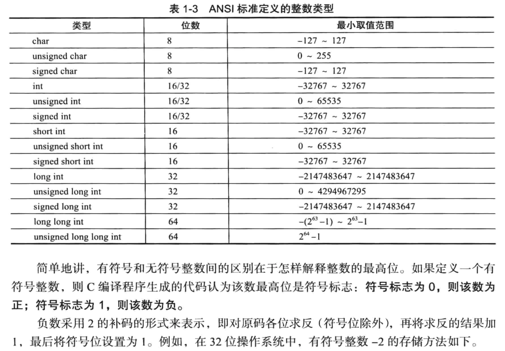
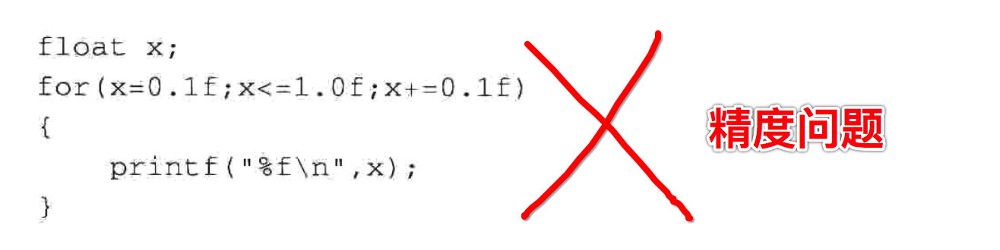

[TOC]


## 1. 禁止【无符号数】与【有符号数】直接运算

### 1.【无符号数】与【有符号数】直接运算，可能会发生【错误】

```c
#include <stdio.h>
int main() {
  // 1. 有符号数，负数以【补码】形式存储。-1 的补码为：32个二进制位全1
  int a = -1; // int => signed int

  // 2. 无符号数
  unsigned int b = 99;

  //3.【有符号数】与【无符号数】进行运算，会当做【无符号】进行计算
  if (a > b)
    printf("a > b\n");
  else
    printf("a <= b\n");
}
```

```
->  gcc main.c
->  ./a.out
a > b
->
```

居然是 **a > b**

### 2. 错误原因:【有符号数】先转换为【无符号数】，再进行运算

- 1、**负数** 是按照 **补码** 形式存储，即 最高位 为 符号位
- 2、将 **有符号数** 转换成 **无符号数** 
- 3、最高位 符号位 被作为 0 正数，最终都是按照 **无符号数** 进行运算
- 4、对 `-1` 的二进制位为 32个1，去掉最高位的 符号位 ，变成了如下数值，实际上变成了 **最大正数**

```
-1 => 1111....111（32个1） => 01111111111.....1 (31个1)
```

所以造成 **99 < -1**

### 3. 正确处理: 统一按照【有符号】进行运算

- 1、先将 **无符号** 数转换为 **有符号** 数
- 2、然后统一按照 **有符号** 数进行运算

```c
#include <stdio.h>
int main() {
  // 1. 有符号数，32个二进制位全为1
  int a = -1;

  // 2. 无符号数
  unsigned int b = 99;

  // 3. 将无符号数转换为【有符号数】
  // 注意：如果无符号数【最高位】有值，可能会造成数值丢失。
  int c = (int)b;

  //4. 转换同样类型，再进行计算
  if (a > c)
    printf("a > b\n");
  else
    printf("a <= b\n");
}
```

```
->  gcc main.c
->  ./a.out
a <= b
->
```


## 2. ANSI C 标准 整数类型 表示的数值范围




## 3. char、signed char、unsigned char

### 1. char 在 unsigned 与 signed 区别

| 类型           | 占用字节数 | 是否有 符号             | 数值范围                      |
| :------------- | :--------- | :---------------------- | ----------------------------- |
| char           | 1          | 可能有，也可能 **没有** | `-128 ~ 127` 也可能 `0 ~ 255` |
| `signed`  char | 1          | 有                      | `-128 ~ 127`                  |
| `unsined` char | 1          | 无                      | `0 ~ 255`                     |

### 2. 使用 char 的【有符号】与【无符号】【交集值范围】提高跨平台性

```
=> (signed) char 范围： -127 ~ 127
=> unsigned char 范围：0 ~ 255
=> 交集范围：0 ~ 127
```


## 4. 【无符号】整数运算产生回绕

```c
#include <stdio.h>
int main() {
  //1. 32位最大无符号正数
  unsigned int a = 0xffffffff;
  unsigned int b = 0;

  //2. 操作数也是无符号数
  unsigned int c = 1;

  //3. 【超过】32位最大无符号正数的【上限】
  printf("a+c = %u\n", a+c);

  //4. 【小于】32位最大无符号正数的【下限】
  printf("b-c= %u\n", b-c);
}
```

```
->  gcc main.c
->  ./a.out
a+c = 0
b-c= 4294967295
->
```


## 5. 浮点数作为循环因子, 会造成死循环




## 6. size_t、ssize_t

### 1. 在不同位数编译器下，占用不同字节数

```c
#include <stdio.h>
#include <stdint.h>

int main() {
  // 32 和 64位下输出格式不同
#if __WORDSIZE == 64
  printf("%ld\n", sizeof(size_t));
  printf("%ld\n", sizeof(ssize_t));
#else
  printf("%d\n", sizeof(size_t));
  printf("%d\n", sizeof(ssize_t));
#endif
}
```

**64** 位操作系统 => **8** 字节（64位）

```
➜  main make
gcc main.c
./a.out
8
8
➜  main
```

**32** 位操作系统 => **4** 字节（32位）

```
➜  share make
gcc main.c
./a.out
4
4
➜  share
```

### 2. size_t 无符号 : 所以【不要】赋值为【负数】

```c
#include <stdio.h>
int main() {
  size_t sizet = -5;
  
  printf("%d\n", sizet);
  printf("%ld\n", sizet);
  printf("%lu\n", sizet);
  printf("%zu\n", sizet);
}
```

```
➜  main make
gcc main.c
main.c:5:18: warning: format specifies type 'int' but the argument has type 'size_t' (aka 'unsigned long') [-Wformat]
  printf("%d\n", sizet);
          ~~     ^~~~~
          %zu
1 warning generated.
./a.out
-5
-5
18446744073709551611
18446744073709551611
➜  main
```

提示将输出格式从 `%d` 替换为 `%zu` **无符号** 格式。

### 3. ssize_t (signed size_t) 有符号

```c
#include <stdio.h>
int main() {
  ssize_t sizet = -5;
  
  printf("%d\n", sizet);
  printf("%ld\n", sizet);
  printf("%lu\n", sizet);
  printf("%zu\n", sizet);
}
```

```
➜  main make
gcc main.c
main.c:5:18: warning: format specifies type 'int' but the argument has type 'ssize_t' (aka 'long') [-Wformat]
  printf("%d\n", sizet);
          ~~     ^~~~~
          %zd
1 warning generated.
./a.out
-5
-5
18446744073709551611
18446744073709551611
➜  main
```


## 7. 禁止【无符号数】与【有符号数】直接运算

### 1.【无符号数】与【有符号数】直接运算，可能会发生错误

```c
#include <stdio.h>
int main() {
  // 1. 有符号数，负数以【补码】形式存储。-1 的补码为：32个二进制位全1
  int a = -1; // int => signed int

  // 2. 无符号数
  unsigned int b = 99;

  //3.【有符号数】与【无符号数】进行运算，会当做【无符号】进行计算
  if (a > b)
    printf("a > b\n");
  else
    printf("a <= b\n");
}
```

```
->  gcc main.c
->  ./a.out
a > b
->
```

居然是 **a > b**。

### 2. 正确处理: 统一按照【有符号】进行运算

- 1、先将 **无符号** 数转换为 **有符号** 数
- 2、然后统一按照 **有符号** 数进行运算

```c
#include <stdio.h>
int main() {
  // 1. 有符号数，32个二进制位全为1
  int a = -1;

  // 2. 无符号数
  unsigned int b = 99;

  // 3. 将无符号数转换为【有符号数】
  // 注意：如果无符号数【最高位】有值，可能会造成数值丢失。
  int c = (int)b;

  //4. 转换同样类型，再进行计算
  if (a > c)
    printf("a > b\n");
  else
    printf("a <= b\n");
}
```

```
->  gcc main.c
->  ./a.out
a <= b
->
```


## 8.【无符号】整数运算产生【回绕】

### 1. 错误代码

```c
#include <stdio.h>
int main() {
  //1. 32位最大无符号正数
  unsigned int a = 0xffffffff;
  unsigned int b = 0;

  //2. 操作数也是无符号数
  unsigned int c = 1;

  //3. 【超过】32位最大无符号正数的【上限】
  printf("a+c = %u\n", a+c);

  //4. 【小于】32位最大无符号正数的【下限】
  printf("b-c= %u\n", b-c);
}
```

```
->  gcc main.c
->  ./a.out
a+c = 0
b-c= 4294967295
->
```

### 2. 回绕【无法避免】，只能是增加错误处理

```c
#include <stdio.h>

int main() {
  //1. 32位最大无符号正数
  unsigned int a = 0xffffffff;

  //2. 操作数也是无符号数
  unsigned int b = 2;
  unsigned int c = 3;

  //3. 判断 a+b 是否能够计算，【超过】32位最大无符号正数的【上限】
#if 0
  if ((a + b) > 0xffffffff) 无法判断回绕，因为 a+b 已经产生 回绕
  (a + b) > 0xffffffff ==> (0xffffffff - a) < b
#endif

  if ((0xffffffff - a) < b)
    printf("出现回绕，禁止进行运算\n");
  else
    printf("a+b = %u\n", a+b);

  //4. 判断 a-b 是否能够计算，【小于】32位最大无符号正数的【下限】
#if 0
  if ((b - c) < 0) 同样无法判断回绕，因为b-c已经产生回绕
  (b - c) < 0 ==> b < c
#endif
  if (b < c)
    printf("出现回绕，禁止进行运算\n");
  else
    printf("b-c= %u\n", b-c);
}
```

```
->  gcc main.c
->  ./a.out
出现回绕，禁止进行运算
出现回绕，禁止进行运算
->
```


## 9. 类型转换

### 1. 无符号 => 有符号

```c
// unsigned int 范围：0 ~ 0xFFFFFFFF
unsigned int a = 12345;

// signed char 范围：-128 ~ 127
signed char b;

// 无符号数值如果大于有符号数的最大值，不能进行转换
if (a > SCHAR_MAX) {
  printf("不能转换，会造成高位丢失\n");
} else {
  b = (signed char)a;
}
```

### 3. 有符号 => 无符号

```c
// 有符号
signed int a = -12345;

// 无符号
unsigned int b;

// 如果有符号数是负数，或者有符号数值大于无符号数的最大值，则不能进行转换
if ((a < 0) || (a > UINT_MAX))
{
  printf("不能转换，会造成高位丢失\n");
}
else
{
  b = (unsigned int)a;
}
```

### 4. 大长度 ==> 小长度

```c
long long int a = LLONG_MAX;
int i = 0;

// 如果大长度类型数据值，处于小长度类型值的范围之外，则不能进行转换
if ((a < INT_MIN) || (a > INT_MAX))
{
  printf("不能转换，会造成高位丢失\n");
}
else
{
  b = (int)a;
}
```


## 10. C 中的 const 局部变量，其实是只读【变量】，而并不是只读【常量】

```c
#include <stdio.h>

int main() {
  int age = 99;
  printf("age = %d\n", age);

  int* p = (int*)&age;
  *p = 100;
  printf("age = %d\n", age);
  printf("*p = %d\n", *p);
}
```

```
 ~/Desktop/main  make
gcc main.c
./a.out
age = 99
age = 100
*p = 100
```

