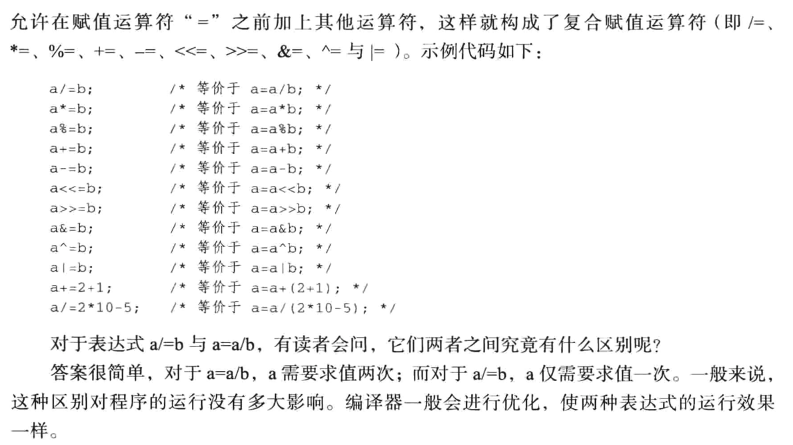
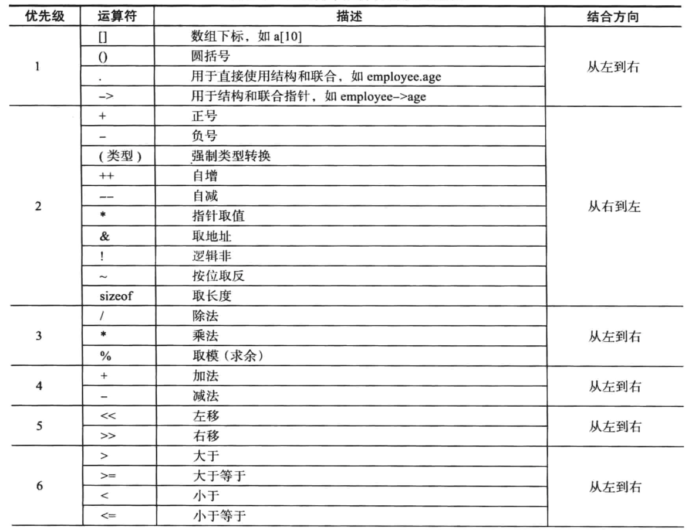
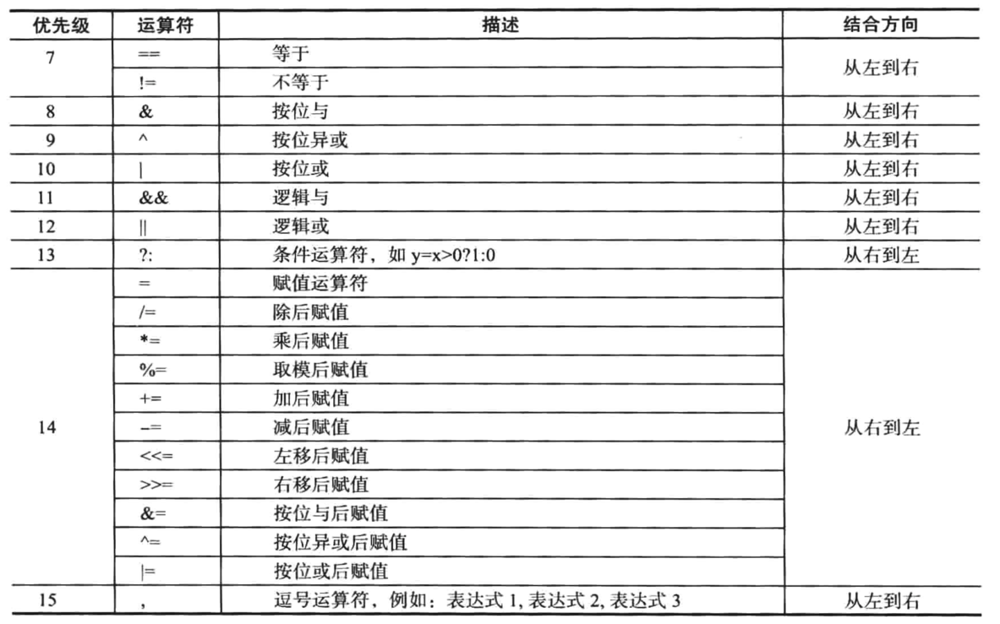

[TOC]


## 1. `|` 与 `||`

```c
#include <stdio.h>

int main() {
  unsigned int a = 0x1010;
  unsigned int b = 0x1101;

  printf("a | b == %d\n", a | b);
  printf("a || b == %d\n", a || b);
}
```

```
 ~/Desktop/main  make
gcc main.c
./a.out
a | b == 4369
a || b == 1
```

结论:

| 运算符   | 作用 |
| ------- | ------- |
| `|`     | 按位 或 |
| `||`    | 逻辑 或 |


## 2. `&` 与 `&&`

```c
#include <stdio.h>

int main() {
  unsigned int a = 0x1010;
  unsigned int b = 0x1101;

  printf("a & b == %d\n", a & b);
  printf("a && b == %d\n", a && b);
}
```

```
 ~/Desktop/main  make
gcc main.c
./a.out
a & b == 4096
a && b == 1
```

结论:

| 运算符   | 作用 |
| ------- | ------- |
| `&`     | 按位 与 |
| `&&`    | 逻辑 与 |


## 3. 复合赋值表达式




## 4. 运算符优先级






