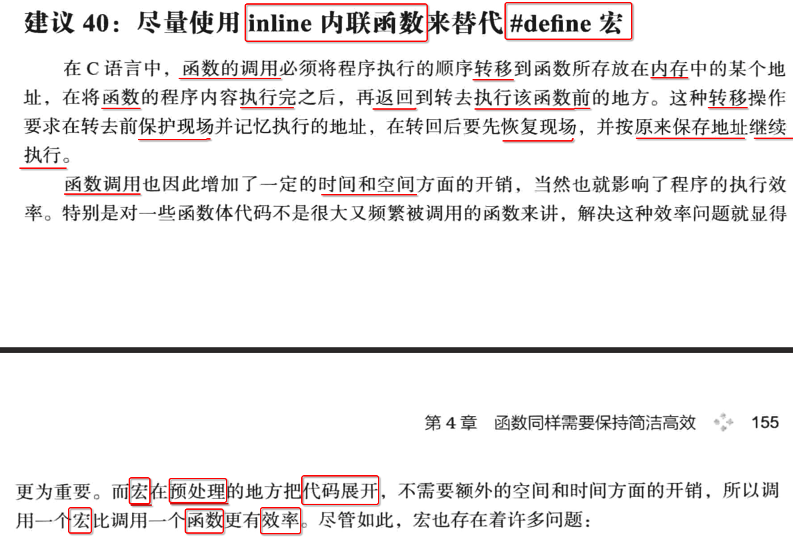

[TOC]

## 1. 避免写不可重入的函数

### 1. 函数内有 static 变量

```c
void func() {
  static int age = 99;
  ........
}
```

- 因为 sttaic 修饰的变量，访问的都是 **同一块** 内存
- 当多次重复调用函数时，会造成内存中的数据不一致

### 2. 不要返回指向 局部 static 变量 的指针


## 2. 没有参数的函数使用 void 限定

ANSI C 标准中，对于一个 `func()` 函数，看似好像不能传递参数，但其实是可以的:

```c
#include <stdio.h>

void run()
{}

int main() {
  run();
  run(1);
  run(1,2);
  run(1,2,3);
}
```

```
 ~/Desktop/main  gcc main.c
main.c:8:8: warning: too many arguments in call to 'run'
  run(1);
  ~~~  ^
main.c:9:10: warning: too many arguments in call to 'run'
  run(1,2);
  ~~~    ^
main.c:10:12: warning: too many arguments in call to 'run'
  run(1,2,3);
  ~~~      ^
3 warnings generated.
```

- 使用的编译器会产生一些 **警告** , 提示传递了多个不需要的参数
- 但是有的编译器，根本不会提示


## 3. const 修饰函数内不需要修改的 参数


## 4. void 修饰 没有返回值 函数


## 5. 函数入口，对参数做有效性检查


## 6. inline 内联函数 vs `#define` 宏定义




总而言之: 

1. 如果一些比较小的函数，可以使用 inline 内联函数封装
2. 因为 inline 内联函数，可以有 函数 类似的 **语法检测**
3. 虽然有 **强制内联** ，但是对于较大的函数，最终也不一定会 inline 内丽娜


## 7. 函数的【调用约定】


