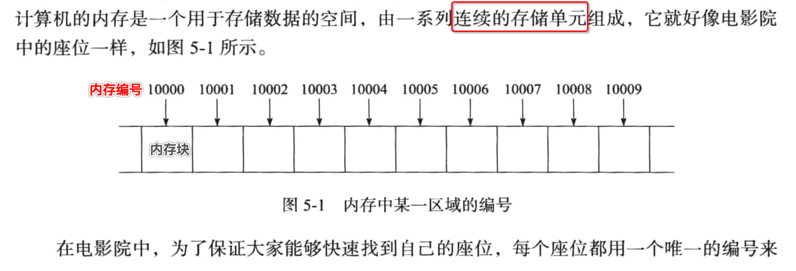
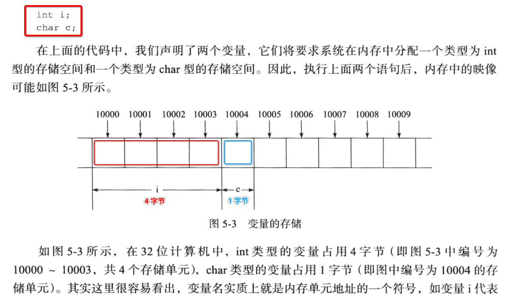
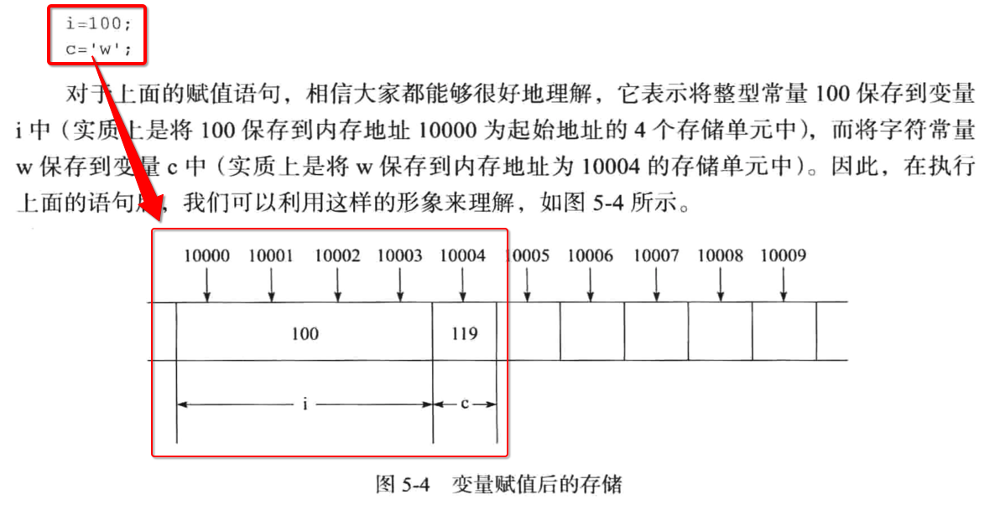
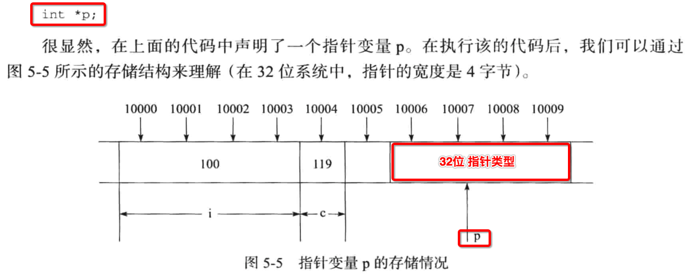
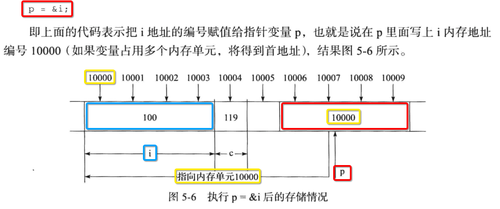
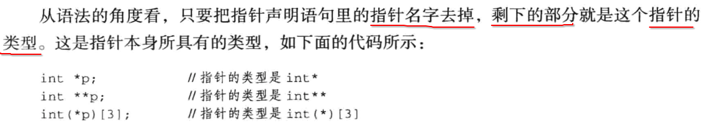
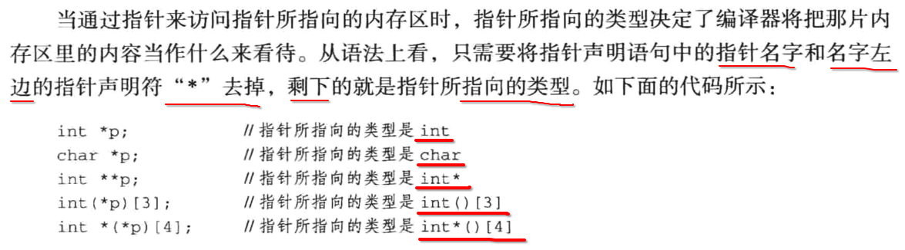
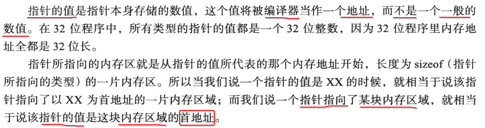
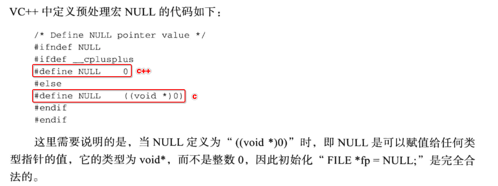
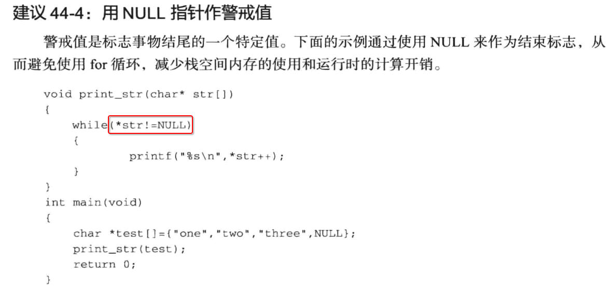

[TOC]


## 1.  内存块 vs 内存地址




## 2. C 语言中的【变量】与【内存块】

### 1. 定义【变量】



### 2. 赋值【变量】




### 3. 定义【指针变量】



### 4. 赋值【指针变量】



- 1、**变量 i** 对应的内存块
  - 占用 4 个字节
  - 其中存储的是 **数值 100**
- 2、**指针变量 p** 对应的内存块
  - 占用 4 个字节
  - 其中存储的是 **内存地址 10000**
- 3、**内存地址 10000** 就是 **变量 i** 对应的内存块的 **起始地址**


## 3. 指针【自己的】【类型】




## 4. 指针【指向的】【类型】



## 5. 指针【值】




## 6. 指针类型占用的字节数

- 32位编译器，占用32位 (4字节)
- 64位编译器，占用64位 (8字节)
- 可使用 `intptr_t` 或 `uintptr_t` 来屏蔽 32位 和 64位 下的差异性


## 7. 应初始化 指针变量

```c
#include <stdio.h>

int main() {
  int *p;
  printf("%p\n", p);
}
```

```
 ~/Desktop/main  make
gcc main.c
./a.out
0x10e43c036
```

即使没有初始化的指针变量，也会指向一个的内存地址。


## 8. NULL 指针的值为空




## 9. NULL 作为【结束递归函数调用】的条件

```c
/**
 *    递归统计传入的文件路径下的所有的普通文件，并且打印所有文件的具体信息
 *    @param filepath 传入的文件路径
 *    @param padding 缩进打印的空格字符数
 */
int wc(char* file)
{
  char filepath[1024] = {0};
  char* p;
  unsigned int filenum = 0;
  unsigned int i;
  struct dirent* ent = NULL;
  DIR* dir = NULL;

  //1. 递归结束条件1
  if (NULL == file)
    return 0;

  //2. 递归结束条件2
  dir = opendir(file);
  if (NULL == dir)
    return 0;

  //3. 遍历当前目录下的所有类型的文件
  while(NULL != (ent = readdir(dir)))
  {
    //3.1 过滤掉 . 和 .. 两个隐藏文件
    if (0 == strcmp(ent->d_name, ".") || \
        0 == strcmp(ent->d_name, ".."))
      continue;

    // 3.2 拼接目录下的子文件的全路径：当前工作目录/子文件名
    memset(filepath, 0, sizeof(filepath));
    memcpy(filepath, file, strlen(file));
    if (filepath[strlen(filepath) - 1] == '/') // 替换掉末尾的`/`符号
      filepath[strlen(filepath) - 1] = '\0';
    p = filepath + strlen(filepath); // 指针变量p指向当前filepath[]数组内容的末尾
    sprintf(p, "/%s", ent->d_name); // 在p指向的filepath[]数组内容的末尾，追加 "/文件名"
    /** 注意：filepath文件路径在linux下，最长只能为256字节 */

    // 3.3 判断当前文件的类型
    switch(ent->d_type)
    {
      case DT_DIR: // 目录
        filenum += wc(filepath); // 继续递归子目录
        break;
      case DT_REG: // 普通文件
      default: // 无法识别的文件
        ++filenum; // 累加1文件数
        printf("%s\n", filepath);
        break;
    }
  }

  // 4.
  closedir(dir);
  dir = NULL;
  return filenum;
}
```


## 10. NULL 作为函数【执行失败】时的返回值

```c
char* strstr(char* str, char ch) {
  ///...........
  
  
  if (执行失败)
    return NULL;
  
  return ...;
}
```


## 11. NULL 作为【结束循环】的条件




## 12. 对 NULL 解引用

```c
#include <stdio.h>

int main() {
  int *p = NULL;
  *p = 99;
}
```

```
 ~/Desktop/main   make
gcc main.c
./a.out
make: *** [all] Segmentation fault: 11
```

崩溃。


## 13. `void *` 可指向任意类型内存地址的万能指针类型

```c
#include <stdio.h>

int main() {
  int a;
  char b;
  float c;

  void *p;
  p = &a;
  p = &b;
  p = &c;
}
```

```
 ~/Desktop/main  make
gcc main.c
./a.out
```


## 14. `void *` 类型的指针变量进行数值计算

```c
#include <stdio.h>

int main() {
  int a;
  char b;
  float c;

  void *p;
  p = &a;
  p = &b;
  p = &c;

  p++;
  p--;
}
```

```
 ~/Desktop/main  make
gcc main.c
./a.out
```

- 1、虽然是编译、链接、运行，都是 ok 的
- 2、但是 **不建议** 这么做
- 3、因为上述的执行，是需要依赖 **编译器** 的行为
- 4、最重要的原因是 `void *` 指针类型，无法确定 **指针的步长**


## 15. 如果函数参数使用 `void *` 接收任意类型的内存地址

```c
void *
memcpy(
  void *restrict dst, 
  const void *restrict src, 
  size_t n
);
```


## 16. `const T *p;` 对比 `T * const p;`

### 1. `const T *p;`

```c
#include <stdio.h>

int main() {
  int a = 99;
  int b = 100;

  const int *p = &a;

  // ok
  p = &b;

  // error
  *p = 101;
}
```

```c
gcc main.c
main.c:13:6: error: read-only variable is not assignable
  *p = 101;
  ~~ ^
1 error generated.
make: *** [all] Error 1
```

### 2. `T * const p;`

```c
#include <stdio.h>

int main() {
  int a = 99;
  int b = 100;

  int * const p = &a;

  // error
  p = &b;

  // ok
  *p = 101;
}
```

```c
gcc main.c
main.c:10:5: error: cannot assign to variable 'p' with const-qualified type 'int *const'
  p = &b;
  ~ ^
main.c:7:15: note: variable 'p' declared const here
  int * const p = &a;
  ~~~~~~~~~~~~^~~~~~
1 error generated.
make: *** [all] Error 1
```


## 17. 函数的参数是指针类型时，形参与实参的区别

```c
#include <stdio.h>
#include <stdlib.h>

void func(int* p) {
  p = malloc(sizeof(int));
  printf("3. %p\n", p);
}

int main() {
  int* p = malloc(sizeof(int));
  printf("1. %p\n", p);

  func(p);
  printf("2. %p\n", p);
}
```

```
gcc main.c
./a.out
1. 0x7f92c64006a0
3. 0x7f92c6402c80
2. 0x7f92c64006a0
```

三个地址都是 **不一样** 的

