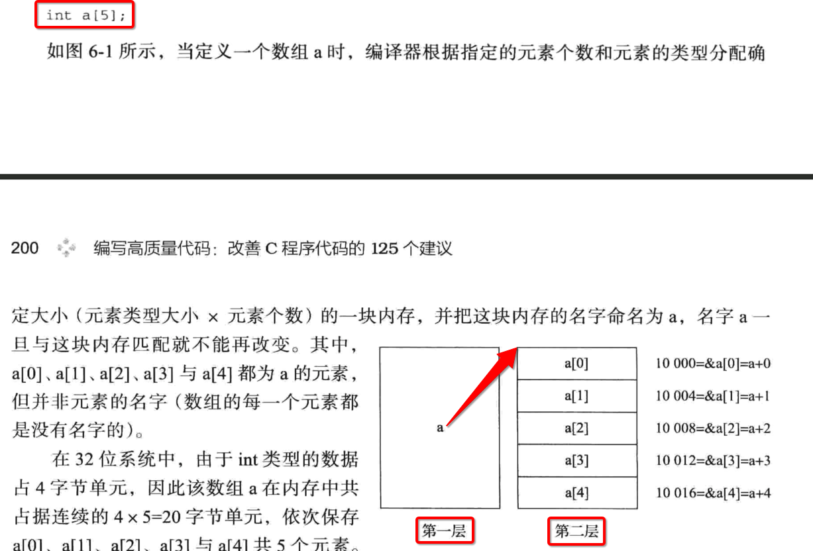
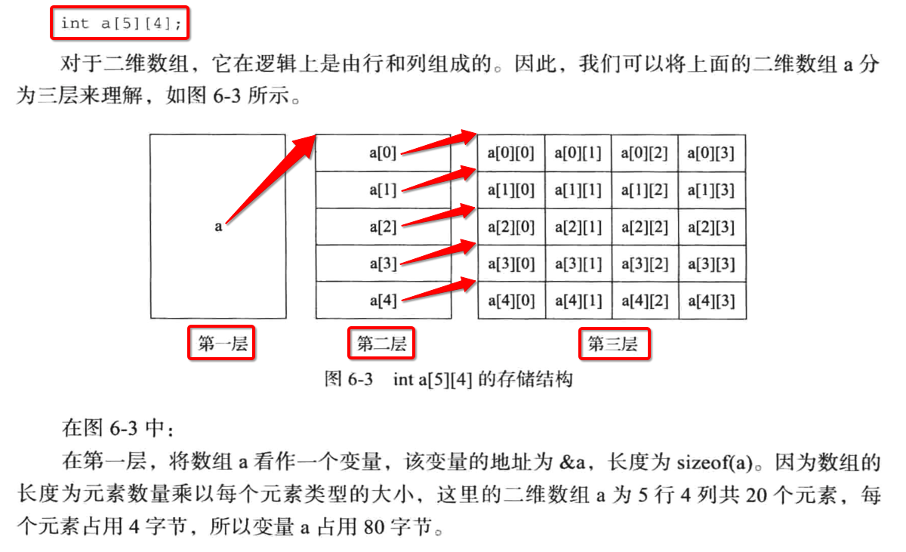
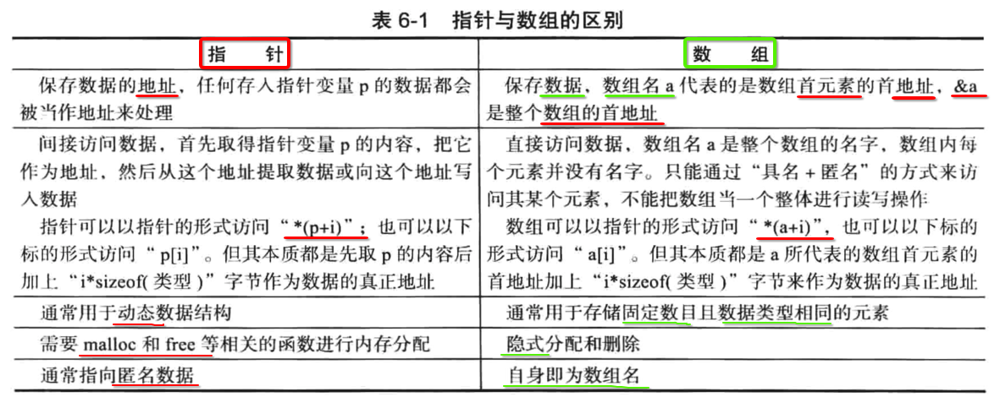
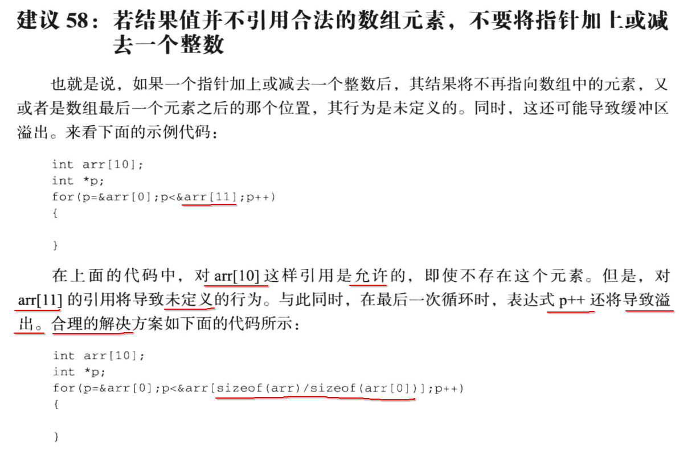
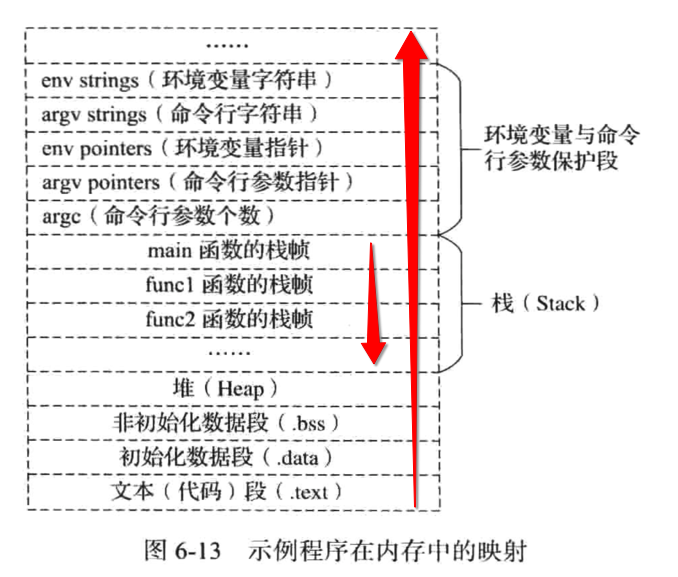
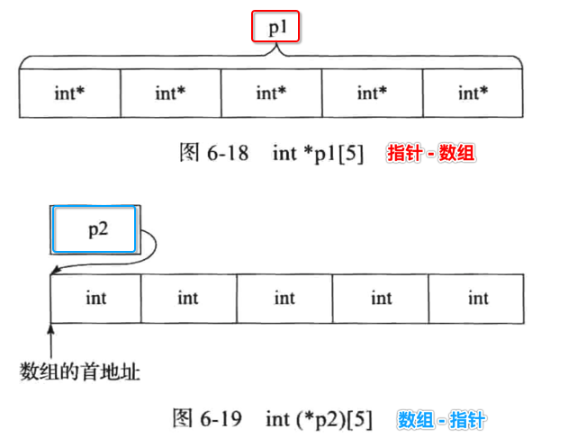

[TOC]


## 1. `int a[5]` 内存结构




- 1、**数组名** 可以看做是一个 **变量** 
- 2、 **变量** 存储的是一个，指向一连串连续内存的 **起始地址**


## 2. `int a[5][4]` 内存结构



- 1、**数组名** 可以看做是一个 **变量** 
- 2、 **变量** 存储的是一个，指向一个 `int* p[5]` 连串连续内存的 **起始地址**
- 3、`p[i]` 存储的一个 `int arr[4]` 连续数组内存的 **起始地址**


## 3. `arr[i]` 与 `&arr` 

### 1. 从【数值】上看没区别

```c
#include <stdio.h>
#include <stdlib.h>

int main() {
  int arr[5];

  printf("&arr[0] = %p\n", &arr[0]);
  printf("&arr = %p\n", &arr);
}
```

```
 ~/Desktop/main  make
gcc main.c
./a.out
&arr[0] = 0x7ffeef723160
&arr = 0x7ffeef723160
```

打印的 **内存地址值** 确实是一样的。

### 2. 但是从【步长】上看是有区别的

```c
#include <stdio.h>
#include <stdlib.h>

int main() {
  int arr[5];

  // 1. 测试 &arr[i]
  printf("1) %ld\n", (char*)(&arr[0] + 1) - (char*)(&arr[0]));
  printf("2) %ld\n", (char*)(&arr[1] + 1) - (char*)(&arr[1]));
  printf("3) %ld\n", (char*)(&arr[2] + 1) - (char*)(&arr[2]));
  printf("4) %ld\n", (char*)(&arr[3] + 1) - (char*)(&arr[3]));

  // 2. 测试 &arr
  printf("5) %ld\n", (char*)(&arr + 1) - (char*)(&arr));
}
```

```
 ~/Desktop/main  make
gcc main.c
./a.out
1) 4
2) 4
3) 4
4) 4
5) 20
```


## 4. 数组【越界】

### 1. 通过【数组名】

```c
#include <stdio.h>
#include <stdlib.h>

int main() {
  int arr[3];
  arr[4] = 99;
}
```

**编译时** 可能有的编译器会直接给出 **警告** :

```c
 ~/Desktop/main  gcc main.c
main.c:6:3: warning: array index 4 is past the end of the array (which contains 3 elements) [-Warray-bounds]
  arr[4] = 99;
  ^   ~
main.c:5:3: note: array 'arr' declared here
  int arr[3];
  ^
1 warning generated.
```

但是 **运行时** 基本都会 **崩溃** :

```c
 ~/Desktop/main  ./a.out
[1]    74954 abort      ./a.out
```

### 2. 通过【指针变量】

```c
#include <stdio.h>
#include <stdlib.h>

int main() {
  int arr[3];
  int* p = arr;
  *(p + 99) = 100;	// ok
  printf("%d\n", *(p + 99)); // 崩溃
}
```

编译 ok

```
 ~/Desktop/main  gcc main.c
 ~/Desktop/main 
```

运行时崩溃

```
 ~/Desktop/main  ./a.out
[1]    75686 segmentation fault  ./a.out
```


## 5. 函数参数为【数组】

### 1. 错误

```c
#include <stdio.h>
#include <stdlib.h>

void sort(int arr[5]) {
  printf("sizeof(arr) = %ld\n", sizeof(arr));
}

int main() {
  int arr[5] = {1,3,2,4,10};
  sort(arr);
}
```

编译时可能就会报如下警告:

```c
 ~/Desktop/main  gcc main.c
main.c:5:39: warning: sizeof on array function parameter will return size of 'int *' instead of 'int [5]' [-Wsizeof-array-argument]
  printf("sizeof(arr) = %ld\n", sizeof(arr));
                                      ^
main.c:4:15: note: declared here
void sort(int arr[5]) {
              ^
1 warning generated.
```

提示:

```c
sizeof on array function parameter will return size of 'int *' instead of 'int [5]'
```

解释:

- 当使用 **sizeof** 计算 **array** 类型数据时
- 返回的是 `int *` 占用的字节数
- 而并不是 `int [5]` 占用的字节数

运行结果

```
 ~/Desktop/main  ./a.out
sizeof(arr) = 8
```

很明显，我们在 main() 中的数组长度 = `4 * 5` = 20 字节

### 2. 正确

应该手动传入 **数组的长度** :

```c
#include <stdio.h>
#include <stdlib.h>

void sort(int* src, int len) {
  for (int i = 0; i < len; ++i)
  {
    printf("%d, ", *(src + i));
  }
  printf("\n");
}

int main() {
  int arr[] = {1,3,2,4,10};
  sort(arr, sizeof(arr)/sizeof(int));
}
```

```
 ~/Desktop/main  make
gcc main.c
./a.out
1, 3, 2, 4, 10,
```


## 6. 指针 vs 数组




## 7. 指针遍历数组




## 8. 可执行文件运行时分配到的虚拟进程空间结构



## 9. 指针数组 vs 数组指针




- p1
  - 是一个 **数组**
  - **数组元素** 是一个 **内存地址**
- p2
  - 是一个 **指针变量**
  - **指针变量** 指向的是一个 **数组的起始内存地址**

