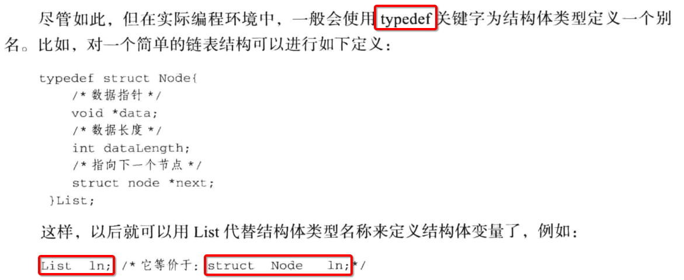
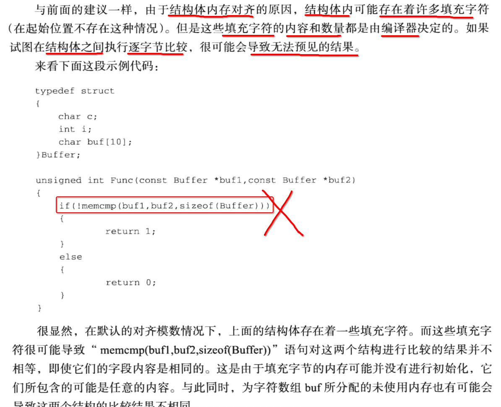
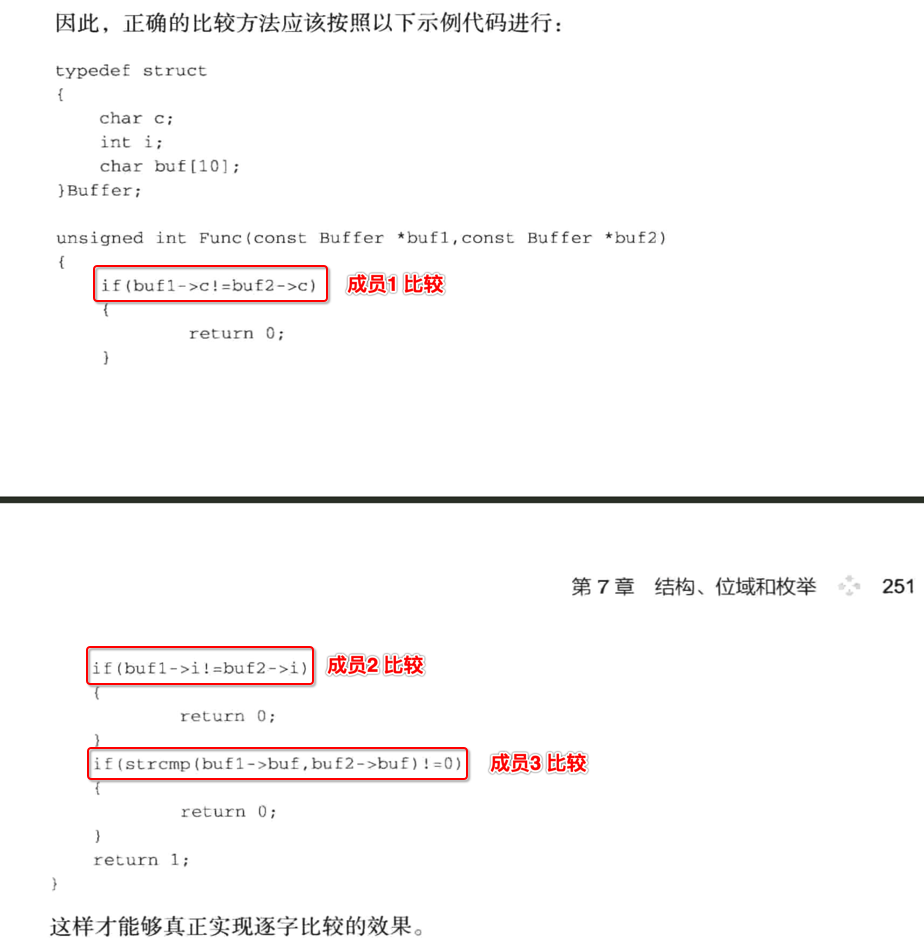
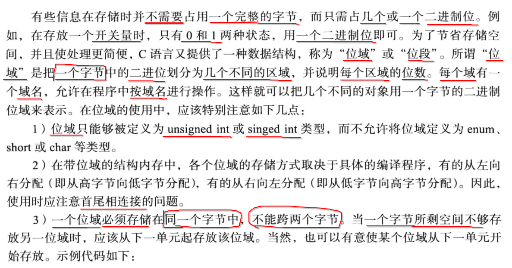
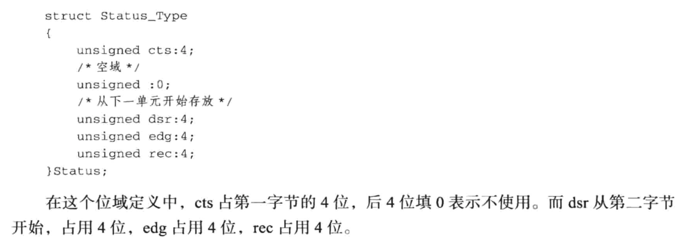
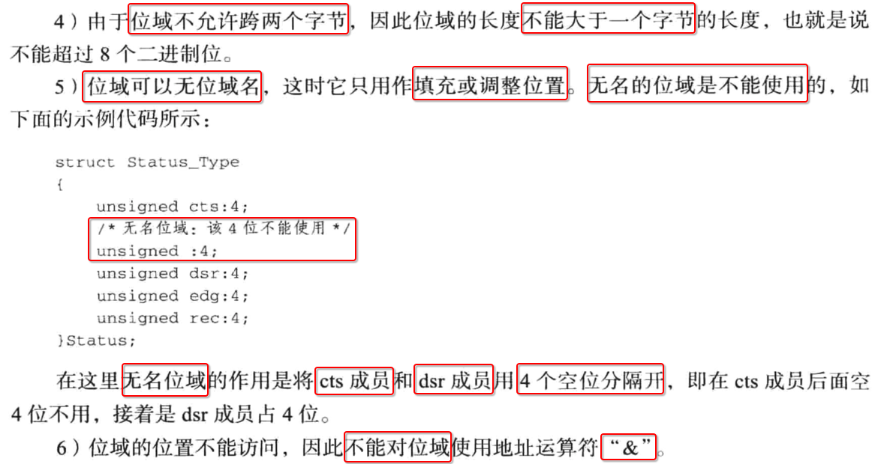
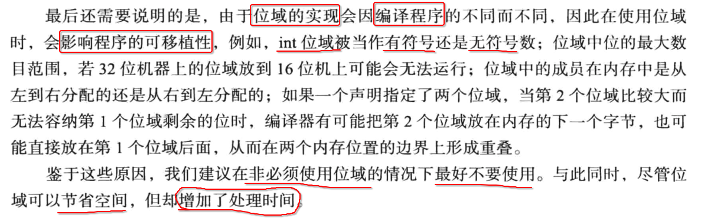
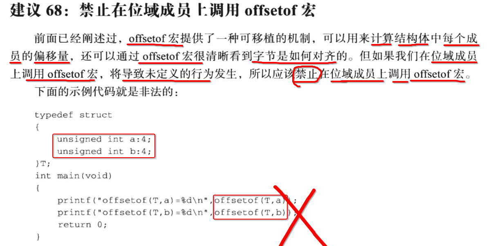
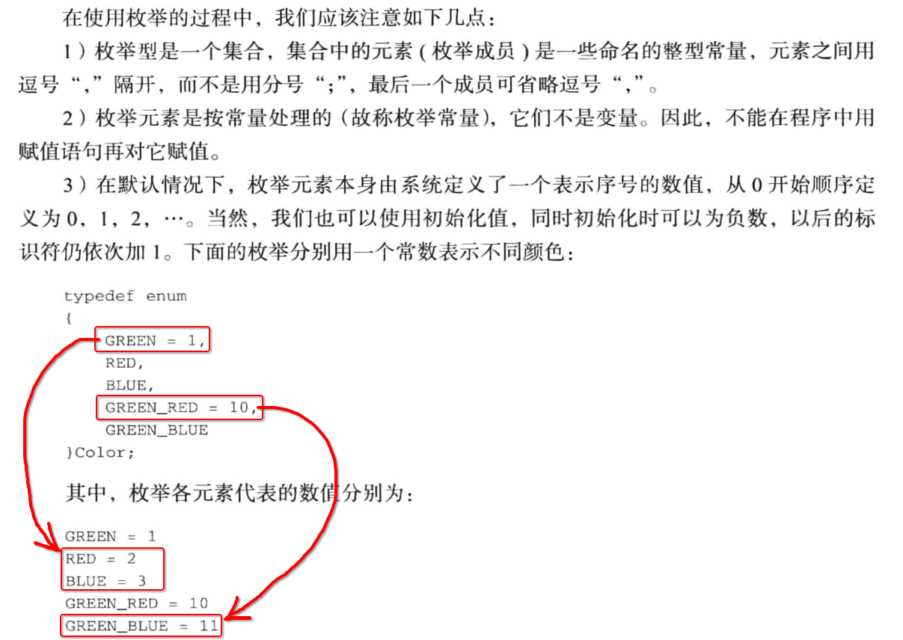
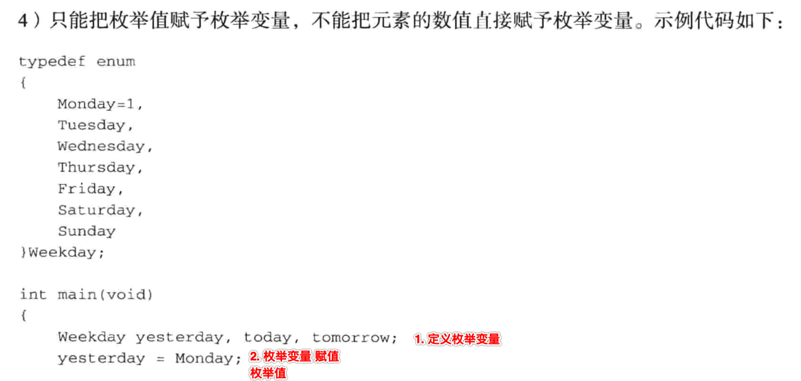

[TOC]


## 1. struct 基本使用




## 2. 字节对齐

### 1. 两个相似 struct 但是占用字节数不同

```c
#include <stdio.h>
#include <stdlib.h>

typedef struct A
{
  int a;
  char b;
  short c;
}A;

typedef struct B
{
  char b;
  int a;
  short c;
}B;

int main() {
  printf("sizeof(A) = %ld\n", sizeof(A));
  printf("sizeof(B) = %ld\n", sizeof(B));
}
```

```
 ~/Desktop/main  make
gcc main.c
./a.out
sizeof(A) = 8
sizeof(B) = 12
```

2个 struct 的成员，仅仅只是 **定义顺序** 不同而已，但是最终占用的 **内存字节数** 就不一样的。

### 2. struct A 字节对齐

```c
typedef struct A
{
  int a;		// 偏移 0 => 4
  char b;		// 偏移 0 => 5
  short c;	// 偏移 1 => 8
}A;
```

最终占用 8 字节。

### 3. struct B 字节对齐

```c
typedef struct B
{
  char b;		// 偏移 0 => 1
  int a;		// 偏移 3 => 8
  short c;	// 偏移 0 => 10 => 最终 +2 凑为 4 倍数 => 12
}B;
```

最终占用 12 字节。

### 4. struct A reverse 成员

```c
typedef struct A
{
  int a;
  char b;
  char reverse;
  short c;
}A;
```

### 5. struct B reverse 成员

```c
typedef struct B
{
  char b;
  char reverse[3];
  int a;
  short c;
}B;
```

### 6. 测试 添加了 reverse 成员的 struct

```c
#include <stdio.h>
#include <stdlib.h>

typedef struct A
{
  int a;
  char b;
  char reverse;
  short c;
}A;

typedef struct B
{
  char b;
  char reverse[3];
  int a;
  short c;
}B;

int main() {
  printf("sizeof(A) = %ld\n", sizeof(A));
  printf("sizeof(B) = %ld\n", sizeof(B));
}
```

```
 ~/Desktop/main  make
gcc main.c
./a.out
sizeof(A) = 8
sizeof(B) = 12
```

### 7. struct 内存对齐原则

- 1、**当前成员** 的 **起始地址** 是 **对齐魔数** 的 **整数倍** ， 如果不是就增加 **无用字节数**
- 2、最终整个 struct 内存字节数 也必须是  **对齐魔数** 的 **整数倍** ，如果不是就增加 **无用字节数**


## 3. struct 拷贝

```c
#include <stdio.h>
#include <stdlib.h>

typedef struct Person
{
  char name[10];
  int age;
}Person;


int main() {
  Person p1 = {"xiong", 99};
  Person p2 = p1;

  printf("%s - %d\n", p2.name, p2.age);
}
```

```
 ~/Desktop/main  make
gcc main.c
./a.out
xiong - 99
```


## 4. 不要对2个 struct 逐字节对比

### 1. 错误



### 2. 正确




## 5. 位域








## 6. 不要随意使用【位域】




## 7. 禁止对【位域】调用 offsetof 宏




## 8. 枚举

### 1. 枚举值



### 2. 先定义枚举变量，再赋值枚举值




