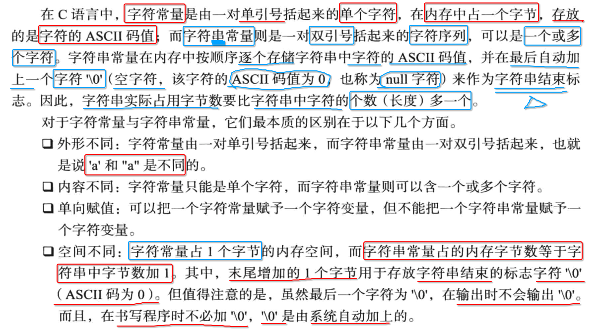
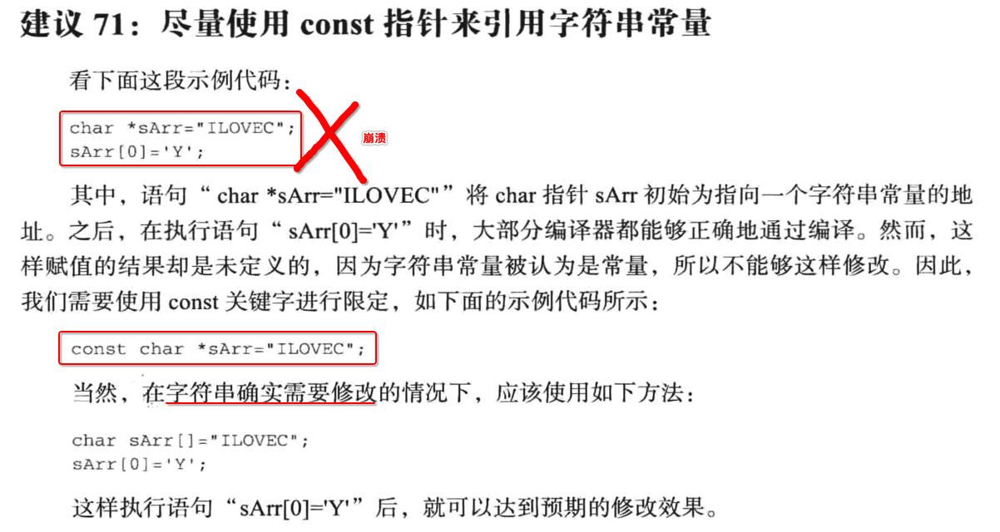

[TOC]


## 1. 字符 vs 字符串




## 2. 字符数组 vs 字符串

```c
#include <stdio.h>
#include <stdlib.h>

int main(int argc, char const *argv[])
{
  // 1.
  char buf1[] = {'a', 'b', 'c'};
  printf("sizeof(buf1) = %ld, buf1 = %s\n", sizeof(buf1), buf1);

  // 2.
  char buf2[] = "abc";
  printf("sizeof(buf2) = %ld, buf2 = %s\n", sizeof(buf2), buf2);
}
```

```
 ~/Desktop/main  make
gcc main.c
./a.out
sizeof(buf1) = 3, buf1 = abc�����
sizeof(buf2) = 4, buf2 = abc
```

- **buf1** ==> 只是一个普通的 **字符数组** 
  - 长度 == **3** 字节
  - 使用 **%s** 当做字符串输出时 **乱码** ，因为没有 **末尾 ‘\0' 结束字符** 

- **buf2** ==> 本质是一个 **字符数组** ，但是可以作为一个 **字符串**
  - 长度 == **4** 字节 ， 因为由编译器自动在 **末尾添加 ‘\0' 结束字符** 
  - 使用 **%s** 当做 **字符串** 正常输出


## 3. 尽量使用 const 修饰 字符串




## 4. strlen(字符串) 与 sizeof(字符串)

```c
#include <stdio.h>
#include <stdlib.h>
#include <string.h>

int main(int argc, char const *argv[])
{
  char buf[] = "abc";

  printf("sizeof(buf) = %ld\n", sizeof(buf));
  printf("strlen(buf) = %ld\n", strlen(buf));
}
```

```
 ~/Desktop/main  make
gcc main.c
./a.out
sizeof(buf) = 4
strlen(buf) = 3
```


## 5. strcpy() 与 memcpy()

```c
#include <stdlib.h>
#include <stdio.h>
#include <string.h>

int main(int argc, const char * argv[]) 
{
  // 1. src
  char str[15] = "Hello\0world"; // 注意：字符串 包含 '\0' 结束符

  // 2. strcpy()
  char dst1[15];
  strcpy(dst1, str);
  printf("dst1: [%s]\n", dst1);
  printf("dst1+6: [%s]\n", dst1+6);

  // 3. memcpy()
  char dst2[15];
  memcpy(dst2, str, 15);
  printf("dst2: [%s]\n", dst2);
  printf("dst2+6: [%s]\n", dst2+6);
}
```

```
 ~/Desktop/main  make
gcc main.c
./a.out
dst1: [Hello]
dst1+6: []
dst2: [Hello]
dst2+6: [world]
```

- 1、strcpy() 遇到 `'\0’` 结束符，就会 **停止** 拷贝内存中的 **字符**
- 2、memcpy() 直接拷贝 **内存** 中的 **任何数据**


## 6. strcmp() 与 memcmp()

strcmp(str1, str2)

```c
int
strcmp(const char *s1, const char *s2);
```

memcmp(src1, src2, **len**) 有一个比较内存的字节数长度参数

```c
int
memcmp(const void *s1, const void *s2, size_t n);
```

示例:

```c
#include <stdlib.h>
#include <stdio.h>
#include <string.h>

int main(int argc, const char * argv[]) 
{
  char str1[] = "Hello\0world1";
  char str2[] = "Hello\0world2";

  printf("strcmp(str1, str2) = %d\n", strcmp(str1, str2));
  printf("memcmp(str1, str2) = %d\n", memcmp(str1, str2, 20));
}
```

```
 ~/Desktop/main  make
gcc main.c
./a.out
strcmp(str1, str2) = 0
memcmp(str1, str2) = -1
```

- 很明显 str1 和 str2 并不是一样的，但是 strcmp() 返回值 0 ，表明是相等的，因为中间有一个 `'、0'` 会结束字符比较
- 而 memcmp() 会比较内存中的每一个字节的数据


