[TOC]

## 1. 宏定义表达式必须使用括号

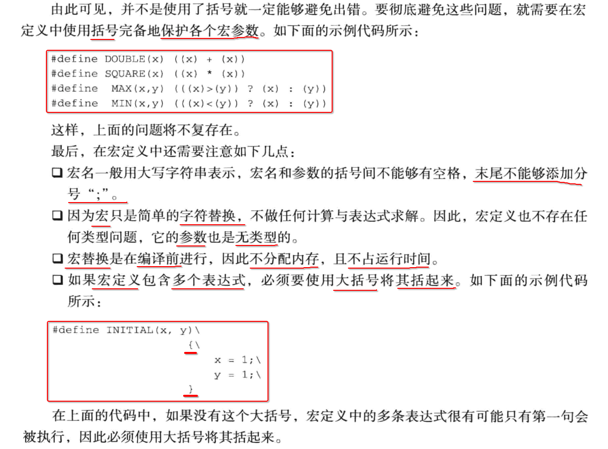

## 2. 宏参数如果是 i++、++i、i--、--i

### 1. MIN(x, y) 宏定义

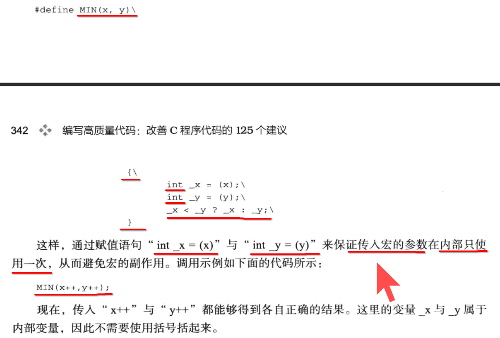

### 2. MIN(type, x, y) 宏定义

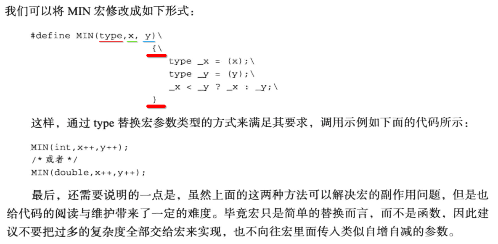

## 3. 尽量使用【inline 内联函数】而不是【宏定义】

### 1. inline 函数

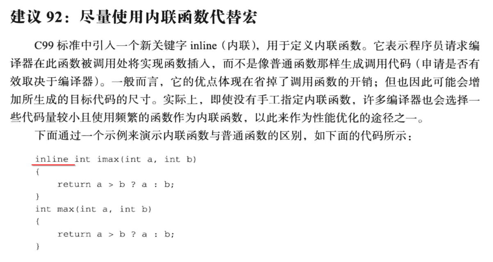

inline 函数类似于 宏定义，也是在 **编译时** 展开。

### 2. C99 static inline

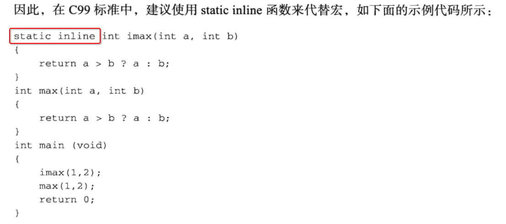

## 3. `#include <xx.h>` 与 `#include "xx.h"`

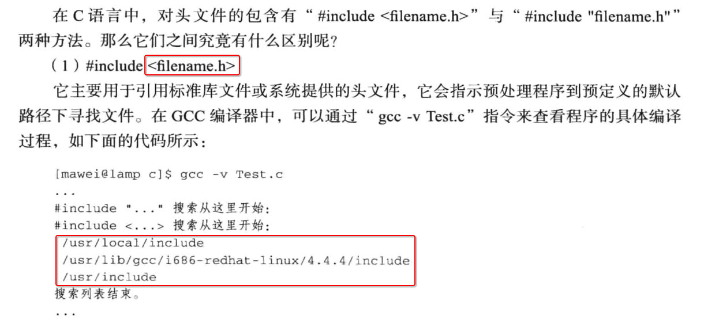

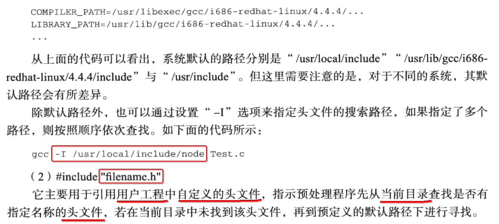

## 4. `#ifndef/#define/#endif`

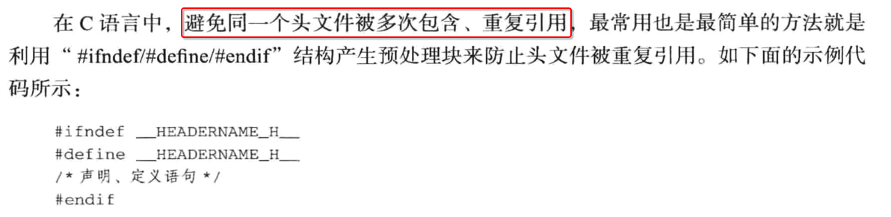

## 5. `#if/#elif/#elif/#else/#endif`

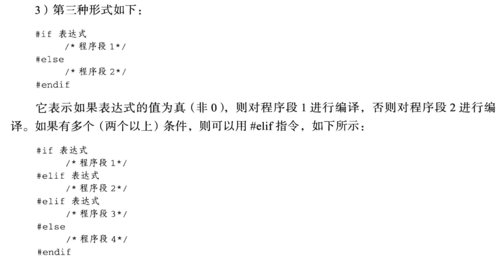

## 6. defined

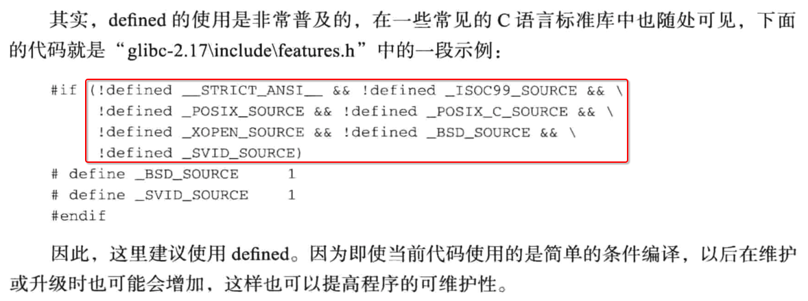

## 7. `#undef/#define`

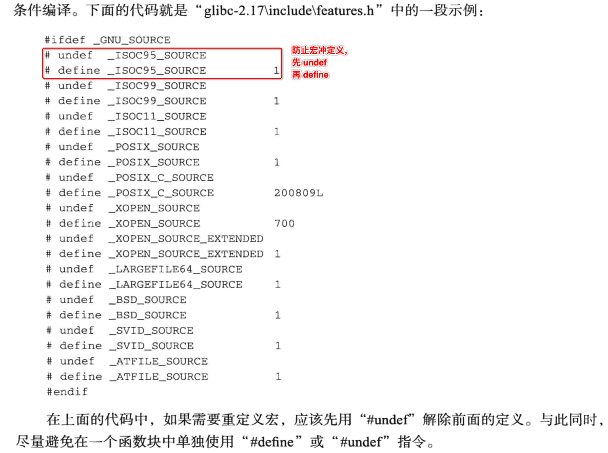

