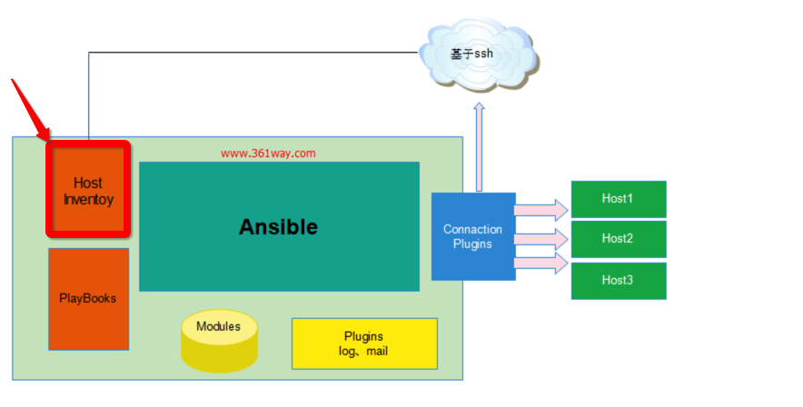

[TOC]


## 1. inventory 告诉 ansible 控制哪一些机器




## 2. 回顾上一篇文章中设置 `/etc/ansible/hosts`

```
[jenkins]
10.13.47.103 ansible_user=zhihu
```

- 其实已经使用 **group 分组** 的概念了
- 创建了一个名字为 jenkins 的 分组
- jenkins 分组下面，只有一个【被控机】
  - ip: 10.13.47.103
  - user: zhihu

下面主要列举常用的配置。


## 3. 挨个定义【组内】的【被控机】

```
#vim /etc/ansible/hosts
[webservers]
192.168.1.31
192.168.1.32
```

然后【主控机】通知【webservers】组内的所有的【被控机】执行命令:

```
[root@localhost ~]# ansible webservers -uroot -m ping -o
192.168.1.32 | SUCCESS => {"changed": false, "ping": "pong"}
192.168.1.31 | SUCCESS => {"changed": false, "ping": "pong"}
```


## 4. 批量定义【组内】的【被控机】

```
#vim /etc/ansible/hosts
[webservers]
192.168.1.[31:34]
```

在【webservers】组内，定义被控机ip范围: 192.168.1.31 ~ 192.168.1.34


## 5. 设置【被控机】的 ssh 配置

```
#vim /etc/ansible/hosts
[webservers]
192.168.1.[31:32] ansible_ssh_user='root' ansible_ssh_pass='redhat' ansible_ssh_port='22'
```

- 1. `ansible_ssh_user='root'` => ssh user 为 **root**
- 2. `ansible_ssh_pass='redhat'` => ssh password 为 **redhat**
- 3. `ansible_ssh_port='22'` => ssh port 为 **22**


## 6. 给【被控机】设置【变量】

```
#vim /etc/ansible/hosts
[webservers]
web1.ding.com http_port=801 maxRequestsPerChild=808
```

- 1. 在【webservers】组内，定义了一个【被控机】地址为【web1.ding.com】
- 2. 并且给【被控机】设置了【2个】变量
  - 2.1. **http_port=801**
  - 2.2. **maxRequestsPerChild=808**


## 7. 给【组】设置【变量】

```
#vim /etc/ansible/hosts
[webservers]
web1.ding.com
web2.ding.com

[webservers:vars]
ntp_server=ntp.ding.com
proxy=proxy.ding.com
```

- 1. 在【webservers】组内，有2个【被控机】
- 2. 下面通过 `[webservers:vars]` 给【webservers】组，设置了2个变量
  - ntp_server=ntp.ding.com
  - proxy=proxy.ding.com

效果就是【webservers】组内的【所有】【被控机】，都能使用这2个变量。


## 8. 【组】嵌套

```
#vim /etc/ansible/hosts
[nginx]
192.168.1.31
[apache]
192.168.1.32
[webservers:children]
apache
nginx
[webservers:vars]
ansible_ssh_user='root'
ansible_ssh_pass='redhat'
ansible_ssh_port='22'
```

- 1. 【nginx】组，有一个【被控机】
- 2. 【apache】组，有一个【被控机】
- 3. 【webservers】组，有【2个】【子组】
  - apache 组
  - nginx 组

直接对【webservers】组，发送命令执行，会触发【nginx】和【apache】两个子组内的【被控机】都执行:

```
[root@localhost ~]# ansible webservers -m ping -o
192.168.1.31 | SUCCESS => {"changed": false, "ping": "pong"}
192.168.1.32 | SUCCESS => {"changed": false, "ping": "pong"}
```

单独对【nginx】组，发送命令执行:

```
[root@localhost ~]# ansible nginx -m ping -o
192.168.1.31 | SUCCESS => {"changed": false, "ping": "pong"}
```

单独对【nginx】组，发送命令执行:

```
[root@localhost ~]# ansible apache -m ping -o
192.168.1.32 | SUCCESS => {"changed": false, "ping": "pong"}
```


## 9. 自定义【inventory】主机清单文件

将如上配置，写入到 `/etc/ansible/webservices` 文件内，然后执行 ansible 时，指定使用:

```
[root@localhost ~]# ansible -i /etc/ansible/webservices webservers -m ping -o
192.168.1.31 | SUCCESS => {"changed": false, "ping": "pong"}
192.168.1.32 | SUCCESS => {"changed": false, "ping": "pong"}
```


## 10. 查看【组】内的【被控机】列表

```
[root@localhost ~]# ansible webservers --list-host
  hosts (2):
    192.168.1.32
    192.168.1.31
[root@localhost ~]# ansible nginx  --list-host
  hosts (1):
    192.168.1.31
```


## 11. 【默认】组

### 1. 有 2 个默认的 分组

- 1. all 包含【所有】的【被控机】
- 2. ungrouped 包含所有【没有在分组】中的【被控机】

### 2. `/etc/ansible/hosts`

```
ansible-host1
[groupA]
ansible-host2
ansible-host3
```

- 1. 未分组 ansible-host1
- 2. groupA 分组
  - ansible-host2
  - ansible-host3

### 3. all 包含了【所有】被控机

```
[root@ansible-manager ~]# ansible all -m ping
ansible-host3 | SUCCESS => {
  "changed": false, 
  "ping": "pong"
}
ansible-host2 | SUCCESS => {
  "changed": false, 
  "ping": "pong"
}
ansible-host1 | SUCCESS => {
  "changed": false, 
  "ping": "pong"
}
```

### 4. ungrouped 包含所有【未分组】被控机

```
[root@ansible-manager ~]# ansible ungrouped -m ping
ansible-host1 | SUCCESS => {
  "changed": false, 
  "ping": "pong"
}
```


## 12. TODO: 动态 inventory

