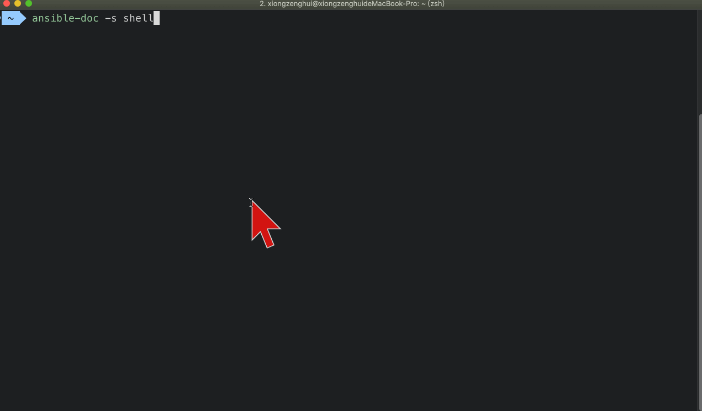

[TOC]


## 1. ansible all modules

https://docs.ansible.com/ansible/latest/modules/list_of_all_modules.html

## 2. 常用的 ansible modules

1、ping 模块 
2、raw 模块 
3、yum 模块 
4、apt 模块 
5、pip 模块 
6、synchronize 模块 
7、template 模块 
8、copy 模块 
9、user 模块、group 模块 
10、service 模块 
11、get_url 模块 
12、fetch 模块 
13、file 模块 
14、unarchive 模块 
15、command 模块、shell 模块

## 3. ansible -s {module_name} 查看模块详细参数



## 4. ansible 执行一个模块的格式

```
ansible 分组名 -m 模块名 -a "模块执行时所需的参数(多个参数使用空格分割)"
```

示例:

```
ansible jenkins -m fetch -a "src=/Users/zhihu/main.c dest=/Users/xiongzenghui/Desktop/tmp/"
```

## 5. ping 模块

类似于 linux shell 中的 ping 命令，检查指定节点机器是否还能连通

用法很简单，不涉及参数，主机如果 **在线**，则 **回复 pong**

示例:

```shell
[root@localhost ~]# ansible group_name -m ping
192.168.10.6 | SUCCESS => {
  "changed": false, 
  "ping": "pong"
}
192.168.10.7 | SUCCESS => {
  "changed": false, 
  "ping": "pong"
}
```

## 6. raw 模块

- 执行原始的命令，而不是通过模块子系统
- 在任何情况下，使用 shell 或 命令模块 是合适的
- 给定原始的参数直接通过配置的远程 shell 运行
- 可返回标准输出、错误输出和返回代码
- 此模块没有变更处理程序支持
- 这个模块 不需要 远程系统上的 Python，就像脚本模块一样
- 此模块也支持 Windows 被控机

示例:

```shell
 ~  ansible jenkins -m raw -a "echo hello"
10.13.47.102 | CHANGED | rc=0 >>
hello
Shared connection to 10.13.47.102 closed.


10.13.47.103 | CHANGED | rc=0 >>
hello
Shared connection to 10.13.47.103 closed.


10.13.47.104 | CHANGED | rc=0 >>
hello
Shared connection to 10.13.47.104 closed.
```

## 7. copy 模块

### 1. 准备【ansible 主机】中的 add.c 文件

```
 ~/Desktop  cat add.c
void add(int a, int b) {
  return a+b;
}
```

### 2. 将【ansible 主机】中的 add.c 文件，copy 拷贝到【jenkins 组内】所有的【被控机】上

```
 ~/Desktop  ansible jenkins -m copy -a "src=/Users/xiongzenghui/Desktop/add.c dest=/Users/zhihu"
 [WARNING]: Platform darwin on host 10.13.47.103 is using the discovered Python interpreter at /usr/bin/python, but future installation of another
Python interpreter could change this. See https://docs.ansible.com/ansible/devel/reference_appendices/interpreter_discovery.html for more
information.

10.13.47.103 | CHANGED => {
  "ansible_facts": {
    "discovered_interpreter_python": "/usr/bin/python"
  },
  "changed": true,
  "checksum": "83e220bc2e9ee74f1a3c7dbb69d7bdefc57d0fb0",
  "dest": "/Users/zhihu/add.c",
  "gid": 20,
  "group": "staff",
  "md5sum": "6432150626009a07140a9a0184723db8",
  "mode": "0644",
  "owner": "zhihu",
  "size": 41,
  "src": "/Users/zhihu/.ansible/tmp/ansible-tmp-1554269285.06-38417068767966/source",
  "state": "file",
  "uid": 501
}
[WARNING]: Platform darwin on host 10.13.47.104 is using the discovered Python interpreter at /usr/bin/python, but future installation of another
Python interpreter could change this. See https://docs.ansible.com/ansible/devel/reference_appendices/interpreter_discovery.html for more
information.

10.13.47.104 | CHANGED => {
  "ansible_facts": {
    "discovered_interpreter_python": "/usr/bin/python"
  },
  "changed": true,
  "checksum": "83e220bc2e9ee74f1a3c7dbb69d7bdefc57d0fb0",
  "dest": "/Users/zhihu/add.c",
  "gid": 20,
  "group": "staff",
  "md5sum": "6432150626009a07140a9a0184723db8",
  "mode": "0644",
  "owner": "zhihu",
  "size": 41,
  "src": "/Users/zhihu/.ansible/tmp/ansible-tmp-1554269285.07-168669243455966/source",
  "state": "file",
  "uid": 501
}
[WARNING]: Platform darwin on host 10.13.47.102 is using the discovered Python interpreter at /usr/bin/python, but future installation of another
Python interpreter could change this. See https://docs.ansible.com/ansible/devel/reference_appendices/interpreter_discovery.html for more
information.

10.13.47.102 | CHANGED => {
  "ansible_facts": {
    "discovered_interpreter_python": "/usr/bin/python"
  },
  "changed": true,
  "checksum": "83e220bc2e9ee74f1a3c7dbb69d7bdefc57d0fb0",
  "dest": "/Users/zhihu/add.c",
  "gid": 20,
  "group": "staff",
  "md5sum": "6432150626009a07140a9a0184723db8",
  "mode": "0644",
  "owner": "zhihu",
  "size": 41,
  "src": "/Users/zhihu/.ansible/tmp/ansible-tmp-1554269285.06-276485345641134/source",
  "state": "file",
  "uid": 501
}
 ~/Desktop 
```


### 3. 查看【被控机】中拷贝的 add.c

```
 ~/Desktop  ssh zhihu@10.13.47.102 "cat /Users/zhihu/add.c"
void add(int a, int b) {
  return a+b;
}
 ~/Desktop  ssh zhihu@10.13.47.103 "cat /Users/zhihu/add.c"
void add(int a, int b) {
  return a+b;
}
 ~/Desktop  ssh zhihu@10.13.47.104 "cat /Users/zhihu/add.c"
void add(int a, int b) {
  return a+b;
}
```

### 4. copy content

```shell
ansible group_name -m copy -a 'content="aaa\nbbb\n" dest=/opt/test'
```

### 5. force=yes 强制覆盖已有文件

```shell
ansible group_name -m copy -a "src=/testdir/copytest dest=/opt/ force=yes"
```

### 6. backup=yes 先备份再拷贝

```shell
ansible group_name -m copy -a "src=/testdir/copytest dest=/opt/ backup=yes"
```

### 7. owner=user 指定文件所属用户

```shell
ansible group_name -m copy -a "src=/testdir/copytest dest=/opt/ owner=xiongzenghui"
```

则要求【被控机】上必须要存在【xiongzenghui】这个【用户】。

### 8. owner=group 指定文件所属组

```shell
ansible group_name -m copy -a "src=/testdir/copytest dest=/opt/ group=xiongzenghui"
```

则要求【被控机】上必须要存在【xiongzenghui】这个【组】。

### 9. mode=0xxx 指定文件权限

```shell
ansible group_name -m copy -a "src=/testdir/copytest dest=/opt/ mode=0640"
```

- 1. rw
- 2. r
- 3. 没有


## 8. lineinfile 模块

### 1. 确保某一行内容，一定会出现在【被控机】指定的【文件】中

```shell
 ~/Desktop  ansible jenkins -m lineinfile -a "path=/Users/zhihu/main.c line=wocaonima"
 [WARNING]: Platform darwin on host 10.13.47.103 is using the discovered Python interpreter at /usr/bin/python, but future installation of another
Python interpreter could change this. See https://docs.ansible.com/ansible/devel/reference_appendices/interpreter_discovery.html for more
information.

10.13.47.103 | CHANGED => {
    "ansible_facts": {
        "discovered_interpreter_python": "/usr/bin/python"
    },
    "backup": "",
    "changed": true,
    "msg": "line added"
}
 [WARNING]: Platform darwin on host 10.13.47.102 is using the discovered Python interpreter at /usr/bin/python, but future installation of another
Python interpreter could change this. See https://docs.ansible.com/ansible/devel/reference_appendices/interpreter_discovery.html for more
information.

10.13.47.102 | CHANGED => {
    "ansible_facts": {
        "discovered_interpreter_python": "/usr/bin/python"
    },
    "backup": "",
    "changed": true,
    "msg": "line added"
}
 [WARNING]: Platform darwin on host 10.13.47.104 is using the discovered Python interpreter at /usr/bin/python, but future installation of another
Python interpreter could change this. See https://docs.ansible.com/ansible/devel/reference_appendices/interpreter_discovery.html for more
information.

10.13.47.104 | CHANGED => {
    "ansible_facts": {
        "discovered_interpreter_python": "/usr/bin/python"
    },
    "backup": "",
    "changed": true,
    "msg": "line added"
}
 ~/Desktop 
```

查看【被控机】上的 main.c 文件

```
 ~/Desktop  ssh zhihu@10.13.47.102 "cat /Users/zhihu/main.c"
haha woshi 102
wocaonima
 ~/Desktop 
```

```
 ~/Desktop  ssh zhihu@10.13.47.103 "cat /Users/zhihu/main.c"
#include <stdio.h>
int main() {
  printf("%s\n", "hello world");

}

wocaonima
 ~/Desktop 
```

```
 ~/Desktop  ssh zhihu@10.13.47.104 "cat /Users/zhihu/main.c"
haha woshi 104
wocaonima
 ~/Desktop 
```

可以看到【被控机】中的 main.c 文件末尾，都会被添加一行 **wocaonima** 。

因为这个三个文件中，都 **不存在** 这一行，所以会 **添加** 内容到文件末尾，，ansible 执行输出内容颜色为 **黄色**


但如果已经存在，则不会执行任何操作，ansible 执行输出内容颜色为 **绿色**


### 2. 配合【正则表达式】

- 如下命令表示根据正则表达式替换 **某一行** 
- 如果 **不止一行** 能够匹配正则，那么只有 **最后一个** 匹配正则的行才会 **被替换**
- 被匹配行会被替换成 **line 参数** 指定的内容
- 但是如果指定的表达式 **没有匹配** 到任何一行，那么 **line** 中的内容，会被添加到 该文件 的 **最后一行**

#### 1. 被控机上的 main.c 文件

```
haha woshi 104
wocaonima
wo ri ni
hello world
haha dawko kdaowk 1223
```

#### 2. 主控机上执行 lineinfile 模块

```
 ~/Desktop  ansible 10.13.47.104 -m lineinfile -a 'path=/Users/zhihu/main.c regexp="hello (.*)" line="hahahah \1 hahahahah" backrefs=yes'
 [WARNING]: Platform darwin on host 10.13.47.104 is using the discovered Python interpreter at /usr/bin/python, but future installation of another
Python interpreter could change this. See https://docs.ansible.com/ansible/devel/reference_appendices/interpreter_discovery.html for more
information.

10.13.47.104 | CHANGED => {
    "ansible_facts": {
        "discovered_interpreter_python": "/usr/bin/python"
    },
    "backup": "",
    "changed": true,
    "msg": "line replaced"
}
```

执行的 ansible 命令:

```
ansible 10.13.47.104 
  -m lineinfile 
  -a 'path=/Users/zhihu/main.c 
      regexp="hello (.*)" 
      line="hahahah \1 hahahahah" 
      backrefs=yes'
```

#### 3. 被控机上的 main.c 文件

```
haha woshi 104
wocaonima
wo ri ni
hahahah world hahahahah
haha dawko kdaowk 1223
```

#### 4. 对比【被控机】上的 main.c 文件变化


## 9. command 模块

### 1. ansible 默认自带 `-m command` 参数

注意: ansible 中默认的模块是 `-m command`，从而模块的参数不需要填写，直接使用即可。

```
ansible group_name -m command "args..."
```

```
ansible group_name "args..."
```

如上两种写法没区别。

### 2. 示例

```
 ~/Desktop  ansible jenkins -m command -a "ls /Users/zhihu"
 [WARNING]: Platform darwin on host 10.13.47.104 is using the discovered Python interpreter at /usr/bin/python, but future installation of another
Python interpreter could change this. See https://docs.ansible.com/ansible/devel/reference_appendices/interpreter_discovery.html for more
information.

10.13.47.104 | CHANGED | rc=0 >>
Desktop
Documents
Downloads
Library
Matchfile
Movies
Music
Pictures
Public
add.c
ci-jenkins
ci-jenkins-low-priority
kanshan
main.c
ossutil
ossutilmac64
test.sh
tools
upload.log

 [WARNING]: Platform darwin on host 10.13.47.103 is using the discovered Python interpreter at /usr/bin/python, but future installation of another
Python interpreter could change this. See https://docs.ansible.com/ansible/devel/reference_appendices/interpreter_discovery.html for more
information.

10.13.47.103 | CHANGED | rc=0 >>
Applications
Desktop
Developer
Documents
Downloads
Library
Movies
Music
Pictures
Public
add.c
builds
cache
ci-jenkins
go
kanshan
main.c
monitor.sh
share
tools

 [WARNING]: Platform darwin on host 10.13.47.102 is using the discovered Python interpreter at /usr/bin/python, but future installation of another
Python interpreter could change this. See https://docs.ansible.com/ansible/devel/reference_appendices/interpreter_discovery.html for more
information.

10.13.47.102 | CHANGED | rc=0 >>
Desktop
Documents
Downloads
Library
Matchfile
Movies
Music
Pictures
Public
Xcode.app
Xcode_10.1.xip
add.c
ci-jenkins
ci-jenkins-low-priority
install_ruby.sh
jenkins_check_mr_jira
kanshan
main.c
tools
```

### 3. 缺点

不支 linux/unix shell 中的 **管道** 操作。


## 10. shell 模块

类似于 linux/unix 中的 shell 解释器，可支持 shell 大部分的特性:

```
 ~/Desktop  ansible jenkins -m shell -a "ls /Users/zhihu | wc -l"
 [WARNING]: Platform darwin on host 10.13.47.104 is using the discovered Python interpreter at /usr/bin/python, but future installation of another
Python interpreter could change this. See https://docs.ansible.com/ansible/devel/reference_appendices/interpreter_discovery.html for more
information.

10.13.47.104 | CHANGED | rc=0 >>
      19

 [WARNING]: Platform darwin on host 10.13.47.103 is using the discovered Python interpreter at /usr/bin/python, but future installation of another
Python interpreter could change this. See https://docs.ansible.com/ansible/devel/reference_appendices/interpreter_discovery.html for more
information.

10.13.47.103 | CHANGED | rc=0 >>
      20

 [WARNING]: Platform darwin on host 10.13.47.102 is using the discovered Python interpreter at /usr/bin/python, but future installation of another
Python interpreter could change this. See https://docs.ansible.com/ansible/devel/reference_appendices/interpreter_discovery.html for more
information.

10.13.47.102 | CHANGED | rc=0 >>
      19
```


## 11. script 模块

相当于执行一个 sh 脚本文件。

### 1.【ansible 主机】上的 sh 脚本文件

```shell
 ~/Desktop  cat main.sh
#!/bin/zsh
echo "haha ~~~"
```

### 2. ansible 操作【被控机】执行本地的 sh 脚本文件

```shell
 ~/Desktop  ansible jenkins -m script -a "/Users/xiongzenghui/Desktop/main.sh"

10.13.47.104 | CHANGED => {
  "changed": true,
  "rc": 0,
  "stderr": "Shared connection to 10.13.47.104 closed.\r\n",
  "stderr_lines": [
      "Shared connection to 10.13.47.104 closed."
  ],
  "stdout": "haha ~~~\r\n",
  "stdout_lines": [
      "haha ~~~"
  ]
}
10.13.47.103 | CHANGED => {
  "changed": true,
  "rc": 0,
  "stderr": "Shared connection to 10.13.47.103 closed.\r\n",
  "stderr_lines": [
      "Shared connection to 10.13.47.103 closed."
  ],
  "stdout": "haha ~~~\r\n",
  "stdout_lines": [
      "haha ~~~"
  ]
}
10.13.47.102 | CHANGED => {
  "changed": true,
  "rc": 0,
  "stderr": "Shared connection to 10.13.47.102 closed.\r\n",
  "stderr_lines": [
    "Shared connection to 10.13.47.102 closed."
  ],
  "stdout": "haha ~~~\r\n",
  "stdout_lines": [
    "haha ~~~"
  ]
}
 ~/Desktop 
```


## 12. 软件包管理

### 1. redhat/debian => yum

```
ansible-doc -s yum
```

### 2. ubuntu => apt

```
ansible-doc -s apt
```

### 3. macosx => brew

#### 1. homebrew

```
ansible-doc -s homebrew
```

#### 2. homebrew_cask

```
ansible-doc -s homebrew_cask
```

### 4. pip

```
ansible-doc -s pip
```

### 5. gem

```
ansible-doc -s gem
```


## 99. 总结

基本上在 linux/unix/macosx 上面有的 shell 命令，都有对应的 ansible module 模块。

