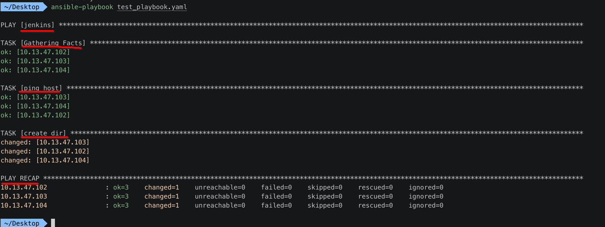

[TOC]


## 1. 直接通过【模块】操作【被控机】安装 nginx

以 redhat/debian 举例，那么需要执行如下几次 ansible 模块:

```shell
# 1. 配置 yum 源
ansible test70 -m yum_repository -a 'name=aliEpel description="alibaba EPEL" baseurl=https://mirrors.aliyun.com/epel/$releasever\Server/$basearch/'

# 2. yum install nginx
ansible test70 -m yum -a 'name=nginx disable_gpg_check=yes enablerepo=aliEpel'

# 3. service launch nginx
ansible test70 -m service -a "name=nginx state=started"
```

需要依次执行 **3次** 调用【ansible 模块】完成这件事。


## 2. ansible Ad-Hoc 命令

- 就是一个 **叫法** 问题
- an-hoc 命令，就是指直接通过 `ansible -m 模块名 -a "参数"` 执行的一条 **单独** 的命令
- eg: `ansible -m shell -a "ls -l"`


## 3. 如果通过【sh 脚本】来完成这件事

### 1. 编写好 sh 脚本文件

```shell
#!/bin/bash

# 1. 
rpm -ivh http://nginx.org/packages/centos/7/noarch/RPMS/nginx-release-centos-7-0.el7.ngx.noarch.rpm

# 2. 
yum install -y nginx

# 3. 
service nginx start
```

### 2. 执行 sh 脚本即可

```
chmmod a+x nginx.sh
./nginx.sh
```


## 4. 如果通过【单条 ansible 模块】调用

```shell
ansible jenkins -m ping
ansible jenkins -m file -a "/Users/zhihu/haha state=directory"
```


## 5. ansible 提供对应【sh 脚本】叫做【playbook】

### 1. 首先在 `/etc/ansible/hosts` 告诉 ansible 哪一些【被控机】

```
 ~/Desktop  cat /etc/ansible/hosts
# 定义【单个】被控主机
#102_host ansible_host=10.13.47.102 ansible_user=zhihu

# 定义【组】包含【多个】被控主机
[jenkins]
10.13.47.102 ansible_user=zhihu
10.13.47.103 ansible_user=zhihu
10.13.47.104 ansible_user=zhihu
```

### 2. ansible 使用 yaml 格式的文件（playbook）类似 sh 批处理文件

```yaml
# vim test_playbook.yaml
---
- hosts: jenkins
  remote_user: zhihu
  tasks:
    - name: ping host
      ping:
    - name: create dir
      file:
        path: /Users/zhihu/haha
        state: directory
```

### 3. ansible 执行 test_playbook.yaml

```
 ~/Desktop  ansible-playbook test_playbook.yaml

PLAY [jenkins] ***************************************************************************************************************************************

TASK [Gathering Facts] *******************************************************************************************************************************
ok: [10.13.47.102]
ok: [10.13.47.103]
ok: [10.13.47.104]

TASK [ping host] *************************************************************************************************************************************
ok: [10.13.47.103]
ok: [10.13.47.104]
ok: [10.13.47.102]

TASK [create dir] ************************************************************************************************************************************
changed: [10.13.47.103]
changed: [10.13.47.102]
changed: [10.13.47.104]

PLAY RECAP *******************************************************************************************************************************************
10.13.47.102               : ok=3    changed=1    unreachable=0    failed=0    skipped=0    rescued=0    ignored=0
10.13.47.103               : ok=3    changed=1    unreachable=0    failed=0    skipped=0    rescued=0    ignored=0
10.13.47.104               : ok=3    changed=1    unreachable=0    failed=0    skipped=0    rescued=0    ignored=0

 ~/Desktop 
```



### 4. 登录【被控机】查看 创建的 haha 目录

```
➜  ~ ls -l | grep haha
drwxr-xr-x   2 zhihu  staff    64 Apr  3 15:24 haha
```
