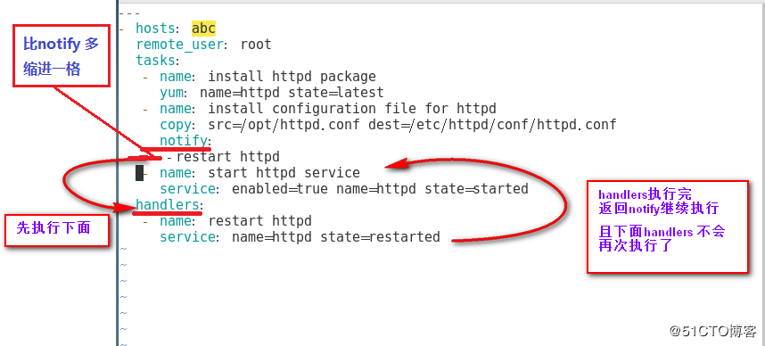
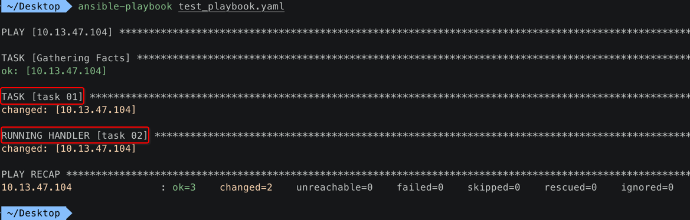
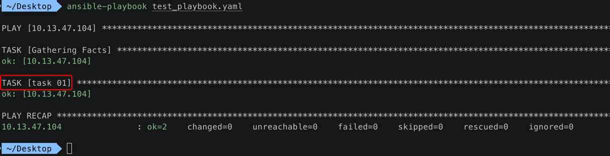

[TOC]


## 1. 场景: playbook 配置 nginx 之后，然后重启 nginx

### 1. playbook

http://www.zsythink.net/archives/2624

```yaml
---
- hosts: test70
  remote_user: root
  tasks:
  - name: Modify the configuration
    lineinfile:
      path=/etc/nginx/conf.d/test.zsythink.net.conf
      regexp="listen(.*) 8080 (.*)"
      line="listen\1 8088 \2"
      backrefs=yes
      backup=yes
  - name: restart nginx
    service:
      name=nginx
      state=restarted
```

### 2. 稍微解释下 playbook 大概做的事情

#### 1. lineinfile 模块

```yaml
lineinfile:
  path=/etc/nginx/conf.d/test.zsythink.net.conf
  regexp="listen(.*) 8080 (.*)"
  line="listen\1 8088 \2"
  backrefs=yes
  backup=yes
```

- **正则式** 匹配 `/etc/nginx/conf.d/test.zsythink.net.conf` 配置文件
- 将配置文件中匹配到的行，替换为 "listen\1 8088 \2"
- 其中的 `\1` 和 `\2` 是 `regexp="listen(.*) 8080 (.*)"` 正则式匹配到的其中 2个 `(.*)` 的内容
- 最终优先监听 8088 端口

#### 2. service 模块

```yaml
service:
  name=nginx
  state=restarted
```

**重启** nginx 服务。

### 3. 第一次 ansible 执行 playbook 后的效果

- 1. 修改 nginx conf 配置文件，监听端口 8088
- 2. **重启 nginx 服务**

ansible 内容输出颜色为 **黄色** ，匹配到内容并对文件作出 **修改**。

### 4. 第二次 ansible 执行 playbook 后的效果

仍然是执行 **两个模块** :

- 1. 修改 nginx conf 配置文件，监听端口 8088
- 2. **重启 nginx 服务**

ansible 内容输出颜色为 **绿色** ，并 **没有** 匹配到内容并对文件作出修改。

### 5. 存在的问题

- 1. **第二次** ansible 执行 playbook 后的效果，并 **没有修改** nginx 配置文件
- 2. 但仍然 **重启** nginx 服务

### 6. 希望的效果

- 只有当 ansible 执行 playbook **匹配到并修改** nginx 配置文件的时候

- 才会去 **重启** nginx 服务

## 2. handlers 解决这个问题




## 3. handlers 示例 1

```yaml
---
- hosts: 192.168.119.134
  remote_user: root
  tasks:
    - name: copy file
      copy: src=/etc/passwd dest=/tmp/aaa.txt
      notify: test handlers # 这里要指定执行下面的 handlers 中的 'test handlers'
  handlers:
    - name: test handlers 
      shell: echo "abc" >> /tmp/aaa.txt
```

- 1. 当 copy 模块执行 **成功** 结束时，**才会** 执行 **test handlers** ，使用 shell 模块执行 echo "abc" >> /tmp/aaa.txt 命令
- 2. 而如果 copy 模块执行 **失败** 结束时，则 **不会** 执行 **test handlers** 


## 4. handlers 示例 2

### 1. 主控机 playbook

```yaml
---
- hosts: 10.13.47.104
  remote_user: zhihu
  tasks:
    - name: task 01
      copy: 
        src: /Users/xiongzenghui/Desktop/add.c
        dest: /Users/zhihu
      notify: 
        - task 02
  handlers:
    - name: task 02
      shell: echo "task 02"
```

### 2. 第一次 主控机 ansible-playbook 执行 playbook



执行顺序:

- task 01
- task 02

### 3. 第二次 主控机 ansible-playbook 执行 playbook



执行顺序:

- task 01


## 5. handlers 中定义 多个【回调 task】

```yaml
---
- hosts: jenkins
  remote_user: root
  
  tasks:
  - name: make testfile1
    file: path=/testdir/testfile1
          state=directory
    notify: ht2
  - name: make testfile2
    file: path=/testdir/testfile2
          state=directory
    notify: ht1

  handlers:
  - name: ht1
    file: path=/testdir/ht1
          state=touch
  - name: ht2
    file: path=/testdir/ht2
          state=touch
```

- 1、 make testfile1 task 成功执行结束时，回调 handlers/ht2 task
- 2、 make testfile2 task 成功执行结束时，回调 handlers/ht1 task


## 6. meta: flush_handlers 立马执行的 handler

```yaml
---
- hosts: jenkins
  remote_user: root

  tasks: 
  - name: task1
    file: path=/testdir/testfile
          state=touch
    notify: handler1 # task1 的【回调】handler
  - name: task2
    file: path=/testdir/testfile2
          state=touch
    notify: handler2 # task2 的【回调】handler

  ############ 使用 meta 指定的 没有名字 的task ############
  ## 这个是【固定】写法，
  ## 表示当【上面最近】的一个【task2】执行完毕，
  ## 就会跳转到上面的【task2】使用【notity】设置的【handler2】task，
  ## 如果不这样设置，那么当【task2】执行完毕时，并【不会】去执行【handler2】task，
  ## 而是会等到【所有】task【都】执行完毕，才会去执行【handler2】task
  ##
  - meta: flush_handlers

  - name: task3
    file: path=/testdir/testfile3
          state=touch
    notify: handler3
 
  handlers:
  - name: handler1
    file: path=/testdir/ht1
          state=touch
  - name: handler2
    file: path=/testdir/ht2
          state=touch
  - name: handler3
    file: path=/testdir/ht3
          state=touch
```


## 7. notify 一个 handler task【组】

```yaml
---
- hosts: jenkins
  remote_user: root
  tasks:
  - name: task1
    file: path=/testdir/testfile
          state=touch
    notify: handler group1 # 在一个 task 中，一次性 notify 一个【handler group1 组内】的多个 task
 
  handlers:
  - name: handler1
    listen: handler group1 # handler1 task 添加到【handler group1】组内
    file: path=/testdir/ht1
          state=touch
  - name: handler2
    listen: handler group1 # handler2 task 添加到【handler group1】组内
    file: path=/testdir/ht2
          state=touch
```

当 task1 执行完毕时，会触发【handler group1】组内的所有【handler1】和【handler2】执行。