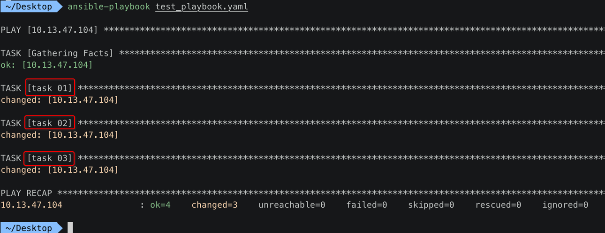
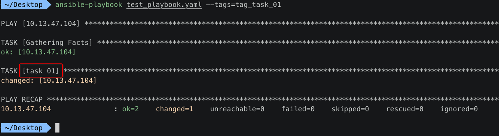
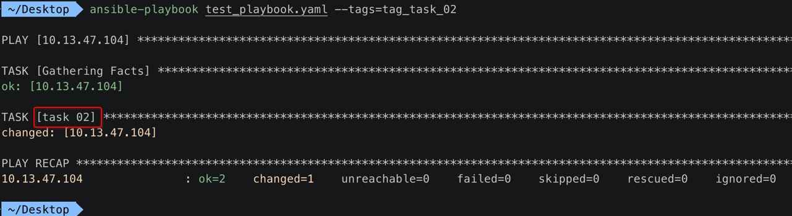
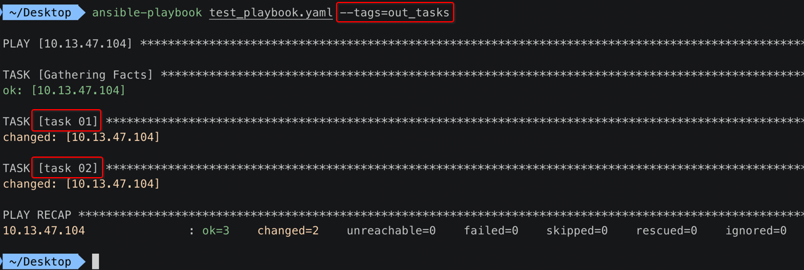
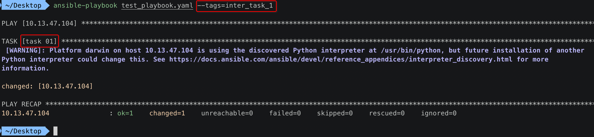
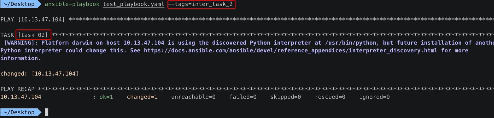
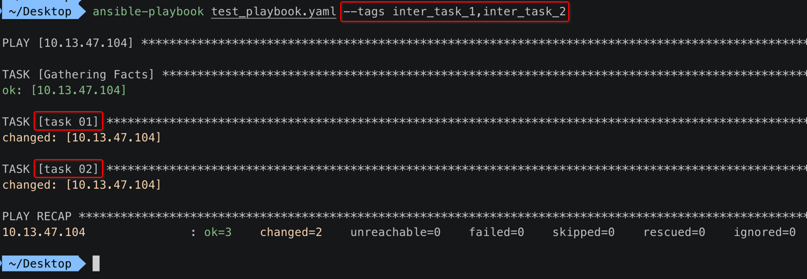
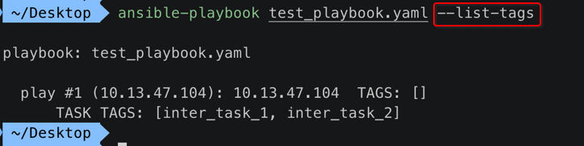

[TOC]


## 1. 默认 playbook tasks 中所有任务都会被执行

playbook:

```yaml
---
- hosts: 10.13.47.104
  remote_user: zhihu
  tasks:
    - name: task 01
      shell: echo "task 01"
    - name: task 02
      shell: echo "task 02"
    - name: task 03
      shell: echo "task 03"
```

执行效果:



依次顺序执行3个 **全部** 的任务。


## 2. 给每一个 task 添加 tags 指定名字

### 1. playbook

```yaml
---
- hosts: 10.13.47.104
  remote_user: zhihu
  tasks:
    - name: task 01
      shell: echo "task 01"
      tags: tag_task_01
    - name: task 02
      shell: echo "task 02"
      tags: tag_task_02
    - name: task 03
      shell: echo "task 03"
      tags: tag_task_03
```

### 2. 只执行 task 01



### 3. 只执行 task 02




## 3. tags 语法总结

### 1. 语法一

```yaml
tags:
 - testtag
 - t1
```

### 2. 语法二

```yaml
tags: tag1,t1
```

### 3. 语法三

```yaml
tags: ['tagtest','t2']
```


## 4. 示例1

```yaml
---
- hosts: 10.13.47.104
  remote_user: zhihu
  tasks:
    - name: task 01
      shell: echo "task 01"
      tags: 
        - tag_task_01
    - name: task 02
      shell: echo "task 02"
      tags: ['tag_task_02']
    - name: task 03
      shell: echo "task 03"
      tags: tag_task_03
```


## 5. 示例2: 给一个 task 取【不同的】tag

```yaml
---
- hosts: 10.13.47.104
  remote_user: zhihu
  tasks:
    - name: task 01
      shell: echo "task 01"
      tags: 
        - task_01_tag1, task_01_tag2, task_01_tag3
```

```
 ~/Desktop  ansible-playbook test_playbook.yaml --tags=task_01_tag1

PLAY [10.13.47.104] **********************************************************************************************************************************

TASK [Gathering Facts] *******************************************************************************************************************************
ok: [10.13.47.104]

PLAY RECAP *******************************************************************************************************************************************
10.13.47.104               : ok=1    changed=0    unreachable=0    failed=0    skipped=0    rescued=0    ignored=0

 ~/Desktop 
 ~/Desktop  ansible-playbook test_playbook.yaml --tags=task_01_tag2

PLAY [10.13.47.104] **********************************************************************************************************************************

TASK [Gathering Facts] *******************************************************************************************************************************
ok: [10.13.47.104]

PLAY RECAP *******************************************************************************************************************************************
10.13.47.104               : ok=1    changed=0    unreachable=0    failed=0    skipped=0    rescued=0    ignored=0

 ~/Desktop  ansible-playbook test_playbook.yaml --tags=task_01_tag3

PLAY [10.13.47.104] **********************************************************************************************************************************

TASK [Gathering Facts] *******************************************************************************************************************************
ok: [10.13.47.104]

PLAY RECAP *******************************************************************************************************************************************
10.13.47.104               : ok=1    changed=0    unreachable=0    failed=0    skipped=0    rescued=0    ignored=0

 ~/Desktop 
```


## 6. tags 放在 tasks 节点【外部】

### 1. playbook

```yaml
---
- hosts: 10.13.47.104
  remote_user: zhihu
  tags: out_tasks
    
  tasks:
    - name: task 01
      shell: echo "task 01"
      tags:
        - inter_task_1
    - name: task 02
      shell: echo "task 02"
      tags:
        - inter_task_2
```

### 2. 执行 tasks 节点【外部】tags: out_tasks



- 因为 **外部** 的 tags 会 **继承** 给下面的 tasks
- 所以执行 **外部** 的 tags，直接就会执行 下面的 2个 task

### 3. 执行 tasks 节点【内部】tags: inter_task_1



### 4. 执行 tasks 节点【内部】tags: inter_task_2




## 7. 同时执行【多个】tags

### 1. playbook

```yaml
---
- hosts: 10.13.47.104
  remote_user: zhihu
  tasks:
    - name: task 01
      shell: echo "task 01"
      tags:
        - inter_task_1
    - name: task 02
      shell: echo "task 02"
      tags:
        - inter_task_2
```

### 2. 同时执行 2个 tags




## 8. 列举 playbook 中的 tags

```
 ~/Desktop  ansible-playbook test_playbook.yaml --list-tags

playbook: test_playbook.yaml

  play #1 (10.13.47.104): 10.13.47.104	TAGS: []
      TASK TAGS: [inter_task_1, inter_task_2]
 ~/Desktop 
```




## 9. 忽略 tags

```
ansible-playbook --skip-tags tagged testtag.yml
```

