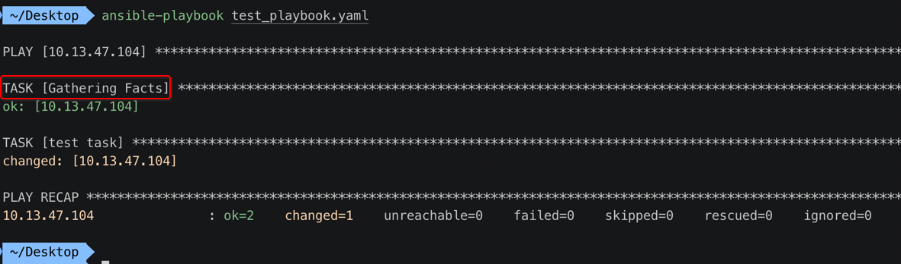

[TOC]


## 1. 定义 与 使用 变量

### 1. playbook

```yaml
---
- hosts: 10.13.47.104
  remote_user: zhihu
  
  ########## vars 块，定义变量 ############
  vars: 
    ## 变量名: 变量值
    myname: xiongzenghui
    age: 199
    sex: man
    
  tasks:
    - name: test task
      shell: echo {{ myname }} -- {{ age }} -- {{ sex }} > /Users/zhihu/txt
```

### 2. 主控机 ansible 执行 playbook


### 3. 查看【被控机】上的 txt 文件

```
super5% cat txt
xiongzenghui -- 199 -- man
super5%
```

## 2. 定义类似 dict(key-value) 类型的变量

### 1. playbook

```yaml
---
- hosts: 10.13.47.104
  remote_user: zhihu
  vars: 
    xiongzenghui:
      age: 199
      sex: man
  tasks:
    - name: test task
      shell: echo {{ xiongzenghui.age }} -- {{ xiongzenghui.sex }} > /Users/zhihu/txt1
```

### 2. 主控机 ansible 执行 playbook

```
 ~/Desktop  ansible-playbook test_playbook.yaml

PLAY [10.13.47.104] **********************************************************************************************************************************

TASK [Gathering Facts] *******************************************************************************************************************************
ok: [10.13.47.104]

TASK [test task] *************************************************************************************************************************************
changed: [10.13.47.104]

PLAY RECAP *******************************************************************************************************************************************
10.13.47.104               : ok=2    changed=1    unreachable=0    failed=0    skipped=0    rescued=0    ignored=0

 ~/Desktop 
```

### 3. 查看【被控机】上的 txt 文件

```
super5% cat txt1
199 -- man
super5%
```

## 3. 重复 定义 key

### 1. playbook

```yaml
---
- hosts: 10.13.47.104
  remote_user: zhihu
  vars: 
    xiongzenghui:
      age: 199
      sex: man
    xiaoli:
      age: 198
      sex: women
  tasks:
    - name: test task
      shell: echo {{ xiongzenghui.age }} -- {{ xiongzenghui.sex }} > /Users/zhihu/txt1
      shell: echo {{ xiaoli.age }} -- {{ xiaoli.sex }} > /Users/zhihu/txt2
```

### 2. 主控机 ansible 执行 playbook


## 4. vars_files 引用包含 变量 的文件

### 1. 单独定义 变量 的文件

```yaml
# vim /Users/xiongzenghui/Desktop/vars_defines.yaml
xiongzenghui:
  age: 199
  sex: man
```

### 2. playbook

```yaml
# vim /Users/xiongzenghui/Desktop/test_playbook.yaml
---
- hosts: 10.13.47.104
  remote_user: zhihu
  vars_files: 
    - /Users/xiongzenghui/Desktop/vars_defines.yaml
  tasks:
    - name: test task
      shell: echo {{ xiongzenghui.age }} -- {{ xiongzenghui.sex }} > /Users/zhihu/txt
```

### 3. ansible 执行 playbook

```
 ~/Desktop  ansible-playbook test_playbook.yaml

PLAY [10.13.47.104] ***************************************************************************************************************************************************

TASK [Gathering Facts] ************************************************************************************************************************************************
ok: [10.13.47.104]

TASK [test task] ******************************************************************************************************************************************************
changed: [10.13.47.104]

PLAY RECAP ************************************************************************************************************************************************************
10.13.47.104               : ok=2    changed=1    unreachable=0    failed=0    skipped=0    rescued=0    ignored=0

 ~/Desktop 
```


## 5. vars 和 vars_files 可同时使用

### 1. playbook

```yaml
---
- hosts: 10.13.47.104
  remote_user: zhihu
  vars: 
    favor: running
  vars_files: 
    - /Users/xiongzenghui/Desktop/vars_defines.yaml
  tasks:
    - name: test task
      shell: echo {{ xiongzenghui.age }} -- {{ xiongzenghui.sex }} -- {{ favor }} > /Users/zhihu/txt
```

### 2. 主控机 ansible 执行 playbook

```
 ~/Desktop  ansible-playbook test_playbook.yaml

PLAY [10.13.47.104] ***************************************************************************************************************************************************

TASK [Gathering Facts] ************************************************************************************************************************************************
ok: [10.13.47.104]

TASK [test task] ******************************************************************************************************************************************************
changed: [10.13.47.104]

PLAY RECAP ************************************************************************************************************************************************************
10.13.47.104               : ok=2    changed=1    unreachable=0    failed=0    skipped=0    rescued=0    ignored=0

 ~/Desktop 
```


## 6. 在一个 playbook 中【默认】执行的 task

### 1. playbook

```yaml
---
- hosts: 10.13.47.104
  remote_user: zhihu
  tasks:
    - name: test task
      shell: echo "hello world"
```

### 2. 执行 playbook



```
 ~/Desktop  ansible-playbook test_playbook.yaml

PLAY [10.13.47.104] ***************************************************************************************************************************************************

TASK [Gathering Facts] ************************************************************************************************************************************************
ok: [10.13.47.104]

TASK [test task] ******************************************************************************************************************************************************
changed: [10.13.47.104]

PLAY RECAP ************************************************************************************************************************************************************
10.13.47.104               : ok=2    changed=1    unreachable=0    failed=0    skipped=0    rescued=0    ignored=0

 ~/Desktop 
```

会默认执行一个名字为 **Gathering Facts** 的 task

### 3. `[Gathering Facts]` task 的作用

- 1、**默认** 执行的一个 task
- 2、用于手机 **被控制的远程主机** 上的各种信息
  - 1) ip 地址
  - 2) 主机名
  - 3) 操作系统
  - 4) 硬件参数

- 3、收集到的各种参数信息，会保存到对应的 **变量** 中
- 4、可以通过对应的 **变量** 来获取到

### 4. `[Gathering Facts]` task 属于【setup 模块】

```
- name: Gathers facts about remote hosts
  setup:
      fact_path:             # path used for local ansible facts (`*.fact') - files in this dir will be run (if executable) and their results be added to
                               `ansible_local' facts if a file is not executable it is read. Check notes for Windows options. (from 2.1
                               on) File/results format can be json or ini-format
      filter:                # if supplied, only return facts that match this shell-style (fnmatch) wildcard.
      gather_subset:         # if supplied, restrict the additional facts collected to the given subset. Possible values: `all', `min', `hardware', `network',
                               `virtual', `ohai', and `facter'. Can specify a list of values to specify a larger subset. Values can
                               also be used with an initial `!' to specify that that specific subset should not be collected.  For
                               instance: `!hardware,!network,!virtual,!ohai,!facter'. If `!all' is specified then only the min subset
                               is collected. To avoid collecting even the min subset, specify `!all,!min'. To collect only specific
                               facts, use `!all,!min', and specify the particular fact subsets. Use the filter parameter if you do not
                               want to display some collected facts.
      gather_timeout:        # Set the default timeout in seconds for individual fact gathering
(END)
```

### 5. 显示执行【setup 模块】

```
 ~/Desktop  ansible 10.13.47.104 -m setup
 [WARNING]: Platform darwin on host 10.13.47.104 is using the discovered Python interpreter at /usr/bin/python, but future installation of another Python interpreter
could change this. See https://docs.ansible.com/ansible/devel/reference_appendices/interpreter_discovery.html for more information.

10.13.47.104 | SUCCESS => {
    "ansible_facts": {
        "ansible_EHC29": {
            "device": "EHC29",
            "flags": [],
            "ipv4": [],
            "ipv6": [],
            "macaddress": "unknown",
            "mtu": "0",
            "type": "unknown"
        },
        "ansible_XHC0": {
            "device": "XHC0",
            "flags": [],
            "ipv4": [],
            "ipv6": [],
            "macaddress": "unknown",
            "mtu": "0",
            "type": "unknown"
        },
        "ansible_all_ipv4_addresses": [
            "10.13.47.104"
        ],
        "ansible_all_ipv6_addresses": [
            "fe80::85e:15bf:720d:1816%en0",
            "fe80::25f2:7126:e75c:2e73%utun0"
        ],
        "ansible_apparmor": {
            "status": "disabled"
        },
        "ansible_architecture": "x86_64",
        "ansible_awdl0": {
            "device": "awdl0",
            "flags": [
                "UP",
                "BROADCAST",
                "PROMISC",
                "SIMPLEX",
                "MULTICAST"
            ],
            "ipv4": [],
            "ipv6": [],
            "macaddress": "a6:ef:2c:5a:c2:51",
            "media": "Unknown",
            "media_select": "autoselect",
            "mtu": "1484",
            "options": [
                "PERFORMNUD",
                "DAD"
            ],
            "status": "inactive",
            "type": "ether"
        },
        "ansible_bridge0": {
            "device": "bridge0",
            "flags": [
                "UP",
                "BROADCAST",
                "SMART",
                "RUNNING",
                "SIMPLEX",
                "MULTICAST"
            ],
            "ipv4": [],
            "ipv6": [],
            "macaddress": "f2:00:01:a4:d0:b5",
            "media": "Unknown",
            "media_select": "Unknown",
            "media_type": "unknown type",
            "mtu": "1500",
            "options": [
                "PERFORMNUD",
                "DAD"
            ],
            "status": "inactive",
            "type": "ether"
        },
        "ansible_date_time": {
            "date": "2019-04-06",
            "day": "06",
            "epoch": "1554558141",
            "hour": "21",
            "iso8601": "2019-04-06T13:42:21Z",
            "iso8601_basic": "20190406T214221184186",
            "iso8601_basic_short": "20190406T214221",
            "iso8601_micro": "2019-04-06T13:42:21.184325Z",
            "minute": "42",
            "month": "04",
            "second": "21",
            "time": "21:42:21",
            "tz": "CST",
            "tz_offset": "+0800",
            "weekday": "星期六",
            "weekday_number": "6",
            "weeknumber": "13",
            "year": "2019"
        },
        "ansible_default_ipv4": {
            "address": "10.13.47.104",
            "broadcast": "10.13.47.255",
            "device": "en0",
            "flags": [
                "UP",
                "BROADCAST",
                "SMART",
                "RUNNING",
                "SIMPLEX",
                "MULTICAST"
            ],
            "gateway": "10.13.47.1",
            "interface": "en0",
            "macaddress": "00:3e:e1:ce:4c:b9",
            "media": "Unknown",
            "media_options": [
                "full-duplex"
            ],
            "media_select": "autoselect",
            "media_type": "1000base",
            "mtu": "1500",
            "netmask": "255.255.255.0",
            "network": "10.13.47.0",
            "options": [
                "PERFORMNUD",
                "DAD"
            ],
            "status": "active",
            "type": "ether"
        },
        "ansible_default_ipv6": {},
        "ansible_distribution": "MacOSX",
        "ansible_distribution_major_version": "10",
        "ansible_distribution_release": "17.7.0",
        "ansible_distribution_version": "10.13.6",
        "ansible_dns": {
            "nameservers": [
                "10.13.47.10",
                "10.13.47.11"
            ]
        },
        "ansible_domain": "",
        "ansible_effective_group_id": 20,
        "ansible_effective_user_id": 501,
        "ansible_en0": {
            "device": "en0",
            "flags": [
                "UP",
                "BROADCAST",
                "SMART",
                "RUNNING",
                "SIMPLEX",
                "MULTICAST"
            ],
            "ipv4": [
                {
                    "address": "10.13.47.104",
                    "broadcast": "10.13.47.255",
                    "netmask": "255.255.255.0",
                    "network": "10.13.47.0"
                }
            ],
            "ipv6": [
                {
                    "address": "fe80::85e:15bf:720d:1816%en0",
                    "prefix": "64"
                }
            ],
            "macaddress": "00:3e:e1:ce:4c:b9",
            "media": "Unknown",
            "media_options": [
                "full-duplex"
            ],
            "media_select": "autoselect",
            "media_type": "1000base",
            "mtu": "1500",
            "options": [
                "PERFORMNUD",
                "DAD"
            ],
            "status": "active",
            "type": "ether"
        },
        "ansible_en1": {
            "device": "en1",
            "flags": [
                "UP",
                "BROADCAST",
                "SMART",
                "RUNNING",
                "SIMPLEX",
                "MULTICAST"
            ],
            "ipv4": [],
            "ipv6": [],
            "macaddress": "00:3e:e1:ce:4c:b8",
            "media": "Unknown",
            "media_select": "autoselect",
            "media_type": "none",
            "mtu": "1500",
            "options": [
                "PERFORMNUD",
                "DAD"
            ],
            "status": "inactive",
            "type": "ether"
        },
        "ansible_en2": {
            "device": "en2",
            "flags": [
                "UP",
                "BROADCAST",
                "SMART",
                "SIMPLEX",
                "MULTICAST"
            ],
            "ipv4": [],
            "ipv6": [],
            "macaddress": "1c:36:bb:41:0e:44",
            "media": "Unknown",
            "media_options": [],
            "media_select": "autoselect",
            "media_type": "<unknow",
            "mtu": "1500",
            "options": [
                "PERFORMNUD",
                "DAD"
            ],
            "status": "inactive",
            "type": "ether"
        },
        "ansible_en3": {
            "device": "en3",
            "flags": [
                "UP",
                "BROADCAST",
                "SMART",
                "RUNNING",
                "PROMISC",
                "SIMPLEX",
                "MULTICAST"
            ],
            "ipv4": [],
            "ipv6": [],
            "macaddress": "f2:00:01:a4:d0:b5",
            "media": "Unknown",
            "media_select": "autoselect",
            "media_type": "full-duplex",
            "mtu": "1500",
            "options": [
                "TSO4",
                "TSO6"
            ],
            "status": "inactive",
            "type": "ether"
        },
        "ansible_en4": {
            "device": "en4",
            "flags": [
                "UP",
                "BROADCAST",
                "SMART",
                "RUNNING",
                "PROMISC",
                "SIMPLEX",
                "MULTICAST"
            ],
            "ipv4": [],
            "ipv6": [],
            "macaddress": "f2:00:01:a4:d0:b9",
            "media": "Unknown",
            "media_select": "autoselect",
            "media_type": "full-duplex",
            "mtu": "1500",
            "options": [
                "TSO4",
                "TSO6"
            ],
            "status": "inactive",
            "type": "ether"
        },
        "ansible_en5": {
            "device": "en5",
            "flags": [
                "UP",
                "BROADCAST",
                "SMART",
                "RUNNING",
                "PROMISC",
                "SIMPLEX",
                "MULTICAST"
            ],
            "ipv4": [],
            "ipv6": [],
            "macaddress": "f2:00:01:a4:d0:b4",
            "media": "Unknown",
            "media_select": "autoselect",
            "media_type": "full-duplex",
            "mtu": "1500",
            "options": [
                "TSO4",
                "TSO6"
            ],
            "status": "inactive",
            "type": "ether"
        },
        "ansible_en6": {
            "device": "en6",
            "flags": [
                "UP",
                "BROADCAST",
                "SMART",
                "RUNNING",
                "PROMISC",
                "SIMPLEX",
                "MULTICAST"
            ],
            "ipv4": [],
            "ipv6": [],
            "macaddress": "f2:00:01:a4:d0:b8",
            "media": "Unknown",
            "media_select": "autoselect",
            "media_type": "full-duplex",
            "mtu": "1500",
            "options": [
                "TSO4",
                "TSO6"
            ],
            "status": "inactive",
            "type": "ether"
        },
        "ansible_en7": {
            "device": "en7",
            "flags": [
                "UP",
                "BROADCAST",
                "SMART",
                "RUNNING",
                "PROMISC",
                "SIMPLEX",
                "MULTICAST"
            ],
            "ipv4": [],
            "ipv6": [],
            "macaddress": "f2:00:01:a4:d0:b1",
            "media": "Unknown",
            "media_select": "autoselect",
            "media_type": "full-duplex",
            "mtu": "1500",
            "options": [
                "TSO4",
                "TSO6"
            ],
            "status": "inactive",
            "type": "ether"
        },
        "ansible_en8": {
            "device": "en8",
            "flags": [
                "UP",
                "BROADCAST",
                "SMART",
                "RUNNING",
                "PROMISC",
                "SIMPLEX",
                "MULTICAST"
            ],
            "ipv4": [],
            "ipv6": [],
            "macaddress": "f2:00:01:a4:d0:b0",
            "media": "Unknown",
            "media_select": "autoselect",
            "media_type": "full-duplex",
            "mtu": "1500",
            "options": [
                "TSO4",
                "TSO6"
            ],
            "status": "inactive",
            "type": "ether"
        },
        "ansible_env": {
            "HOME": "/Users/zhihu",
            "LANG": "zh_CN.UTF-8",
            "LC_CTYPE": "zh_CN.UTF-8",
            "LOGNAME": "zhihu",
            "MAIL": "/var/mail/zhihu",
            "PATH": "/usr/bin:/bin:/usr/sbin:/sbin",
            "PWD": "/Users/zhihu",
            "SHELL": "/bin/zsh",
            "SHLVL": "1",
            "SSH_CLIENT": "10.13.37.56 61234 22",
            "SSH_CONNECTION": "10.13.37.56 61234 10.13.47.104 22",
            "SSH_TTY": "/dev/ttys002",
            "TERM": "xterm-256color",
            "TMPDIR": "/var/folders/9b/76wvqcsd1rb_nd64mh_36hth0000gn/T/",
            "USER": "zhihu",
            "VERSIONER_PYTHON_PREFER_32_BIT": "no",
            "VERSIONER_PYTHON_VERSION": "2.7",
            "_": "/usr/bin/python",
            "__CF_USER_TEXT_ENCODING": "0x1F5:0x19:0x34"
        },
        "ansible_fibre_channel_wwn": [],
        "ansible_fips": false,
        "ansible_fqdn": "super5",
        "ansible_gif0": {
            "device": "gif0",
            "flags": [
                "POINTOPOINT",
                "MULTICAST"
            ],
            "ipv4": [],
            "ipv6": [],
            "macaddress": "unknown",
            "mtu": "1280",
            "type": "unknown"
        },
        "ansible_hostname": "super5",
        "ansible_hostnqn": "",
        "ansible_interfaces": [
            "EHC29",
            "XHC0",
            "awdl0",
            "bridge0",
            "en0",
            "en1",
            "en2",
            "en3",
            "en4",
            "en5",
            "en6",
            "en7",
            "en8",
            "gif0",
            "lo0",
            "p2p0",
            "stf0",
            "utun0"
        ],
        "ansible_is_chroot": false,
        "ansible_iscsi_iqn": "",
        "ansible_kernel": "17.7.0",
        "ansible_lo0": {
            "device": "lo0",
            "flags": [
                "UP",
                "LOOPBACK",
                "RUNNING",
                "MULTICAST"
            ],
            "ipv4": [
                {
                    "address": "127.0.0.1",
                    "broadcast": "127.255.255.255",
                    "netmask": "255.0.0.0",
                    "network": "127.0.0.0"
                }
            ],
            "ipv6": [
                {
                    "address": "::1",
                    "prefix": "128"
                },
                {
                    "address": "fe80::1%lo0",
                    "prefix": "64",
                    "scope": "0x1"
                }
            ],
            "macaddress": "unknown",
            "mtu": "16384",
            "options": [
                "PERFORMNUD",
                "DAD"
            ],
            "type": "loopback"
        },
        "ansible_local": {},
        "ansible_lsb": {},
        "ansible_machine": "x86_64",
        "ansible_memfree_mb": 8115,
        "ansible_memtotal_mb": 16384,
        "ansible_model": "MacPro6,1",
        "ansible_nodename": "super5",
        "ansible_os_family": "Darwin",
        "ansible_osrevision": "199506",
        "ansible_osversion": "17G65",
        "ansible_p2p0": {
            "device": "p2p0",
            "flags": [
                "BROADCAST",
                "SIMPLEX",
                "MULTICAST"
            ],
            "ipv4": [],
            "ipv6": [],
            "macaddress": "0e:36:bb:41:0e:44",
            "media": "Unknown",
            "media_select": "autoselect",
            "mtu": "2304",
            "status": "inactive",
            "type": "ether"
        },
        "ansible_pkg_mgr": "homebrew",
        "ansible_processor": "Intel(R) Xeon(R) CPU E5-2697 v2 @ 2.70GHz",
        "ansible_processor_cores": "12",
        "ansible_processor_vcpus": "24",
        "ansible_product_name": "MacPro6,1",
        "ansible_python": {
            "executable": "/usr/bin/python",
            "has_sslcontext": true,
            "type": "CPython",
            "version": {
                "major": 2,
                "micro": 10,
                "minor": 7,
                "releaselevel": "final",
                "serial": 0
            },
            "version_info": [
                2,
                7,
                10,
                "final",
                0
            ]
        },
        "ansible_python_version": "2.7.10",
        "ansible_real_group_id": 20,
        "ansible_real_user_id": 501,
        "ansible_selinux": {
            "status": "Missing selinux Python library"
        },
        "ansible_selinux_python_present": false,
        "ansible_service_mgr": "launchd",
        "ansible_ssh_host_key_dsa_public": "AAAAB3NzaC1kc3MAAACBAKXOuyznnAGq+v+8yOq+JFfkbzI4rFUVMExTNqBnZ6h5+8fUQAQ8RCQJJkEYCEfPZoHUGcXsvmo81mHAyF6tOGhjL2ZzvKw8LoquPBthFW07nlIKK4z5WRC1tGmi4aPlw6O/+EqybUwq4gC59kv4ftorOSlXtqEIBoYYfBKuhIhnAAAAFQC2pH2S5Re4MaL+H0Nd1mMGqtoMvQAAAIEAmnA/QDbVC88UfkgKEycKDILf3/kVNex7tFA9ztjZAsRUsULu8cCcuN0yOvhGBGfd6kpr7aGFB0zhJWbnIhxHmE2MOusIZvEHR/UWLcSZ1E/vZkmZoBJMIljAI5RQ88O/EzbWlxqLJfthLiP3fdTw+YJ+cqeRYtr1hwjvR6cLBSIAAACAXQwkyrDGOQxwCGYROmuERpd9fU5sSMKnG5QbaIOkuOqmmSyqcm8tOH/xwLDm59tXJqQA/bgOKlq16baeDYaEP00VqhfVGUK0Ncr5X0+4j/h47by0E80JAu3S8h4rZa5LgUzzq4uVElBKkGE9ef3RCIrdhuwqGGQ3CG1D3vdXC7w=",
        "ansible_ssh_host_key_ecdsa_public": "AAAAE2VjZHNhLXNoYTItbmlzdHAyNTYAAAAIbmlzdHAyNTYAAABBBPB4obdXOcNAPyVhZSWMFa+stRybI2qHKFL8E4gdEld+IPvAYc4wlK6+v4i8M+JHkGY//uwFogdUoNQIvCRkeSs=",
        "ansible_ssh_host_key_ed25519_public": "AAAAC3NzaC1lZDI1NTE5AAAAIGfcX7kKyWDQSWun+YtsKMgREp3Npn3dEmAG45Bp9J8h",
        "ansible_ssh_host_key_rsa_public": "AAAAB3NzaC1yc2EAAAADAQABAAABAQDCij27NINIx3lq1n5YxuKr4+eWuiJxXvL0GNtWhUq4u16++Rt3yYgM+CvSVGf5ZKcfeOMaFGVgm+6KgG6L4IZRXvYpZDR7I8L+2oG0ubNIDD+ro+vPCXHHzdsjce4ydJIPVpI+q5AWVcoSvlOPlmCvEKIBG/TTIqTBT4oASwO1+LBplRQuN+u3iHdvW2g0RuvUyaWSmrkhBv63GmwtDUpeaLAzVCek70V19ZOOJB7EHK4jOw59dN5MOH82aKj22Cg5wEekPeBg8BnM1O8G/wjYAAW7WC1OLMTeS31o0XvWZLVnTadO6vraxmp1cdOW5DixsJP2DbXp8jwR9cgk3E8r",
        "ansible_stf0": {
            "device": "stf0",
            "flags": [],
            "ipv4": [],
            "ipv6": [],
            "macaddress": "unknown",
            "mtu": "1280",
            "type": "unknown"
        },
        "ansible_system": "Darwin",
        "ansible_user_dir": "/Users/zhihu",
        "ansible_user_gecos": "zhihu",
        "ansible_user_gid": 20,
        "ansible_user_id": "zhihu",
        "ansible_user_shell": "/bin/zsh",
        "ansible_user_uid": 501,
        "ansible_userspace_architecture": "x86_64",
        "ansible_userspace_bits": "64",
        "ansible_utun0": {
            "device": "utun0",
            "flags": [
                "UP",
                "POINTOPOINT",
                "RUNNING",
                "MULTICAST"
            ],
            "ipv4": [],
            "ipv6": [
                {
                    "address": "fe80::25f2:7126:e75c:2e73%utun0",
                    "prefix": "64",
                    "scope": "0x12"
                }
            ],
            "macaddress": "unknown",
            "mtu": "2000",
            "options": [
                "PERFORMNUD",
                "DAD"
            ],
            "type": "unknown"
        },
        "ansible_virtualization_role": "",
        "ansible_virtualization_type": "",
        "discovered_interpreter_python": "/usr/bin/python",
        "gather_subset": [
            "all"
        ],
        "module_setup": true
    },
    "changed": false
}
 ~/Desktop 
```

读取出了被控制的远程主机的所有的基本信息，格式为 **json** 

### 6.【过滤】只显示某一项数据

```
 ~/Desktop  ansible 10.13.47.104 -m setup -a "filter=ansible_all_ipv4_addresses"
 [WARNING]: Platform darwin on host 10.13.47.104 is using the discovered Python interpreter at /usr/bin/python, but future installation of another Python interpreter
could change this. See https://docs.ansible.com/ansible/devel/reference_appendices/interpreter_discovery.html for more information.

10.13.47.104 | SUCCESS => {
    "ansible_facts": {
        "ansible_all_ipv4_addresses": [
            "10.13.47.104"
        ],
        "discovered_interpreter_python": "/usr/bin/python"
    },
    "changed": false
}
 ~/Desktop 
```

### 7. 还可使用【通配符】【过滤】

```
 ~/Desktop  ansible 10.13.47.104 -m setup -a "filter=*mb*"
 [WARNING]: Platform darwin on host 10.13.47.104 is using the discovered Python interpreter at /usr/bin/python, but future installation of another Python interpreter
could change this. See https://docs.ansible.com/ansible/devel/reference_appendices/interpreter_discovery.html for more information.

10.13.47.104 | SUCCESS => {
    "ansible_facts": {
        "ansible_memfree_mb": 8113,
        "ansible_memtotal_mb": 16384,
        "discovered_interpreter_python": "/usr/bin/python"
    },
    "changed": false
}
 ~/Desktop 
```


## 7. 自定义【被控机】信息参数

### 1. `/etc/ansible/facts.d` 目录

- ansible 会查找这个目录下的配置文件，当做远程主机的配置信息
- 配置文件以 `xx.fact` 为后缀
- `xx.fact` 文件格式为 **ini**
- 如果没有这个目录，则自己手动创建

```
sudo mkdir -p /etc/ansible/facts.d
```

### 2. 创建一个 test.fact 配置文件

```
super5% cd /etc/ansible/facts.d
super5% vim test.fact
```

### 3. test.fact 文件内容

```ini
[testmsg]
msg1=This is the first custom test message
msg2=This is the second custom test message
```

### 4. 读取【被控机】上配置的 test.fact


### 5. ansible xx.xx.xx.xx -m setup -a "filter=ansible_local"

默认会读取 被控主机 上的 `/etc/ansible/facts.d` 目录下的 `xx.fact` 文件。

### 6. ansible xx.xx.xx.xx -m setup -a "fact_path=xx.fact 文件路径"

#### 1. 指定  `xx.fact` 文件的路径

```
super5% pwd
/Users/zhihu
super5% vim test.fact
super5% cat test.fact
[haha]
msg1=123456789
msg2=987654321
```

#### 2. ansible 读取 test.fact


```
 ~/Desktop  ansible 10.13.47.104 -m setup -a "fact_path=/Users/zhihu filter=ansible_local"
 [WARNING]: Platform darwin on host 10.13.47.104 is using the discovered Python interpreter at /usr/bin/python, but future installation of another Python interpreter
could change this. See https://docs.ansible.com/ansible/devel/reference_appendices/interpreter_discovery.html for more information.

10.13.47.104 | SUCCESS => {
    "ansible_facts": {
        "ansible_local": {
            "test": {
                "haha": {
                    "msg1": "123456789",
                    "msg2": "987654321"
                }
            }
        },
        "discovered_interpreter_python": "/usr/bin/python"
    },
    "changed": false
}
 ~/Desktop 
```


## 8. debug 模块

### 1. playbook

```yaml
---
- hosts: 10.13.47.104
  remote_user: zhihu
  tasks:
    - name: file task
      file:
        path: /Users/zhihu/main.c
        state: touch
    - name: debug task
      debug: 
        msg: this is debug info,The test file has been touched
```

### 2. ansible 执行 playbook


### 3. 格式化 输出【变量】

#### 1. playbook

```yaml
---
- hosts: 10.13.47.104
  remote_user: zhihu
  vars:
    myname: xiongzenghui
    age: 99
  tasks:
    - name: debug task
      debug: 
        msg: name={{ myname }}, age={{ age }}
```

#### 2. ansible 执行 playbook


## 9. 获取【模块】执行的【返回值】

### 1. playbook

```yaml
---
- hosts: 10.13.47.104
  remote_user: zhihu
  tasks:
    - name: cat main.c
      shell: "cat /Users/zhihu/main.c"
      register: ret # 将上面 shell 命令的 stdout 输出值，注册到变量 ret 中
    - name: debug  
      debug: 
        var: ret
```

### 2. ansible 执行 playbook


## 10. 获取【返回值】中的某个项

### 1. playbook

```yaml
---
- hosts: 10.13.47.104
  remote_user: zhihu
  tasks:
    - name: cat main.c
      shell: "cat /Users/zhihu/main.c"
      register: ret
    - name: debug  
      debug: 
        msg: cmd={{ ret.cmd }}
```

### 2. ansible 执行 playbook


## 11. 提示用户输入，并写入到变量

### 1. 让用户输入 name、age

#### 1. playbook

```yaml
---
- hosts: 10.13.47.104
  remote_user: zhihu
  vars_prompt: 
    # 要求输入值，并保存到 your_name 变量中
    - name: "your_name"
      prompt: "what is your name?"
    # 要求输入值，并保存到 your_age 变量中
    - name: "your_age"
      prompt: "how old you?"
  tasks:
    - name: debug output vars
      debug: 
        msg: name={{ your_name }} , age={{ your_age }}
```

#### 2. ansible 执行 playbook


```
 ~/Desktop  ansible-playbook test_playbook.yaml
what is your name?:
how old you?:

PLAY [10.13.47.104] ***********************************************************************************************

TASK [Gathering Facts] ********************************************************************************************
ok: [10.13.47.104]

TASK [debug output vars] ******************************************************************************************
ok: [10.13.47.104] => {
    "msg": "name=xiongzenghui , age=99"
}

PLAY RECAP ********************************************************************************************************
10.13.47.104               : ok=2    changed=0    unreachable=0    failed=0    skipped=0    rescued=0    ignored=0

 ~/Desktop 
```

但是可以看到输入的内容，都是 **不可见** 的。

### 2. 让输入的内容【可见】

#### 1. playbook

```yaml
---
- hosts: 10.13.47.104
  remote_user: zhihu
  vars_prompt: 
    # 要求输入值，并保存到 your_name 变量中
    - name: "your_name"
      prompt: "what is your name?"
      private: no
    # 要求输入值，并保存到 your_age 变量中
    - name: "your_age"
      prompt: "how old you?"
      private: no
  tasks:
    - name: debug output vars
      debug: 
        msg: name={{ your_name }} , age={{ your_age }}
```

在变量定义的节点下，使用 **private: no** 设置为内容 **可见**。

#### 2. ansible 执行 playbook


### 3. 提示用户选择【某个选项】

#### 1. playbook

```yaml
---
- hosts: 10.13.47.104
  remote_user: zhihu
  vars_prompt: 
    - name: "solution"
      prompt: "Choose the solution you want? \n
      A: solutionA\n
      B: solutionB\n
      C: solutionC\n"
      private: no
  tasks:
    - name: debug output vars
      debug: 
        msg: The final solution is {{solution}}.
```

#### 2. ansible 执行 playbook


```
 ~/Desktop  ansible-playbook test_playbook.yaml
Choose the solution you want?
 A: solutionA
 B: solutionB
 C: solutionC
: B

PLAY [10.13.47.104] ***********************************************************************************************************************************

TASK [Gathering Facts] ********************************************************************************************************************************
ok: [10.13.47.104]

TASK [debug output vars] ******************************************************************************************************************************
ok: [10.13.47.104] => {
    "msg": "The final solution is B."
}

PLAY RECAP ********************************************************************************************************************************************
10.13.47.104               : ok=2    changed=0    unreachable=0    failed=0    skipped=0    rescued=0    ignored=0

 ~/Desktop 
```

### 4. 输入 user、pwd 创建系统用户

```yaml
---
- hosts: 10.13.47.104
  remote_user: zhihu
  vars_prompt: 
    - name: "hash_string"
      prompt: "Enter something"
      private: no
      encrypt: "sha512_crypt"
  tasks:
    - name: Output the string after hash
      debug:
        msg: "{{hash_string}}"
```


## 12. 执行 playbook 时传入变量值

### 1. playbook

```yaml
---
- hosts: 10.13.47.104
  remote_user: zhihu
  tasks: 
    - name: "Passing Variables On The Command Line"
      debug: 
        msg: "pass_var={{ pass_var }}"
```

### 2. `--extra-vars "变量名=变量值"`

```
 ~/Desktop  ansible-playbook test_playbook.yaml --extra-vars "pass_var=haha"

PLAY [10.13.47.104] ***********************************************************************************************************************************

TASK [Gathering Facts] ********************************************************************************************************************************
ok: [10.13.47.104]

TASK [Passing Variables On The Command Line] **********************************************************************************************************
ok: [10.13.47.104] => {
    "msg": "pass_var=haha"
}

PLAY RECAP ********************************************************************************************************************************************
10.13.47.104               : ok=2    changed=0    unreachable=0    failed=0    skipped=0    rescued=0    ignored=0

 ~/Desktop 
```

### 3. `-e "变量名=变量值"`

```
 ~/Desktop  ansible-playbook test_playbook.yaml -e "pass_var=haha"

PLAY [10.13.47.104] ***********************************************************************************************************************************

TASK [Gathering Facts] ********************************************************************************************************************************
ok: [10.13.47.104]

TASK [Passing Variables On The Command Line] **********************************************************************************************************
ok: [10.13.47.104] => {
    "msg": "pass_var=haha"
}

PLAY RECAP ********************************************************************************************************************************************
10.13.47.104               : ok=2    changed=0    unreachable=0    failed=0    skipped=0    rescued=0    ignored=0

 ~/Desktop 
```

### 4. 一次传递【多个】变量值

```
ansible-playbook test_playbook.yaml -e "pass_var=haha myname=xiongzenghui age=99"
```

### 5. 通过【json】格式传入变量值

```
ansible-playbook cmdvar.yml -e '{"testvar":"test","testvar1":"test1"}'
```

```
ansible-playbook cmdvar.yml -e '{"countlist":["one","two","three","four"]}'
```

### 5. 传入【变量 yaml】文件

#### 1. 变量 yaml 文件

```yaml
# cat /testdir/ansible/testvar
testvar: testvarinfile
countlist:
- one
- two
- three
- four
```

#### 2. playbook

```yaml
---
- hosts: test70
  remote_user: root
  tasks:
  - name: "Passing Variables On The Command Line"
    debug:
      msg: "{{testvar}} {{countlist[0]}}"
```

#### 3. 执行 playbook

```
ansible-playbook cmdvar.yml -e "@/testdir/ansible/testvar"
```


## 13. 被控机清单: 【被控机】变量

### 1. `/etc/ansible/hosts` 主机清单文件

```
# cat /etc/ansible/hosts
102_host ansible_host=10.13.47.102 ansible_user=zhihu favor=running
```

### 2. ansible 执行 被控机

```
 ~/Desktop  ansible 102_host -m shell -a "echo {{favor}} > /Users/zhihu/txt"
102_host | CHANGED | rc=0 >>
```

### 3. 查看 被控机 被写入 favor=running 的文件 txt

```
 ~/Desktop  ssh zhihu@10.13.47.102 "cat /Users/zhihu/txt"
running
```

### 4. 复杂一点的 `/etc/ansible/hosts` 主机变量 配置

#### 1. `/etc/ansible/hosts`

```
# cat /etc/ansible/hosts
all:
  hosts:
    102_host:
      ansible_host: 10.13.47.102
      ansible_user: zhihu
      ansible_port: 22
      testhostvar1: 102_host_val_1
      testhostvar2: 102_host_val_2
      testhostvar3:
        key1: value1
        key2: value2
```

#### 2. 使用 变量 testhostvar1

```
 ~/Desktop  ansible 102_host -m shell -a "echo {{testhostvar1}} > /Users/zhihu/txt1"
102_host | CHANGED | rc=0 >>
 ~/Desktop  ssh zhihu@10.13.47.102 "cat /Users/zhihu/txt1"
102_host_val_1
 ~/Desktop 
```

#### 2. 使用 变量 testhostvar3 (dict 类型)

```
ansible 102_host -m shell -a "echo {{testhostvar3['key1']}} > /Users/zhihu/txt1"
ansible 102_host -m shell -a "echo {{testhostvar3['key2']}} > /Users/zhihu/txt2"
```

查看 被控机 上的 txt1、txt2 文件内容

```
 ~/Desktop  ssh zhihu@10.13.47.102 "cat /Users/zhihu/txt1"
value1
 ~/Desktop  ssh zhihu@10.13.47.102 "cat /Users/zhihu/txt2"
value2
 ~/Desktop 
```


## 14. 被控机清单: 【组】变量

### 1. `/etc/ansible/hosts`

```yaml
[group_01]
test70 ansible_host=10.1.1.70
test71 anisble_host=10.1.1.71
 
[group_01]
test_group_var1='group var test'
test_group_var2='group var test2'
```

### 2. 复杂一点的配置

```yaml
all: 
  children: 
    testB: 
      hosts: 
        test70: 
          ansible_host: 10.1.1.70
          ansible_port: 22
        test71:
          ansible_host: 10.1.1.71
          ansible_port: 22
       vars: 
          test_group_var1: 'group var test1'
          test_group_var2: 'group var test2'
```


## 15. 【set_fact 模块】在【task 内】定义变量

### 1. `/etc/ansible/hosts` 被控机清单文件

```
[jenkins]
10.13.47.102 ansible_user=zhihu
10.13.47.103 ansible_user=zhihu
10.13.47.104 ansible_user=zhihu
```

### 2. playbook

```yaml
---
- hosts: 10.13.47.102
  remote_user: zhihu
  tasks: 
    - set_fact:
        forvar: "running"
    - name: "debug"  
      debug: 
        msg: "forvar={{forvar}}"
```

### 3. ansible 执行 playbook

```
 ~/Desktop  ansible-playbook test_playbook.yaml

PLAY [10.13.47.102] ***********************************************************************************************************************************
  1 #102_host ansible_host=10.13.47.102 ansible_user=zhihu

TASK [Gathering Facts] ********************************************************************************************************************************
ok: [10.13.47.102]

TASK [set_fact] ***************************************************************************************************************************************
ok: [10.13.47.102]

TASK [debug] ******************************************************************************************************************************************
ok: [10.13.47.102] => {
    "msg": "forvar=running"
}

PLAY RECAP ********************************************************************************************************************************************
10.13.47.102               : ok=3    changed=0    unreachable=0    failed=0    skipped=0    rescued=0    ignored=0
```


## 16. 内置(系统预设) 变量

### 1. ansible_version

```
 ~/Desktop  ansible 102_host -m debug -a "msg={{ansible_version}}"
102_host | SUCCESS => {
  "msg": {
    "full": "2.8.0.dev0",
    "major": 2,
    "minor": 8,
    "revision": 0,
    "string": "2.8.0.dev0"
  }
}
```

### 2. hostvars

```
 ~/Desktop  ansible 102_host -m debug -a "msg={{hostvars}}"
102_host | SUCCESS => {
    "msg": {
        "10.13.47.102": {
            "ansible_check_mode": false,
            "ansible_diff_mode": false,
            "ansible_facts": {},
            "ansible_forks": 5,
            "ansible_inventory_sources": [
                "/etc/ansible/hosts"
            ],
            "ansible_playbook_python": "/Users/xiongzenghui/.pyenv/versions/2.7.10/bin/python",
            "ansible_user": "zhihu",
            "ansible_verbosity": 0,
            "ansible_version": {
                "full": "2.8.0.dev0",
                "major": 2,
                "minor": 8,
                "revision": 0,
                "string": "2.8.0.dev0"
            },
            "group_names": [
                "jenkins"
            ],
            "groups": {
                "all": [
                    "102_host",
                    "10.13.47.102",
                    "10.13.47.103",
                    "10.13.47.104"
                ],
                "jenkins": [
                    "10.13.47.102",
                    "10.13.47.103",
                    "10.13.47.104"
                ],
                "ungrouped": [
                    "102_host"
                ]
            },
            "inventory_dir": "/etc/ansible",
            "inventory_file": "/etc/ansible/hosts",
            "inventory_hostname": "10.13.47.102",
            "inventory_hostname_short": "10",
            "playbook_dir": "/Users/xiongzenghui/Desktop"
        },
        "10.13.47.103": {
            "ansible_check_mode": false,
            "ansible_diff_mode": false,
            "ansible_facts": {},
            "ansible_forks": 5,
            "ansible_inventory_sources": [
                "/etc/ansible/hosts"
            ],
            "ansible_playbook_python": "/Users/xiongzenghui/.pyenv/versions/2.7.10/bin/python",
            "ansible_user": "zhihu",
            "ansible_verbosity": 0,
            "ansible_version": {
                "full": "2.8.0.dev0",
                "major": 2,
                "minor": 8,
                "revision": 0,
                "string": "2.8.0.dev0"
            },
            "group_names": [
                "jenkins"
            ],
            "groups": {
                "all": [
                    "102_host",
                    "10.13.47.102",
                    "10.13.47.103",
                    "10.13.47.104"
                ],
                "jenkins": [
                    "10.13.47.102",
                    "10.13.47.103",
                    "10.13.47.104"
                ],
                "ungrouped": [
                    "102_host"
                ]
            },
            "inventory_dir": "/etc/ansible",
            "inventory_file": "/etc/ansible/hosts",
            "inventory_hostname": "10.13.47.103",
            "inventory_hostname_short": "10",
            "playbook_dir": "/Users/xiongzenghui/Desktop"
        },
        "10.13.47.104": {
            "ansible_check_mode": false,
            "ansible_diff_mode": false,
            "ansible_facts": {},
            "ansible_forks": 5,
            "ansible_inventory_sources": [
                "/etc/ansible/hosts"
            ],
            "ansible_playbook_python": "/Users/xiongzenghui/.pyenv/versions/2.7.10/bin/python",
            "ansible_user": "zhihu",
            "ansible_verbosity": 0,
            "ansible_version": {
                "full": "2.8.0.dev0",
                "major": 2,
                "minor": 8,
                "revision": 0,
                "string": "2.8.0.dev0"
            },
            "group_names": [
                "jenkins"
            ],
            "groups": {
                "all": [
                    "102_host",
                    "10.13.47.102",
                    "10.13.47.103",
                    "10.13.47.104"
                ],
                "jenkins": [
                    "10.13.47.102",
                    "10.13.47.103",
                    "10.13.47.104"
                ],
                "ungrouped": [
                    "102_host"
                ]
            },
            "inventory_dir": "/etc/ansible",
            "inventory_file": "/etc/ansible/hosts",
            "inventory_hostname": "10.13.47.104",
            "inventory_hostname_short": "10",
            "playbook_dir": "/Users/xiongzenghui/Desktop"
        },
        "102_host": {
            "ansible_check_mode": false,
            "ansible_diff_mode": false,
            "ansible_facts": {},
            "ansible_forks": 5,
            "ansible_host": "10.13.47.102",
            "ansible_inventory_sources": [
                "/etc/ansible/hosts"
            ],
            "ansible_playbook_python": "/Users/xiongzenghui/.pyenv/versions/2.7.10/bin/python",
            "ansible_user": "zhihu",
            "ansible_verbosity": 0,
            "ansible_version": {
                "full": "2.8.0.dev0",
                "major": 2,
                "minor": 8,
                "revision": 0,
                "string": "2.8.0.dev0"
            },
            "group_names": [
                "ungrouped"
            ],
            "groups": {
                "all": [
                    "102_host",
                    "10.13.47.102",
                    "10.13.47.103",
                    "10.13.47.104"
                ],
                "jenkins": [
                    "10.13.47.102",
                    "10.13.47.103",
                    "10.13.47.104"
                ],
                "ungrouped": [
                    "102_host"
                ]
            },
            "inventory_dir": "/etc/ansible",
            "inventory_file": "/etc/ansible/hosts",
            "inventory_hostname": "102_host",
            "inventory_hostname_short": "102_host",
            "playbook_dir": "/Users/xiongzenghui/Desktop"
        }
    }
}
```

内容很长，输出 **被控机** 的所有的配置信息。

### 3. inventory_hostname

```
 ~/Desktop  ansible 102_host -m debug -a "msg={{inventory_hostname}}"
102_host | SUCCESS => {
  "msg": "102_host"
}
```

### 4. inventory_hostname_short

```
 ~/Desktop  ansible 102_host -m debug -a "msg={{inventory_hostname_short}}"
102_host | SUCCESS => {
  "msg": "102_host"
}
```

### 5. play_hosts

```
 ~/Desktop  ansible 102_host -m debug -a "msg={{play_hosts}}"
102_host | SUCCESS => {
  "msg": [
    "102_host",
    "10.13.47.102",
    "10.13.47.103",
    "10.13.47.104"
  ]
}
```

输出的是 `/etc/ansible/hosts` 中定义的 **所有** 被控机。

### 6. groups

```
 ~  ansible 102_host -m debug -a "msg={{groups}}"
102_host | SUCCESS => {
    "msg": {
        "all": [
            "102_host",
            "10.13.47.102",
            "10.13.47.103",
            "10.13.47.104"
        ],
        "jenkins": [
            "10.13.47.102",
            "10.13.47.103",
            "10.13.47.104"
        ],
        "ungrouped": [
            "102_host"
        ]
    }
}
```

- 1、 根节点: **all**
- 2、 我自己创建的组: **jenkins**
- 3、 ansible 默认的组: **ungrouped**

### 6. group_names

```
 ~  ansible 102_host -m debug -a "msg={{group_names}}"
102_host | SUCCESS => {
    "msg": [
        "ungrouped"
    ]
}
```

获取 **当前被控机 102_host** 位于哪一个组的名字。

### 7. inventory_dir

```
 ~  ansible 102_host -m debug -a "msg={{inventory_dir}}"
102_host | SUCCESS => {
    "msg": "/etc/ansible"
}
```

获取 **ansible 被控机清单** 配置文件的存储路径。

