[TOC]


## 1. with_items : 遍历数组中值

### eg1. 一次循环创建多个文件

#### 1. playbook

```yaml
---
- hosts: 10.13.47.102
  remote_user: zhihu
  tasks: 
    - name: "循环多次创建文件"
      file: 
        path: /Users/zhihu/{{item}}
        state: touch
      with_items: 
        - 1.txt
        - 2.txt
        - 3.txt
```

#### 2. ansible-playbook 

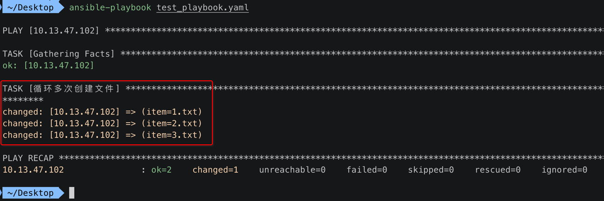

#### 3. 查看 被控机 上创建的 1.txt 2.txt 3.txt

```
 ~/Desktop  ssh zhihu@10.13.47.102 "ls /Users/zhihu/*.txt"
/Users/zhihu/1.txt
/Users/zhihu/2.txt
/Users/zhihu/3.txt
```

### eg2. item 为 dict 类型

```yaml
- tasks:
  - name: add several users
    user: name={{ item.name }} state=present groups={{ item.groups }}
    with_items:
      - { name: 'testuser1', groups: 'wheel' }
      - { name: 'testuser2', groups: 'root' }
```


## 2. with_nested : 让数组中参数作用于一条命令

### 1. 修改【单个】文件的权限

#### 1. playbook

```yaml
---
- hosts: 10.13.47.102
  remote_user: zhihu
  tasks: 
    - name: "修改1个文件的权限"
      shell: chmod -R {{ item[0] }} {{ item[1] }}
      with_nested: 
        - ['555']
        - ['1.txt']
      
```

#### 2. ansible-playbook 

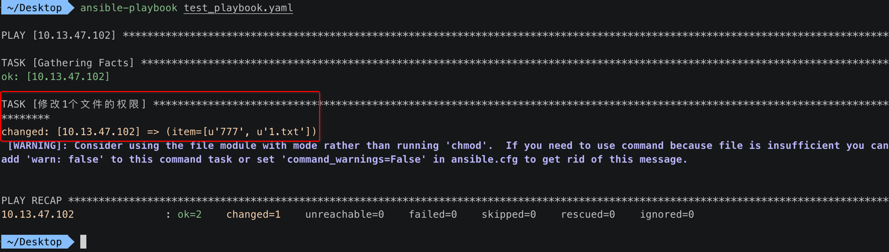

### 2. 【批量】修改【多个】文件的权限

#### 1. playbook

```yaml
---
- hosts: 10.13.47.102
  remote_user: zhihu
  tasks: 
    - name: "批量修改多个文件的权限"
      shell: chmod -R {{ item[0] }} {{ item[1] }}
      with_nested: 
        - ['666', '444', '777']
        - ['1.txt', '2.txt', '3.txt']
```

#### 2. ansible-playbook 

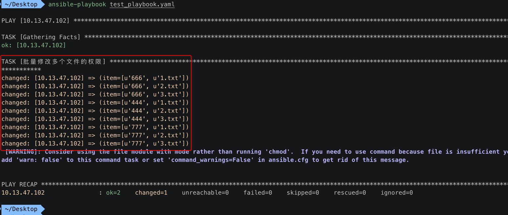


## 3. with_dict : 遍历复杂的 dict 结构

### 1. playbook

```yaml
---
- hosts: 10.13.47.102
  remote_user: zhihu
  vars_files:
    - /Users/xiongzenghui/Desktop/playbook_var.yml
  tasks: 
    - name: "Print phone records"
      debug: 
        msg: "User {{ item.key }} is {{ item.value.name }} ({{ item.value.telephone }})"
      with_dict: "{{ users }}"
```

### 2. 主控机 playbook 变量文件

```yaml
users: 
  alice: 
    name: Alice Appleworth
    telephone: 123-456-7890
  bob: 
    name: Bob Bananarama
    telephone: 987-654-3210
```

### 3. ansible-playbook

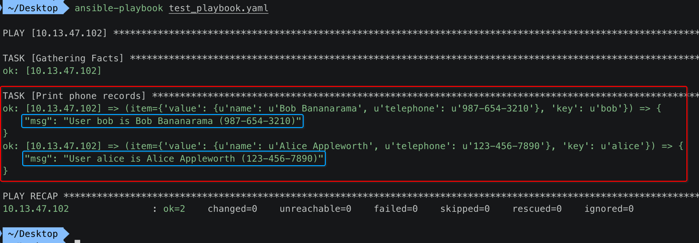


## 4. with_fileglob : 文件匹配遍历

### 1. 完成效果

- 指定 **主控机** 中的一个 **目录**
- 使用 **with_fileglob** 可以循环 **遍历** 这个目录中的 **所有文件**

### 2. playbook

```yaml
---
- hosts: 10.13.47.102
  remote_user: zhihu
  tasks: 
    - name: list dir all files
      debug: 
        msg: "{{ item }}"
      with_fileglob: 
        - /Users/xiongzenghui/Desktop/main/*.c
```

### 3. ansible-playbook

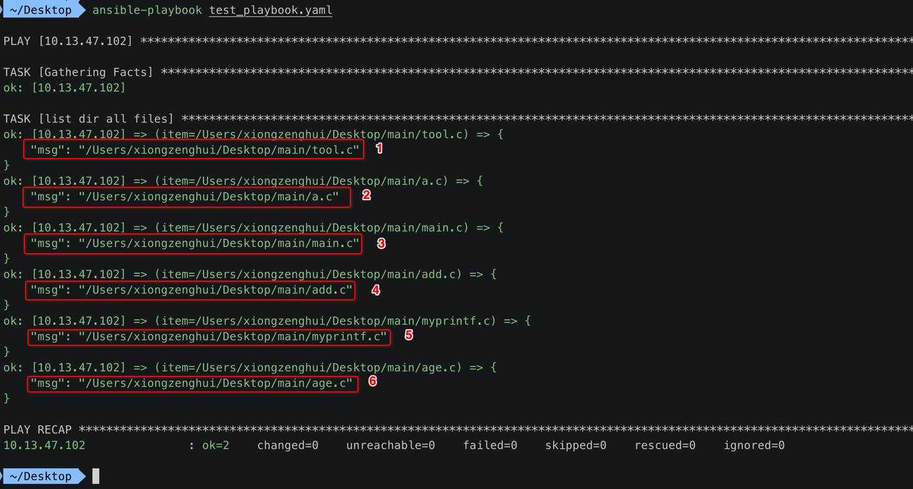


### 4. 查看 主控机 `/Users/xiongzenghui/Desktop/main/*.c`

```
 ~/Desktop/main  pwd
/Users/xiongzenghui/Desktop/main
 ~/Desktop/main  ls -l *.c
-rw-r--r--  1 xiongzenghui  staff     0 11 16 21:13 a.c
-rw-r--r--  1 xiongzenghui  staff    40 12 22 03:19 add.c
-rw-r--r--  1 xiongzenghui  staff    14 10 13 21:58 age.c
-rw-r--r--  1 xiongzenghui  staff   176  2 17 01:34 main.c
-rw-r--r--@ 1 xiongzenghui  staff  1808  4  9  2018 myprintf.c
-rw-r--r--@ 1 xiongzenghui  staff   111  6  2  2018 tool.c
```


## 5. with_subelements : 遍历子元素

### 1. playbook

```yaml
---
- hosts: 10.13.47.102
  remote_user: zhihu
  vars: 
    users: 
      - name: alice
        authorized: 
          - /tmp/alice/onekey.pub
          - /tmp/alice/twokey.pub
        mysql: 
          password: mysql-password
          hosts: 
            - "%"
            - "127.0.0.1"
            - "::1"
            - "localhost"
          privs: 
            - "*.*:SELECT"
            - "DB1.*:ALL"
      - name: bob
        authorized: 
          - /tmp/bob/id_rsa.pub
        mysql: 
          password: other-mysql-password
          hosts: 
            - "db1"
          privs: 
            - "*.*:SELECT"
            - "DB2.*:ALL"
  tasks: 
    - name: task 01
      debug: 
        msg: "name = {{ item.name }}"
      with_items:
        - "{{ users }}"
    - name: task 02
      debug: 
        msg: "User = {{ item.0.name }}, key = {{ item.1 }}"
      with_subelements: 
        - "{{ users }}"
        - authorized
```

### 2. ansible-playbook

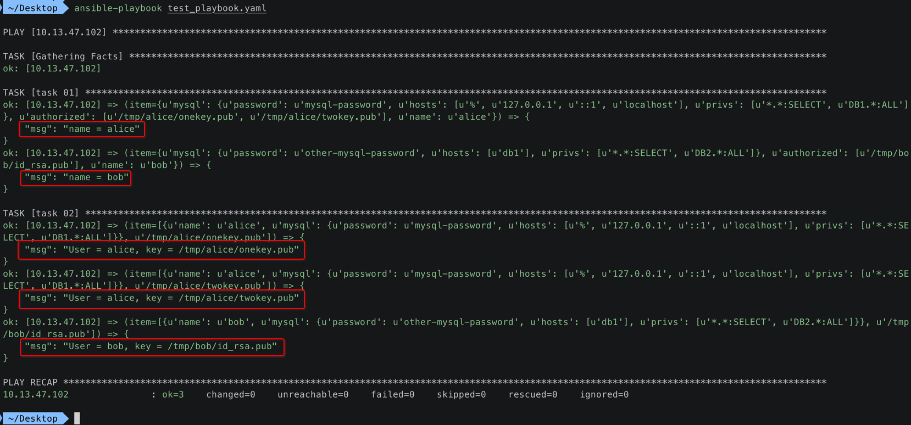


## 6. with_sequence : 构建一个序列

### 1. playbook

```yaml
---
- hosts: 10.13.47.102
  remote_user: zhihu
  tasks: 
    - name: Learn loop sequence
      debug: msg={{ item }}
      with_sequence: start=0 end=6 stride=2
```

其中的

```
with_sequence: start=0 end=6 stride=2
```

- 1、 start=0
- 2、 end=6
- 3、 stride=2

也就是构建一个序列: **0, 2, 4, 6**

### 2. ansible-playbook

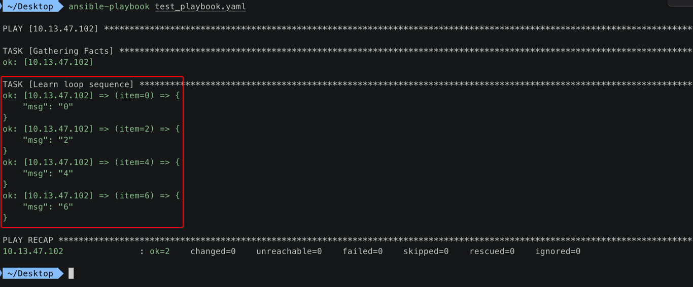


## 7. with_random_choice : 随机 序列值

### 1. playbook

```yaml
---
- hosts: 10.13.47.102
  remote_user: zhihu
  tasks: 
    - name: Learn Random
      debug: msg={{ item }}
      with_random_choice: 
        - "1111111111"
        - "2222222222"
        - "3333333333"
        - "4444444444"
```

### 2. 第1次 ansible-playbook

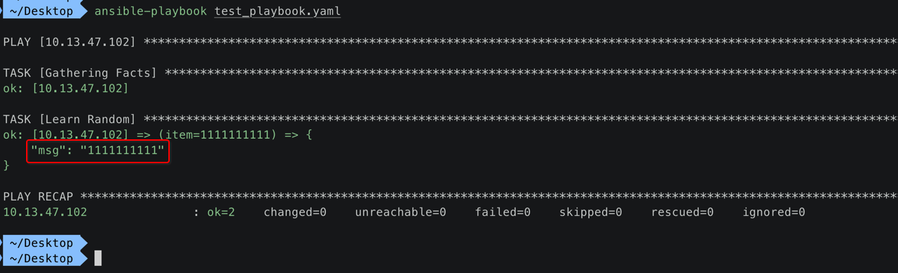

### 3. 第2次 ansible-playbook

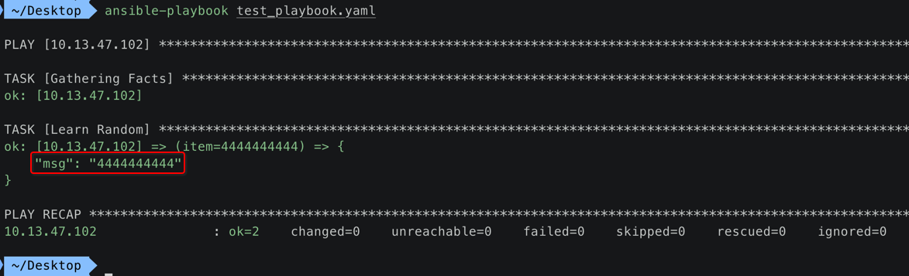

### 4. 第3次 ansible-playbook


## 8. with_lines : 遍历内容的【每一行】

### 1. playbook

```yaml
---
- hosts: 10.13.47.102
  remote_user: zhihu
  tasks: 
    - name: Learn Random
      debug: msg={{ item }}
      with_lines: /bin/ls /Users/xiongzenghui/Desktop/main/test # 在【主控机】上的目录
```

### 2. ansible-playbook

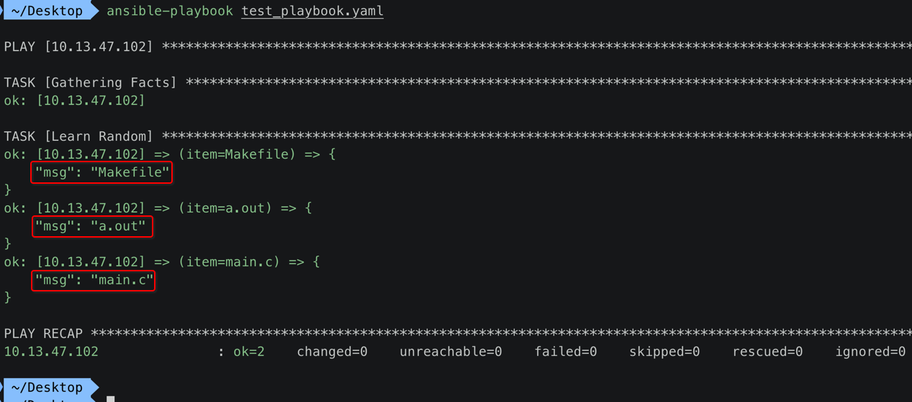


## 9. with_flatted : 【合并】数组内的元素，在进行遍历

### 1. playbook

```yaml
---
- hosts: 10.13.47.102
  remote_user: zhihu
  vars_files:
    - /Users/xiongzenghui/Desktop/playbook_var.yml
  tasks: 
    - name: with_flattened demo task
      debug: msg={{ item }}
      with_flattened: 
        - "{{ packages_base }}"
        - "{{ packages_apps }}"
```

### 2. ansible-playbook

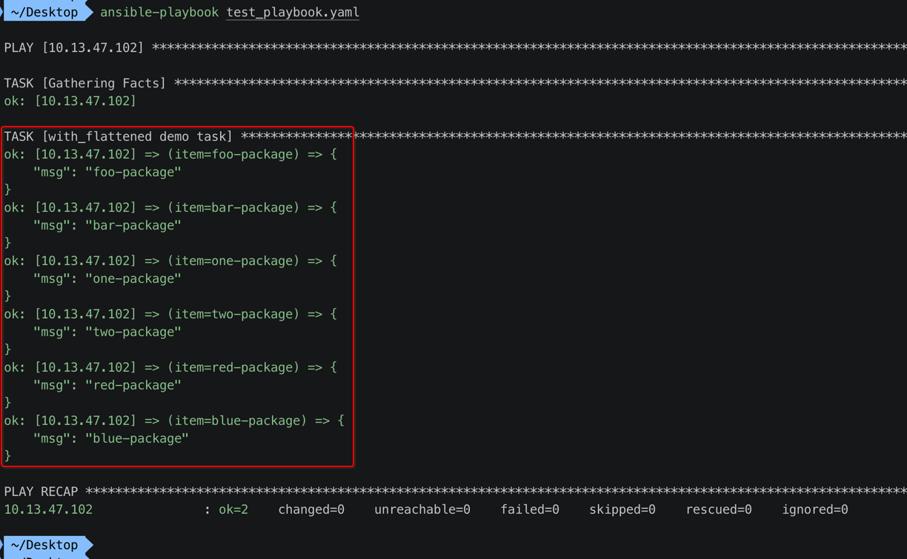


