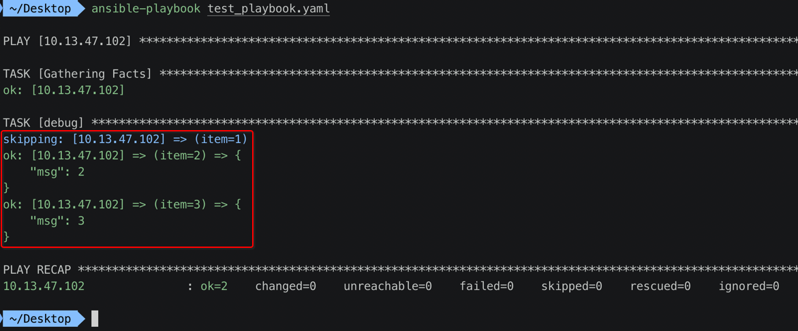
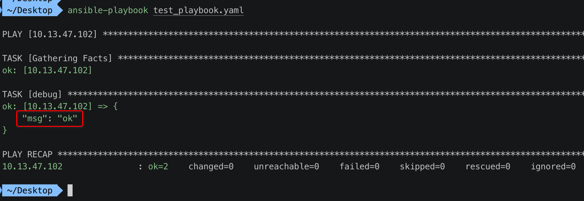
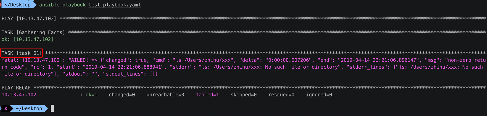
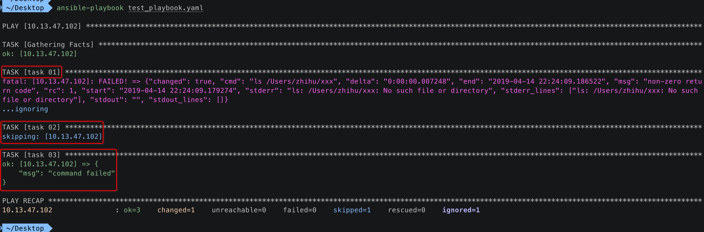

[TOC]


## 1. when

### 1. ansible_distribution 变量

#### 1. playbook

```yaml
---
- hosts: 10.13.47.102
  remote_user: zhihu
  tasks: 
    - name: debug
      debug: msg={{ ansible_distribution }}
```

#### 2. ansible-playbook

```
 ~/Desktop  ansible-playbook test_playbook.yaml

PLAY [10.13.47.102] ***********************************************************************************************************************************

TASK [Gathering Facts] ********************************************************************************************************************************
ok: [10.13.47.102]

TASK [debug] ******************************************************************************************************************************************
ok: [10.13.47.102] => {
    "msg": "MacOSX"
}

PLAY RECAP ********************************************************************************************************************************************
10.13.47.102               : ok=2    changed=0    unreachable=0    failed=0    skipped=0    rescued=0    ignored=0
```

### 2. 判断如果 ansible_distribution == "MacOSX" 

#### 1. playbook

```yaml
---
- hosts: 10.13.47.102
  remote_user: zhihu
  tasks: 
    - name: debug
      debug: msg="ansible_distribution == MacOSX"
      when: ansible_distribution == "MacOSX"
```

#### 2. ansible-playbook

```
 ~/Desktop  ansible-playbook test_playbook.yaml

PLAY [10.13.47.102] ***********************************************************************************************************************************

TASK [Gathering Facts] ********************************************************************************************************************************
ok: [10.13.47.102]

TASK [debug] ******************************************************************************************************************************************
ok: [10.13.47.102] => {
    "msg": "ansible_distribution == MacOSX"
}

PLAY RECAP ********************************************************************************************************************************************
10.13.47.102               : ok=2    changed=0    unreachable=0    failed=0    skipped=0    rescued=0    ignored=0
```

## 2. 比较运算

### 1. 运算符

```
- 1、==
- 2、!=
- 3、>
- 4、<
- 5、>=
- 6、<=
```

### 2. when + with_items

#### 1. playbook

```yaml
---
- hosts: 10.13.47.102
  remote_user: zhihu
  tasks: 
    - name: debug
      debug: msg={{ item }}
      with_items:
        - 1
        - 2
        - 3
      when: item > 1
```

#### 2. ansible-playbook



## 3. 逻辑运算

### 1. 运算符

```
- 1、and 逻辑与
- 2、or 逻辑或
- 3、not 条件值取反
- 4、() 多个条件包装为一个
```

### 2. playbook

```yaml
---
- hosts: 10.13.47.102
  remote_user: zhihu
  tasks: 
    - name: debug
      debug: msg="ok"
      when: ansible_distribution_major_version == "10" and ansible_distribution == "MacOSX" 
```

### 3. ansible-playbook




## 4. 结合 register 

### 1. 错误的例子

#### 1. playbook

```yaml
---
- hosts: 10.13.47.102
  remote_user: zhihu
  tasks: 
    - name: "task 01"
      shell: "ls /Users/zhihu/xxx"
      register: cmd_ret
    - name: "task 02"
      debug: msg="command success"
      when: cmd_ret.rc == 0
    - name: "task 03"
      debug: msg="command failed"
      when: cmd_ret.rc != 0
```

#### 2. ansible-playbook



只执行到 **task 01** 发生错误，就结束了。

### 2. ignore_errors 忽略错误【继续】执行

#### 1. playbook

```yaml
---
- hosts: 10.13.47.102
  remote_user: zhihu
  tasks: 
    - name: "task 01"
      shell: "ls /Users/zhihu/xxx"
      register: cmd_ret
      ignore_errors: true
    - name: "task 02"
      debug: msg="command success"
      when: cmd_ret.rc == 0
    - name: "task 03"
      debug: msg="command failed"
      when: cmd_ret.rc != 0
```

#### 2. ansible-playbook




