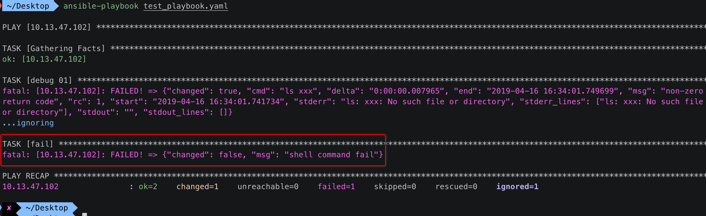

[TOC]


## 1. shell test 命令


## 2. 写成 sh 脚本

```shell
#!/bin/bash

if [[ test -e xzh ]]; then
  echo "exiist"
fi
```


## 3. sh 脚本 => playbook

### 1. playbook

```yaml
---
- hosts: 10.13.47.102
  remote_user: zhihu
  vars:
    filepath: /Users/zhihu/xxx
  tasks: 
    - name: "task 01"
      debug: msg="file exist"
      when: filepath is exists
    - name: "task 02"
      debug: msg="file not exist"
      when: filepath is not exists
```

### 2. ansible-playbook


## 4. test 变量

### 1. 判断变量的运算符

- 1、defined : 变量 **有** 定义
- 2、undefined : 变量 **没有** 定义
- 3、none : 变量 **有** 定义，但是 **没有值**

### 2. playbook

```yaml
---
- hosts: 10.13.47.102
  remote_user: zhihu
  vars:
    var1: "var1"
    var2: 
  tasks: 
    - name: "task 01"
      debug: msg="var1 is defined"
      when: var1 is defined
    - name: "task 02"
      debug: msg="var2 is none"
      when: var2 is none
    - name: "task 03"
      debug: msg="var3 is not defined"
      when: var3 is not defined
```

### 3. ansible-playbook


## 5. test 命令执行结果

### 1. 判断变量的运算符


### 2. playbook

```yaml
---
- hosts: 10.13.47.102
  remote_user: zhihu
  tasks: 
    - name: "ls file"
      shell: "ls xxx"
      register: ret
      ignore_errors: true
    - name: "task 01"
      debug: msg="success"
      when: ret is success
    - name: "task 02"
      debug: msg="failure"
      when: ret is failure
    - name: "task 03"
      debug: msg="change"
      when: ret is change
    - name: "task 04"
      debug: msg="skip"
      when: ret is skip
```

### 3. ansible-playbook


## 6. test 文件/目录/路径

### 1. test 判断的【文件/目录/路径】

- 都是位于 **安装 ansible 主控机** 上的【文件/目录/路径】
- 而并 **不是** **被控机** 上

### 2. 运算符


### 3. 示例

```yaml
---
- hosts: 10.13.47.102
  remote_user: zhihu
  
  vars:
    testpath1: "/testdir/test"
    testpath2: "/testdir/"
    testpath3: "/testdir/testsoftlink"
    testpath4: "/testdir/testhardlink"
    testpath5: "/boot"
  
tasks:
  - debug:
      msg: "file"
    when: testpath1 is file
  - debug:
      msg: "directory"
    when: testpath2 is directory
  - debug:
      msg: "link"
    when: testpath3 is link
  - debug:
      msg: "link"
    when: testpath4 is link
  - debug:
      msg: "mount"
    when: testpath5 is mount
  - debug:
      msg: "exists"
    when: testpath1 is exists
```


## 7. test 字符串

### 1. 运算


### 2. 示例

```yaml
---
- hosts: 10.13.47.102
  remote_user: zhihu
  gather_facts: no
  
  vars:
    str1: "abc"
    str2: "ABC"
  
  tasks:
  - debug:
      msg: "This string is all lowercase"
    when: str1 is lower
  - debug:
      msg: "This string is all uppercase"
    when: str2 is upper
```


## 8. test version

### 方式1: version(ver,">")

#### 1. playbook

```yaml
---
- hosts: 10.13.47.102
  remote_user: zhihu
  vars: 
    ver1: "7.4.1708"
    ver2: "7.4.1707"
  tasks:
    - name: "task 01"
      debug: msg="ver1 > ver2"
      when: ver1 is version(ver2,">")
```

#### 2. ansible-playbook


### 方式2: version(ver,"gt")

#### 1. playbook

```yaml
---
- hosts: 10.13.47.102
  remote_user: zhihu
  vars: 
    ver1: "7.4.1708"
    ver2: "7.4.1707"
  tasks:
    - name: "task 01"
      debug: msg="ver1 > ver2"
      when: ver1 is version(ver2,"gt")
```

#### 2. ansible-playbook

同上


## 9. subset、superset


```yaml
- hosts: test70
  remote_user: root
  gather_facts: no
  vars:
    a:
    - 2
    - 5
    b: [1,2,3,4,5]
  tasks:
  - debug:
      msg: "A is a subset of B"
    when: a is subset(b)
  - debug:
      msg: "B is the parent set of A"
    when: b is superset(a)
```


## 10. string 判断变量值是否是【字符串】

```yaml
---
- hosts: test70
  remote_user: root
  gather_facts: no
  
  vars:
    testvar1: 1
    testvar2: "1"
    testvar3: a
  
  tasks:
  - debug:
      msg: "This variable is a string"
    when: testvar1 is string
  - debug:
      msg: "This variable is a string"
    when: testvar2 is string
  - debug:
      msg: "This variable is a string"
    when: testvar3 is string
```


## 11. number 判断变量值是否是【数值】

```yaml
---
- hosts: test70
  remote_user: root
  gather_facts: no
  vars:
    testvar1: 1
    testvar2: "1"
    testvar3: 00.20
  tasks:
  - debug:
      msg: "This variable is number"
    when: testvar1 is number
  - debug:
      msg: "This variable is a number"
    when: testvar2 is number
  - debug:
      msg: "This variable is a number"
    when: testvar3 is number
```


## 12. when + block (组合多个模块)

```yaml
- hosts: 102_host
  remote_user: zhihu
  tasks:
  - shell: 'ls /ooo'
    register: return_value
    ignore_errors: true
  - debug:
      msg: "I cought an error"
    when: return_value is failed
```

- 1、在远程被控机上执行 'ls /ooo' 命令
  - 1) 并将命令的执行结果值写入到 **return_value** 变量中
  - 2) 并且 ignore_errors 忽略错误，继续往下执行 playbook

- 2、when 判断 **return_value** 变量中的值，是否是 **失败**，如果失败则执行 debug 模块打印 "**I cought an error"**


## 13. block + rescue 错误捕获

```yaml
---
- hosts: 102_host
  remote_user: zhihu
  tasks:
  - block:
    - shell: 'ls /opt'
    - shell: 'ls /testdir'
    - shell: 'ls /c'
    rescue:
      - debug:
        msg: 'I caught an error'
```

- 1、首先执行 block 里面的 3个 shell 命令
- 2、一旦某一个 shell 命令执行 **出错** 时，就会触发下面的 **rescue** 节点中的 debug 模块执行


## 14. block + rescue + always

```yaml
---
- hosts: 102_host
  remote_user: zhihu
  tasks:
  - block:
    - shell: 'ls /opt'
    - shell: 'ls /testdir'
    - shell: 'ls /c'
    rescue:
      - debug:
        msg: 'I caught an error'
    always:
      - debug:
        msg: "This always executes"
```

- 1、首先执行 block 里面的 3个 shell 命令
- 2、一旦某一个 shell 命令执行 **出错** 时，就会触发下面的 **rescue** 节点中的 debug 模块执行
- 3、最终一定会执行 **always** 节点中的 debug 模块代码


## 15. fail 模块

### 1. playbook

```yaml
---
- hosts: 10.13.47.102
  remote_user: zhihu
  vars: 
    ver1: "7.4.1708"
    ver2: "7.4.1707"
  tasks:
    - name: "debug 01"
      debug: msg="debug 01"
    - name: "fail"
      fail: msg="fail"
    - name: "debug 02"
      debug: msg="debug 02"
```

### 2. ansible-playbook


直接 **停止** 在调用 **fail** 模块，不再往下继续执行。


## 16. fail + when

### 1. playbook

```yaml
---
- hosts: 10.13.47.102
  remote_user: zhihu
  vars: 
    ver1: "7.4.1708"
    ver2: "7.4.1707"
  tasks:
    - name: "debug 01"
      shell: 'ls xxx'
      register: ret
      ignore_errors: true
    - name: "fail"
      fail: msg="shell command fail"
      when: 'ret is failure'
```

### 2. ansible-playbook




## 17. failed_when

### 1. playbook

```yaml
---
- hosts: 10.13.47.102
  remote_user: zhihu
  tasks: 
    - name: "task 01"
      shell: 'ls *.txt | wc -l'
      register: ret
      failed_when: 'ret.stdout > 4'
```

### 2. ansible-playbook


### 3. 远程 被控机

```
super3% ls *.txt | wc -l
  3
```


## 18. changed_when 控制文件状态是否 change

- 在使用 command /shell 模块的时候
- ansible playbook 会按照自己的判断来决定是否 changed
- 有时候我们仅仅是 ls 文件
- ansible-playbook 也会认为是 changed，可能这并不是我们想要的
- 这个时候我们就要用例子中方法来修改task的状态

```yaml
---
- hosts: test70
  remote_user: root
  tasks:
    - shell: /usr/bin/billybass --mode="take me to the river"
      register: bass_result
      changed_when: "bass_result.rc != 2"

    # this will never report 'changed' status
    - shell: wall 'beep'
      changed_when: False
```

