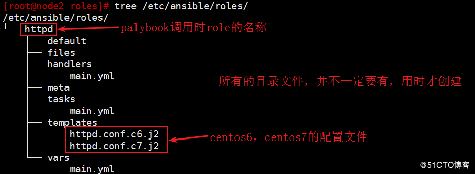
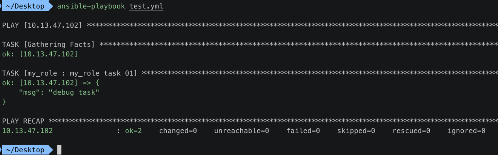

[TOC]


## 1. roles (角色) 作用

- 前面已经学习过各种编写 **playbook** 中的语法
- 现在的问题是如何让这些已经编写好的 playbook 能够 **重用**
- ansible 通过 role 将一系列 playbook 组织起来


## 2. role : 一个有规定的目录结构

### 1. 目录名

```
- role_name/  : 我们定义的role的名字
  - files/      : 用于存放各种模块调用的函数
  - tasks/      : 用于定义各种task，此目录一定要有 main.yml ;其他文件需要 main.yml 包含调用
  - handlers/   : 用于定义各种handlers，此目录一定要有 main.yml ;其他文件需要 main.yml 包含调用
  - vars/       : 用于定义variables，此目录一定要有 main.yml ;其他文件需要 main.yml 包含调用
  - templates/  : 存储由 template 模块调用的模板文本；
  - meta/       : 定义当前角色的特殊设定及其依赖关系，
                此目录中至少应该有一个名为 main.yml 的文件；
                其它的文件需要由 main.yml 进行“包含”调用；
  - default/    : 此目录中至少应该有一个名为 main.yml 的文件，用于设定默认变量；
```

### 2. 示例




## 3. `/etc/ansible/ansible.cfg` 注册存放 role 路径

```
# sudo vim 
roles_path = /etc/ansible/roles:/usr/share/ansible/roles:{其他的roles路径}
```


## 4. playbbok 使用 roles 引用 role

### 1. 使用 `/etc/ansible/roles` 无参

```yaml
- hosts: HOSTS
  remote_user: root
  roles:
    - ROLE_NAME1
    - ROLE_NAME2
```

### 2. 使用 `/etc/ansible/roles` 无参

```yaml
- hosts: HOSTS
  remote_user: root
  roles:
  - { role: ROLE_NAME1, VARIABLE1: VALUE1, ... }
```

### 3. 使用 `/etc/ansible/roles` 无参

```yaml
---
- hosts: HOSTS
  remote_user: root
    - role: ROLE_NAME1
    - role: ROLE_NAME2
```

### 4. 使用 role 绝对路径

```yaml
- hosts: HOSTS
  remote_user: root
  roles:
    - role: /root/lab-ansible/roles/ROLE_NAME1
    - role: /root/lab-ansible/roles/ROLE_NAME2
```

### 5. 有参数

```yaml
- hosts: HOSTS
  remote_user: root
  roles:
    - role: ROLE_NAME1
      vars:
        name: Maurice
        age: 100
```

或者 

```yaml
- hosts: HOSTS
  remote_user: root
  roles:
    - {role: ROLE_NAME1, name='Maurice', age='100'}
```


### 6. tags

```yaml
- hosts: HOSTS
  remote_user: root
  roles:
    - role: ROLE_NAME1
      tags:
        - tag_one
        - tag_two
```

或者 

```yaml
- hosts: HOSTS
  remote_user: root
  roles:
    - {role: ROLE_NAME1, tags:['tag_one','tag_two']}
```

### 7. when 条件执行 role

```yaml
- hosts: HOSTS
  remote_user: root
  roles:
  - {role: ROLE_NAME1, when: CONDITIONS}
```


## 5. 手动创建一个 role

### 1. 创建 role 规定的目录结构

```
cd /etc/ansible/roles
sudo mkdir -pv my_role/{files,templates,tasks,handlers,vars,defaults,meta}
sudo touch my_role/{files,templates,tasks,handlers,vars,defaults,meta}/main.yml
```

### 2. my_role 目录结构

```
 /etc/ansible/roles   master  tree my_role
my_role
├── defaults
│   └── main.yml
├── files
│   └── main.yml
├── handlers
│   └── main.yml
├── meta
│   └── main.yml
├── tasks
│   └── main.yml
├── templates
│   └── main.yml
└── vars
    └── main.yml

7 directories, 7 files
```

### 3. my_role/tasks/main.yml

```yaml
- name: "my_role task 01"
  debug: msg="debug task"
```

在 `{role_name}/tasks/main.yml` 文件中，编写要执行的任务。

### 4. 任意目录下的 test.yml 调用 my_role

```yaml
---
- hosts: 10.13.47.102
  remote_user: zhihu
  roles: 
    - my_role
```

### 5. ansible-playbook test.yml 



### 6. rolese 引用 role 的缺点

- 很明显就是将需要的 role **写死** 在一个 **数组** 中，
- 无法按照 **逻辑** 导入某一些 role


## 6. playbbok 使用 include_role 和 import_role 引用 role

### 1. playbook 分别使用 include_role 和 import_role 引用同一个 role

```
---
# cat test.yaml
- hosts: node1
  tasks:
    # include
    - include_role:
        name: role_A
      tags: maurice
    # import
    - import_role:
        name: role_B
      tags: maurice
```

在 include_role 和 import_role 节点，都是用 **tags: maurice** 限制只执行 **maurice** tag task。

### 2. role_A 和 role_B 内容都一样

- role_A/tasks/main.yml
- role_B/tasks/main.yml

```yaml
---
- debug:
  msg: "age"
- debug:
  msg: "maurice"
```

### 3. ansible-playbook test.yml

```
PLAY [node1] *************************************************************

TASK [Gathering Facts] *************************************************************
ok: [node1]

TASK [include_role : role_A] *************************************************************

TASK [role_B : debug] *************************************************************
ok: [node1] => {
    "msg": "I'm just role_B"
}

PLAY RECAP *************************************************************
node1                      : ok=2    changed=0    unreachable=0    failed=0
```

执行结果:

- 虽然 role_A 被引用，但里面的 task 并 **没有执行**
- 但是 role_B 中的 task 都被执行了，tag 并没有启动 **限制** task 的作用

### 4. 结论

- 1) include_role: **动态(运行时）** 根据 **条件** 导入 role
- 2) import_role: **静态库(文件读取时)** 直接全部 导入 role


## 7. 重复导入 role

test.yaml playbook

```yaml
---
- hosts: node1
  roles:
    - role_A
    - role_A
    - role_A
```

- 不添加 **其他变量、tag** 等的情况下
- 一个playbook中对同一个role引入多次时
- 实际 ansible 只会 **执行一次**


## 8. roles 与 tasks 执行顺序

如果 playbook 中只有「tasks」和「roles」，ansible 总是会先执行「roles」语句部分。


## 9. role 依赖

### 1. role「car」引入了role「wheel」

```yaml
---
# roles/car/meta/main.yml
dependencies:
- role: wheel
  vars:
    n: 1
- role: wheel
  vars:
    n: 2
- role: wheel
  vars:
    n: 3
- role: wheel
  vars:
    n: 4
```

### 2. role「wheel」引入了 role「tire」和「brake」

```yaml
# roles/wheel/meta/main.yml
---
dependencies:
- role: tire
- role: brake
```

### 3. ansible-playbook 执行结果

```
tire(n=1)
brake(n=1)
wheel(n=1)
tire(n=2)
brake(n=2)
wheel(n=2)
...
car
```


## 10. Ansible Galaxy 自动创建 role 目录结构

```
 ~/Desktop  ansible-galaxy init haha
- haha was created successfully
```

```
 ~/Desktop  ansible-galaxy init haha
- haha was created successfully
 ~/Desktop  tree haha
haha
├── README.md
├── defaults
│   └── main.yml
├── files
├── handlers
│   └── main.yml
├── meta
│   └── main.yml
├── tasks
│   └── main.yml
├── templates
├── tests
│   ├── inventory
│   └── test.yml
└── vars
    └── main.yml

8 directories, 8 files
```

