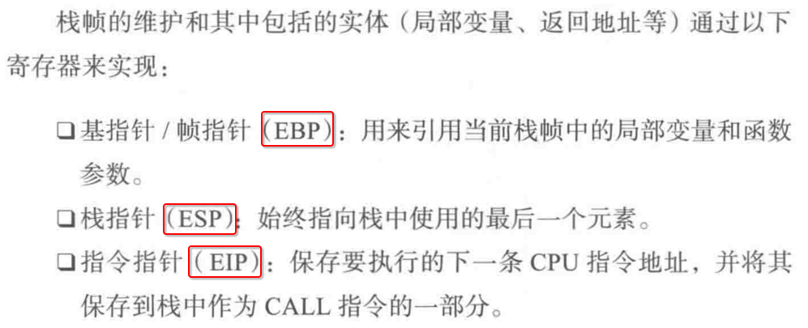
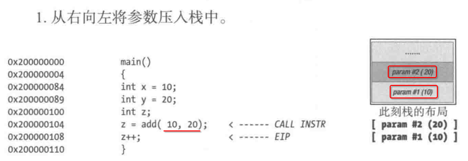

[TOC]

## 1. 可执行文件在内存中的结构

## 2. 函数调用栈帧

## 3. 函数调用的步骤

### 1. 从右到左，将函数参数压栈

### 2. 调用函数

### 3. 保存之前的栈底，更新新的栈底

### 4. 从【被调用】函数中，返回到【主调】函数

## 4. 虚拟内存地址 <=> 物理内存地址

- CPU 将一个要访问的 **虚拟地址** 发送给 **MMU**
- MMU 将 虚拟地址 翻译为对应的 **物理地址**

## 5. 内核管理用户进程

每一个用户进程中，都有一个分配在 **内核空间** 中的 **内核内存块**

## 6. 虚拟地址结构

## 7. 虚拟地址 => 物理地址

## 8. 虚拟分页

## 9. 页表

记录一个 **虚拟页** 对应的 **物理内存地址**。