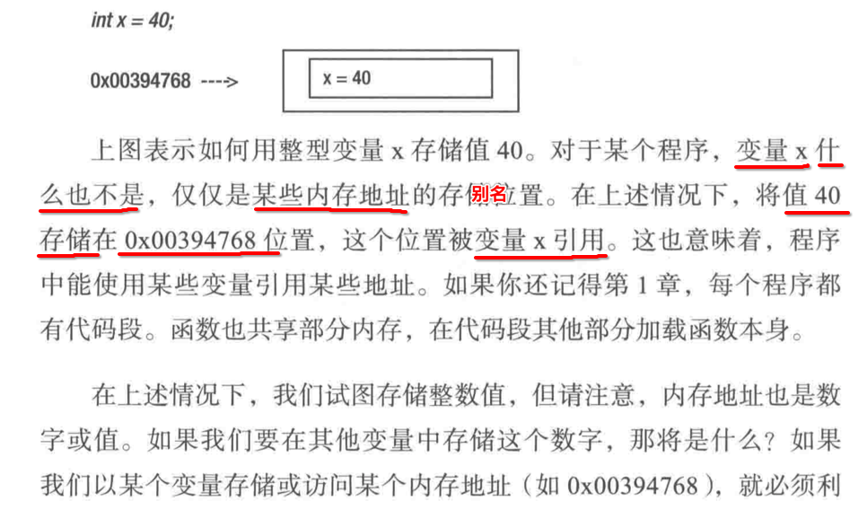
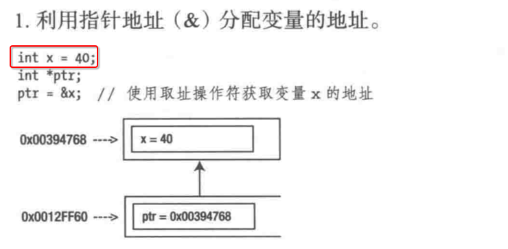
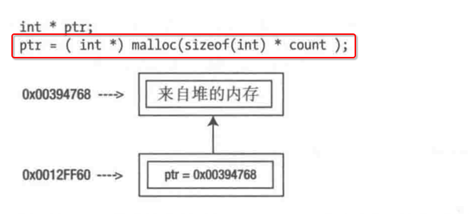
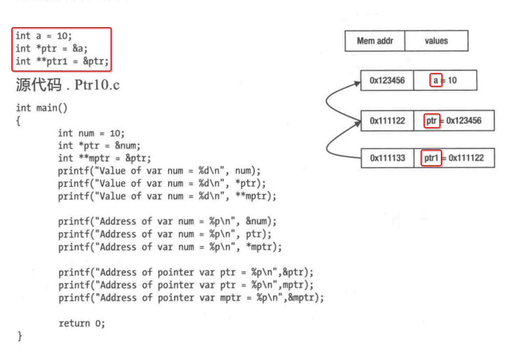

[TOC]


## 1. 变量



- **数据** 最终都是存储在 **某一块内存**
- 每一块内存都有唯一的 **内存地址**
- 代码中如果直接通过 **内存地址** 来定位，显得就太麻烦了
- **编译器** 让我们可以通过一个 **变量名** 来替代 **内存地址值**
- 所以 **一个变量(名）** 其实就是一个 **内存地址值** 的 **别名**


## 2. `&变量` 获取这个变量标记的【内存起始地址】

### 1. `&普通变量`

```c
#include <stdio.h>
#include <stdlib.h>
#include <string.h>

int main(int argc, const char * argv[]) 
{
  int age = 99;
  printf("&age = %p\n", &age);
}
```

```
 ~/Desktop/main  make
gcc main.c
./a.out
&age = 0x7ffee6f0c11c
```

### 2. `char*` 字符串，本身就是 内存起始地址

```c
#include <stdio.h>
#include <stdlib.h>
#include <string.h>

int main(int argc, const char * argv[]) 
{
  char* name = "xiong";
  printf("name = %p\n", name);
}
```

```
 ~/Desktop/main  make
gcc main.c
./a.out
name = 0x107feaf9e
```

### 3. 数组名 本身也是 内存起始地址

```c
#include <stdio.h>
#include <stdlib.h>
#include <string.h>

int main(int argc, const char * argv[]) 
{
  int arr[] = {1,2,3,4,5};
  printf("arr = %p\n", arr);
}
```

```
 ~/Desktop/main  make
gcc main.c
./a.out
arr = 0x7ffee0b68100
```

### 4. `&结构体成员变量`

```c
#include <stdio.h>
#include <stdlib.h>
#include <string.h>

typedef struct Person
{
  char name[8];
  int  age;
}Person;

int main(int argc, const char * argv[]) 
{
  printf("sizeof(Person) = %ld\n", sizeof(Person));

  Person p1 = {"xiong", 99};

  printf("&p1 = %p\n", &p1);
  printf("p1.name = %p\n", p1.name); // `char name[n]` 数组名，本身就是 内存起始地址，不需要使用 & 
  printf("&p1.age = %p\n", &p1.age);
}
```

```
 ~/Desktop/main  make
gcc main.c
./a.out
sizeof(Person) = 12
&p1 = 0x7ffee1e25108
p1.name = 0x7ffee1e25108
&p1.age = 0x7ffee1e25110
```

- 1) p1 起始内存地址 : 0x7ffee1e25**108**
- 2) name 成员的起始地址 : 0x7ffee8b6e**108**  (与 `&p1` 相等)
- 3) age 成员的起始地址 : 0x7ffee8b6e**110**
- 4) 0x7ffee8b6e**110** - 0x7ffee8b6e**108** = 0x08
- 5) `char name[8];` 刚好就是 **0x08(8) 字节**


## 3. 指针的【赋值】

### 1. 指针 指向【栈上】内存



### 2. 指针 指向【堆区】内存



- 本质上并没有什么区别
- 唯一的区别是【指向的】【内存】到底在哪里


## 4. 指针类型 占用的 内存字节数

```c
#include <stdio.h>
#include <stdlib.h>
#include <string.h>

typedef struct Person
{
  char name[8];
  int  age;
}Person;

int main(int argc, const char * argv[]) 
{
  // 1级指针
  printf("sizeof(char***) = %ld\n", sizeof(char***));
  printf("sizeof(int***) = %ld\n", sizeof(int***));
  printf("sizeof(double***) = %ld\n", sizeof(double***));
  printf("sizeof(Person***) = %ld\n", sizeof(Person***));

  // 2级指针
  printf("sizeof(char***) = %ld\n", sizeof(char***));
  printf("sizeof(int***) = %ld\n", sizeof(int***));
  printf("sizeof(double***) = %ld\n", sizeof(double***));
  printf("sizeof(Person***) = %ld\n", sizeof(Person***));

  // 3级指针
  printf("sizeof(char***) = %ld\n", sizeof(char***));
  printf("sizeof(int***) = %ld\n", sizeof(int***));
  printf("sizeof(double***) = %ld\n", sizeof(double***));
  printf("sizeof(Person***) = %ld\n", sizeof(Person***));


  // n级别指针
  printf("sizeof(char********************) = %ld\n", sizeof(char********************));
  printf("sizeof(int********************) = %ld\n", sizeof(int********************));
  printf("sizeof(double********************) = %ld\n", sizeof(double********************));
  printf("sizeof(Person********************) = %ld\n", sizeof(Person********************));
}
```

```
 ~/Desktop/main  make
gcc main.c
./a.out
sizeof(char***) = 8
sizeof(int***) = 8
sizeof(double***) = 8
sizeof(Person***) = 8
sizeof(char***) = 8
sizeof(int***) = 8
sizeof(double***) = 8
sizeof(Person***) = 8
sizeof(char***) = 8
sizeof(int***) = 8
sizeof(double***) = 8
sizeof(Person***) = 8
sizeof(char********************) = 8
sizeof(int********************) = 8
sizeof(double********************) = 8
sizeof(Person********************) = 8
```

- 64位 编译器环境，不管多少级的指针变量，都是占用 8 字节
- 32位 编译器环境，不管多少级的指针变量，都是占用 4 字节


## 5. 解引用 (读写指针变量指向的内存中的数据)

```c
#include <stdio.h>
#include <stdlib.h>
#include <string.h>

typedef struct Person
{
  char name[8];
  int  age;
}Person;

int main(int argc, const char * argv[]) 
{
  int age = 99;

  // 1. 获取内存的地址
  int* ptr = &age;

  // 2. 解引用 (读写指针变量指向的内存中的数据)
  printf("*ptr = %d\n", *ptr);

  // 3. 解引用 (读写指针变量指向的内存中的数据)
  *ptr = 100;
  printf("*ptr = %d\n", *ptr);
}
```

- 其实就是一个 **术语** 而已
- 说白了就是通过 **内存地址** 读写 **被指向的内存中** 的数据


## 6. 值传递 vs 地址(引用)传递

### 1. 普通变量 - 值传递

```c
#include <stdio.h>
#include <stdlib.h>
#include <string.h>

void change(int age) {
  age = 100;
}

int main(int argc, const char * argv[]) 
{
  int age = 99;
  printf("age = %d\n", age);

  change(age);
  printf("age = %d\n", age);  
}
```

```
 ~/Desktop/main  make
gcc main.c
./a.out
age = 99
age = 99
```

### 2. 1级 指针变量 - 值传递

```c
#include <stdio.h>
#include <stdlib.h>
#include <string.h>

void change(int* p) {
  p = (int*)malloc(sizeof(int));
}

int main(int argc, const char * argv[]) 
{
  int* p = (int*)malloc(sizeof(int));
  printf("1. p = %p\n", p);

  change(p);
  printf("2. p = %p\n", p);
}
```

```
 ~/Desktop/main  make
gcc main.c
./a.out
1. p = 0x7fcd6a402c90
2. p = 0x7fcd6a402c90
```

### 3. 普通变量 - 地址(引用)传递

```c
#include <stdio.h>
#include <stdlib.h>
#include <string.h>

void change(int* p ) {
  *p = 100;
}

int main(int argc, const char * argv[]) 
{
  int age = 99;
  printf("1. age = %d\n", age);

  change(&age);
  printf("2. age = %d\n", age);
}
```

```
 ~/Desktop/main  make
gcc main.c
./a.out
1. age = 99
2. age = 100
```

### 3. 1级 指针变量 - 地址(引用)传递

```c
#include <stdio.h>
#include <stdlib.h>
#include <string.h>

void change(int** p) {
  *p = (int*)malloc(sizeof(int));
}

int main(int argc, const char * argv[]) 
{
  int* p = (int*)malloc(sizeof(int));
  printf("1. p = %p\n", p);

  change(&p); // 注意: 传递 p 的【内存地址】
  printf("2. p = %p\n", p);
}
```

```
 ~/Desktop/main  make
gcc main.c
./a.out
1. p = 0x7fe92f402c90
2. p = 0x7fe92f402ca0
```

注意: 2次打印的 **内存地址** 不同了。


## 7. 常量 指针 : `const T* p;`  或 `T const * p;`

```c
#include <stdio.h>
#include <stdlib.h>
#include <string.h>

int main(int argc, const char * argv[]) 
{
  int age = 99;
  int level = 100;

  // 定义【常量】【指针】
  const int* p = &age;
  // int const * p = &age; 同上

  // 【不可以】修改【常量】【指针】【数据】
#if 0
    *p1 = 100;
    *p2 = 101;
#endif

  // 【可以】修改【指针】指向【内存中的数据】
  p = &level;
}
```


## 8. 指针 常量 : `T* const p;`

```c
#include <stdio.h>
#include <stdlib.h>
#include <string.h>

int main(int argc, const char * argv[]) 
{
  int age = 99;
  int level = 100;

  // 定义【指针】【常量】
  int* const p = &age;

  // 【可以】修改【指针】指向【内存中的数据】
  *p = 101;

  // 【不可以】修改【常量】【指针】【数据】
#if 0
  p = &level;
#endif
}
```


## 9. 双重 const : `const T* const p;`

```c
#include <stdio.h>
#include <stdlib.h>
#include <string.h>

int main(int argc, const char * argv[]) 
{
  int age = 99;
  int level = 100;

  const int* const p = &age;

  // 【不可以】修改【常量】【指针】【数据】
#if 0
    *p1 = 100;
    *p2 = 101;
#endif

  // 【不可以】修改【指针】指向【内存中的数据】
#if 0
  p = &level;
#endif
}
```


## 10. 多级 指针




