[TOC]


## 1. 一个最简单的 hello world 包含的问题

```c
#include <stdio.h>

int main(int argc, const char * argv[])
{
  printf("Hello World!\n");
  return 0;
}
```

```
 ~/Desktop/main  gcc -c main.c
 ~/Desktop/main  gcc main.o
 ~/Desktop/main  ./a.out
Hello World!
```

- 1、main.c 为什么需要先 **编译** 之后，才能运行？

- 2、**main.c (源文件) ==> gcc 编译器 ==> a.out (可执行文件)** 这个过程经历了一些什么？

- 3、最后出来的 **可执行文件** 中包含了一些什么东西？以及如何 **组织 (文件格式)** ？

- 4、`#include <stdio.h>` 是什么意思? (把 stdio.h **包含** 进来是什么意思？)

- 5、**C 标准库** 是什么？以及 **如何实现** 的？

- 4、**不同环境** 下的 **编译结果 (可执行文件)** 一样吗？为什么？
  - 1) 不同的 **编译器** : Microsoft VC、gcc、clang ...
  - 2) 不同的 **cpu** : x86、mips、arm ...
  - 3) 不同的 **操作系统** : linux、unix、macosx、windows ...

- 5、a.out (可执行文件) 怎么运行起来的？
  - 5.1) a.out 如何加载到内存？进程空间 是什么？
  - 5.2) a.out **从哪里** 开始执行？
  - 5.3) main() 执行 **之前** 做了哪些事？
  - 5.4) main() 执行 **之后** 做了哪些事？

- 6、如果 **没有操作系统** 能让 a.out 跑起来吗？如何才能跑起来？

- 7、printf()
  - 7.1) 这个函数 **定义在哪里**？
  - 7.2) 由 **谁来** 实现？
  - 7.3) **如何** 实现？
  - 7.4) 为什么可以 **不定参数**？
  - 7.5) 为什么可以将内容输出到 **屏幕(终端)** 上显示？

- 8、a.out 在内存中什么样子？(进程空间)


## 2. BUS 总线

### 1. 早期 CPU 直接连接 其他硬件

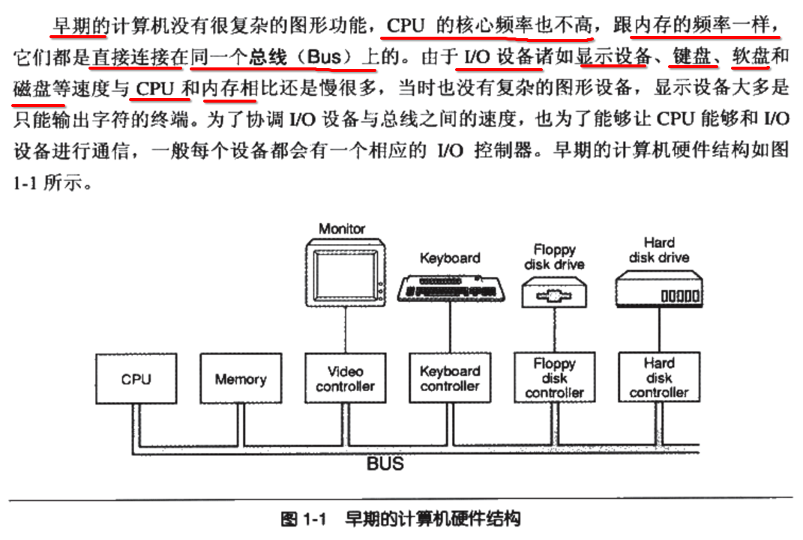

### 2. 后期发展为 ==南北桥、PCI 总线、AGP 总线== 硬件模型

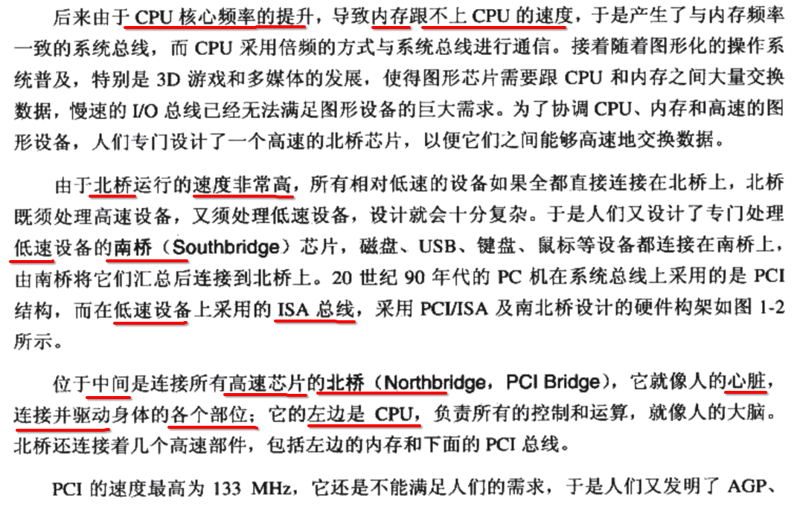

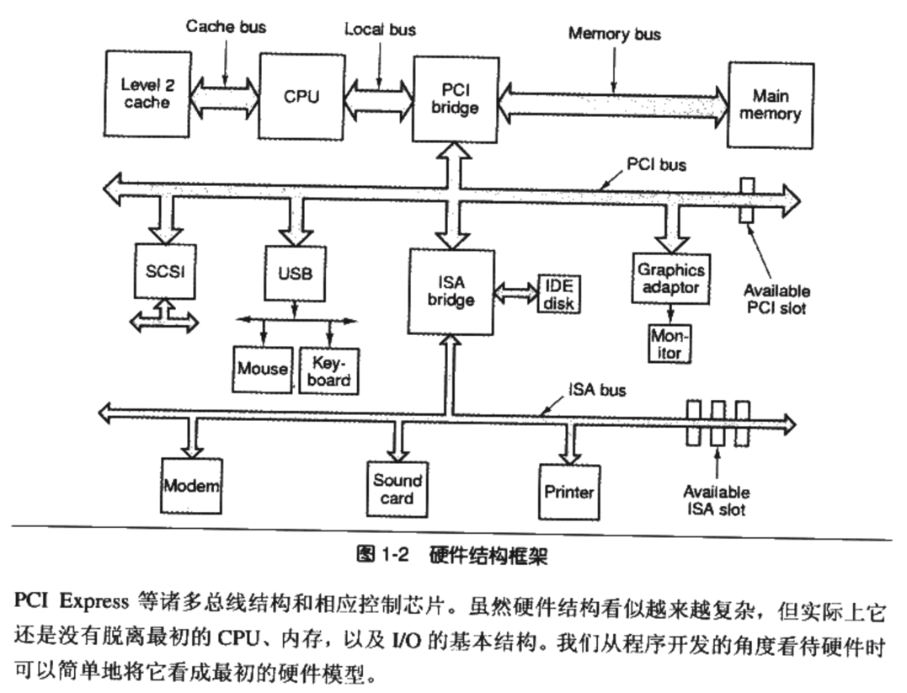


## 3. CPU (处理器) 进化

- 1) SMP (Symmetrical Multi-Processing) 
- 2) Multi-core processor


## 4. 计算器的软件体系结构

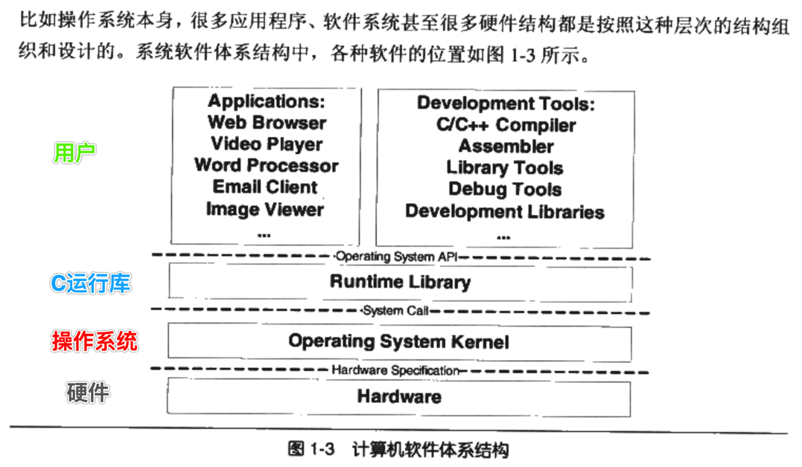


## 5. 操作系统做的事情

- 1、不让 **CPU** 偷懒
- 2、驱动 **硬件设备** 完成工作
- 3、管理 **内存** 使用


## 6. 进程的虚拟内存 <==> 物理内存

### 1. 分段 (segment) 映射

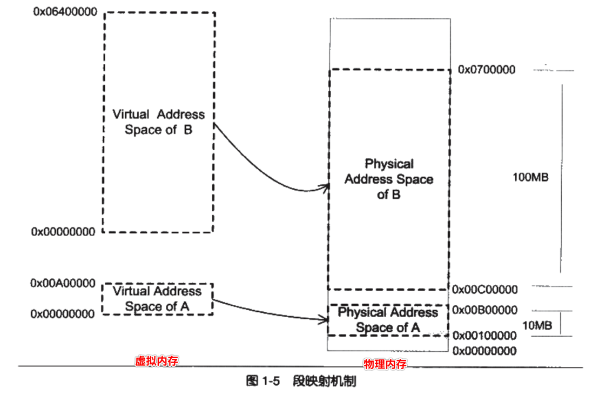

- 程序 A 
  - 需要 **10MB** 的 **虚拟** 内存，假设从 0x0000,0000 ~ 0x00A0,0000 这一块连续的 **虚拟** 内存地址空间
  - 由 **操作系统** 完成将 **10MB 虚拟** 内存地址空间，映射到 **10MB 物理** 内存地址空间中

- 程序 B
  - 需要 **100MB** 的 **虚拟** 内存
  - 同样由 **操作系统** 完成将 **100MB 虚拟** 内存地址空间，映射到 **100MB 物理** 内存地址空间中 

- 两个程序最终分配到 **物理内存空间** 都是 **相互独立** 的

### 2. 分段 (segment) 映射 优点: 地址隔离、地址映射对用户程序透明

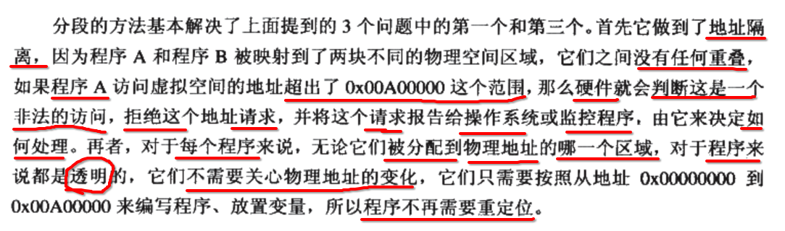

### 3. 分段 (segment) 映射 缺点: 内存使用效率低

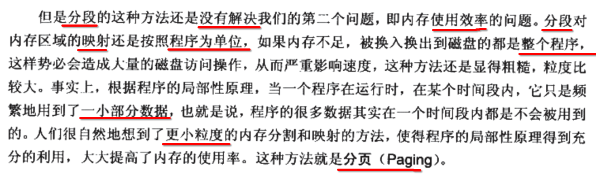

### 4. 分页 (segment) 映射

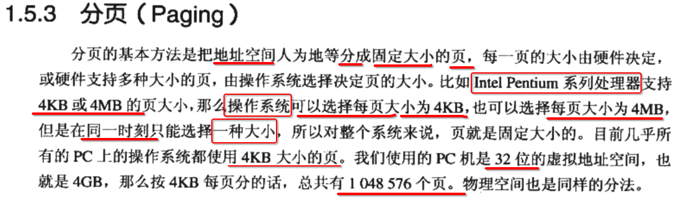

### 5. 三种 分页 之间的映射

- 1) DP (Disk Page)
- 2) VP (Virtual space Page)
- 3) PP (Physics Page)

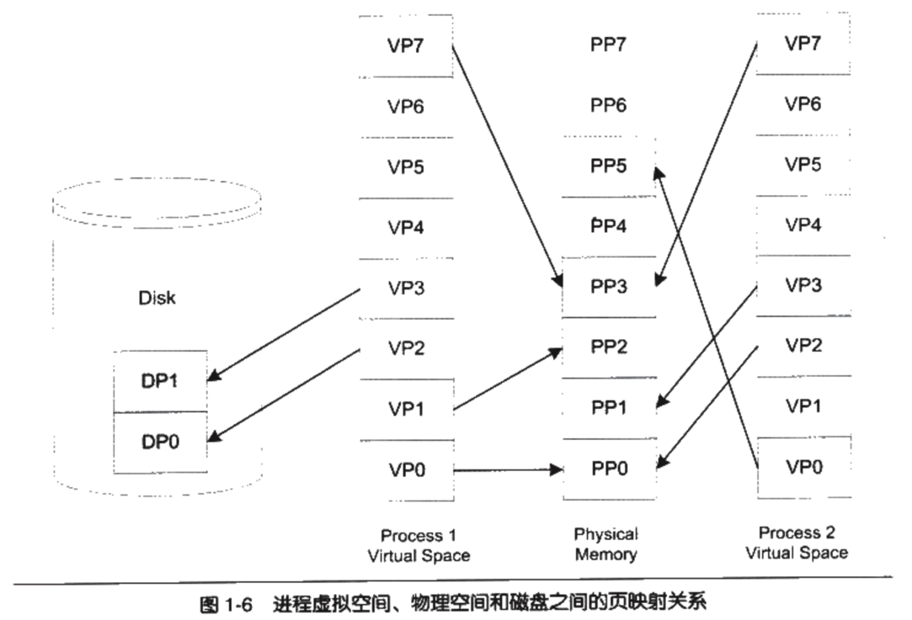

### 6. MMU (内存地址映射)

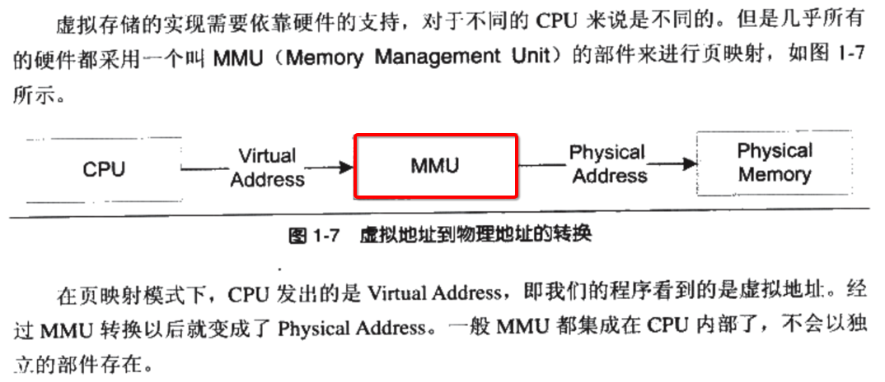


## 7. 线程

### 1. 什么是 ==线程== ？

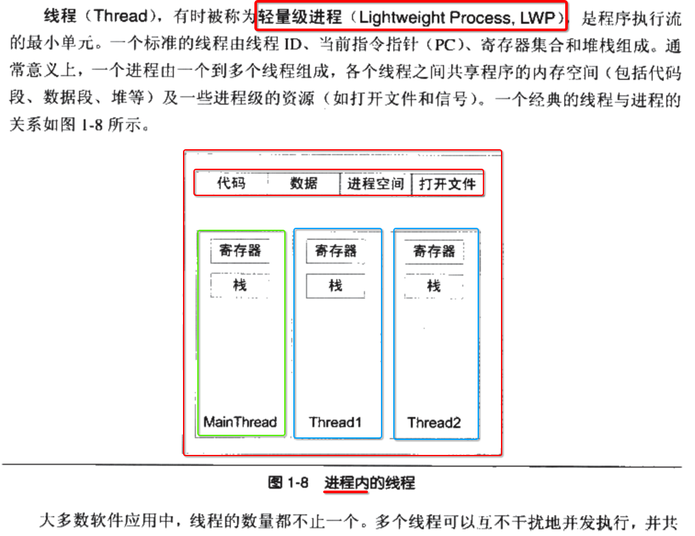

- 1、 一个 **进程** 内部，可以有 n 个 **线程**
- 2、 一个 **线程** 可以看做 **轻量级** 的 **进程**
- 3、 所有的线程 **共享** **所属进程** 的 **整个** 虚拟空间
- 4、 但是 **每一个线程** 都有 **自己的** 东西
  - 1) 栈
  - 2) 寄存器
  - 3) 局部存储

### 2. 使用 线程 的原因

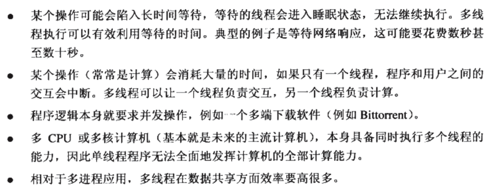

### 3. 线程 ==私有== 的东西

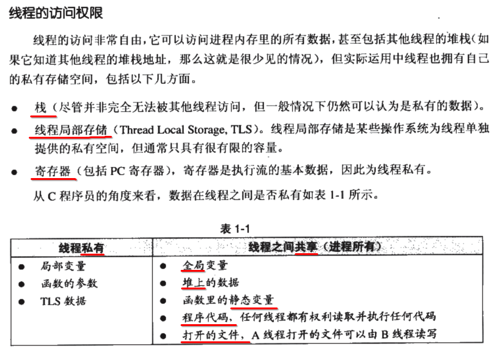

### 4. 线程 ==3种状态==

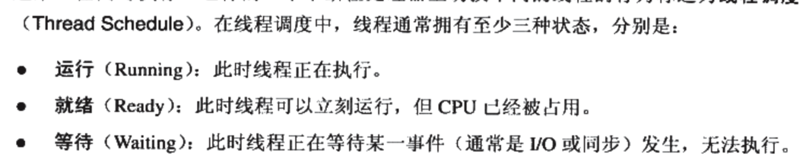

### 5. 线程 ==状态转变==

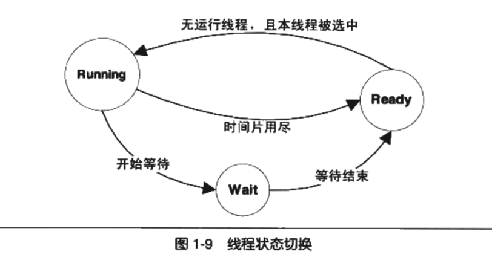

### 6. 线程的 ==分类==

- 1) **IO** 密集型 ===> **长** 时间占用 CPU
- 2) **CPU** 密集型 ===> **很小** 时间占用 CPU

### 7. linux/unix 不存在真正意义上的 线程

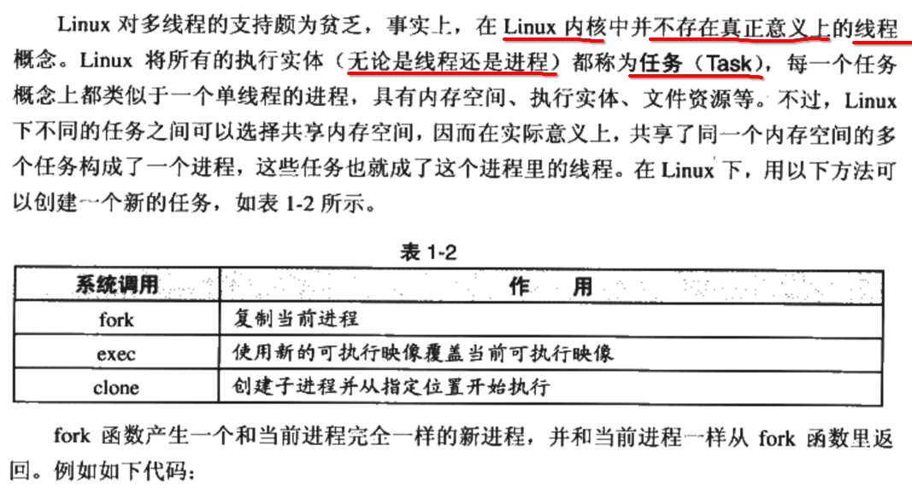

### 8. 读时共享，写时复制

- 1) fork() 并不是每次都 **复制** 进程空间
- 2) 当只是 **读取** 进程空间时，fork() **不会** 复制 进程空间
- 3) 但需要 **写入** 进程空间时，fork() **会** 复制 进程空间

### 9. 线程安全 处理手段

- 1、lock
- 2、semaphore
- 3、mutex
- 4、read-write lock
- 5、condition variable
- 6、atomic
- 7、volatile 取消编译器过渡优化
- 8、barrier 内存屏障

### 10. 三种 线程模型

#### 1用户线程 : 1内核线程

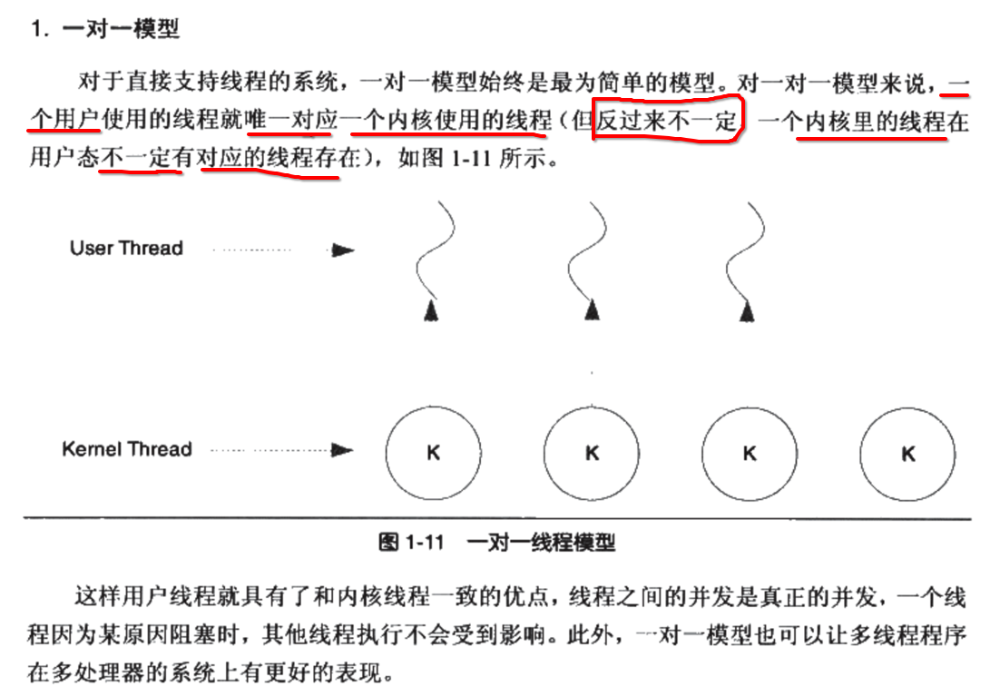

#### n用户线程 : 1内核线程

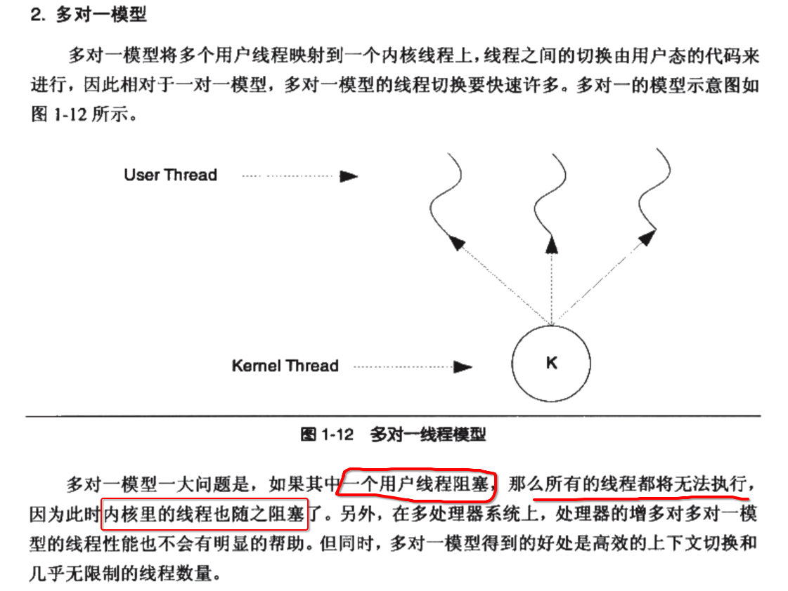

#### n用户线程 : n内核线程

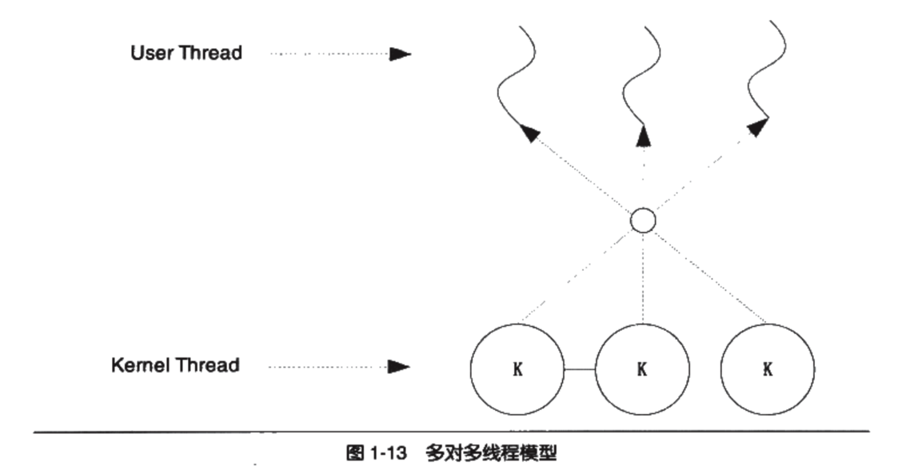

评价偏低
