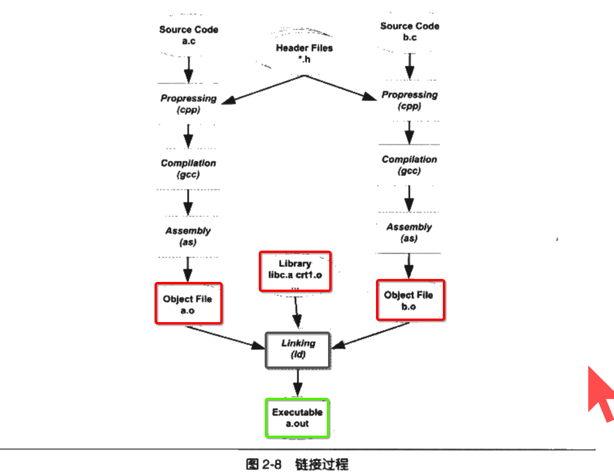

[TOC]

## 1. 被隐藏了的 4个 过程

## 2. GCC 编译过程分解 (实际上不止4个步骤)

## 3. GCC 是一系列内部命令的包装

## 4. 4大过程

### 1. 预编译

### 2. 编译

### 3. 汇编

### 4. 链接

- 1) 直接使用 **ld** 链接生成 **可执行文件** 命令相当的长
- 2) 所以才会有 **gcc *.o** 这样的 **包装** 

## 5. 编译器

### 0. 编译过程 6大步

### 1. 词法分析

### 2. 语法分析

### 3. 语义分析

### 4. 语法树 (源码级) ==优化== (opt)

### 5. 生成 ==中间== 代码

### 6. 编译器 ==前端== <--> 中间代码 <--> 编译器 ==后端==

与 LLVM 编译器模型一致。

### 7. 生成 ==目标机器代码== (Code Generator)

### 8. 目标机器代码 ==优化==

### 9. 总结: ==编译器==

## 6. ==链接器== 将所有的 xx.o 目标文件 链接在一起

## 7. 模块拼接 : ==静态== 拼接

## 8. 地址重定位

