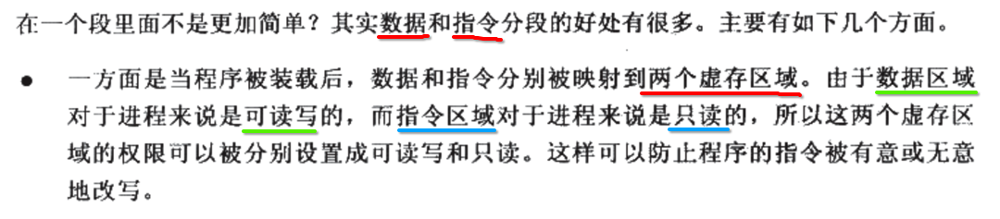

[TOC]


## 1. 目标文件

- 1) 源码 **经过编译**，但是 **没有链接** 的中间文件
- 2) windows : xx.obj
- 3) linux/unix/macosx : xx.o
- 4) 目标文件 **文件格式** 与 可执行文件 结构很相似
- 5) 以及与 静态链接库 和 动态链接库 的结构都是很相似 (同一种文件格式) 


## 2. linux 目标文件格式 (elf/elf64)


## 3. 目标文件 与 可执行文件 的历史


## 4. 目标文件 中的 section 和 segment


## 5. 一个 main.c 编译后的 目标文件 的结构


## 6. elf ==Header==


## 7. ==bss== section 只占用 目标文件，但在链接时

### 1. bss section 的历史


### 2. bss section 存储 ==未初始化== 全局变量、局部 static 变量


## 8. text (代码) 与 data (数据) 分开的好处




## 9. 实验一个简单的 main.o

### 1. main.c

```c
// 未初始化全局变量
int var1;

// 未初始化的static全局变量
static int var2;

// 已经初始化全局变量
int var3 = 1;

// 已经初始化的static全局变量
static int var4 = 2;

int main(int argv, char* argr[])
{
	// 未初始化的static局部变量
	static int var5;

	// 已经初始化的static局部变量
	static int var6 = 1;

	// 未初始化的局部变量
	int var7;

	return 1;
}
```

### 2. 32 位 linux ubuntu + gcc 编译 得到 main.o

```
xzh@xzh-VirtualBox:~$ gcc -c main.c
```

### 3. `objdump -h` main.o

```
xzh@xzh-VirtualBox:~$ objdump -h main.o

main.o:     file format elf64-x86-64

Sections:
Idx Name          Size      VMA               LMA               File off  Algn
  0 .text         00000012  0000000000000000  0000000000000000  00000040  2**0
                  CONTENTS, ALLOC, LOAD, READONLY, CODE
  1 .data         0000000c  0000000000000000  0000000000000000  00000054  2**2
                  CONTENTS, ALLOC, LOAD, DATA
  2 .bss          00000008  0000000000000000  0000000000000000  00000060  2**2
                  ALLOC
  3 .comment      0000002b  0000000000000000  0000000000000000  00000060  2**0
                  CONTENTS, READONLY
  4 .note.GNU-stack 00000000  0000000000000000  0000000000000000  0000008b  2**0
                  CONTENTS, READONLY
  5 .eh_frame     00000038  0000000000000000  0000000000000000  00000090  2**3
                  CONTENTS, ALLOC, LOAD, RELOC, READONLY, DATA
```

### 4. `readelf -S` main.o

```
xzh@xzh-VirtualBox:~$ readelf -S main.o
There are 11 section headers, starting at offset 0x2d8:

Section Headers:
  [Nr] Name              Type             Address           Offset
       Size              EntSize          Flags  Link  Info  Align
  [ 0]                   NULL             0000000000000000  00000000
       0000000000000000  0000000000000000           0     0     0
  [ 1] .text             PROGBITS         0000000000000000  00000040
       0000000000000012  0000000000000000  AX       0     0     1
  [ 2] .data             PROGBITS         0000000000000000  00000054
       000000000000000c  0000000000000000  WA       0     0     4
  [ 3] .bss              NOBITS           0000000000000000  00000060
       0000000000000008  0000000000000000  WA       0     0     4
  [ 4] .comment          PROGBITS         0000000000000000  00000060
       000000000000002b  0000000000000001  MS       0     0     1
  [ 5] .note.GNU-stack   PROGBITS         0000000000000000  0000008b
       0000000000000000  0000000000000000           0     0     1
  [ 6] .eh_frame         PROGBITS         0000000000000000  00000090
       0000000000000038  0000000000000000   A       0     0     8
  [ 7] .rela.eh_frame    RELA             0000000000000000  00000268
       0000000000000018  0000000000000018   I       8     6     8
  [ 8] .symtab           SYMTAB           0000000000000000  000000c8
       0000000000000168  0000000000000018           9    12     8
  [ 9] .strtab           STRTAB           0000000000000000  00000230
       0000000000000035  0000000000000000           0     0     1
  [10] .shstrtab         STRTAB           0000000000000000  00000280
       0000000000000054  0000000000000000           0     0     1
```

比 `objdump -h` 得到更多的 section 

### 5. 多出来的其他 section

- 1) `.rodate` **只读** 数据段
- 2) `.comment` **注释** 信息段
- 3) `.note.GNU-stack` 堆区提示段

### 6. 如上 section 在 elf 文件中的布局


## 10. ==size== 查看 elf 中的 text、data、bss section 长度

```
xzh@xzh-VirtualBox:~$ size main.o
   text	   data	    bss	    dec	    hex	filename
     74	     12	      8	     94	     5e	main.o
```


## 11. ==objdump== `-s -d` 查看 main.o 代码段 ==反汇编===


```
xzh@xzh-VirtualBox:~$ objdump -s -d main.o

main.o:     file format elf64-x86-64

Contents of section .text:
 0000 554889e5 897dfc48 8975f0b8 01000000  UH...}.H.u......
 0010 5dc3                                 ].
Contents of section .data:
 0000 01000000 02000000 01000000           ............
Contents of section .comment:
 0000 00474343 3a202855 62756e74 7520372e  .GCC: (Ubuntu 7.
 0010 332e302d 32377562 756e7475 317e3138  3.0-27ubuntu1~18
 0020 2e303429 20372e33 2e3000             .04) 7.3.0.
Contents of section .eh_frame:
 0000 14000000 00000000 017a5200 01781001  .........zR..x..
 0010 1b0c0708 90010000 1c000000 1c000000  ................
 0020 00000000 12000000 00410e10 8602430d  .........A....C.
 0030 064d0c07 08000000                    .M......

Disassembly of section .text:

0000000000000000 <main>:
   0:	55                   	push   %rbp
   1:	48 89 e5             	mov    %rsp,%rbp
   4:	89 7d fc             	mov    %edi,-0x4(%rbp)
   7:	48 89 75 f0          	mov    %rsi,-0x10(%rbp)
   b:	b8 01 00 00 00       	mov    $0x1,%eax
  10:	5d                   	pop    %rbp
  11:	c3                   	retq
```


## 12. `objdump -x -s -d` 查看 rodata 只读数据段

```c
char* name = "xiong";

int main(int argv, char* argr[])
{
}
```

```
xzh@xzh-VirtualBox:~$ gcc -c main.c
xzh@xzh-VirtualBox:~$ objdump -x -s -d main.o

main.o:     file format elf64-x86-64
main.o
architecture: i386:x86-64, flags 0x00000011:
HAS_RELOC, HAS_SYMS
start address 0x0000000000000000

Sections:
Idx Name          Size      VMA               LMA               File off  Algn
  0 .text         00000012  0000000000000000  0000000000000000  00000040  2**0
                  CONTENTS, ALLOC, LOAD, READONLY, CODE
  1 .data         00000000  0000000000000000  0000000000000000  00000052  2**0
                  CONTENTS, ALLOC, LOAD, DATA
  2 .bss          00000000  0000000000000000  0000000000000000  00000052  2**0
                  ALLOC
  3 .rodata       00000006  0000000000000000  0000000000000000  00000052  2**0
                  CONTENTS, ALLOC, LOAD, READONLY, DATA
  4 .data.rel.local 00000008  0000000000000000  0000000000000000  00000058  2**3
                  CONTENTS, ALLOC, LOAD, RELOC, DATA
  5 .comment      0000002b  0000000000000000  0000000000000000  00000060  2**0
                  CONTENTS, READONLY
  6 .note.GNU-stack 00000000  0000000000000000  0000000000000000  0000008b  2**0
                  CONTENTS, READONLY
  7 .eh_frame     00000038  0000000000000000  0000000000000000  00000090  2**3
                  CONTENTS, ALLOC, LOAD, RELOC, READONLY, DATA
SYMBOL TABLE:
0000000000000000 l    df *ABS*	0000000000000000 main.c
0000000000000000 l    d  .text	0000000000000000 .text
0000000000000000 l    d  .data	0000000000000000 .data
0000000000000000 l    d  .bss	0000000000000000 .bss
0000000000000000 l    d  .rodata	0000000000000000 .rodata
0000000000000000 l    d  .data.rel.local	0000000000000000 .data.rel.local
0000000000000000 l    d  .note.GNU-stack	0000000000000000 .note.GNU-stack
0000000000000000 l    d  .eh_frame	0000000000000000 .eh_frame
0000000000000000 l    d  .comment	0000000000000000 .comment
0000000000000000 g     O .data.rel.local	0000000000000008 name
0000000000000000 g     F .text	0000000000000012 main


Contents of section .text:
 0000 554889e5 897dfc48 8975f0b8 00000000  UH...}.H.u......
 0010 5dc3                                 ].
Contents of section .rodata:
 0000 78696f6e 6700                        xiong.
Contents of section .data.rel.local:
 0000 00000000 00000000                    ........
Contents of section .comment:
 0000 00474343 3a202855 62756e74 7520372e  .GCC: (Ubuntu 7.
 0010 332e302d 32377562 756e7475 317e3138  3.0-27ubuntu1~18
 0020 2e303429 20372e33 2e3000             .04) 7.3.0.
Contents of section .eh_frame:
 0000 14000000 00000000 017a5200 01781001  .........zR..x..
 0010 1b0c0708 90010000 1c000000 1c000000  ................
 0020 00000000 12000000 00410e10 8602430d  .........A....C.
 0030 064d0c07 08000000                    .M......

Disassembly of section .text:

0000000000000000 <main>:
   0:	55                   	push   %rbp
   1:	48 89 e5             	mov    %rsp,%rbp
   4:	89 7d fc             	mov    %edi,-0x4(%rbp)
   7:	48 89 75 f0          	mov    %rsi,-0x10(%rbp)
   b:	b8 00 00 00 00       	mov    $0x0,%eax
  10:	5d                   	pop    %rbp
  11:	c3                   	retq
```

- 在 `.rodata` section 中，可以看到一个字符串 **xiong** 
- 字符串 **xiong** 作为 **字符串常量** 只读


## 13. `objdump -x -s -d` 查看 data 数据段

### 1. main.c

```c
char* name = "xiong";
int age = 99;

int main(int argv, char* argr[])
{
}
```

### 2. 编译生成 main.o

```
gcc -c main.c
```

### 3. `objdump -x -s -d` 查看 data 数据段

```
xzh@xzh-VirtualBox:~$ objdump -x -s -d main.o

main.o:     file format elf64-x86-64
main.o
architecture: i386:x86-64, flags 0x00000011:
HAS_RELOC, HAS_SYMS
start address 0x0000000000000000

Sections:
Idx Name          Size      VMA               LMA               File off  Algn
  0 .text         00000012  0000000000000000  0000000000000000  00000040  2**0
                  CONTENTS, ALLOC, LOAD, READONLY, CODE
  1 .data         00000004  0000000000000000  0000000000000000  00000054  2**2
                  CONTENTS, ALLOC, LOAD, DATA
  2 .bss          00000000  0000000000000000  0000000000000000  00000058  2**0
                  ALLOC
  3 .rodata       00000006  0000000000000000  0000000000000000  00000058  2**0
                  CONTENTS, ALLOC, LOAD, READONLY, DATA
  4 .data.rel.local 00000008  0000000000000000  0000000000000000  00000060  2**3
                  CONTENTS, ALLOC, LOAD, RELOC, DATA
  5 .comment      0000002b  0000000000000000  0000000000000000  00000068  2**0
                  CONTENTS, READONLY
  6 .note.GNU-stack 00000000  0000000000000000  0000000000000000  00000093  2**0
                  CONTENTS, READONLY
  7 .eh_frame     00000038  0000000000000000  0000000000000000  00000098  2**3
                  CONTENTS, ALLOC, LOAD, RELOC, READONLY, DATA
SYMBOL TABLE:
0000000000000000 l    df *ABS*	0000000000000000 main.c
0000000000000000 l    d  .text	0000000000000000 .text
0000000000000000 l    d  .data	0000000000000000 .data
0000000000000000 l    d  .bss	0000000000000000 .bss
0000000000000000 l    d  .rodata	0000000000000000 .rodata
0000000000000000 l    d  .data.rel.local	0000000000000000 .data.rel.local
0000000000000000 l    d  .note.GNU-stack	0000000000000000 .note.GNU-stack
0000000000000000 l    d  .eh_frame	0000000000000000 .eh_frame
0000000000000000 l    d  .comment	0000000000000000 .comment
0000000000000000 g     O .data.rel.local	0000000000000008 name
0000000000000000 g     O .data	0000000000000004 age
0000000000000000 g     F .text	0000000000000012 main


Contents of section .text:
 0000 554889e5 897dfc48 8975f0b8 00000000  UH...}.H.u......
 0010 5dc3                                 ].
Contents of section .data:
 0000 63000000                             c...
Contents of section .rodata:
 0000 78696f6e 6700                        xiong.
Contents of section .data.rel.local:
 0000 00000000 00000000                    ........
Contents of section .comment:
 0000 00474343 3a202855 62756e74 7520372e  .GCC: (Ubuntu 7.
 0010 332e302d 32377562 756e7475 317e3138  3.0-27ubuntu1~18
 0020 2e303429 20372e33 2e3000             .04) 7.3.0.
Contents of section .eh_frame:
 0000 14000000 00000000 017a5200 01781001  .........zR..x..
 0010 1b0c0708 90010000 1c000000 1c000000  ................
 0020 00000000 12000000 00410e10 8602430d  .........A....C.
 0030 064d0c07 08000000                    .M......

Disassembly of section .text:

0000000000000000 <main>:
   0:	55                   	push   %rbp
   1:	48 89 e5             	mov    %rsp,%rbp
   4:	89 7d fc             	mov    %edi,-0x4(%rbp)
   7:	48 89 75 f0          	mov    %rsi,-0x10(%rbp)
   b:	b8 00 00 00 00       	mov    $0x0,%eax
  10:	5d                   	pop    %rbp
  11:	c3                   	retq
```

- 可以看到 `.data` 段的长度为 `00000004` 字节 (4 字节).
- 刚好就是 `int age;` 占的 4 字节
- 但好像 `char* name = "xiong";` 并未占用字节

### 4. data 段中 4 字节的数据

```
Contents of section .data:
 0000 63000000
```

- 1) 63000000 ==> 0x63 , 0x00 , 0x00 , 0x00 
- 2) int age = **99**;
- 3) 99 = `16 * 6` + 3 = **0x63**
- 4) 99 按照尝试划分为 4 字节: `[00][00][00][99]` (每一个 `[]` 表示 **一个字节** 的内存块)
- 5) 因为 **大端** 存储 => **数据的 低字节** 存放在 **内存块的 高字节**
- 6) 所以在 **大端** 存储下，99 在内存中的 4 字节: `[99][00][00][00]` => `[0x16][0x00][0x00][0x00]`

### 5. readelf -S 查看 main.o 所有的 section 编号

```
xzh@xzh-VirtualBox:~$ readelf -S main.o
There are 14 section headers, starting at offset 0x2c8:

Section Headers:
  [Nr] Name              Type             Address           Offset
       Size              EntSize          Flags  Link  Info  Align
  [ 0]                   NULL             0000000000000000  00000000
       0000000000000000  0000000000000000           0     0     0
  [ 1] .text             PROGBITS         0000000000000000  00000040
       0000000000000012  0000000000000000  AX       0     0     1
  [ 2] .data             PROGBITS         0000000000000000  00000054
       0000000000000004  0000000000000000  WA       0     0     4
  [ 3] .bss              NOBITS           0000000000000000  00000058
       0000000000000000  0000000000000000  WA       0     0     1
  [ 4] .rodata           PROGBITS         0000000000000000  00000058
       0000000000000006  0000000000000000   A       0     0     1
  [ 5] .data.rel.local   PROGBITS         0000000000000000  00000060
       0000000000000008  0000000000000000  WA       0     0     8
  [ 6] .rela.data.rel.lo RELA             0000000000000000  00000220
       0000000000000018  0000000000000018   I      11     5     8
  [ 7] .comment          PROGBITS         0000000000000000  00000068
       000000000000002b  0000000000000001  MS       0     0     1
  [ 8] .note.GNU-stack   PROGBITS         0000000000000000  00000093
       0000000000000000  0000000000000000           0     0     1
  [ 9] .eh_frame         PROGBITS         0000000000000000  00000098
       0000000000000038  0000000000000000   A       0     0     8
  [10] .rela.eh_frame    RELA             0000000000000000  00000238
       0000000000000018  0000000000000018   I      11     9     8
  [11] .symtab           SYMTAB           0000000000000000  000000d0
       0000000000000138  0000000000000018          12    10     8
  [12] .strtab           STRTAB           0000000000000000  00000208
       0000000000000016  0000000000000000           0     0     1
  [13] .shstrtab         STRTAB           0000000000000000  00000250
       0000000000000071  0000000000000000           0     0     1
```

### 6. readelf -s 查看 main.o 符号表

```
xzh@xzh-VirtualBox:~$ readelf -s main.o

Symbol table '.symtab' contains 13 entries:
   Num:    Value          Size Type    Bind   Vis      Ndx Name
     0: 0000000000000000     0 NOTYPE  LOCAL  DEFAULT  UND
     1: 0000000000000000     0 FILE    LOCAL  DEFAULT  ABS main.c
     2: 0000000000000000     0 SECTION LOCAL  DEFAULT    1
     3: 0000000000000000     0 SECTION LOCAL  DEFAULT    2
     4: 0000000000000000     0 SECTION LOCAL  DEFAULT    3
     5: 0000000000000000     0 SECTION LOCAL  DEFAULT    4
     6: 0000000000000000     0 SECTION LOCAL  DEFAULT    5
     7: 0000000000000000     0 SECTION LOCAL  DEFAULT    8
     8: 0000000000000000     0 SECTION LOCAL  DEFAULT    9
     9: 0000000000000000     0 SECTION LOCAL  DEFAULT    7
    10: 0000000000000000     8 OBJECT  GLOBAL DEFAULT    5 name
    11: 0000000000000000     4 OBJECT  GLOBAL DEFAULT    2 age
    12: 0000000000000000    18 FUNC    GLOBAL DEFAULT    1 main
```

- 1) name 符号 : 出现在 5 号 section => `.data.rel.local`
- 2) age 符号 : 出现在 1 号 section => `.data`


## 14. ==bss 段==

### 1. main.c

```c
int aa;
int bb = 0;
int cc = 1;

int main(int argv, char* argr[])
{
}
```

### 2. 编译生成 main.o

```
gcc -c main.c
```

### 3. readelf -S 查看 main.o 所有的 section 编号

```
xzh@xzh-VirtualBox:~$ readelf -S main.o
There are 11 section headers, starting at offset 0x268:

Section Headers:
  [Nr] Name              Type             Address           Offset
       Size              EntSize          Flags  Link  Info  Align
  [ 0]                   NULL             0000000000000000  00000000
       0000000000000000  0000000000000000           0     0     0
  [ 1] .text             PROGBITS         0000000000000000  00000040
       0000000000000012  0000000000000000  AX       0     0     1
  [ 2] .data             PROGBITS         0000000000000000  00000054
       0000000000000004  0000000000000000  WA       0     0     4
  [ 3] .bss              NOBITS           0000000000000000  00000058
       0000000000000004  0000000000000000  WA       0     0     4
  [ 4] .comment          PROGBITS         0000000000000000  00000058
       000000000000002b  0000000000000001  MS       0     0     1
  [ 5] .note.GNU-stack   PROGBITS         0000000000000000  00000083
       0000000000000000  0000000000000000           0     0     1
  [ 6] .eh_frame         PROGBITS         0000000000000000  00000088
       0000000000000038  0000000000000000   A       0     0     8
  [ 7] .rela.eh_frame    RELA             0000000000000000  000001f8
       0000000000000018  0000000000000018   I       8     6     8
  [ 8] .symtab           SYMTAB           0000000000000000  000000c0
       0000000000000120  0000000000000018           9     8     8
  [ 9] .strtab           STRTAB           0000000000000000  000001e0
       0000000000000016  0000000000000000           0     0     1
  [10] .shstrtab         STRTAB           0000000000000000  00000210
       0000000000000054  0000000000000000           0     0     1
```

### 4. readelf -s 查看 main.o 符号表

```
xzh@xzh-VirtualBox:~$ readelf -s main.o

Symbol table '.symtab' contains 12 entries:
   Num:    Value          Size Type    Bind   Vis      Ndx Name
     0: 0000000000000000     0 NOTYPE  LOCAL  DEFAULT  UND
     1: 0000000000000000     0 FILE    LOCAL  DEFAULT  ABS main.c
     2: 0000000000000000     0 SECTION LOCAL  DEFAULT    1
     3: 0000000000000000     0 SECTION LOCAL  DEFAULT    2
     4: 0000000000000000     0 SECTION LOCAL  DEFAULT    3
     5: 0000000000000000     0 SECTION LOCAL  DEFAULT    5
     6: 0000000000000000     0 SECTION LOCAL  DEFAULT    6
     7: 0000000000000000     0 SECTION LOCAL  DEFAULT    4
     8: 0000000000000004     4 OBJECT  GLOBAL DEFAULT  COM aa
     9: 0000000000000000     4 OBJECT  GLOBAL DEFAULT    3 bb
    10: 0000000000000000     4 OBJECT  GLOBAL DEFAULT    2 cc
    11: 0000000000000000    18 FUNC    GLOBAL DEFAULT    1 main
```

### 5. 变量 (符号) 出现的 section

| 变量 (符号) | 出现的 section                                  |
| ----------- | ----------------------------------------------- |
| int aa;     | **COM** 段 (编译时存在，在链接后不会存在这个段) |
| int bb = 0; | bss 段                                          |
| int cc = 1; | data 段                                         |


## 15. 其他 section 段


## 16. 将一个 ==二进制== 文件 (图片、MP3 ..) 作为 目标文件 中的一个 section


## 17. ==自定义== section 段


## 18. elf ==Header== struct

### 1. `readelf -h` 

```
xzh@xzh-VirtualBox:~$ readelf -h main.o
ELF Header:
  Magic:   7f 45 4c 46 02 01 01 00 00 00 00 00 00 00 00 00
  Class:                             ELF64
  Data:                              2's complement, little endian
  Version:                           1 (current)
  OS/ABI:                            UNIX - System V
  ABI Version:                       0
  Type:                              REL (Relocatable file)
  Machine:                           Advanced Micro Devices X86-64
  Version:                           0x1
  Entry point address:               0x0
  Start of program headers:          0 (bytes into file)
  Start of section headers:          616 (bytes into file)
  Flags:                             0x0
  Size of this header:               64 (bytes)
  Size of program headers:           0 (bytes)
  Number of program headers:         0
  Size of section headers:           64 (bytes)
  Number of section headers:         11
  Section header string table index: 10
```


### 2. `/usr/include/elf.h`

- 1) Elf32_Ehdr
- 2) Elf64_Ehdr
- 3) Ehdr ==> Elf Header

#### 1. elf 32 header

```c
typedef struct
{
  unsigned char e_ident[EI_NIDENT]; /* Magic number and other info */
  Elf32_Half  e_type;     /* Object file type */
  Elf32_Half  e_machine;    /* Architecture */
  Elf32_Word  e_version;    /* Object file version */
  Elf32_Addr  e_entry;    /* Entry point virtual address */
  Elf32_Off   e_phoff;    /* Program header table file offset */
  Elf32_Off   e_shoff;    /* Section header table file offset */
  Elf32_Word  e_flags;    /* Processor-specific flags */
  Elf32_Half  e_ehsize;   /* ELF header size in bytes */
  Elf32_Half  e_phentsize;    /* Program header table entry size */
  Elf32_Half  e_phnum;    /* Program header table entry count */
  Elf32_Half  e_shentsize;    /* Section header table entry size */
  Elf32_Half  e_shnum;    /* Section header table entry count */
  Elf32_Half  e_shstrndx;   /* Section header string table index */
} Elf32_Ehdr;
```

#### 2. elf 64 header

```c
typedef struct
{
  unsigned char e_ident[EI_NIDENT]; /* Magic number and other info */
  Elf64_Half  e_type;     /* Object file type */
  Elf64_Half  e_machine;    /* Architecture */
  Elf64_Word  e_version;    /* Object file version */
  Elf64_Addr  e_entry;    /* Entry point virtual address */
  Elf64_Off   e_phoff;    /* Program header table file offset */
  Elf64_Off   e_shoff;    /* Section header table file offset */
  Elf64_Word  e_flags;    /* Processor-specific flags */
  Elf64_Half  e_ehsize;   /* ELF header size in bytes */
  Elf64_Half  e_phentsize;    /* Program header table entry size */
  Elf64_Half  e_phnum;    /* Program header table entry count */
  Elf64_Half  e_shentsize;    /* Section header table entry size */
  Elf64_Half  e_shnum;    /* Section header table entry count */
  Elf64_Half  e_shstrndx;   /* Section header string table index */
} Elf64_Ehdr;
```

### 3. elf header struct 成员含义


### 4. `e_ident[EI_NIDENT];` elf 魔数


### 5. elf 魔数中，最开始的 4 个字节


### 6. `e_type` elf 文件类型


### 7. `e_machine` 可执行文件 支持的 cpu 架构


## 19. ==Section header table== (段表) 

### 1. Section header table (段表) 描述 elf 文件中的 ==每一个 section==


### 2. objdump -h 会省略一些 section


```
xzh@xzh-VirtualBox:~$ objdump -h main.o

main.o:     file format elf64-x86-64

Sections:
Idx Name          Size      VMA               LMA               File off  Algn
  0 .text         00000012  0000000000000000  0000000000000000  00000040  2**0
                  CONTENTS, ALLOC, LOAD, READONLY, CODE
  1 .data         00000004  0000000000000000  0000000000000000  00000054  2**2
                  CONTENTS, ALLOC, LOAD, DATA
  2 .bss          00000004  0000000000000000  0000000000000000  00000058  2**2
                  ALLOC
  3 .comment      0000002b  0000000000000000  0000000000000000  00000058  2**0
                  CONTENTS, READONLY
  4 .note.GNU-stack 00000000  0000000000000000  0000000000000000  00000083  2**0
                  CONTENTS, READONLY
  5 .eh_frame     00000038  0000000000000000  0000000000000000  00000088  2**3
                  CONTENTS, ALLOC, LOAD, RELOC, READONLY, DATA
```

只打印出了 6 个 section。

### 3. readelf -S 显示 所有 section

```
xzh@xzh-VirtualBox:~$ readelf -S main.o
There are 11 section headers, starting at offset 0x268:

Section Headers:
  [Nr] Name              Type             Address           Offset
       Size              EntSize          Flags  Link  Info  Align
  [ 0]                   NULL             0000000000000000  00000000
       0000000000000000  0000000000000000           0     0     0
  [ 1] .text             PROGBITS         0000000000000000  00000040
       0000000000000012  0000000000000000  AX       0     0     1
  [ 2] .data             PROGBITS         0000000000000000  00000054
       0000000000000004  0000000000000000  WA       0     0     4
  [ 3] .bss              NOBITS           0000000000000000  00000058
       0000000000000004  0000000000000000  WA       0     0     4
  [ 4] .comment          PROGBITS         0000000000000000  00000058
       000000000000002b  0000000000000001  MS       0     0     1
  [ 5] .note.GNU-stack   PROGBITS         0000000000000000  00000083
       0000000000000000  0000000000000000           0     0     1
  [ 6] .eh_frame         PROGBITS         0000000000000000  00000088
       0000000000000038  0000000000000000   A       0     0     8
  [ 7] .rela.eh_frame    RELA             0000000000000000  000001f8
       0000000000000018  0000000000000018   I       8     6     8
  [ 8] .symtab           SYMTAB           0000000000000000  000000c0
       0000000000000120  0000000000000018           9     8     8
  [ 9] .strtab           STRTAB           0000000000000000  000001e0
       0000000000000016  0000000000000000           0     0     1
  [10] .shstrtab         STRTAB           0000000000000000  00000210
       0000000000000054  0000000000000000           0     0     1
```

main.o 目标文件中的 11 个 section 都被打印出来。

### 4. 32 位 section header struct

```c
typedef struct
{
  Elf32_Word  sh_name;    /* Section name (string tbl index) */
  Elf32_Word  sh_type;    /* Section type */
  Elf32_Word  sh_flags;   /* Section flags */
  Elf32_Addr  sh_addr;    /* Section virtual addr at execution */
  Elf32_Off sh_offset;    /* Section file offset */
  Elf32_Word  sh_size;    /* Section size in bytes */
  Elf32_Word  sh_link;    /* Link to another section */
  Elf32_Word  sh_info;    /* Additional section information */
  Elf32_Word  sh_addralign;   /* Section alignment */
  Elf32_Word  sh_entsize;   /* Entry size if section holds table */
} Elf32_Shdr;
```

### 5. 64 位 section header struct

```c
typedef struct
{
  Elf64_Word  sh_name;    /* Section name (string tbl index) */
  Elf64_Word  sh_type;    /* Section type */
  Elf64_Xword sh_flags;   /* Section flags */
  Elf64_Addr  sh_addr;    /* Section virtual addr at execution */
  Elf64_Off sh_offset;    /* Section file offset */
  Elf64_Xword sh_size;    /* Section size in bytes */
  Elf64_Word  sh_link;    /* Link to another section */
  Elf64_Word  sh_info;    /* Additional section information */
  Elf64_Xword sh_addralign;   /* Section alignment */
  Elf64_Xword sh_entsize;   /* Entry size if section holds table */
} Elf64_Shdr;
```

### 6. section header struct 成员含义


### 7. elf header->e_shoff 定位到 elf 文件中的 section header table


### 8. 段的 类型


### 9. 段的 标志位


### 10. 段的 链接信息


## 20. `.rel.text` ==重定位表== 

### 1. 重定位的符号类型

- 1) 需要 重定位的 **全局变量**
- 2) 需要 重定位的 **函数**

### 2. main.c

```c
extern int age; // 引用其他文件中的 全局变量

int main(int argv, char* argr[])
{
	printf("age = %d\n", age); // 引用其他文件中的 函数
}
```

### 3. readelf -s 查看 ==编译== 后的 elf 文件 (main.o) 符号表

```
xzh@xzh-VirtualBox:~$ readelf -s main.o

Symbol table '.symtab' contains 13 entries:
   Num:    Value          Size Type    Bind   Vis      Ndx Name
     0: 0000000000000000     0 NOTYPE  LOCAL  DEFAULT  UND
     1: 0000000000000000     0 FILE    LOCAL  DEFAULT  ABS main.c
     2: 0000000000000000     0 SECTION LOCAL  DEFAULT    1
     3: 0000000000000000     0 SECTION LOCAL  DEFAULT    3
     4: 0000000000000000     0 SECTION LOCAL  DEFAULT    4
     5: 0000000000000000     0 SECTION LOCAL  DEFAULT    5
     6: 0000000000000000     0 SECTION LOCAL  DEFAULT    7
     7: 0000000000000000     0 SECTION LOCAL  DEFAULT    8
     8: 0000000000000000     0 SECTION LOCAL  DEFAULT    6
     9: 0000000000000000    47 FUNC    GLOBAL DEFAULT    1 main
    10: 0000000000000000     0 NOTYPE  GLOBAL DEFAULT  UND age
    11: 0000000000000000     0 NOTYPE  GLOBAL DEFAULT  UND _GLOBAL_OFFSET_TABLE_
    12: 0000000000000000     0 NOTYPE  GLOBAL DEFAULT  UND printf
```

可以看到 **age** 和 **printf** 两个符号的 **Ndx** 值都是 **UND (undefined)**

### 4. readelf -s 查看 ==链接== 后的 elf 文件 (a.out) 符号表

```
xzh@xzh-VirtualBox:~$ gcc -c main.c
xzh@xzh-VirtualBox:~$ gcc -c age.c
xzh@xzh-VirtualBox:~$ gcc *.o
xzh@xzh-VirtualBox:~$ ./a.out
age = 99
```

```
xzh@xzh-VirtualBox:~$ readelf -s a.out

Symbol table '.dynsym' contains 7 entries:
   Num:    Value          Size Type    Bind   Vis      Ndx Name
     0: 0000000000000000     0 NOTYPE  LOCAL  DEFAULT  UND
     1: 0000000000000000     0 NOTYPE  WEAK   DEFAULT  UND _ITM_deregisterTMCloneTab
     2: 0000000000000000     0 FUNC    GLOBAL DEFAULT  UND printf@GLIBC_2.2.5 (2)
     3: 0000000000000000     0 FUNC    GLOBAL DEFAULT  UND __libc_start_main@GLIBC_2.2.5 (2)
     4: 0000000000000000     0 NOTYPE  WEAK   DEFAULT  UND __gmon_start__
     5: 0000000000000000     0 NOTYPE  WEAK   DEFAULT  UND _ITM_registerTMCloneTable
     6: 0000000000000000     0 FUNC    WEAK   DEFAULT  UND __cxa_finalize@GLIBC_2.2.5 (2)

Symbol table '.symtab' contains 65 entries:
   Num:    Value          Size Type    Bind   Vis      Ndx Name
     0: 0000000000000000     0 NOTYPE  LOCAL  DEFAULT  UND
     1: 0000000000000238     0 SECTION LOCAL  DEFAULT    1
     2: 0000000000000254     0 SECTION LOCAL  DEFAULT    2
     3: 0000000000000274     0 SECTION LOCAL  DEFAULT    3
     4: 0000000000000298     0 SECTION LOCAL  DEFAULT    4
     5: 00000000000002b8     0 SECTION LOCAL  DEFAULT    5
     6: 0000000000000360     0 SECTION LOCAL  DEFAULT    6
     7: 00000000000003e4     0 SECTION LOCAL  DEFAULT    7
     8: 00000000000003f8     0 SECTION LOCAL  DEFAULT    8
     9: 0000000000000418     0 SECTION LOCAL  DEFAULT    9
    10: 00000000000004d8     0 SECTION LOCAL  DEFAULT   10
    11: 00000000000004f0     0 SECTION LOCAL  DEFAULT   11
    12: 0000000000000510     0 SECTION LOCAL  DEFAULT   12
    13: 0000000000000530     0 SECTION LOCAL  DEFAULT   13
    14: 0000000000000540     0 SECTION LOCAL  DEFAULT   14
    15: 00000000000006f4     0 SECTION LOCAL  DEFAULT   15
    16: 0000000000000700     0 SECTION LOCAL  DEFAULT   16
    17: 0000000000000710     0 SECTION LOCAL  DEFAULT   17
    18: 0000000000000750     0 SECTION LOCAL  DEFAULT   18
    19: 0000000000200db8     0 SECTION LOCAL  DEFAULT   19
    20: 0000000000200dc0     0 SECTION LOCAL  DEFAULT   20
    21: 0000000000200dc8     0 SECTION LOCAL  DEFAULT   21
    22: 0000000000200fb8     0 SECTION LOCAL  DEFAULT   22
    23: 0000000000201000     0 SECTION LOCAL  DEFAULT   23
    24: 0000000000201014     0 SECTION LOCAL  DEFAULT   24
    25: 0000000000000000     0 SECTION LOCAL  DEFAULT   25
    26: 0000000000000000     0 FILE    LOCAL  DEFAULT  ABS crtstuff.c
    27: 0000000000000570     0 FUNC    LOCAL  DEFAULT   14 deregister_tm_clones
    28: 00000000000005b0     0 FUNC    LOCAL  DEFAULT   14 register_tm_clones
    29: 0000000000000600     0 FUNC    LOCAL  DEFAULT   14 __do_global_dtors_aux
    30: 0000000000201014     1 OBJECT  LOCAL  DEFAULT   24 completed.7696
    31: 0000000000200dc0     0 OBJECT  LOCAL  DEFAULT   20 __do_global_dtors_aux_fin
    32: 0000000000000640     0 FUNC    LOCAL  DEFAULT   14 frame_dummy
    33: 0000000000200db8     0 OBJECT  LOCAL  DEFAULT   19 __frame_dummy_init_array_
    34: 0000000000000000     0 FILE    LOCAL  DEFAULT  ABS age.c
    35: 0000000000000000     0 FILE    LOCAL  DEFAULT  ABS main.c
    36: 0000000000000000     0 FILE    LOCAL  DEFAULT  ABS crtstuff.c
    37: 0000000000000854     0 OBJECT  LOCAL  DEFAULT   18 __FRAME_END__
    38: 0000000000000000     0 FILE    LOCAL  DEFAULT  ABS
    39: 0000000000200dc0     0 NOTYPE  LOCAL  DEFAULT   19 __init_array_end
    40: 0000000000200dc8     0 OBJECT  LOCAL  DEFAULT   21 _DYNAMIC
    41: 0000000000200db8     0 NOTYPE  LOCAL  DEFAULT   19 __init_array_start
    42: 0000000000000710     0 NOTYPE  LOCAL  DEFAULT   17 __GNU_EH_FRAME_HDR
    43: 0000000000200fb8     0 OBJECT  LOCAL  DEFAULT   22 _GLOBAL_OFFSET_TABLE_
    44: 00000000000006f0     2 FUNC    GLOBAL DEFAULT   14 __libc_csu_fini
    45: 0000000000000000     0 NOTYPE  WEAK   DEFAULT  UND _ITM_deregisterTMCloneTab
    46: 0000000000201000     0 NOTYPE  WEAK   DEFAULT   23 data_start
    47: 0000000000201014     0 NOTYPE  GLOBAL DEFAULT   23 _edata
    48: 00000000000006f4     0 FUNC    GLOBAL DEFAULT   15 _fini
    49: 0000000000000000     0 FUNC    GLOBAL DEFAULT  UND printf@@GLIBC_2.2.5
    50: 0000000000000000     0 FUNC    GLOBAL DEFAULT  UND __libc_start_main@@GLIBC_
    51: 0000000000201000     0 NOTYPE  GLOBAL DEFAULT   23 __data_start
    52: 0000000000000000     0 NOTYPE  WEAK   DEFAULT  UND __gmon_start__
    53: 0000000000201008     0 OBJECT  GLOBAL HIDDEN    23 __dso_handle
    54: 0000000000000700     4 OBJECT  GLOBAL DEFAULT   16 _IO_stdin_used
    55: 0000000000000680   101 FUNC    GLOBAL DEFAULT   14 __libc_csu_init
    56: 0000000000201010     4 OBJECT  GLOBAL DEFAULT   23 age
    57: 0000000000201018     0 NOTYPE  GLOBAL DEFAULT   24 _end
    58: 0000000000000540    43 FUNC    GLOBAL DEFAULT   14 _start
    59: 0000000000201014     0 NOTYPE  GLOBAL DEFAULT   24 __bss_start
    60: 000000000000064a    47 FUNC    GLOBAL DEFAULT   14 main
    61: 0000000000201018     0 OBJECT  GLOBAL HIDDEN    23 __TMC_END__
    62: 0000000000000000     0 NOTYPE  WEAK   DEFAULT  UND _ITM_registerTMCloneTable
    63: 0000000000000000     0 FUNC    WEAK   DEFAULT  UND __cxa_finalize@@GLIBC_2.2
    64: 00000000000004f0     0 FUNC    GLOBAL DEFAULT   11 _init
```

内容很多，过滤出 **age** 和 **printf** 两个符号

```
56: 0000000000201010     4 OBJECT  GLOBAL DEFAULT   23 age
49: 0000000000000000     0 FUNC    GLOBAL DEFAULT  UND printf@@GLIBC_2.2.5
```

- 对于 **age** 符号，已经确定出现在 **23** 号 section 段
- 但是对于 **printf** 符号，仍然为 **UND printf@@GLIBC_2.2.5** ，因为依赖 **动态库 libc.so** ，所以需要在 **a.out 运行时** 完成 **动态符号重定位**


## 21. `.shstrtab` ==字符串表==

### 1. ==字符串表== 存储 elf 文件中所有的 字符串


### 2. 通过在 字符串表 中的 ==偏移量== 查找对应的 字符串


### 3. 常见的 ==两种== 字符串表


### 4. elf header->e_shstrndx 定位 section header table 字符串表


## 22. ==符号== (elf symbol) vs ==符号名== (字符串)


## 23. 每一个待链接的 ==目标文件== 中都包含一个 ==符号表==


## 24. ==符号表== 中存储 各种类型 ==符号==


- 1) **全局** 符号 (全局变量、函数)
- 2) 全局符号的 **引用**
- 3) 段名
- 4) **局部** 符号 (只在 **当前编译单元** 内部可见)
- 5) 行号 (机器指令 <=> 源文件中的代码行)


## 25. 查看 目标文件 ==符号表== 工具

- 1、 readelf
- 2、 objdump
- 3、 nm


## 26. elf ==Symbol== struct

### 1. 符号表 => 一个 section (段) => 结构体实例数组


### 2. 32 位 Sym(bol) struct

```c
typedef struct
{
  Elf32_Word  st_name;      /* Symbol name (string tbl index) */
  Elf32_Addr  st_value;     /* Symbol value */
  Elf32_Word  st_size;      /* Symbol size */
  unsigned char st_info;    /* Symbol type and binding */
  unsigned char st_other;   /* Symbol visibility */
  Elf32_Section st_shndx;   /* Section index */
} Elf32_Sym;
```

### 3. 64 位 Sym(bol) struct

```c
typedef struct
{
  Elf64_Word  st_name;      /* Symbol name (string tbl index) */
  unsigned char st_info;    /* Symbol type and binding */
  unsigned char st_other;   /* Symbol visibility */
  Elf64_Section st_shndx;   /* Section index */
  Elf64_Addr  st_value;     /* Symbol value */
  Elf64_Xword st_size;      /* Symbol size */
} Elf64_Sym;
```

### 4. struct 成员 含义


### 5. 符号 ==绑定==


### 6. 符号 ==类型==


### 7. 符号 ==所在段== 的特殊值 (Elf64_Sym->st_shndx)

- 通常情况下为一个 **数字**
- 表明 **所属** 哪一个 段的 **序号**


### 8. 符号==值== (存储在不同地方，表示的含义不同)


### 9. ld 链接生成 可执行文件 时，多出很多 ==特殊的符号==


```c
#include <stdio.h>

extern char __executable_start[];
extern char etext[], _etext[], __etext[];
extern char edata[], _edata[];
extern char end[], _end[];

int main(int argv, char* argr[])
{
	printf("__executable_start = %p\n", __executable_start);
	printf("etext = %p\n", etext);
	printf("_etext = %p\n", _etext);
	printf("__etext = %p\n", __etext);
	printf("edata = %p\n", edata);
	printf("_edata = %p\n", _edata);
	printf("end = %p\n", end);
	printf("_end = %p\n", _end);
}
```

```
xzh@xzh-VirtualBox:~$ gcc main.c
xzh@xzh-VirtualBox:~$ ./a.out
__executable_start = 0x5617a43b8000
etext = 0x5617a43b879d
_etext = 0x5617a43b879d
__etext = 0x5617a43b879d
edata = 0x5617a45b9010
_edata = 0x5617a45b9010
end = 0x5617a45b9018
_end = 0x5617a45b9018
```


## 27. 符号修饰 与 函数签名

### 1. 早期编译器，变量和函数的名字 == 符号名


- 1) **源文件** 中的 名字
- 2) **目标文件->符号表** 中的 名字

### 2. 带来的问题: 同名冲突


### 3. Unix C 规定

C 源文件所有的 **变量名** 和 **函数名** 在编译之后，在其名字之前加上 `_` 下划线:

- 1) **C 源文件** 中的 **函数名**: `main`
- 2) **目标文件** 中的 **符号名**: `_main`

### 4. Fortran 规定

Fortran 源文件所有的 **变量名** 和 **函数名** 在编译之后，在其名字 **之前 和 之后** 都加上 `_` 下划线:

- 1) **Fortran 源文件** 中的 **函数名**: `main`
- 2) **目标文件** 中的 **符号名**: `_main_`

### 5. C++ ==语言== 级别的 namespace 名字隔离

..

### 6. 函数名 只是 ==函数签名== 的一部分


### 7. C++ 符号 ==修饰== (Name ==Decoration==) => 函数重载


### 8. extern "C" 同时 声明 和 定义 C 符号


### 9.extern "C" 只单独 ==声明== C 符号


### 10. C++ 混编 C


### 11. C++ 符号 ==改编== (Name ==Mangling==)

..


##28. ==强==符号 vs ==弱==符号

### 1. 在 ==链接== 时可能出现 ==同名全局符号== 冲突 (符号重命名)

#### 1. 所有的 C 文件

```
xzh@xzh-VirtualBox:~/src$ ls
animal.c  main.c  people.c
```

```c
//xzh@xzh-VirtualBox:~/src$ cat animal.c
#include <stdio.h>

int age = 100;

void run() {
	printf("animal run\n");
}
```

```c
//xzh@xzh-VirtualBox:~/src$ cat animal.c
#include <stdio.h>

int age = 100;

void run() {
	printf("animal run\n");
}
```

```c
//xzh@xzh-VirtualBox:~/src$ cat main.c
#include <stdio.h>

extern int age;
extern void run();

int main(int argv, char* argr[])
{
	printf("age = %d\n", age);
	run();
}
```

#### 2. 单独 编译 每一个 C 文件

```
xzh@xzh-VirtualBox:~/src$ gcc -c *.c
xzh@xzh-VirtualBox:~/src$ ll
total 32
drwxrwxr-x  2 xzh xzh 4096 May 16 18:25 ./
drwxr-xr-x 17 xzh xzh 4096 May 16 18:22 ../
-rw-rw-r--  1 xzh xzh   76 May 16 18:23 animal.c
-rw-rw-r--  1 xzh xzh 1568 May 16 18:25 animal.o
-rw-rw-r--  1 xzh xzh  130 May 16 18:23 main.c
-rw-rw-r--  1 xzh xzh 1680 May 16 18:25 main.o
-rw-rw-r--  1 xzh xzh   75 May 16 18:23 people.c
-rw-rw-r--  1 xzh xzh 1568 May 16 18:25 people.o
```

#### 3. 链接 所有的 目标文件 时报错

```c
xzh@xzh-VirtualBox:~/src$ gcc *.o
people.o:(.data+0x0): multiple definition of `age'
animal.o:(.data+0x0): first defined here
people.o: In function `run':
people.c:(.text+0x0): multiple definition of `run'
animal.o:animal.c:(.text+0x0): first defined here
collect2: error: ld returned 1 exit status
```

- 1) multiple definition of `age'
- 2) multiple definition of `run'

提示重读定义了2个 **全局** 类型的符号。

### 2. 因为 ==全局==符号 => ==强==符号 (Strong Symbol)

#### 1. 查看 people.o 符号表

```
xzh@xzh-VirtualBox:~/src$ readelf -s people.o

Symbol table '.symtab' contains 13 entries:
   Num:    Value          Size Type    Bind   Vis      Ndx Name
     0: 0000000000000000     0 NOTYPE  LOCAL  DEFAULT  UND
     1: 0000000000000000     0 FILE    LOCAL  DEFAULT  ABS people.c
     2: 0000000000000000     0 SECTION LOCAL  DEFAULT    1
     3: 0000000000000000     0 SECTION LOCAL  DEFAULT    3
     4: 0000000000000000     0 SECTION LOCAL  DEFAULT    4
     5: 0000000000000000     0 SECTION LOCAL  DEFAULT    5
     6: 0000000000000000     0 SECTION LOCAL  DEFAULT    7
     7: 0000000000000000     0 SECTION LOCAL  DEFAULT    8
     8: 0000000000000000     0 SECTION LOCAL  DEFAULT    6
     9: 0000000000000000     4 OBJECT  GLOBAL DEFAULT    3 age
    10: 0000000000000000    19 FUNC    GLOBAL DEFAULT    1 run
    11: 0000000000000000     0 NOTYPE  GLOBAL DEFAULT  UND _GLOBAL_OFFSET_TABLE_
    12: 0000000000000000     0 NOTYPE  GLOBAL DEFAULT  UND puts
```

- 1) age 符号的 **Bind** 类型是 **GLOBAL**
- 2) run 符号的 **Bind** 类型同样是 **GLOBAL**

#### 2. 查看 animal.o 符号表

```
xzh@xzh-VirtualBox:~/src$ readelf -s animal.o

Symbol table '.symtab' contains 13 entries:
   Num:    Value          Size Type    Bind   Vis      Ndx Name
     0: 0000000000000000     0 NOTYPE  LOCAL  DEFAULT  UND
     1: 0000000000000000     0 FILE    LOCAL  DEFAULT  ABS animal.c
     2: 0000000000000000     0 SECTION LOCAL  DEFAULT    1
     3: 0000000000000000     0 SECTION LOCAL  DEFAULT    3
     4: 0000000000000000     0 SECTION LOCAL  DEFAULT    4
     5: 0000000000000000     0 SECTION LOCAL  DEFAULT    5
     6: 0000000000000000     0 SECTION LOCAL  DEFAULT    7
     7: 0000000000000000     0 SECTION LOCAL  DEFAULT    8
     8: 0000000000000000     0 SECTION LOCAL  DEFAULT    6
     9: 0000000000000000     4 OBJECT  GLOBAL DEFAULT    3 age
    10: 0000000000000000    19 FUNC    GLOBAL DEFAULT    1 run
    11: 0000000000000000     0 NOTYPE  GLOBAL DEFAULT  UND _GLOBAL_OFFSET_TABLE_
    12: 0000000000000000     0 NOTYPE  GLOBAL DEFAULT  UND puts
```

- 1) age 符号的 **Bind** 类型是 **GLOBAL**
- 2) run 符号的 **Bind** 类型同样是 **GLOBAL**

### 3. 编译器 默认 ==函数== 和 ==已初始化的全局变量== 都是 Strong Symbol

```c
#include <stdio.h>

int age = 100; // 已经初始化的【全局变量】==> 强符号

void run() { // 【函数】==> 强符号
	printf("animal run\n");
}
```

### 4. ==定义== 一个 ==弱==符号


```c
extern int ext;
int weak1;
int strong = 1;
__attribute__((weak)) int weak2 = 2;

int main(int argv, char* argr[])
{
}
```

```
xzh@xzh-VirtualBox:~/src$ gcc -c main.c
xzh@xzh-VirtualBox:~/src$ readelf -s main.o

Symbol table '.symtab' contains 12 entries:
   Num:    Value          Size Type    Bind   Vis      Ndx Name
     0: 0000000000000000     0 NOTYPE  LOCAL  DEFAULT  UND
     1: 0000000000000000     0 FILE    LOCAL  DEFAULT  ABS main.c
     2: 0000000000000000     0 SECTION LOCAL  DEFAULT    1
     3: 0000000000000000     0 SECTION LOCAL  DEFAULT    2
     4: 0000000000000000     0 SECTION LOCAL  DEFAULT    3
     5: 0000000000000000     0 SECTION LOCAL  DEFAULT    5
     6: 0000000000000000     0 SECTION LOCAL  DEFAULT    6
     7: 0000000000000000     0 SECTION LOCAL  DEFAULT    4
     8: 0000000000000004     4 OBJECT  GLOBAL DEFAULT  COM weak1
     9: 0000000000000000     4 OBJECT  GLOBAL DEFAULT    2 strong
    10: 0000000000000004     4 OBJECT  WEAK   DEFAULT    2 weak2
    11: 0000000000000000    18 FUNC    GLOBAL DEFAULT    1 main
```

| 符号   | strong/weak  | 存储在的段 (section) |
| ------ | ------------------------------------- | -- |
| ext    | 都不是 | |
| weak1  | strong | COM 段 |
| weak2  | weak | data 段 |
| strong | strong | data 段 |
| main | strong | text 段 |

### 5. ld (链接器) 处理被 ==多次== 定义的 ==全局 (strong)== 符号


#### 规则1: 不允许 重复定义 ==strong== 符号

```
xzh@xzh-VirtualBox:~/src$ gcc *.o
people.o:(.data+0x0): multiple definition of `age'
animal.o:(.data+0x0): first defined here
people.o: In function `run':
people.c:(.text+0x0): multiple definition of `run'
animal.o:animal.c:(.text+0x0): first defined here
collect2: error: ld returned 1 exit status
```

#### 规则2: strong ==覆盖== 同名的 weak 符号

```c
//xzh@xzh-VirtualBox:~/src$ cat people.c
#include <stdio.h>

void run() {
	printf("people run\n");
}
```

```c
//xzh@xzh-VirtualBox:~/src$ cat animal.c
#include <stdio.h>

__attribute__((weak)) void run() {
	printf("animal run\n");
}
```

```c
//xzh@xzh-VirtualBox:~/src$ cat main.c
extern void run();

int main(int argv, char* argr[])
{
	run();
}
```

```
xzh@xzh-VirtualBox:~/src$ gcc *.c
xzh@xzh-VirtualBox:~/src$ ./a.out
people run
```

最终链接的是 people.c 文件中的 **strong** 类型的 run 符号

#### 规则3: 在所有同名的 weak 中选择 ==占用字节数最大== 的

```c
//xzh@xzh-VirtualBox:~/src$ cat people.c
__attribute__((weak)) char age = '9';
```

```c
//xzh@xzh-VirtualBox:~/src$ cat animal.c
≈ int age = 99;
```

```c
//xzh@xzh-VirtualBox:~/src$ cat main.c
#include <stdio.h>

extern age;

int main(int argv, char* argr[])
{
	printf("age = %d\n", age);
}
```

```
xzh@xzh-VirtualBox:~/src$ gcc *.c
main.c:3:8: warning: type defaults to 'int' in declaration of 'age' [-Wimplicit-int]
 extern age;
        ^~~
xzh@xzh-VirtualBox:~/src$ ./a.out
age = 99
```

最终链接的是 animal.c 文件中的 **占用字节数最大** 的 weak 符号

### 6. 符号的 ==strong== reference (强引用)

#### 1. 代码

```c
//xzh@xzh-VirtualBox:~/src$ cat main.c
#include <stdio.h>

extern int add(int,int); // 默认声明为【强】引用

int main(int argv, char* argr[])
{
	int sum = add(1,2);
}
```

```c
//xzh@xzh-VirtualBox:~/src$ cat people.c
int add(int a, int b) {
	return a + b;
}
```

#### 2. 同时链接 main.o 和 people.o => 编译 ok、链接 ok、运行 ok

```
xzh@xzh-VirtualBox:~/src$ gcc main.c people.c
xzh@xzh-VirtualBox:~/src$ ./a.out
xzh@xzh-VirtualBox:~/src$
```

#### 3. 只单独链接 main.o => 编译 ok、==链接 error==

```
xzh@xzh-VirtualBox:~/src$ gcc main.c
/tmp/cchWaow0.o: In function `main':
main.c:(.text+0x1a): undefined reference to `add'
collect2: error: ld returned 1 exit status
```

### 7. 符号的 ==weak== reference (弱引用)

#### 1. 代码

```c
//xzh@xzh-VirtualBox:~/src$ cat people.c
int add(int a, int b) {
	return a + b;
}
```

```c
//xzh@xzh-VirtualBox:~/src$ cat main.c
#include <stdio.h>

__attribute__((weak)) int add(int,int); // 声明为【弱】引用

int main(int argv, char* argr[])
{
	int sum = add(1,2);
}
```

#### 2. 同时链接 main.o 和 people.o => 编译 ok、链接 ok、运行 ok

```
xzh@xzh-VirtualBox:~/src$ gcc main.c people.c
xzh@xzh-VirtualBox:~/src$ ./a.out
xzh@xzh-VirtualBox:~/src$
```


#### 3. 只单独链接 main.o => 编译 ok、链接 ok、==运行 crash==

```
xzh@xzh-VirtualBox:~/src$ gcc main.c
xzh@xzh-VirtualBox:~/src$ ./a.out
Segmentation fault (core dumped)
xzh@xzh-VirtualBox:~/src$
```

运行时会 **崩溃** : Segmentation fault (core dumped)

### 8. 运行时判断 ==weak== reference 是否指向 ==函数== 的内存地址

#### 1. 代码

```c
//xzh@xzh-VirtualBox:~/src$ cat people.c
int add(int a, int b) {
	return a + b;
}
```

```c
//xzh@xzh-VirtualBox:~/src$ cat main.c
#include <stdio.h>

__attribute__((weak)) int add(int,int);

int main(int argv, char* argr[])
{
	if (add) {
		int sum = add(1,2);
	}
}
```

#### 2. 同时链接 main.o 和 people.o => 编译 ok、链接 ok、运行 ok

```
xzh@xzh-VirtualBox:~/src$ gcc main.c people.c
xzh@xzh-VirtualBox:~/src$ ./a.out
xzh@xzh-VirtualBox:~/src$
```


#### 3. 只单独链接 main.o => 编译 ok、链接 ok、==运行 ok==

```
xzh@xzh-VirtualBox:~/src$ gcc main.c
xzh@xzh-VirtualBox:~/src$ ./a.out
xzh@xzh-VirtualBox:~/src$
```

### 9. 编写一个可以 ==选择性链接 pthread 库== 的客户端代码

```c
#include <stdio.h>
#include <pthread.h>

int pthread_create(
  pthread_t *thread,
	const pthread_attr_t *attr,
	void *(*start_routine) (void *), 
  void *arg) __attribute__((weak));

int main(int argv, char* argr[])
{
	// printf("%p\n", pthread_create);

	if (pthread_create) {
		printf("multi-thread\n");
	} else {
		printf("single-thread\n");
	}
}
```


我发现 linux(GCC) 和 macosx(LLVM) 下的执行效果 **不一致**。


## 29. ==目标文件== 包含 ==调试== 信息


进行 **源码级** 调试 的关键:

| 文件 **类型** | 文件内的 **内容** |
| ------------ | ---------------------------- |
| 源文件        | 每一个 **函数**、每一个 **变量**、每一行的 **行号** |
| 目标文件      | 二进制的 **机器指令**           |

这两类文件 **内容** 的 **映射关系** 就是 **调试信息**


## 30. gcc `-g` 在 目标文件 中生成 调试信息

```c
//xzh@xzh-VirtualBox:~/src$ cat main.c
void run() {}

int main(int argv, char* argr[])
{
	run();
}
```

gcc `-g` 编译生成 目标文件

```
xzh@xzh-VirtualBox:~/src$ gcc -c -g main.c
```

查看 main.o 所有的 section

```
xzh@xzh-VirtualBox:~/src$ readelf -S main.o
There are 20 section headers, starting at offset 0x6b8:

Section Headers:
  [Nr] Name              Type             Address           Offset
       Size              EntSize          Flags  Link  Info  Align
  [ 0]                   NULL             0000000000000000  00000000
       0000000000000000  0000000000000000           0     0     0
  [ 1] .text             PROGBITS         0000000000000000  00000040
       0000000000000027  0000000000000000  AX       0     0     1
  [ 2] .rela.text        RELA             0000000000000000  00000460
       0000000000000018  0000000000000018   I      17     1     8
  [ 3] .data             PROGBITS         0000000000000000  00000067
       0000000000000000  0000000000000000  WA       0     0     1
  [ 4] .bss              NOBITS           0000000000000000  00000067
       0000000000000000  0000000000000000  WA       0     0     1
  [ 5] .debug_info       PROGBITS         0000000000000000  00000067
       000000000000009f  0000000000000000           0     0     1
  [ 6] .rela.debug_info  RELA             0000000000000000  00000478
       0000000000000120  0000000000000018   I      17     5     8
  [ 7] .debug_abbrev     PROGBITS         0000000000000000  00000106
       0000000000000074  0000000000000000           0     0     1
  [ 8] .debug_aranges    PROGBITS         0000000000000000  0000017a
       0000000000000030  0000000000000000           0     0     1
  [ 9] .rela.debug_arang RELA             0000000000000000  00000598
       0000000000000030  0000000000000018   I      17     8     8
  [10] .debug_line       PROGBITS         0000000000000000  000001aa
       000000000000003c  0000000000000000           0     0     1
  [11] .rela.debug_line  RELA             0000000000000000  000005c8
       0000000000000018  0000000000000018   I      17    10     8
  [12] .debug_str        PROGBITS         0000000000000000  000001e6
       0000000000000070  0000000000000001  MS       0     0     1
  [13] .comment          PROGBITS         0000000000000000  00000256
       000000000000002b  0000000000000001  MS       0     0     1
  [14] .note.GNU-stack   PROGBITS         0000000000000000  00000281
       0000000000000000  0000000000000000           0     0     1
  [15] .eh_frame         PROGBITS         0000000000000000  00000288
       0000000000000058  0000000000000000   A       0     0     8
  [16] .rela.eh_frame    RELA             0000000000000000  000005e0
       0000000000000030  0000000000000018   I      17    15     8
  [17] .symtab           SYMTAB           0000000000000000  000002e0
       0000000000000168  0000000000000018          18    13     8
  [18] .strtab           STRTAB           0000000000000000  00000448
       0000000000000011  0000000000000000           0     0     1
  [19] .shstrtab         STRTAB           0000000000000000  00000610
       00000000000000a8  0000000000000000           0     0     1
```

会多出很多的 **debug** 相关的 section (段) 


## 31. 如上 debug 相关的 section (段) 作用


## 32. DWARF (Debugging With Attributed RecordFormats) 文件格式 : 存储 调试信息


