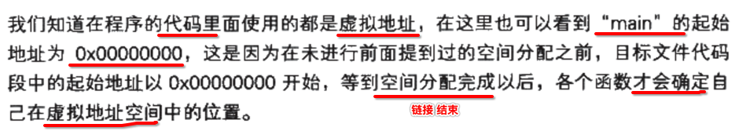
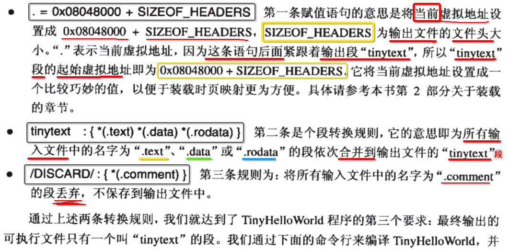

[TOC]


## 1. 静态链接: 将所有的 ==目标文件== 链接生成 ==可执行文件==


## 2. 静态链接 解决的问题: 如何将多个目标文件的 ==各种段== 取出来再进行 ==合并==


- 1) 取出 A.o , B.o , C.o 的 **text section** 合并到 a.out
- 2) 取出 A.o , B.o , C.o 的 **data section** 合并到 a.out


## 3. 简单的合并多个目标文件: 依次往下叠加


存在的 **缺点** :

- 会存在大量的 **零散** 段 (碎片化)
- 会造成 **可执行文件的体积** 较大
- 也会导致 **占用的内存** 也比较大


## 4. 实际的合并多个目标文件: ==相似段== 进行合并


## 5. 链接器: 为 ==目标文件== 分配 ==空间== 与 ==地址==


- 1) **链接** 结束，最终存在于 **可执行文件** 中的占用的 **文件** 空间
- 2) 可执行文件被 **加载到内存** 分配到的 **内存** 空间


## 6. Two-pass Linking (两步链接): 链接分为 2个 步骤


## 7. ld `-e` 指定可执行文件的 ==入口符号==


## 8. 对比 链接 前后 地址分配 情况

### 1. 代码

```c
//xzh@xzh-VirtualBox:~/src$ cat people.c
int age = 99;

void run(){}
```

```c
//xzh@xzh-VirtualBox:~/src$ cat main.c
extern int age;
extern void run();

int main(int argv, char* argr[])
{
	int x = age;
	run();
}
```

### 2. objdump -h main.o

```
xzh@xzh-VirtualBox:~/src$ gcc -c main.c
```

```
xzh@xzh-VirtualBox:~/src$ objdump -h main.o

main.o:     file format elf64-x86-64

Sections:
Idx Name          Size      VMA               LMA               File off  Algn
  0 .text         00000029  0000000000000000  0000000000000000  00000040  2**0
                  CONTENTS, ALLOC, LOAD, RELOC, READONLY, CODE
  1 .data         00000000  0000000000000000  0000000000000000  00000069  2**0
                  CONTENTS, ALLOC, LOAD, DATA
  2 .bss          00000000  0000000000000000  0000000000000000  00000069  2**0
                  ALLOC
  3 .comment      0000002b  0000000000000000  0000000000000000  00000069  2**0
                  CONTENTS, READONLY
  4 .note.GNU-stack 00000000  0000000000000000  0000000000000000  00000094  2**0
                  CONTENTS, READONLY
  5 .eh_frame     00000038  0000000000000000  0000000000000000  00000098  2**3
                  CONTENTS, ALLOC, LOAD, RELOC, READONLY, DATA
```

### 3. objdump -h people.o

```
xzh@xzh-VirtualBox:~/src$ gcc -c people.c
```

```
xzh@xzh-VirtualBox:~/src$ objdump -h people.o

people.o:     file format elf64-x86-64

Sections:
Idx Name          Size      VMA               LMA               File off  Algn
  0 .text         00000007  0000000000000000  0000000000000000  00000040  2**0
                  CONTENTS, ALLOC, LOAD, READONLY, CODE
  1 .data         00000004  0000000000000000  0000000000000000  00000048  2**2
                  CONTENTS, ALLOC, LOAD, DATA
  2 .bss          00000000  0000000000000000  0000000000000000  0000004c  2**0
                  ALLOC
  3 .comment      0000002b  0000000000000000  0000000000000000  0000004c  2**0
                  CONTENTS, READONLY
  4 .note.GNU-stack 00000000  0000000000000000  0000000000000000  00000077  2**0
                  CONTENTS, READONLY
  5 .eh_frame     00000038  0000000000000000  0000000000000000  00000078  2**3
                  CONTENTS, ALLOC, LOAD, RELOC, READONLY, DATA
```

### 4. objdump -h a.out

```
xzh@xzh-VirtualBox:~/src$ gcc main.o people.o
```

```
xzh@xzh-VirtualBox:~/src$ objdump -h a.out

a.out:     file format elf64-x86-64

Sections:
Idx Name          Size      VMA               LMA               File off  Algn
  0 .interp       0000001c  0000000000000238  0000000000000238  00000238  2**0
                  CONTENTS, ALLOC, LOAD, READONLY, DATA
  1 .note.ABI-tag 00000020  0000000000000254  0000000000000254  00000254  2**2
                  CONTENTS, ALLOC, LOAD, READONLY, DATA
  2 .note.gnu.build-id 00000024  0000000000000274  0000000000000274  00000274  2**2
                  CONTENTS, ALLOC, LOAD, READONLY, DATA
  3 .gnu.hash     0000001c  0000000000000298  0000000000000298  00000298  2**3
                  CONTENTS, ALLOC, LOAD, READONLY, DATA
  4 .dynsym       00000090  00000000000002b8  00000000000002b8  000002b8  2**3
                  CONTENTS, ALLOC, LOAD, READONLY, DATA
  5 .dynstr       0000007d  0000000000000348  0000000000000348  00000348  2**0
                  CONTENTS, ALLOC, LOAD, READONLY, DATA
  6 .gnu.version  0000000c  00000000000003c6  00000000000003c6  000003c6  2**1
                  CONTENTS, ALLOC, LOAD, READONLY, DATA
  7 .gnu.version_r 00000020  00000000000003d8  00000000000003d8  000003d8  2**3
                  CONTENTS, ALLOC, LOAD, READONLY, DATA
  8 .rela.dyn     000000c0  00000000000003f8  00000000000003f8  000003f8  2**3
                  CONTENTS, ALLOC, LOAD, READONLY, DATA
  9 .init         00000017  00000000000004b8  00000000000004b8  000004b8  2**2
                  CONTENTS, ALLOC, LOAD, READONLY, CODE
 10 .plt          00000010  00000000000004d0  00000000000004d0  000004d0  2**4
                  CONTENTS, ALLOC, LOAD, READONLY, CODE
 11 .plt.got      00000008  00000000000004e0  00000000000004e0  000004e0  2**3
                  CONTENTS, ALLOC, LOAD, READONLY, CODE
 12 .text         000001b2  00000000000004f0  00000000000004f0  000004f0  2**4
                  CONTENTS, ALLOC, LOAD, READONLY, CODE
 13 .fini         00000009  00000000000006a4  00000000000006a4  000006a4  2**2
                  CONTENTS, ALLOC, LOAD, READONLY, CODE
 14 .rodata       00000004  00000000000006b0  00000000000006b0  000006b0  2**2
                  CONTENTS, ALLOC, LOAD, READONLY, DATA
 15 .eh_frame_hdr 00000044  00000000000006b4  00000000000006b4  000006b4  2**2
                  CONTENTS, ALLOC, LOAD, READONLY, DATA
 16 .eh_frame     00000128  00000000000006f8  00000000000006f8  000006f8  2**3
                  CONTENTS, ALLOC, LOAD, READONLY, DATA
 17 .init_array   00000008  0000000000200df0  0000000000200df0  00000df0  2**3
                  CONTENTS, ALLOC, LOAD, DATA
 18 .fini_array   00000008  0000000000200df8  0000000000200df8  00000df8  2**3
                  CONTENTS, ALLOC, LOAD, DATA
 19 .dynamic      000001c0  0000000000200e00  0000000000200e00  00000e00  2**3
                  CONTENTS, ALLOC, LOAD, DATA
 20 .got          00000040  0000000000200fc0  0000000000200fc0  00000fc0  2**3
                  CONTENTS, ALLOC, LOAD, DATA
 21 .data         00000014  0000000000201000  0000000000201000  00001000  2**3
                  CONTENTS, ALLOC, LOAD, DATA
 22 .bss          00000004  0000000000201014  0000000000201014  00001014  2**0
                  ALLOC
 23 .comment      0000002a  0000000000000000  0000000000000000  00001014  2**0
                  CONTENTS, READONLY
```

### 5. 三个输出的区别

- 1、main.o、people.o 输出中的 **VMA** 和 **LMA** 都是 **0000000000000000**
- 2、a.out 输出中的 **VMA** 和 **LMA** 都是有 **实际值** 的，而且都不一样

### 6. VMA 和 LMA


### 7. 链接前 和 链接后，代码中使用的都是 ==虚拟地址==


## 9. 目标文件 / 可执行文件 / 进程空间


- 1) 目标文件 ==> **链接** ==> 可执行文件
- 2) 可执行文件 ==> **加载** ==> 内存中分配虚拟内存存储空间


## 10. 为什么给 text(段) 和 data(段) 分配 ==固定== 起始地址？


- 各个操作系统的不同而不同
- 因为最终负责 **衔接硬件** 那部分 **启动代码**  是由 **各个操作系统** 提供
- 那么也就有不同的 **起始地址 分配规则**


## 11. 链接器 通过 ==段内 偏移== 计算 各个符号 虚拟地址


## 12. 链接器 处理 目标文件内的 ==外部符号引用==

### 1. objdump -d xx.o 反汇编


### 2. 此时 main 符号的 起始地址 是 0



### 3. 如何看 objdump -d 输出


### 4. main.o 引用 外部 shard 变量


----


### 5. main.o 引用 外部 swap 函数 (近址相对位移调用)


### 6. call 跳转的地址 = 0x2b + (-4) = 0x27 (一个 ==临时的假地址==)


----


### 7. ==链接器== 对需要进行 ==重定位的指令== 进行 ==地址修正==


### 8. 链接之后的 ==可执行文件== 内的 外部符号引用 ==地址修正==


## 13. 重定位表: 记录 ==谁要== 要修正、==哪部分== 需要修正、==如何== 修正


## 14. 重定位==表== == 重定位==段== (==objdump -r== 查看重定位段)


## 15. 重定位表(段): 一个 elf rel struct 实例 数组

> /usr/include/elf.h

### 1. 32 位 elf rel struct

```c
/* Relocation table entry without addend (in section of type SHT_REL).  */

typedef struct
{
  Elf32_Addr  r_offset;   /* Address */
  Elf32_Word  r_info;     /* Relocation type and symbol index */
} Elf32_Rel;
```

### 2. 64 位 elf rel struct

```c
/* I have seen two different definitions of the Elf64_Rel and
   Elf64_Rela structures, so we'll leave them out until Novell (or
   whoever) gets their act together.  */
/* The following, at least, is used on Sparc v9, MIPS, and Alpha.  */

typedef struct
{
  Elf64_Addr  r_offset;   /* Address */
  Elf64_Xword r_info;     /* Relocation type and symbol index */
} Elf64_Rel;
```

### 3. struct 成员含义


## 16. 链接 时，会经常报错: 符号 ==未定义==


## 17. 链接器 从 ==全局符号表== 中查找 ==未定义符号的引用== 进行 ==重定位==


## 18. COMMON (COM) 块

### 1. 在不同文件中，相同名字 的符号，但是 ==类型== 不一致的情况


### 2. COMMON (COM) 机制，最早源于 Fortran


### 3. 链接器 处理 ==弱符号== 时，与合并 COMMON (COM) 一样，选择 ==长度最大== 的


### 4. 早期 链接器 当处理 相同名字 sizeof(weak 符号) > sizeof(strong 符号) 会报警告


### 5. 总结为何 编译器 会将 ==没初始化的全局变量的符号== 放在 bss(COM) 


## 19. 全局变量、static 全局变量、static 局部变量(未初始化 和 已经初始化)

### 1. main.c

```c
//xzh@xzh-VirtualBox:~/src$ cat main.c
int var1 = 99;
static int var2 = 100;

int var3;
static int var4;

int main(int argv, char* argr[])
{
	static int var5;
	static int var6 = 101;
}
```

### 2. 编译 阶段

```
xzh@xzh-VirtualBox:~/src$ gcc -c main.c
```

#### 1. 所有的 section

```
xzh@xzh-VirtualBox:~/src$ readelf -S main.o
There are 11 section headers, starting at offset 0x2d8:

Section Headers:
  [Nr] Name              Type             Address           Offset
       Size              EntSize          Flags  Link  Info  Align
  [ 0]                   NULL             0000000000000000  00000000
       0000000000000000  0000000000000000           0     0     0
  [ 1] .text             PROGBITS         0000000000000000  00000040
       0000000000000012  0000000000000000  AX       0     0     1
  [ 2] .data             PROGBITS         0000000000000000  00000054
       000000000000000c  0000000000000000  WA       0     0     4
  [ 3] .bss              NOBITS           0000000000000000  00000060
       0000000000000008  0000000000000000  WA       0     0     4
  [ 4] .comment          PROGBITS         0000000000000000  00000060
       000000000000002b  0000000000000001  MS       0     0     1
  [ 5] .note.GNU-stack   PROGBITS         0000000000000000  0000008b
       0000000000000000  0000000000000000           0     0     1
  [ 6] .eh_frame         PROGBITS         0000000000000000  00000090
       0000000000000038  0000000000000000   A       0     0     8
  [ 7] .rela.eh_frame    RELA             0000000000000000  00000268
       0000000000000018  0000000000000018   I       8     6     8
  [ 8] .symtab           SYMTAB           0000000000000000  000000c8
       0000000000000168  0000000000000018           9    12     8
  [ 9] .strtab           STRTAB           0000000000000000  00000230
       0000000000000035  0000000000000000           0     0     1
  [10] .shstrtab         STRTAB           0000000000000000  00000280
       0000000000000054  0000000000000000           0     0     1
```

#### 2. 符号表

```
xzh@xzh-VirtualBox:~/src$ readelf -s main.o

Symbol table '.symtab' contains 15 entries:
   Num:    Value          Size Type    Bind   Vis      Ndx Name
     0: 0000000000000000     0 NOTYPE  LOCAL  DEFAULT  UND
     1: 0000000000000000     0 FILE    LOCAL  DEFAULT  ABS main.c
     2: 0000000000000000     0 SECTION LOCAL  DEFAULT    1
     3: 0000000000000000     0 SECTION LOCAL  DEFAULT    2
     4: 0000000000000000     0 SECTION LOCAL  DEFAULT    3
     5: 0000000000000004     4 OBJECT  LOCAL  DEFAULT    2 var2
     6: 0000000000000000     4 OBJECT  LOCAL  DEFAULT    3 var4
     7: 0000000000000008     4 OBJECT  LOCAL  DEFAULT    2 var6.1801
     8: 0000000000000004     4 OBJECT  LOCAL  DEFAULT    3 var5.1800
     9: 0000000000000000     0 SECTION LOCAL  DEFAULT    5
    10: 0000000000000000     0 SECTION LOCAL  DEFAULT    6
    11: 0000000000000000     0 SECTION LOCAL  DEFAULT    4
    12: 0000000000000000     4 OBJECT  GLOBAL DEFAULT    2 var1
    13: 0000000000000004     4 OBJECT  GLOBAL DEFAULT  COM var3
    14: 0000000000000000    18 FUNC    GLOBAL DEFAULT    1 main
```

#### 3. var1 ~ var6 符号存储位置

- 1) var1 -- 2号 -- data 段
- 2) var2 -- 2号 -- data 段
- 3) var3 -- 弱符号 -- COM 段
- 4) var4 -- 弱符号 -- bss 段
- 5) var5 -- 弱符号 -- bss 段
- 6) var6 -- 2号 -- data 段

### 3. 链接 阶段

```
xzh@xzh-VirtualBox:~/src$ gcc main.o
```

#### 1. 所有的 section

```
xzh@xzh-VirtualBox:~/src$ readelf -S a.out
There are 28 section headers, starting at offset 0x19a8:

Section Headers:
  [Nr] Name              Type             Address           Offset
       Size              EntSize          Flags  Link  Info  Align
  [ 0]                   NULL             0000000000000000  00000000
       0000000000000000  0000000000000000           0     0     0
  [ 1] .interp           PROGBITS         0000000000000238  00000238
       000000000000001c  0000000000000000   A       0     0     1
  [ 2] .note.ABI-tag     NOTE             0000000000000254  00000254
       0000000000000020  0000000000000000   A       0     0     4
  [ 3] .note.gnu.build-i NOTE             0000000000000274  00000274
       0000000000000024  0000000000000000   A       0     0     4
  [ 4] .gnu.hash         GNU_HASH         0000000000000298  00000298
       000000000000001c  0000000000000000   A       5     0     8
  [ 5] .dynsym           DYNSYM           00000000000002b8  000002b8
       0000000000000090  0000000000000018   A       6     1     8
  [ 6] .dynstr           STRTAB           0000000000000348  00000348
       000000000000007d  0000000000000000   A       0     0     1
  [ 7] .gnu.version      VERSYM           00000000000003c6  000003c6
       000000000000000c  0000000000000002   A       5     0     2
  [ 8] .gnu.version_r    VERNEED          00000000000003d8  000003d8
       0000000000000020  0000000000000000   A       6     1     8
  [ 9] .rela.dyn         RELA             00000000000003f8  000003f8
       00000000000000c0  0000000000000018   A       5     0     8
  [10] .init             PROGBITS         00000000000004b8  000004b8
       0000000000000017  0000000000000000  AX       0     0     4
  [11] .plt              PROGBITS         00000000000004d0  000004d0
       0000000000000010  0000000000000010  AX       0     0     16
  [12] .plt.got          PROGBITS         00000000000004e0  000004e0
       0000000000000008  0000000000000008  AX       0     0     8
  [13] .text             PROGBITS         00000000000004f0  000004f0
       0000000000000192  0000000000000000  AX       0     0     16
  [14] .fini             PROGBITS         0000000000000684  00000684
       0000000000000009  0000000000000000  AX       0     0     4
  [15] .rodata           PROGBITS         0000000000000690  00000690
       0000000000000004  0000000000000004  AM       0     0     4
  [16] .eh_frame_hdr     PROGBITS         0000000000000694  00000694
       000000000000003c  0000000000000000   A       0     0     4
  [17] .eh_frame         PROGBITS         00000000000006d0  000006d0
       0000000000000108  0000000000000000   A       0     0     8
  [18] .init_array       INIT_ARRAY       0000000000200df0  00000df0
       0000000000000008  0000000000000008  WA       0     0     8
  [19] .fini_array       FINI_ARRAY       0000000000200df8  00000df8
       0000000000000008  0000000000000008  WA       0     0     8
  [20] .dynamic          DYNAMIC          0000000000200e00  00000e00
       00000000000001c0  0000000000000010  WA       6     0     8
  [21] .got              PROGBITS         0000000000200fc0  00000fc0
       0000000000000040  0000000000000008  WA       0     0     8
  [22] .data             PROGBITS         0000000000201000  00001000
       000000000000001c  0000000000000000  WA       0     0     8
  [23] .bss              NOBITS           000000000020101c  0000101c
       0000000000000014  0000000000000000  WA       0     0     4
  [24] .comment          PROGBITS         0000000000000000  0000101c
       000000000000002a  0000000000000001  MS       0     0     1
  [25] .symtab           SYMTAB           0000000000000000  00001048
       0000000000000648  0000000000000018          26    46     8
  [26] .strtab           STRTAB           0000000000000000  00001690
       0000000000000218  0000000000000000           0     0     1
  [27] .shstrtab         STRTAB           0000000000000000  000018a8
       00000000000000f9  0000000000000000           0     0     1
```

#### 2. 符号表

```
xzh@xzh-VirtualBox:~/src$ readelf -s a.out

Symbol table '.dynsym' contains 6 entries:
   Num:    Value          Size Type    Bind   Vis      Ndx Name
     0: 0000000000000000     0 NOTYPE  LOCAL  DEFAULT  UND
     1: 0000000000000000     0 NOTYPE  WEAK   DEFAULT  UND _ITM_deregisterTMCloneTab
     2: 0000000000000000     0 FUNC    GLOBAL DEFAULT  UND __libc_start_main@GLIBC_2.2.5 (2)
     3: 0000000000000000     0 NOTYPE  WEAK   DEFAULT  UND __gmon_start__
     4: 0000000000000000     0 NOTYPE  WEAK   DEFAULT  UND _ITM_registerTMCloneTable
     5: 0000000000000000     0 FUNC    WEAK   DEFAULT  UND __cxa_finalize@GLIBC_2.2.5 (2)

Symbol table '.symtab' contains 67 entries:
   Num:    Value          Size Type    Bind   Vis      Ndx Name
     0: 0000000000000000     0 NOTYPE  LOCAL  DEFAULT  UND
     1: 0000000000000238     0 SECTION LOCAL  DEFAULT    1
     2: 0000000000000254     0 SECTION LOCAL  DEFAULT    2
     3: 0000000000000274     0 SECTION LOCAL  DEFAULT    3
     4: 0000000000000298     0 SECTION LOCAL  DEFAULT    4
     5: 00000000000002b8     0 SECTION LOCAL  DEFAULT    5
     6: 0000000000000348     0 SECTION LOCAL  DEFAULT    6
     7: 00000000000003c6     0 SECTION LOCAL  DEFAULT    7
     8: 00000000000003d8     0 SECTION LOCAL  DEFAULT    8
     9: 00000000000003f8     0 SECTION LOCAL  DEFAULT    9
    10: 00000000000004b8     0 SECTION LOCAL  DEFAULT   10
    11: 00000000000004d0     0 SECTION LOCAL  DEFAULT   11
    12: 00000000000004e0     0 SECTION LOCAL  DEFAULT   12
    13: 00000000000004f0     0 SECTION LOCAL  DEFAULT   13
    14: 0000000000000684     0 SECTION LOCAL  DEFAULT   14
    15: 0000000000000690     0 SECTION LOCAL  DEFAULT   15
    16: 0000000000000694     0 SECTION LOCAL  DEFAULT   16
    17: 00000000000006d0     0 SECTION LOCAL  DEFAULT   17
    18: 0000000000200df0     0 SECTION LOCAL  DEFAULT   18
    19: 0000000000200df8     0 SECTION LOCAL  DEFAULT   19
    20: 0000000000200e00     0 SECTION LOCAL  DEFAULT   20
    21: 0000000000200fc0     0 SECTION LOCAL  DEFAULT   21
    22: 0000000000201000     0 SECTION LOCAL  DEFAULT   22
    23: 000000000020101c     0 SECTION LOCAL  DEFAULT   23
    24: 0000000000000000     0 SECTION LOCAL  DEFAULT   24
    25: 0000000000000000     0 FILE    LOCAL  DEFAULT  ABS crtstuff.c
    26: 0000000000000520     0 FUNC    LOCAL  DEFAULT   13 deregister_tm_clones
    27: 0000000000000560     0 FUNC    LOCAL  DEFAULT   13 register_tm_clones
    28: 00000000000005b0     0 FUNC    LOCAL  DEFAULT   13 __do_global_dtors_aux
    29: 000000000020101c     1 OBJECT  LOCAL  DEFAULT   23 completed.7696
    30: 0000000000200df8     0 OBJECT  LOCAL  DEFAULT   19 __do_global_dtors_aux_fin
    31: 00000000000005f0     0 FUNC    LOCAL  DEFAULT   13 frame_dummy
    32: 0000000000200df0     0 OBJECT  LOCAL  DEFAULT   18 __frame_dummy_init_array_
    33: 0000000000000000     0 FILE    LOCAL  DEFAULT  ABS main.c
    34: 0000000000201014     4 OBJECT  LOCAL  DEFAULT   22 var2
    35: 0000000000201020     4 OBJECT  LOCAL  DEFAULT   23 var4
    36: 0000000000201018     4 OBJECT  LOCAL  DEFAULT   22 var6.1801
    37: 0000000000201024     4 OBJECT  LOCAL  DEFAULT   23 var5.1800
    38: 0000000000000000     0 FILE    LOCAL  DEFAULT  ABS crtstuff.c
    39: 00000000000007d4     0 OBJECT  LOCAL  DEFAULT   17 __FRAME_END__
    40: 0000000000000000     0 FILE    LOCAL  DEFAULT  ABS
    41: 0000000000200df8     0 NOTYPE  LOCAL  DEFAULT   18 __init_array_end
    42: 0000000000200e00     0 OBJECT  LOCAL  DEFAULT   20 _DYNAMIC
    43: 0000000000200df0     0 NOTYPE  LOCAL  DEFAULT   18 __init_array_start
    44: 0000000000000694     0 NOTYPE  LOCAL  DEFAULT   16 __GNU_EH_FRAME_HDR
    45: 0000000000200fc0     0 OBJECT  LOCAL  DEFAULT   21 _GLOBAL_OFFSET_TABLE_
    46: 0000000000000680     2 FUNC    GLOBAL DEFAULT   13 __libc_csu_fini
    47: 0000000000000000     0 NOTYPE  WEAK   DEFAULT  UND _ITM_deregisterTMCloneTab
    48: 0000000000201000     0 NOTYPE  WEAK   DEFAULT   22 data_start
    49: 000000000020101c     0 NOTYPE  GLOBAL DEFAULT   22 _edata
    50: 0000000000000684     0 FUNC    GLOBAL DEFAULT   14 _fini
    51: 0000000000000000     0 FUNC    GLOBAL DEFAULT  UND __libc_start_main@@GLIBC_
    52: 0000000000201000     0 NOTYPE  GLOBAL DEFAULT   22 __data_start
    53: 0000000000000000     0 NOTYPE  WEAK   DEFAULT  UND __gmon_start__
    54: 0000000000201008     0 OBJECT  GLOBAL HIDDEN    22 __dso_handle
    55: 0000000000000690     4 OBJECT  GLOBAL DEFAULT   15 _IO_stdin_used
    56: 0000000000000610   101 FUNC    GLOBAL DEFAULT   13 __libc_csu_init
    57: 0000000000201030     0 NOTYPE  GLOBAL DEFAULT   23 _end
    58: 0000000000201010     4 OBJECT  GLOBAL DEFAULT   22 var1
    59: 00000000000004f0    43 FUNC    GLOBAL DEFAULT   13 _start
    60: 0000000000201028     4 OBJECT  GLOBAL DEFAULT   23 var3
    61: 000000000020101c     0 NOTYPE  GLOBAL DEFAULT   23 __bss_start
    62: 00000000000005fa    18 FUNC    GLOBAL DEFAULT   13 main
    63: 0000000000201020     0 OBJECT  GLOBAL HIDDEN    22 __TMC_END__
    64: 0000000000000000     0 NOTYPE  WEAK   DEFAULT  UND _ITM_registerTMCloneTable
    65: 0000000000000000     0 FUNC    WEAK   DEFAULT  UND __cxa_finalize@@GLIBC_2.2
    66: 00000000000004b8     0 FUNC    GLOBAL DEFAULT   10 _init
```

#### 3. var1 ~ var6 符号存储位置

- 1) var1 -- 22号 -- data 段
- 2) var2 -- 22号 -- data 段
- 3) var3 -- 23号 -- bss 段
- 4) var4 -- 23号 -- bss 段
- 5) var5 -- 23号 -- bss 段
- 6) var6 -- 22号 -- data 段

最终符号就只存在 **data 和 bss** 两种段，因为 **COM** 中的符号，会被转义到 **bss** 段中。

### 4. 总结下上述 main.c 中变量 对应的 ==符号 (elf_Sym)== 存储 ==位置(secion)==

#### 1. 编译 阶段

```c
//xzh@xzh-VirtualBox:~/src$ cat main.c
int var1 = 99; // .data
static int var2 = 100; // .data

int var3; // COM
static int var4; // .bss

int main(int argv, char* argr[])
{
	static int var5; // .bss
	static int var6 = 101; // .data
}
```

#### 2. 链接 阶段

```c
//xzh@xzh-VirtualBox:~/src$ cat main.c
int var1 = 99; // 不变
static int var2 = 100; // 不变

int var3; // 【变化】COM ==> .bss
static int var4; // 不变

int main(int argv, char* argr[])
{
	static int var5; // 不变
	static int var6 = 101; // 不变
}
```


## 20. gcc `-fno-common` 允许将 ==未初始化全局变量== 


## 21. C++ 全局对象 构造与析构 实现: 1) `.init` 2) `.fini`


- 1、linux 系统中的 **可执行文件** 指定的 **入口** 符号一般为 `_start`
- 2、ld.script (链接脚本文件) 中已经 **写死** 必须要 **链接** `_start` 这个符号
- 3、而 `_start` 这个符号的 **实现** 由 linux 系统目录下的 `crt*.o` 目标文件 提供
- 4、当执行 main **之前** ， 先执行 `.init` 段中的 **代码**
- 5、当执行 main **返回结束** ， 再执行 `.fini` 段中的 **代码**


## 22. 不同 ==编译器== 生成的 ==目标文件 - 格式== 不同的


## 23. 不同 ==编译器== 生成的 ==目标文件== 可以 ==相互链接== 的要求: ABI 兼容


- 1、ABI 包含的内容:
  - 1) 目标文件的 **文件格式**
  - 2) **符号修饰** 算法 (C++ 函数重载 处理方式)
  - 3) 变的 **内存分布** 算法
  - 4) **函数调用** 方式

- 2、结论: 如果想让 不同 ==编译器== 生成的 ==目标文件== 可以 ==相互链接== ，那么必须保证 **不同编译环境** 下的 **ABI 必须都兼容**


## 24. ==AP(源码)I== 级别的接口 vs ==AB(二进制)I== 级别的接口


## 25. 影响 ==二进制 ABI== 主要因素，1) ==编译器== 2) ==操作系统==


- 1、编译器: **生成** 二进制 文件
- 2、操作系统: **加载、运行 (分配内存空间)** 二进制 文件


## 26. ==C++ 特性== 使得 ==编译器 ABI== 更加难以 兼容


## 27. ==C++ ABI== (二进制) 兼容性 ==一直没有解决==

### 1. 一直以来就很差


### 2. 到现在也没有解决


## 28. 每一种语言 都会提供对应的 语言库 (Language Lirabry)


## 29. 静态库: 很多个 ==目标文件== 打包压缩在一起

### 1. 多个 C 文件

```c
//xzh@xzh-VirtualBox:~/src$ cat add.c
int add(int a, int b) {
	return a + b;
}
```

```c
//xzh@xzh-VirtualBox:~/src$ cat sub.c
int sub(int a, int b) {
	return a - b;
}
```

```c
// xzh@xzh-VirtualBox:~/src$ cat mul.c
int mul(int a, int b) {
	return a * b;
}
```

### 2. 各自 编译成 目标文件

```
xzh@xzh-VirtualBox:~/src$ gcc -c add.c
xzh@xzh-VirtualBox:~/src$ gcc -c sub.c
xzh@xzh-VirtualBox:~/src$ gcc -c mul.c
xzh@xzh-VirtualBox:~/src$
```

```
xzh@xzh-VirtualBox:~/src$ ls *.o
add.o  mul.o  sub.o
xzh@xzh-VirtualBox:~/src$
```

### 3. ar -rcs 将多个 目标文件 打包在一起为 libMath.a

```
xzh@xzh-VirtualBox:~/src$ ar -rcs libMath.a add.o sub.o mul.o
```

### 4. file libMath.a

```
xzh@xzh-VirtualBox:~/src$ ls
add.c  add.o  libMath.a  main.c  mul.c  mul.o  sub.c  sub.o
```

```
xzh@xzh-VirtualBox:~/src$ file libMath.a
libMath.a: current ar archive
```

### 5. ar -t 显示 libMath.a 包含的所有对象文件(.o文件)

```
xzh@xzh-VirtualBox:~/src$ ar -t libMath.a
add.o
sub.o
mul.o
```

### 6. ar -tv 按大小 显示 libMath.a 包含的所有对象文件(.o文件)

```
xzh@xzh-VirtualBox:~/src$ ar -tv libMath.a
rw-r--r-- 0/0   1232 Jan  1 03:00 1970 add.o
rw-r--r-- 0/0   1232 Jan  1 03:00 1970 sub.o
rw-r--r-- 0/0   1232 Jan  1 03:00 1970 mul.o
```

### 7. ar -d 从 libMath.a ==删除== 某一个 对象文件(.o文件)

```
xzh@xzh-VirtualBox:~/src$ ar -d libMath.a add.o
```

```
xzh@xzh-VirtualBox:~/src$ ar -t libMath.a
sub.o
mul.o
```

在 libMath.a 中只剩下 **2个** 目标文件。

### 8. ar -r 将某一个 对象文件(.o文件) ==添加到== libMath.a

#### 1. ar -r libMath.a b.o

```makefile
all:
	@rm libMath.a
	@ar rcs libMath.a sub.o mul.o
  @ar -t libMath.a
  @echo '---------------------'
	@ar -r libMath.a add.o
	@ar -t libMath.a
```

```
xzh@xzh-VirtualBox:~/src$ make
sub.o
mul.o
---------------------
sub.o
mul.o
add.o
```

直接将 add.o 追加到 libMath.a 末尾

#### 2. ar -ra sub.o libMath.a add.o

```makefile
all:
	@rm libMath.a
	@ar rcs libMath.a sub.o mul.o
	@ar -t libMath.a
	@echo '---------------------'
	@ar -ra sub.o libMath.a add.o
	@ar -t libMath.a
```

```
xzh@xzh-VirtualBox:~/src$ make
sub.o
mul.o
---------------------
sub.o
add.o
mul.o
```

- add.o 被添加到了 已经存在于 libMath.a 中的 **sub.o 后面**
- 也可以直接传入 **源文件** : 例如"ar -ra a.c liba.a b.c"表示将b.c加入liba.a并放在已有成员a.c之后

#### 3. ar -rb sub.o libMath.a add.o

```makefile
all:
	@rm libMath.a
	@ar rcs libMath.a sub.o mul.o
	@ar -t libMath.a
	@echo '---------------------'
	@ar -rb sub.o libMath.a add.o
	@ar -t libMath.a
```

```
xzh@xzh-VirtualBox:~/src$ make
sub.o
mul.o
---------------------
add.o
sub.o
mul.o
```

与上相反，将 add.o 被添加到了 已经存在于 libMath.a 中的 **sub.o 前面**

#### 4. ar -ri sub.o libMath.a add.o

```makefile
all:
	@rm libMath.a
	@ar rcs libMath.a sub.o mul.o
	@ar -t libMath.a
	@echo '---------------------'
	@ar -ri sub.o libMath.a add.o
	@ar -t libMath.a
```

```
xzh@xzh-VirtualBox:~/src$ make
sub.o
mul.o
---------------------
add.o
sub.o
mul.o
```

-ri 等价于 -rb

### 9. ar -x 从 libMath.a 中分离出 add.o

```
xzh@xzh-VirtualBox:~/src$ ls *.o
ls: cannot access '*.o': No such file or directory
```

```
xzh@xzh-VirtualBox:~/src$ ar -x libMath.a add.o
```

```
xzh@xzh-VirtualBox:~/src$ ls *.o
add.o
```


## 30. 查看 libxx.a ==符号表==

### 1. objdump -t libxx.a

```
xzh@xzh-VirtualBox:~/src$ objdump -t libMath.a
In archive libMath.a:

add.o:     file format elf64-x86-64

SYMBOL TABLE:
0000000000000000 l    df *ABS*	0000000000000000 add.c
0000000000000000 l    d  .text	0000000000000000 .text
0000000000000000 l    d  .data	0000000000000000 .data
0000000000000000 l    d  .bss	0000000000000000 .bss
0000000000000000 l    d  .note.GNU-stack	0000000000000000 .note.GNU-stack
0000000000000000 l    d  .eh_frame	0000000000000000 .eh_frame
0000000000000000 l    d  .comment	0000000000000000 .comment
0000000000000000 g     F .text	0000000000000014 add


sub.o:     file format elf64-x86-64

SYMBOL TABLE:
0000000000000000 l    df *ABS*	0000000000000000 sub.c
0000000000000000 l    d  .text	0000000000000000 .text
0000000000000000 l    d  .data	0000000000000000 .data
0000000000000000 l    d  .bss	0000000000000000 .bss
0000000000000000 l    d  .note.GNU-stack	0000000000000000 .note.GNU-stack
0000000000000000 l    d  .eh_frame	0000000000000000 .eh_frame
0000000000000000 l    d  .comment	0000000000000000 .comment
0000000000000000 g     F .text	0000000000000012 sub


mul.o:     file format elf64-x86-64

SYMBOL TABLE:
0000000000000000 l    df *ABS*	0000000000000000 mul.c
0000000000000000 l    d  .text	0000000000000000 .text
0000000000000000 l    d  .data	0000000000000000 .data
0000000000000000 l    d  .bss	0000000000000000 .bss
0000000000000000 l    d  .note.GNU-stack	0000000000000000 .note.GNU-stack
0000000000000000 l    d  .eh_frame	0000000000000000 .eh_frame
0000000000000000 l    d  .comment	0000000000000000 .comment
0000000000000000 g     F .text	0000000000000013 mul
```

- 1、add.o: -- `.text` -- add 函数符号
- 2、sub.o: -- `.text` -- sub 函数符号
- 3、mul.o: -- `.text` -- mul 函数符号

### 2. readelf -s

```
xzh@xzh-VirtualBox:~/src$ readelf -s libMath.a

File: libMath.a(add.o)

Symbol table '.symtab' contains 9 entries:
   Num:    Value          Size Type    Bind   Vis      Ndx Name
     0: 0000000000000000     0 NOTYPE  LOCAL  DEFAULT  UND
     1: 0000000000000000     0 FILE    LOCAL  DEFAULT  ABS add.c
     2: 0000000000000000     0 SECTION LOCAL  DEFAULT    1
     3: 0000000000000000     0 SECTION LOCAL  DEFAULT    2
     4: 0000000000000000     0 SECTION LOCAL  DEFAULT    3
     5: 0000000000000000     0 SECTION LOCAL  DEFAULT    5
     6: 0000000000000000     0 SECTION LOCAL  DEFAULT    6
     7: 0000000000000000     0 SECTION LOCAL  DEFAULT    4
     8: 0000000000000000    20 FUNC    GLOBAL DEFAULT    1 add

File: libMath.a(sub.o)

Symbol table '.symtab' contains 9 entries:
   Num:    Value          Size Type    Bind   Vis      Ndx Name
     0: 0000000000000000     0 NOTYPE  LOCAL  DEFAULT  UND
     1: 0000000000000000     0 FILE    LOCAL  DEFAULT  ABS sub.c
     2: 0000000000000000     0 SECTION LOCAL  DEFAULT    1
     3: 0000000000000000     0 SECTION LOCAL  DEFAULT    2
     4: 0000000000000000     0 SECTION LOCAL  DEFAULT    3
     5: 0000000000000000     0 SECTION LOCAL  DEFAULT    5
     6: 0000000000000000     0 SECTION LOCAL  DEFAULT    6
     7: 0000000000000000     0 SECTION LOCAL  DEFAULT    4
     8: 0000000000000000    18 FUNC    GLOBAL DEFAULT    1 sub

File: libMath.a(mul.o)

Symbol table '.symtab' contains 9 entries:
   Num:    Value          Size Type    Bind   Vis      Ndx Name
     0: 0000000000000000     0 NOTYPE  LOCAL  DEFAULT  UND
     1: 0000000000000000     0 FILE    LOCAL  DEFAULT  ABS mul.c
     2: 0000000000000000     0 SECTION LOCAL  DEFAULT    1
     3: 0000000000000000     0 SECTION LOCAL  DEFAULT    2
     4: 0000000000000000     0 SECTION LOCAL  DEFAULT    3
     5: 0000000000000000     0 SECTION LOCAL  DEFAULT    5
     6: 0000000000000000     0 SECTION LOCAL  DEFAULT    6
     7: 0000000000000000     0 SECTION LOCAL  DEFAULT    4
     8: 0000000000000000    19 FUNC    GLOBAL DEFAULT    1 mul
```

打印结果比 `objdump -t libxx.a` 更加清晰。


## 31. `gcc -fno-builtin` 禁止函数优化

### 1. printf("Hello World!\n");

#### 1. main.c

```c
//xzh@xzh-VirtualBox:~/src$ cat main.c
#include <stdio.h>

int main(int argv, char* argr[])
{
	printf("Hello World!\n");
}
```

#### 2. 链接的是 puts

```
xzh@xzh-VirtualBox:~/src$ gcc -c main.c
xzh@xzh-VirtualBox:~/src$ readelf -s main.o

Symbol table '.symtab' contains 12 entries:
   Num:    Value          Size Type    Bind   Vis      Ndx Name
     0: 0000000000000000     0 NOTYPE  LOCAL  DEFAULT  UND
     1: 0000000000000000     0 FILE    LOCAL  DEFAULT  ABS main.c
     2: 0000000000000000     0 SECTION LOCAL  DEFAULT    1
     3: 0000000000000000     0 SECTION LOCAL  DEFAULT    3
     4: 0000000000000000     0 SECTION LOCAL  DEFAULT    4
     5: 0000000000000000     0 SECTION LOCAL  DEFAULT    5
     6: 0000000000000000     0 SECTION LOCAL  DEFAULT    7
     7: 0000000000000000     0 SECTION LOCAL  DEFAULT    8
     8: 0000000000000000     0 SECTION LOCAL  DEFAULT    6
     9: 0000000000000000    34 FUNC    GLOBAL DEFAULT    1 main
    10: 0000000000000000     0 NOTYPE  GLOBAL DEFAULT  UND _GLOBAL_OFFSET_TABLE_
    11: 0000000000000000     0 NOTYPE  GLOBAL DEFAULT  UND puts
```

### 2. printf("age = %d\n", 99);

#### 1. main.c

```c
//xzh@xzh-VirtualBox:~/src$ cat main.c
#include <stdio.h>

int main(int argv, char* argr[])
{
	// printf("Hello World!\n");
	printf("age = %d\n", 99);
}
```

#### 2. 链接的是 printf

```
xzh@xzh-VirtualBox:~/src$ gcc -c main.c
xzh@xzh-VirtualBox:~/src$ readelf -s main.o

Symbol table '.symtab' contains 12 entries:
   Num:    Value          Size Type    Bind   Vis      Ndx Name
     0: 0000000000000000     0 NOTYPE  LOCAL  DEFAULT  UND
     1: 0000000000000000     0 FILE    LOCAL  DEFAULT  ABS main.c
     2: 0000000000000000     0 SECTION LOCAL  DEFAULT    1
     3: 0000000000000000     0 SECTION LOCAL  DEFAULT    3
     4: 0000000000000000     0 SECTION LOCAL  DEFAULT    4
     5: 0000000000000000     0 SECTION LOCAL  DEFAULT    5
     6: 0000000000000000     0 SECTION LOCAL  DEFAULT    7
     7: 0000000000000000     0 SECTION LOCAL  DEFAULT    8
     8: 0000000000000000     0 SECTION LOCAL  DEFAULT    6
     9: 0000000000000000    44 FUNC    GLOBAL DEFAULT    1 main
    10: 0000000000000000     0 NOTYPE  GLOBAL DEFAULT  UND _GLOBAL_OFFSET_TABLE_
    11: 0000000000000000     0 NOTYPE  GLOBAL DEFAULT  UND printf
```

此时链接的是 **printf** 函数符号

### 3. `-fno-builtin` 禁止函数优化 printf("Hello World!\n");

#### 1. main.c

```c
// xzh@xzh-VirtualBox:~/src$ cat main.c
#include <stdio.h>

int main(int argv, char* argr[])
{
	printf("Hello World!\n");
	// printf("age = %d\n", 99);
}
```

#### 2. 链接的是 printf

```
xzh@xzh-VirtualBox:~/src$ gcc -c main.c -fno-builtin
xzh@xzh-VirtualBox:~/src$ readelf -s main.o

Symbol table '.symtab' contains 12 entries:
   Num:    Value          Size Type    Bind   Vis      Ndx Name
     0: 0000000000000000     0 NOTYPE  LOCAL  DEFAULT  UND
     1: 0000000000000000     0 FILE    LOCAL  DEFAULT  ABS main.c
     2: 0000000000000000     0 SECTION LOCAL  DEFAULT    1
     3: 0000000000000000     0 SECTION LOCAL  DEFAULT    3
     4: 0000000000000000     0 SECTION LOCAL  DEFAULT    4
     5: 0000000000000000     0 SECTION LOCAL  DEFAULT    5
     6: 0000000000000000     0 SECTION LOCAL  DEFAULT    7
     7: 0000000000000000     0 SECTION LOCAL  DEFAULT    8
     8: 0000000000000000     0 SECTION LOCAL  DEFAULT    6
     9: 0000000000000000    39 FUNC    GLOBAL DEFAULT    1 main
    10: 0000000000000000     0 NOTYPE  GLOBAL DEFAULT  UND _GLOBAL_OFFSET_TABLE_
    11: 0000000000000000     0 NOTYPE  GLOBAL DEFAULT  UND printf
```


## 32. 手动使用 ld 链接 目标文件

### 1. 不使用 C 标准库

#### 1. C 文件

```c
// xzh@xzh-VirtualBox:~/src$ cat add.c
int add(int a, int b) {
	return a + b;
}
```

```c
// xzh@xzh-VirtualBox:~/src$ cat sub.c
int sub(int a, int b) {
	return a - b;
}
```

```c
// xzh@xzh-VirtualBox:~/src$ cat main.c
extern int add(int,int);
extern int sub(int,int);

int main(int argv, char* argr[])
{
	add(1,2);
	sub(2,1);
}
```

#### 2. 各自 编译 生成 目标文件

```
xzh@xzh-VirtualBox:~/src$ gcc -c add.c sub.c main.c
```

#### 3. ld 链接 add.o sub.o main.o

```c
xzh@xzh-VirtualBox:~/src$ ld add.o sub.o main.o
ld: warning: cannot find entry symbol _start; defaulting to 00000000004000b0
```

#### 4. 报错找不到 `_start` 符号

```c
ld: warning: cannot find entry symbol _start; defaulting to 00000000004000b0
```

无法找到 **入口** 符号 `_start`

### 2. 不使用 C 标准库

#### 1. C 文件

```c
// xzh@xzh-VirtualBox:~/src$ cat main.c
int main(int argv, char* argr[])
{
	printf("1+1=%d\n", 2);
}
```

#### 2. 编译 生成 目标文件

```c
main.c: In function 'main':
main.c:3:2: warning: implicit declaration of function 'printf' [-Wimplicit-function-declaration]
  printf("1+1=%d\n", 2);
  ^~~~~~
main.c:3:2: warning: incompatible implicit declaration of built-in function 'printf'
main.c:3:2: note: include '<stdio.h>' or provide a declaration of 'printf'
```

会有警告，提示添加 `<stdio.h>` 头文件来引入 printf 函数的 **声明**

#### 3. ld 链接 main.o

```c
xzh@xzh-VirtualBox:~/src$ ld main.o
ld: warning: cannot find entry symbol _start; defaulting to 00000000004000b0
main.o: In function `main':
main.c:(.text+0x21): undefined reference to `printf'
```

#### 4. 报错找不到 `_start` 和 printf 2个符号

- 1) ld: warning: cannot find entry symbol _start; defaulting to 00000000004000b0
- 2) main.c:(.text+0x21): undefined reference to `printf'

### 3. gcc 入口工具，完成很多 ==隐藏细节==

```
xzh@xzh-VirtualBox:~/src$ gcc main.c
main.c: In function 'main':
main.c:3:2: warning: implicit declaration of function 'printf' [-Wimplicit-function-declaration]
  printf("1+1=%d\n", 2);
  ^~~~~~
main.c:3:2: warning: incompatible implicit declaration of built-in function 'printf'
main.c:3:2: note: include '<stdio.h>' or provide a declaration of 'printf'
```

```
xzh@xzh-VirtualBox:~/src$ ./a.out
1+1=2
```

- 虽然 **编译** 时仍然有警告
- 但是最终 **链接** 生成的 可执行文件，正常运行


## 33. gcc -static 指定 ==静态== 方式 进行 ==链接==

### 1. main.c

```c
// xzh@xzh-VirtualBox:~/src$ cat main.c
int main(int argv, char* argr[])
{
	printf("age = %d\n", 99);
}
```

### 2. gcc main.c 生成可执行文件

```
xzh@xzh-VirtualBox:~/src$ gcc main.c
main.c: In function 'main':
main.c:3:2: warning: implicit declaration of function 'printf' [-Wimplicit-function-declaration]
  printf("Hello World!\n");
  ^~~~~~
main.c:3:2: warning: incompatible implicit declaration of built-in function 'printf'
main.c:3:2: note: include '<stdio.h>' or provide a declaration of 'printf'
```

查看 a.out 文件大小

```
xzh@xzh-VirtualBox:~/src$ ll | grep 'a.out'
-rwxrwxr-x  1 xzh xzh 8296 May 20 15:47 a.out*
```

a.out 文件的大小为 **8296** 字节。

### 3. gcc -static main.c 生成可执行文件

```
xzh@xzh-VirtualBox:~/src$ gcc -static main.c
main.c: In function 'main':
main.c:3:2: warning: implicit declaration of function 'printf' [-Wimplicit-function-declaration]
  printf("Hello World!\n");
  ^~~~~~
main.c:3:2: warning: incompatible implicit declaration of built-in function 'printf'
main.c:3:2: note: include '<stdio.h>' or provide a declaration of 'printf'
```

查看 a.out 文件大小

```
xzh@xzh-VirtualBox:~/src$ ll | grep 'a.out'
-rwxrwxr-x  1 xzh xzh 844704 May 20 15:48 a.out*
```

- a.out 文件的大小为 **844704** 字节
- 明显 **844704** 字节 比上面的 **gcc main.c** 生成的 a.out 大小 **8296** 字节 **大的多**

### 4. 两种 ==链接== 方式

- 1) **静态** 链接
- 2) **动态** 链接


## 34. ==静态== 链接

### 1. 将所有的 目标文件、静态库(目标文件集合) 打包在一起，链接为 可执行文件


### 2. readelf -s a.out 查看 符号表 中的 printf 符号

```
xzh@xzh-VirtualBox:~/src$ readelf -s a.out | grep 'printf'
   ...........
   731: 000000000040f660   192 FUNC    GLOBAL DEFAULT    6 printf
   ...........
```

printf 符号，出现在 **a.out 符号表** 中记录的 **6号段中**

### 3. readelf -S a.out 查看 所有的 段

```
xzh@xzh-VirtualBox:~/src$ readelf -S a.out
There are 33 section headers, starting at offset 0xcdb80:

Section Headers:
  [Nr] Name              Type             Address           Offset
       Size              EntSize          Flags  Link  Info  Align
  [ 0]                   NULL             0000000000000000  00000000
       0000000000000000  0000000000000000           0     0     0
  [ 1] .note.ABI-tag     NOTE             0000000000400190  00000190
       0000000000000020  0000000000000000   A       0     0     4
  [ 2] .note.gnu.build-i NOTE             00000000004001b0  000001b0
       0000000000000024  0000000000000000   A       0     0     4
readelf: Warning: [ 3]: Link field (0) should index a symtab section.
  [ 3] .rela.plt         RELA             00000000004001d8  000001d8
       0000000000000228  0000000000000018  AI       0    20     8
  [ 4] .init             PROGBITS         0000000000400400  00000400
       0000000000000017  0000000000000000  AX       0     0     4
  [ 5] .plt              PROGBITS         0000000000400418  00000418
       00000000000000b8  0000000000000000  AX       0     0     8
  [ 6] .text             PROGBITS         00000000004004d0  000004d0
       000000000008f530  0000000000000000  AX       0     0     16
  ...........
```

**6号段** 就是 `.text` a.out 代码段。

### 4. 总结 静态 链接

- 1、将所有的 目标文件、静态库文件(目标文件集合) **链接** 在一起，生成 **可执行文件**
- 2、可执行文件的 **体积** 会 **非常大**
- 3、gcc **默认** 使用 **动态** 链接
- 4、当使用 `gcc -statis` 指定为 **静态** 链接


## 35. gcc `--verbose` 打印整个 编译、链接 过程

### 1. 32. 中的 例1 整个过程

```
xzh@xzh-VirtualBox:~/src$ gcc main.c add.c sub.c --verbose
Using built-in specs.
COLLECT_GCC=gcc
COLLECT_LTO_WRAPPER=/usr/lib/gcc/x86_64-linux-gnu/7/lto-wrapper
OFFLOAD_TARGET_NAMES=nvptx-none
OFFLOAD_TARGET_DEFAULT=1
Target: x86_64-linux-gnu
Configured with: ../src/configure -v --with-pkgversion='Ubuntu 7.3.0-27ubuntu1~18.04' --with-bugurl=file:///usr/share/doc/gcc-7/README.Bugs --enable-languages=c,ada,c++,go,brig,d,fortran,objc,obj-c++ --prefix=/usr --with-gcc-major-version-only --program-suffix=-7 --program-prefix=x86_64-linux-gnu- --enable-shared --enable-linker-build-id --libexecdir=/usr/lib --without-included-gettext --enable-threads=posix --libdir=/usr/lib --enable-nls --with-sysroot=/ --enable-clocale=gnu --enable-libstdcxx-debug --enable-libstdcxx-time=yes --with-default-libstdcxx-abi=new --enable-gnu-unique-object --disable-vtable-verify --enable-libmpx --enable-plugin --enable-default-pie --with-system-zlib --with-target-system-zlib --enable-objc-gc=auto --enable-multiarch --disable-werror --with-arch-32=i686 --with-abi=m64 --with-multilib-list=m32,m64,mx32 --enable-multilib --with-tune=generic --enable-offload-targets=nvptx-none --without-cuda-driver --enable-checking=release --build=x86_64-linux-gnu --host=x86_64-linux-gnu --target=x86_64-linux-gnu
Thread model: posix
gcc version 7.3.0 (Ubuntu 7.3.0-27ubuntu1~18.04)
COLLECT_GCC_OPTIONS='-v' '-mtune=generic' '-march=x86-64'
 /usr/lib/gcc/x86_64-linux-gnu/7/cc1 -quiet -v -imultiarch x86_64-linux-gnu main.c -quiet -dumpbase main.c -mtune=generic -march=x86-64 -auxbase main -version -fstack-protector-strong -Wformat -Wformat-security -o /tmp/ccsCpzKa.s
GNU C11 (Ubuntu 7.3.0-27ubuntu1~18.04) version 7.3.0 (x86_64-linux-gnu)
	compiled by GNU C version 7.3.0, GMP version 6.1.2, MPFR version 4.0.1, MPC version 1.1.0, isl version isl-0.19-GMP

GGC heuristics: --param ggc-min-expand=97 --param ggc-min-heapsize=126135
ignoring nonexistent directory "/usr/local/include/x86_64-linux-gnu"
ignoring nonexistent directory "/usr/lib/gcc/x86_64-linux-gnu/7/../../../../x86_64-linux-gnu/include"
#include "..." search starts here:
#include <...> search starts here:
 /usr/lib/gcc/x86_64-linux-gnu/7/include
 /usr/local/include
 /usr/lib/gcc/x86_64-linux-gnu/7/include-fixed
 /usr/include/x86_64-linux-gnu
 /usr/include
End of search list.
GNU C11 (Ubuntu 7.3.0-27ubuntu1~18.04) version 7.3.0 (x86_64-linux-gnu)
	compiled by GNU C version 7.3.0, GMP version 6.1.2, MPFR version 4.0.1, MPC version 1.1.0, isl version isl-0.19-GMP

GGC heuristics: --param ggc-min-expand=97 --param ggc-min-heapsize=126135
Compiler executable checksum: c8081a99abb72bbfd9129549110a350c
COLLECT_GCC_OPTIONS='-v' '-mtune=generic' '-march=x86-64'
 as -v --64 -o /tmp/ccHKtMMk.o /tmp/ccsCpzKa.s
GNU assembler version 2.30 (x86_64-linux-gnu) using BFD version (GNU Binutils for Ubuntu) 2.30
COLLECT_GCC_OPTIONS='-v' '-mtune=generic' '-march=x86-64'
 /usr/lib/gcc/x86_64-linux-gnu/7/cc1 -quiet -v -imultiarch x86_64-linux-gnu add.c -quiet -dumpbase add.c -mtune=generic -march=x86-64 -auxbase add -version -fstack-protector-strong -Wformat -Wformat-security -o /tmp/ccsCpzKa.s
GNU C11 (Ubuntu 7.3.0-27ubuntu1~18.04) version 7.3.0 (x86_64-linux-gnu)
	compiled by GNU C version 7.3.0, GMP version 6.1.2, MPFR version 4.0.1, MPC version 1.1.0, isl version isl-0.19-GMP

GGC heuristics: --param ggc-min-expand=97 --param ggc-min-heapsize=126135
ignoring nonexistent directory "/usr/local/include/x86_64-linux-gnu"
ignoring nonexistent directory "/usr/lib/gcc/x86_64-linux-gnu/7/../../../../x86_64-linux-gnu/include"
#include "..." search starts here:
#include <...> search starts here:
 /usr/lib/gcc/x86_64-linux-gnu/7/include
 /usr/local/include
 /usr/lib/gcc/x86_64-linux-gnu/7/include-fixed
 /usr/include/x86_64-linux-gnu
 /usr/include
End of search list.
GNU C11 (Ubuntu 7.3.0-27ubuntu1~18.04) version 7.3.0 (x86_64-linux-gnu)
	compiled by GNU C version 7.3.0, GMP version 6.1.2, MPFR version 4.0.1, MPC version 1.1.0, isl version isl-0.19-GMP

GGC heuristics: --param ggc-min-expand=97 --param ggc-min-heapsize=126135
Compiler executable checksum: c8081a99abb72bbfd9129549110a350c
COLLECT_GCC_OPTIONS='-v' '-mtune=generic' '-march=x86-64'
 as -v --64 -o /tmp/ccyfgKSu.o /tmp/ccsCpzKa.s
GNU assembler version 2.30 (x86_64-linux-gnu) using BFD version (GNU Binutils for Ubuntu) 2.30
COLLECT_GCC_OPTIONS='-v' '-mtune=generic' '-march=x86-64'
 /usr/lib/gcc/x86_64-linux-gnu/7/cc1 -quiet -v -imultiarch x86_64-linux-gnu sub.c -quiet -dumpbase sub.c -mtune=generic -march=x86-64 -auxbase sub -version -fstack-protector-strong -Wformat -Wformat-security -o /tmp/ccsCpzKa.s
GNU C11 (Ubuntu 7.3.0-27ubuntu1~18.04) version 7.3.0 (x86_64-linux-gnu)
	compiled by GNU C version 7.3.0, GMP version 6.1.2, MPFR version 4.0.1, MPC version 1.1.0, isl version isl-0.19-GMP

GGC heuristics: --param ggc-min-expand=97 --param ggc-min-heapsize=126135
ignoring nonexistent directory "/usr/local/include/x86_64-linux-gnu"
ignoring nonexistent directory "/usr/lib/gcc/x86_64-linux-gnu/7/../../../../x86_64-linux-gnu/include"
#include "..." search starts here:
#include <...> search starts here:
 /usr/lib/gcc/x86_64-linux-gnu/7/include
 /usr/local/include
 /usr/lib/gcc/x86_64-linux-gnu/7/include-fixed
 /usr/include/x86_64-linux-gnu
 /usr/include
End of search list.
GNU C11 (Ubuntu 7.3.0-27ubuntu1~18.04) version 7.3.0 (x86_64-linux-gnu)
	compiled by GNU C version 7.3.0, GMP version 6.1.2, MPFR version 4.0.1, MPC version 1.1.0, isl version isl-0.19-GMP

GGC heuristics: --param ggc-min-expand=97 --param ggc-min-heapsize=126135
Compiler executable checksum: c8081a99abb72bbfd9129549110a350c
COLLECT_GCC_OPTIONS='-v' '-mtune=generic' '-march=x86-64'
 as -v --64 -o /tmp/cc1mvi2E.o /tmp/ccsCpzKa.s
GNU assembler version 2.30 (x86_64-linux-gnu) using BFD version (GNU Binutils for Ubuntu) 2.30
COMPILER_PATH=/usr/lib/gcc/x86_64-linux-gnu/7/:/usr/lib/gcc/x86_64-linux-gnu/7/:/usr/lib/gcc/x86_64-linux-gnu/:/usr/lib/gcc/x86_64-linux-gnu/7/:/usr/lib/gcc/x86_64-linux-gnu/
LIBRARY_PATH=/usr/lib/gcc/x86_64-linux-gnu/7/:/usr/lib/gcc/x86_64-linux-gnu/7/../../../x86_64-linux-gnu/:/usr/lib/gcc/x86_64-linux-gnu/7/../../../../lib/:/lib/x86_64-linux-gnu/:/lib/../lib/:/usr/lib/x86_64-linux-gnu/:/usr/lib/../lib/:/usr/lib/gcc/x86_64-linux-gnu/7/../../../:/lib/:/usr/lib/
COLLECT_GCC_OPTIONS='-v' '-mtune=generic' '-march=x86-64'
 /usr/lib/gcc/x86_64-linux-gnu/7/collect2 -plugin /usr/lib/gcc/x86_64-linux-gnu/7/liblto_plugin.so -plugin-opt=/usr/lib/gcc/x86_64-linux-gnu/7/lto-wrapper -plugin-opt=-fresolution=/tmp/cc4StGcP.res -plugin-opt=-pass-through=-lgcc -plugin-opt=-pass-through=-lgcc_s -plugin-opt=-pass-through=-lc -plugin-opt=-pass-through=-lgcc -plugin-opt=-pass-through=-lgcc_s --sysroot=/ --build-id --eh-frame-hdr -m elf_x86_64 --hash-style=gnu --as-needed -dynamic-linker /lib64/ld-linux-x86-64.so.2 -pie -z now -z relro /usr/lib/gcc/x86_64-linux-gnu/7/../../../x86_64-linux-gnu/Scrt1.o /usr/lib/gcc/x86_64-linux-gnu/7/../../../x86_64-linux-gnu/crti.o /usr/lib/gcc/x86_64-linux-gnu/7/crtbeginS.o -L/usr/lib/gcc/x86_64-linux-gnu/7 -L/usr/lib/gcc/x86_64-linux-gnu/7/../../../x86_64-linux-gnu -L/usr/lib/gcc/x86_64-linux-gnu/7/../../../../lib -L/lib/x86_64-linux-gnu -L/lib/../lib -L/usr/lib/x86_64-linux-gnu -L/usr/lib/../lib -L/usr/lib/gcc/x86_64-linux-gnu/7/../../.. /tmp/ccHKtMMk.o /tmp/ccyfgKSu.o /tmp/cc1mvi2E.o -lgcc --push-state --as-needed -lgcc_s --pop-state -lc -lgcc --push-state --as-needed -lgcc_s --pop-state /usr/lib/gcc/x86_64-linux-gnu/7/crtendS.o /usr/lib/gcc/x86_64-linux-gnu/7/../../../x86_64-linux-gnu/crtn.o
COLLECT_GCC_OPTIONS='-v' '-mtune=generic' '-march=x86-64'
```

### 2. 32. 中的 例2 整个过程

```
xzh@xzh-VirtualBox:~/src$ gcc main.c --verbose
Using built-in specs.
COLLECT_GCC=gcc
COLLECT_LTO_WRAPPER=/usr/lib/gcc/x86_64-linux-gnu/7/lto-wrapper
OFFLOAD_TARGET_NAMES=nvptx-none
OFFLOAD_TARGET_DEFAULT=1
Target: x86_64-linux-gnu
Configured with: ../src/configure -v --with-pkgversion='Ubuntu 7.3.0-27ubuntu1~18.04' --with-bugurl=file:///usr/share/doc/gcc-7/README.Bugs --enable-languages=c,ada,c++,go,brig,d,fortran,objc,obj-c++ --prefix=/usr --with-gcc-major-version-only --program-suffix=-7 --program-prefix=x86_64-linux-gnu- --enable-shared --enable-linker-build-id --libexecdir=/usr/lib --without-included-gettext --enable-threads=posix --libdir=/usr/lib --enable-nls --with-sysroot=/ --enable-clocale=gnu --enable-libstdcxx-debug --enable-libstdcxx-time=yes --with-default-libstdcxx-abi=new --enable-gnu-unique-object --disable-vtable-verify --enable-libmpx --enable-plugin --enable-default-pie --with-system-zlib --with-target-system-zlib --enable-objc-gc=auto --enable-multiarch --disable-werror --with-arch-32=i686 --with-abi=m64 --with-multilib-list=m32,m64,mx32 --enable-multilib --with-tune=generic --enable-offload-targets=nvptx-none --without-cuda-driver --enable-checking=release --build=x86_64-linux-gnu --host=x86_64-linux-gnu --target=x86_64-linux-gnu
Thread model: posix
gcc version 7.3.0 (Ubuntu 7.3.0-27ubuntu1~18.04)
COLLECT_GCC_OPTIONS='-v' '-mtune=generic' '-march=x86-64'
 /usr/lib/gcc/x86_64-linux-gnu/7/cc1 -quiet -v -imultiarch x86_64-linux-gnu main.c -quiet -dumpbase main.c -mtune=generic -march=x86-64 -auxbase main -version -fstack-protector-strong -Wformat -Wformat-security -o /tmp/cc07bE3X.s
GNU C11 (Ubuntu 7.3.0-27ubuntu1~18.04) version 7.3.0 (x86_64-linux-gnu)
	compiled by GNU C version 7.3.0, GMP version 6.1.2, MPFR version 4.0.1, MPC version 1.1.0, isl version isl-0.19-GMP

GGC heuristics: --param ggc-min-expand=97 --param ggc-min-heapsize=126135
ignoring nonexistent directory "/usr/local/include/x86_64-linux-gnu"
ignoring nonexistent directory "/usr/lib/gcc/x86_64-linux-gnu/7/../../../../x86_64-linux-gnu/include"
#include "..." search starts here:
#include <...> search starts here:
 /usr/lib/gcc/x86_64-linux-gnu/7/include
 /usr/local/include
 /usr/lib/gcc/x86_64-linux-gnu/7/include-fixed
 /usr/include/x86_64-linux-gnu
 /usr/include
End of search list.
GNU C11 (Ubuntu 7.3.0-27ubuntu1~18.04) version 7.3.0 (x86_64-linux-gnu)
	compiled by GNU C version 7.3.0, GMP version 6.1.2, MPFR version 4.0.1, MPC version 1.1.0, isl version isl-0.19-GMP

GGC heuristics: --param ggc-min-expand=97 --param ggc-min-heapsize=126135
Compiler executable checksum: c8081a99abb72bbfd9129549110a350c
main.c: In function 'main':
main.c:3:2: warning: implicit declaration of function 'printf' [-Wimplicit-function-declaration]
  printf("1+1=%d\n", 2);
  ^~~~~~
main.c:3:2: warning: incompatible implicit declaration of built-in function 'printf'
main.c:3:2: note: include '<stdio.h>' or provide a declaration of 'printf'
COLLECT_GCC_OPTIONS='-v' '-mtune=generic' '-march=x86-64'
 as -v --64 -o /tmp/ccFSdKKD.o /tmp/cc07bE3X.s
GNU assembler version 2.30 (x86_64-linux-gnu) using BFD version (GNU Binutils for Ubuntu) 2.30
COMPILER_PATH=/usr/lib/gcc/x86_64-linux-gnu/7/:/usr/lib/gcc/x86_64-linux-gnu/7/:/usr/lib/gcc/x86_64-linux-gnu/:/usr/lib/gcc/x86_64-linux-gnu/7/:/usr/lib/gcc/x86_64-linux-gnu/
LIBRARY_PATH=/usr/lib/gcc/x86_64-linux-gnu/7/:/usr/lib/gcc/x86_64-linux-gnu/7/../../../x86_64-linux-gnu/:/usr/lib/gcc/x86_64-linux-gnu/7/../../../../lib/:/lib/x86_64-linux-gnu/:/lib/../lib/:/usr/lib/x86_64-linux-gnu/:/usr/lib/../lib/:/usr/lib/gcc/x86_64-linux-gnu/7/../../../:/lib/:/usr/lib/
COLLECT_GCC_OPTIONS='-v' '-mtune=generic' '-march=x86-64'
 /usr/lib/gcc/x86_64-linux-gnu/7/collect2 -plugin /usr/lib/gcc/x86_64-linux-gnu/7/liblto_plugin.so -plugin-opt=/usr/lib/gcc/x86_64-linux-gnu/7/lto-wrapper -plugin-opt=-fresolution=/tmp/ccMORHsj.res -plugin-opt=-pass-through=-lgcc -plugin-opt=-pass-through=-lgcc_s -plugin-opt=-pass-through=-lc -plugin-opt=-pass-through=-lgcc -plugin-opt=-pass-through=-lgcc_s --sysroot=/ --build-id --eh-frame-hdr -m elf_x86_64 --hash-style=gnu --as-needed -dynamic-linker /lib64/ld-linux-x86-64.so.2 -pie -z now -z relro /usr/lib/gcc/x86_64-linux-gnu/7/../../../x86_64-linux-gnu/Scrt1.o /usr/lib/gcc/x86_64-linux-gnu/7/../../../x86_64-linux-gnu/crti.o /usr/lib/gcc/x86_64-linux-gnu/7/crtbeginS.o -L/usr/lib/gcc/x86_64-linux-gnu/7 -L/usr/lib/gcc/x86_64-linux-gnu/7/../../../x86_64-linux-gnu -L/usr/lib/gcc/x86_64-linux-gnu/7/../../../../lib -L/lib/x86_64-linux-gnu -L/lib/../lib -L/usr/lib/x86_64-linux-gnu -L/usr/lib/../lib -L/usr/lib/gcc/x86_64-linux-gnu/7/../../.. /tmp/ccFSdKKD.o -lgcc --push-state --as-needed -lgcc_s --pop-state -lc -lgcc --push-state --as-needed -lgcc_s --pop-state /usr/lib/gcc/x86_64-linux-gnu/7/crtendS.o /usr/lib/gcc/x86_64-linux-gnu/7/../../../x86_64-linux-gnu/crtn.o
COLLECT_GCC_OPTIONS='-v' '-mtune=generic' '-march=x86-64'
```

### 3. 链接了很多的 系统提供 目标文件、动态库、静态库 (gcc -static)


## 36. ==一个目标文件== 中只包含 ==一个函数==


## 37. 控制 ==链接 过程==


## 38. ==链接器== 一般提供 三种方式 控制 ==链接过程==


----

- 1、ld 链接器 参数
- 2、链接 指令
- 3、链接 脚本


## 40. 链接器 默认 ==链接脚本==


## 41. 链接时，==指定== 自己的 ==链接脚本==


## 42. ==不依赖 libc== 实现 hello world，

### 1. C 源文件 (==没有 main 函数==)


### 2. print() 函数: 直接使用 ==系统调用== ，绕过 ==libc库==

```c
char* str = "Hello World!\n"; // 13 bytes

void myprintf()
{
  __asm__ __volatile__
  (
    "movl $4, %eax\n\t"   // 设置 sys_write() 系统调用号 等于 4 => 打印内容到终端屏幕
    "movl $0, %ebx\n\t"   // 写入的文件 fd=1 => stdout 标准输出
    "movl %0, %ecx\n\t"   // 写入数据的内存起始地址
    "movl $13, %edx\n\t"  // 写入数据的长度
    "int $0x80"           // 发出中断，触发 系统调用
    :
    : "r" (str)
    : "edx", "ecx", "ebx"
    
  );
}
```

### 3. 上面其实就是直接调用 linux 提供的 系统函数 write()


### 4. exit() 函数: 同上

```c
void exit()
{
  asm
  (
    "movl $42, %%ebx\n\t" // 返回值
    "movl $1, %%eax\n\t"  // 设置 sys_write() 系统调用号 等于 1 => 退出进程
    "int $0x80"           // 发出中断，触发 系统调用
  );
}
```

### 5. 通过 ld 命令行，完成普通的 编译、链接


### 6. elf 可执行文件 4个段，可 ==合并== 性


## 43. ld 链接脚本 : 控制所有的 ==段(section)== 如何 ==合并== 

### 1. 图示


### 2. ==ld 脚本== 控制 ==链接过程==

- 1、输入 : 所有 **将要合并** 的 **段(section)**
- 2、输出 : 指定的多个 **段(section)** 最终 **合并到** 的 **段(section)**
- 3、链接过程 完成:
  - 1) 哪一些段进行 **合并**
  - 2) 哪一些段 **丢弃**
  - 3) 最终 **合并** 成的 段 名字、属性、装载地址

### 3. 如上 ld 脚本 语法规则




### 4. ld 使用自定义 链接脚本文件，使用 ==objdump== 查看生成的可执行文件中 ==只有1个段==


### 5. 但是用 ==readelf== 查看生成的可执行文件中还有 ==其他三个段==


### 6. 默认 ld 链接脚本，会输出三个段

| 段名 | 全称 | 中文名 |
| ---- | ---- | ------ |
| `.shstrtab` | section header string table | **段表** 类型的 **字符串表** |
| `.symtab` | symbol table | **符号表** (记录每一个 **符号** 的 **类型、所属段、绑定类型**) |
| `.strtab` | string table | **普通** 类型的 **字符串表** |

### 6. 如上三个段的 ==可选性==

| 段名 | 全称 | 可选性 |
| ---- | ---- | ------ |
| `.shstrtab` | **section header** string table | No |
| `.symtab` | **symbol** table | Yes |
| `.strtab` | **string** table | Yes |

### 7. 去除 ==符号表== 方式

- 1、**ld -s** 参数，告诉 **链接器** 在链接时，不要将 **符号表(段)** 写入到 可执行文件 中
- 2、**strip** 剔除 可执行文件 中的 **符号表(段)**

### 8. 一个最小的 可执行文件 45 字节


## 44. ld 链接脚本 ==语法==

### 1. 指令 (命令)


----

| 命令 | 作用 |
| ---- | ---- |
| entry(符号) | 用户程序的 入口符号 |
| intput(目标文件) | 指定要链接的 **目标文件** |
| startup(文件名)) | 指定 链接过程 中的 **第一个** 目标文件 |
| search_dir(路径) | 指定 二进制库的 **头文件** 搜索路径 |
| provide(符号) | 在链接脚本中 **定义** 一个符号，可以在 用户程序 中访问 |

### 2. 配置 ==entry== 入口符号

```c
/* Entry Point */
ENTRY(Reset_Handler)
```

### 3. 设置 ==Runtime== 大小 (堆栈)

```c
/* Highest address of the user mode stack */
_estack = 0x20030000;    /* end of 192K RAM */

/* Generate a link error if heap and stack don't fit into RAM */
_Min_Heap_Size = 0;      /* required amount of heap  */
_Min_Stack_Size = 0x400; /* required amount of stack */
```

### 4. 配置 ==存储== 区域

```c
/* Specify the memory areas */
MEMORY
{
  FLASH (rx)      : ORIGIN = 0x08000000, LENGTH = 2048K
  RAM (xrw)       : ORIGIN = 0x20000000, LENGTH = 192K
  MEMORY_B1 (rx)  : ORIGIN = 0x60000000, LENGTH = 0K
  CCMRAM (rw)     : ORIGIN = 0x10000000, LENGTH = 64K
}
```

### 5. 定义 ==SECTIONS== 起始 (表明后续都是 ==段==）


### 6. 添加 `.text` section (必选)

```c
.text :
{
  . = ALIGN(4);
  *(.text)           /* .text sections (code) */
  *(.text*)          /* .text* sections (code) */
  *(.glue_7)         /* glue arm to thumb code */
  *(.glue_7t)        /* glue thumb to arm code */
  *(.eh_frame)

  KEEP (*(.init))
  KEEP (*(.fini))

  . = ALIGN(4);
  _etext = .;        /* define a global symbols at end of code */
} >FLASH
```


### 7. 添加 `.rodata` section (可选)

```c
/* Constant data goes into FLASH */
.rodata :
{
  . = ALIGN(4);
  *(.rodata)         /* .rodata sections (constants, strings, etc.) */
  *(.rodata*)        /* .rodata* sections (constants, strings, etc.) */
  . = ALIGN(4);
} >FLASH
```

### 8. 添加 `.data` section (必选)

```c
/* Initialized data sections goes into RAM, load LMA copy after code */
.data : 
{
  . = ALIGN(4);
  _sdata = .;        /* create a global symbol at data start */
  *(.data)           /* .data sections */
  *(.data*)          /* .data* sections */

  . = ALIGN(4);
  _edata = .;        /* define a global symbol at data end */
} >RAM AT> FLASH
```

### 9. 添加 `.bss` section (必选)

```c
.bss :
{
  /* This is used by the startup in order to initialize the .bss secion */
  _sbss = .;         /* define a global symbol at bss start */
  __bss_start__ = _sbss;
  *(.bss)
  *(.bss*)
  *(COMMON)

  . = ALIGN(4);
  _ebss = .;         /* define a global symbol at bss end */
  __bss_end__ = _ebss;
} >RAM
```

### 10. `/DISCARD/` section (可选, 被 ==丢弃== 段，不会输出到 ==输出文件== 中)

```c
/DISCARD/ : {
  xxx.o ( * )
  libA.a ( * )
  libB.a ( * )
}
```

表示丢弃 xxx.o、libA.a、libB.a 中所有的的段。


