[TOC]


注意: 并不是与该数一一对应，只是记录了一些个人觉得重要的。

## 1. C++ const 是真正的【常量】

```c++
#include <iostream>

int main(int argc, char const *argv[])
{
  // 1.
  const int age = 99;
  printf("age = %d\n", age);

  // 2. 
  int* p = (int*)(&age);

  // 3. 
  *p = 100;
  printf("age 被修改 100\n");

  // 4. 
  printf("age = %d\n", age);

}
```

```
 ~/Desktop/main  make lan=c++
g++ main.cpp
./a.out
age = 99
age 被修改 100
age = 99
```

最终 age 值仍然等于 99 ，并没被修改为 100 。


## 2. const 修饰 对象 成员方法

```c++
#include <iostream>
#include <string>

class Person {
public:
  Person(int _age, std::string _name):age(_age) ,name(_name){}

  int get_age() const {
    return age;
  }

  const std::string& get_name() const {
    return name;
  }

private:
  int age;
  std::string name;
};

int main(int argc, char const *argv[])
{}
```


## 3. C++ 编译器给一个 empty class 默认生成的方法实现

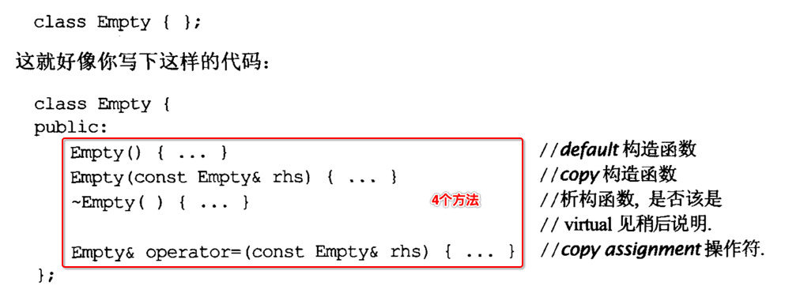

注意: 如何自己添加任何形式的 **构造方法** ， 那么 C++ 编译器 **不再** 添加 **默认的构造方法**。


## 4. 构造方法、拷贝构造方法、赋值运算方法

```c++
#include <iostream>
#include <string>

class Animal {
private:
  int age;
  std::string name;
  
public:
  // 无参 构造
  Animal(){std::cout << "Animal(): " << this << std::endl;}

  // 析构
  ~Animal(){std::cout << "~Animal(): " << this << std::endl;}
  
  // 有参 构造
  Animal(int _age, std::string _name):age(_age), name(_name) {
    std::cout << "Animal(int, std::string): " << this << std::endl;
  }
  
  // 拷贝 构造
  Animal(const Animal& other) {
    age = other.age;
    name = other.name;
    std::cout << "Animal(const Animal& other): " << this << std::endl;
  }

  // = 赋值运算
  const Animal& operator=(const Animal& other) {
    std::cout << "const Animal& operator=(const Animal& other): " << this << std::endl;
    age = other.age;
    name = other.name;
    return *this;
  }
  
  // == 运算符重载
  bool operator==(const Animal& other) {
    std::cout << "bool operator==(const Animal& other): " << this << std::endl;
    if (this != &other) return false;
    if (age != other.age) return false;
    if (name != other.name) return false;
    return false;
  }
};

int main(int argc, char const *argv[])
{
  std::cout << "--------------- 1 -------------" << std::endl;

  {
    Animal a1;
    Animal a2(99, "Dog");
  }

  std::cout << "--------------- 2 -------------" << std::endl;

  {
    Animal* a1 = new Animal;
    Animal* a2 = new Animal(99, "Dog");

    delete a1;
    delete a2;
  }

  std::cout << "--------------- 3 -------------" << std::endl;

  {
    Animal a1(99, "Dog");
    Animal a2;
    a1 = a2;
  }

  std::cout << "--------------- 4 -------------" << std::endl;

  {
    Animal a1(99, "Dog");
    Animal a2 = a1;
  }

  std::cout << "--------------- 5 -------------" << std::endl;
}
```

```
 ~/Desktop/main  make lan=c++
g++ main.cpp
./a.out
--------------- 1 -------------
Animal(): 0x7ffee28caf40
Animal(int, std::string): 0x7ffee28caf20
~Animal(): 0x7ffee28caf20
~Animal(): 0x7ffee28caf40
--------------- 2 -------------
Animal(): 0x7fbcbac02c90
Animal(int, std::string): 0x7fbcbac02cb0
~Animal(): 0x7fbcbac02c90
~Animal(): 0x7fbcbac02cb0
--------------- 3 -------------
Animal(int, std::string): 0x7ffee28caea8
Animal(): 0x7ffee28cae70
const Animal& operator=(const Animal& other): 0x7ffee28caea8
~Animal(): 0x7ffee28cae70
~Animal(): 0x7ffee28caea8
--------------- 4 -------------
Animal(int, std::string): 0x7ffee28cae50
Animal(const Animal& other): 0x7ffee28cae18
~Animal(): 0x7ffee28cae18
~Animal(): 0x7ffee28cae50
--------------- 5 -------------
```

可以很清楚的看到 **这三种方法** 的调用时机。


## 5. 禁止 编译器 生成默认的方法实现

### 1. C++ 11之前的做法

```c++
#include <iostream>
#include <string>

class Animal {
private:
  int age;
  std::string name;
  
public:
  // 无参 构造
  Animal(){std::cout << "Animal(): " << this << std::endl;}

  // 析构
  ~Animal(){std::cout << "~Animal(): " << this << std::endl;}
  
  // 有参 构造
  Animal(int _age, std::string _name):age(_age), name(_name) {
    std::cout << "Animal(int, std::string): " << this << std::endl;
  }
  
  /**
   * 将不想让编译器生成默认实现的方法的【声明】，
   * 放到 private 成员区域内即可
   */
private:
  // 拷贝构造
  Animal(const Animal& other);

  // = 赋值运算
  const Animal& operator=(const Animal& other);
  
  // == 运算符重载
  bool operator==(const Animal& other);
};

int main(int argc, char const *argv[])
{
  // ok
  {
    Animal a1(99, "Dog");
    Animal a2;
  }

  // error
  {
    Animal a1(99, "Dog");
    Animal a2(a1);
  }

  // error
  {
    Animal a1(99, "Dog");
    Animal a2;
    a1 = a2;
  }

  // error
  {
    Animal a1(99, "Dog");
    Animal a2(100, "Monkey");
    a1 == a2;
  }
}
```

编译报错如下，**找不到方法** :

```c
 ~/Desktop/main  g++ main.cpp
main.cpp:47:12: error: calling a private constructor of class 'Animal'
    Animal a2(a1);
           ^
main.cpp:27:3: note: declared private here
  Animal(const Animal& other);
  ^
main.cpp:54:8: error: 'operator=' is a private member of 'Animal'
    a1 = a2;
    ~~ ^ ~~
main.cpp:30:17: note: declared private here
  const Animal& operator=(const Animal& other);
                ^
main.cpp:61:8: error: 'operator==' is a private member of 'Animal'
    a1 == a2;
    ~~ ^  ~~
main.cpp:33:8: note: declared private here
  bool operator==(const Animal& other);
       ^
main.cpp:61:8: warning: equality comparison result unused [-Wunused-comparison]
    a1 == a2;
    ~~~^~~~~
main.cpp:61:8: note: use '=' to turn this equality comparison into an assignment
    a1 == a2;
       ^~
       =
1 warning and 3 errors generated.
```

### 2. C++ 11 做法

```c++
class Animal {
private:
  int age;
  std::string name;
  
public:
  // 无参 构造
  Animal(){std::cout << "Animal(): " << this << std::endl;}

  // 析构
  ~Animal(){std::cout << "~Animal(): " << this << std::endl;}
  
  // 有参 构造
  Animal(int _age, std::string _name):age(_age), name(_name) {
    std::cout << "Animal(int, std::string): " << this << std::endl;
  }
  
  // 拷贝构造
  Animal(const Animal& other) = delete;

  // = 赋值运算
  const Animal& operator=(const Animal& other) = delete;
  
  // == 运算符重载
  bool operator==(const Animal& other) = delete;
};
```

直接在方法身后面的后面，加上 **delete** 关键字即可。

### 3. 兼容2个版本的 C++ 编译器

```c++
class Animal {
private:
  int age;
  std::string name;
  
public:
  // 无参 构造
  Animal(){std::cout << "Animal(): " << this << std::endl;}

  // 析构
  ~Animal(){std::cout << "~Animal(): " << this << std::endl;}
  
  // 有参 构造
  Animal(int _age, std::string _name):age(_age), name(_name) {
    std::cout << "Animal(int, std::string): " << this << std::endl;
  }
  
#if defined(__GXX_EXPERIMENTAL_CXX0X__) && (__cplusplus >= 201103L)
  // 拷贝构造
  Animal(const Animal& other) = delete;

  // = 赋值运算
  const Animal& operator=(const Animal& other) = delete;
  
  // == 运算符重载
  bool operator==(const Animal& other) = delete;
#else
private:
  // 拷贝构造
  Animal(const Animal& other);

  // = 赋值运算
  const Animal& operator=(const Animal& other);
  
  // == 运算符重载
  bool operator==(const Animal& other);
#endif  
};
```

### 4. 类似 boost 提供一个 base 类

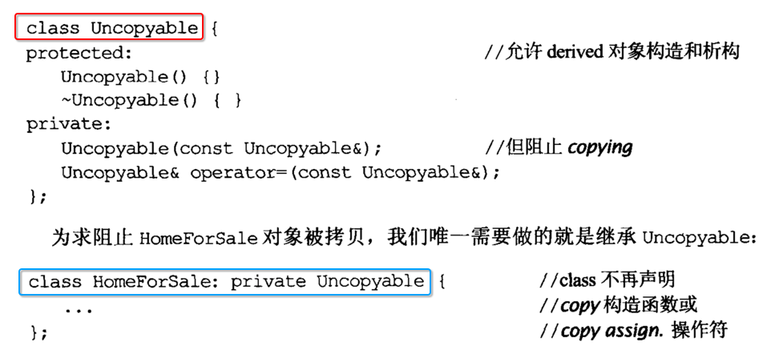


## 6. 必须使用 virtual 修饰 多态 base 类d的 析构方法

```c++
#include <iostream>
using namespace std;

class Father
{
public:

  Father(){
    cout << "Father()" << endl;
  }
  
  ~Father(){
    cout << "~Father()" << endl;
  } 
};

class Son : public Father
{
public:
  
  Son(){
    cout << "Son()" << endl;
  }
  
  ~Son(){
    cout << "~Son()" << endl;
  }
};

int main(int argc, const char * argv[]) 
{  
  {
    // 子类对象
    Son* p = new Son;

    // 使用【父类指针】指向【子类对象】
    Father* pp = dynamic_cast<Father*>(p);

    // 对【父类】类型的指针变量进行释放
    delete pp;
  }
}
```

```
->  make
g++ main.cpp -std=c++11
->  ./a.out
Father()
Son()
~Father()
->
```

最终执行的 并不是 **子类对象** 析构函数，这就有问题了。

### 2. 必须将【父类 - 析构函数】修饰为【虚函数】

```c++
class Father
{
public:

  Father(){
    cout << "Father()" << endl;
  }
  
  // 将【父类】的析构函数，使用【virtual】修饰为【虚函数】，来开启【析构函数】多态性
  virtual ~Father(){
    cout << "~Father()" << endl;
  } 
};
```

- 这样当 `delete pp` 时，就会根据 pp 指向的内存中，查找对应的 **析构方法**
- 而不是只静态的根据 `pp 指向的类型` 中查找 **析构方法**

### 3. 进阶为【纯】虚析构方法

```c++
#include <iostream>
#include <string>

class Father
{
public:

  Father(){
    std::cout << "Father()" << std::endl;
  }
  
  // 纯虚析构方法
  virtual ~Father() = 0;
};

Father::~Father() {
  std::cout << "~Father()" << std::endl;
} 

int main(int argc, char const *argv[])
{
}
```

注意: **纯虚析构方法** 是唯一当方法为 **virtual** 修饰为虚范法规时，必须在 class 外部实现的 **一种特例**。


## 7. 禁止在【构造方法】和【析构方法】中调用【virtual 虚方法】

- 1、virtual 实现多态时，对于每一个多态对象，都有自己专属的 **虚函数表**
- 2、而 **虚函数表** 在 **构造方法** 执行时，还没有 **完成** 创建
- 3、 同理在 **析构方法** 执行时，很可能对象的 **虚函数表** 已经被废弃


## 8. class#operator=() 

### 1. 返回 `*this` 引用

```c++
#include <iostream>
#include <string>

class Animal {
private:
  int age;
  std::string name;
  
public:
  // 无参 构造
  Animal(){std::cout << "Animal(): " << this << std::endl;}

  // 析构
  ~Animal(){std::cout << "~Animal(): " << this << std::endl;}
  
  // 有参 构造
  Animal(int _age, std::string _name):age(_age), name(_name) {
    std::cout << "Animal(int, std::string): " << this << std::endl;
  }
  
  // 拷贝 构造
  Animal(const Animal& other) {
    age = other.age;
    name = other.name;
    std::cout << "Animal(const Animal& other): " << this << std::endl;
  }

  // 左值类型的 = 赋值运算
  const Animal& operator=(const Animal& other) {
    std::cout << "const Animal& operator=(const Animal& other): " << this << std::endl;
    age = other.age;
    name = other.name;
    return *this;
  }

  // 右值类型的 = 赋值运算
  const Animal& operator=(Animal&& other) {
    std::cout << "const Animal& operator=(Animal&& other): " << this << std::endl;
    age = other.age;
    name = other.name;
    return *this;
  }
};

int main(int argc, char const *argv[])
{
  {
    Animal a1(99, "Dog");
    Animal a2;
    a2 = a1;
  }

  std::cout << "-------------------------" << std::endl;

  {
    Animal a2;
    a2 = Animal(99, "Dog");
  }
}
```

```
 ~/Desktop/main  make lan=c++ ver=c++11
g++ main.cpp  -std=c++11
./a.out
Animal(int, std::string): 0x7ffee2db8000
Animal(): 0x7ffee2db7fb8
const Animal& operator=(const Animal& other): 0x7ffee2db7fb8
~Animal(): 0x7ffee2db7fb8
~Animal(): 0x7ffee2db8000
-------------------------
Animal(): 0x7ffee2db7f98
Animal(int, std::string): 0x7ffee2db7f78
const Animal& operator=(Animal&& other): 0x7ffee2db7f98
~Animal(): 0x7ffee2db7f78
~Animal(): 0x7ffee2db7f98
```

### 2. 防止对自己拷贝

```c++
#include <iostream>
#include <string>

class Animal {
private:
  int age;
  std::string name;
  
public:
  // 无参 构造
  Animal(){std::cout << "Animal(): " << this << std::endl;}

  // 析构
  ~Animal(){std::cout << "~Animal(): " << this << std::endl;}
  
  // 有参 构造
  Animal(int _age, std::string _name):age(_age), name(_name) {
    std::cout << "Animal(int, std::string): " << this << std::endl;
  }
  
  // 拷贝 构造
  Animal(const Animal& other) {
    age = other.age;
    name = other.name;
    std::cout << "Animal(const Animal& other): " << this << std::endl;
  }

  // 左值类型的 = 赋值运算
  const Animal& operator=(const Animal& other) {
    if (this == &other)
      return *this;

    std::cout << "const Animal& operator=(const Animal& other): " << this << std::endl;
    age = other.age;
    name = other.name;
    return *this;
  }
};

int main(int argc, char const *argv[])
{
  {
    Animal a1(99, "Dog");
    a1 = a1;
  }
}
```

```
 ~/Desktop/main  make lan=c++ ver=c++11
g++ main.cpp  -std=c++11
./a.out
Animal(int, std::string): 0x7ffeee240058
~Animal(): 0x7ffeee240058
```

并没有执行 `operator=()` 

### 3. 继承环境下的拷贝

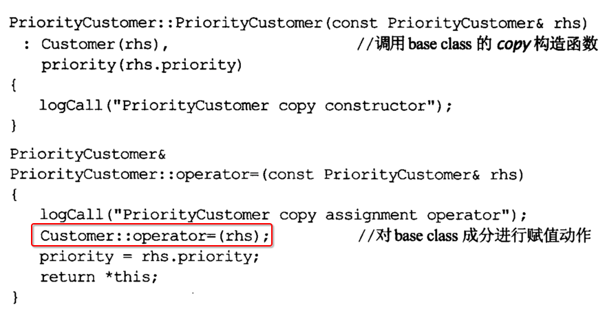


## 9. C++ 内存管理

### 1. std 标准库

- 1) std::auto_ptr
- 2) std::unique_ptr
- 3) std::shared_ptr
- 4) std::weak_ptr

### 2. boost 三方库

- 1) boost::scoped_ptr
- 2) boost::shared_ptr
- 3) boost::weak_ptr
- 4) boost::pool
- 5) boost::factory


## 10. 一个实体类的写法

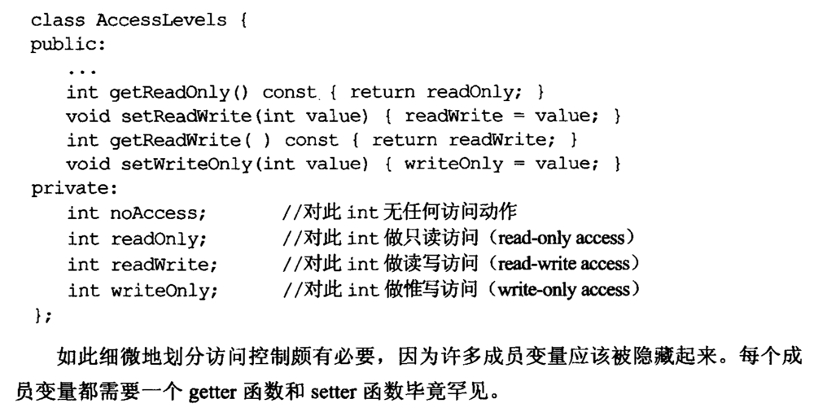


## 11. non-member 方法 + namespace 扩展性

### 1. 核心功能

```c++
namespace WebBrowserStuff {
  // 实体类
  class WebBrowser { ... }; 

  // 非对象成员方法，提供操作实体类的方法
  void openBrowser(WebBrowser* b);
  void closeBrowser(WebBrowser* b);
}
```

### 2. 扩展 1

```c++
namespace WebBrowserStuff {
  // 扩展【书签】模块功能
  void addBookmark(WebBrowser* b);
  void removeBookmark(WebBrowser* b);
}
```

### 3. 扩展 2


```c++
namespace WebBrowserStuff {
  // 扩展【cookie】模块功能
  void addCookie(WebBrowser* b);
  void removeCookie(WebBrowser* b);
}
```


## 12. 运算符方法

### 1. 在【class 内部】添加 运算符重载方法

```c++
#include <iostream>
#include <string>

class Box {
private:
  int w;
  int h;
  
public:
  ~Box() {}
  
  Box() {}
  Box(int _w, int _h): w(_w), h(_h) {}
  
  const Box operator*(const Box& o) const {
    Box b;
    b.w = w * o.w;
    b.h = h * o.h;
    return b;
  }
};

int main(int argc, char const *argv[])
{
  Box b1(1,2);
  Box b2(3,4);

  Box b3 = b1 * b2; // ok
  Box b4 = b2 * b1; // ok
}
```


### 2. 修改 运算符重载方法【参数类型】

```c++
#include <iostream>
#include <string>

class Box {
private:
  int w;
  int h;
  
public:
  ~Box() {}
  
  Box() {}
  Box(int _w, int _h): w(_w), h(_h) {}
  
  const Box operator*(const Box& o) const {
    Box b;
    b.w = w * o.w;
    b.h = h * o.h;
    return b;
  }
};

int main(int argc, char const *argv[])
{
  Box b1(1,2);
  Box b2(3,4);

  Box b3 = b1 * 2; // error
}
```

```
 ~/Desktop/main  g++ main.cpp
main.cpp:28:15: error: invalid operands to binary expression ('Box' and 'int')
  Box b3 = b1 * 2; // error
           ~~ ^ ~
main.cpp:15:13: note: candidate function not viable: no known conversion from 'int' to 'const Box' for 1st argument
  const Box operator*(const Box& o) const {
            ^
1 error generated.
```

### 3. 继续在【class 内部】添加 运算符重载方法，应对新的参数

```c++
#include <iostream>
#include <string>

class Box {
private:
  int w;
  int h;
  
public:
  ~Box() {}
  
  Box() {}
  Box(int _w, int _h): w(_w), h(_h) {}
  
  const Box operator*(const Box& o) const {
    Box b;
    b.w = w * o.w;
    b.h = h * o.h;
    return b;
  }

  // 新增
  const Box operator*(int padding) const {
    Box b;
    b.w = w * padding;
    b.h = h * padding;
    return b;
  }
};

int main(int argc, char const *argv[])
{
  Box b1(1,2);
  Box b2(3,4);

  Box b3 = b1 * 2; // ok
}
```

### 4. 但是无法重载【左操作数】为【基本类型】情况

```c++
#include <iostream>
#include <string>

class Box {
private:
  int w;
  int h;
  
public:
  ~Box() {}
  
  Box() {}
  Box(int _w, int _h): w(_w), h(_h) {}
  
  const Box operator*(const Box& o) const {
    Box b;
    b.w = w * o.w;
    b.h = h * o.h;
    return b;
  }

  const Box operator*(int padding) const {
    Box b;
    b.w = w * padding;
    b.h = h * padding;
    return b;
  }
};

int main(int argc, char const *argv[])
{
  Box b1(1,2);
  Box b2(3,4);

  Box b3 = 2 * b1; // error
}
```

```
 ~/Desktop/main  g++ main.cpp
main.cpp:35:14: error: invalid operands to binary expression ('int' and 'Box')
  Box b3 = 2 * b1; // error
           ~ ^ ~~
1 error generated.
```

- 这样不太可能继续在 **class 类中** 继续添加 **运算符重载方法** 
- 因为 `2 * b1` 就必须形成 `2.operator(b1)` , 显然是 **不可能** 的

### 5. 全局 C++ 运算符重载函数，支持【基本类型】参数

```c++
#include <iostream>
#include <string>

class Box {
private:
  int w;
  int h;
  
public:
  ~Box() {}
  
  Box() {}
  Box(int _w, int _h): w(_w), h(_h) {}
};

// 【全局】C++ 运算符重载方法
const Box operator*(int padding, const Box& o) const {
  Box b;
  b.w = padding * o.w;
  b.h = padding * o.h;
  return b;
}

int main(int argc, char const *argv[])
{
  Box b1(1,2);
  Box b2(3,4);

  Box b3 = 2 * b1; // error
}
```

编译报错

```c
 ~/Desktop/main  g++ main.cpp
main.cpp:17:48: error: non-member function cannot have 'const' qualifier
const Box operator*(int padding, const Box& o) const {
                                               ^~~~~~
main.cpp:19:5: error: 'w' is a private member of 'Box'
  b.w = padding * o.w;
    ^
main.cpp:6:7: note: declared private here
  int w;
      ^
main.cpp:19:21: error: 'w' is a private member of 'Box'
  b.w = padding * o.w;
                    ^
main.cpp:6:7: note: declared private here
  int w;
      ^
main.cpp:20:5: error: 'h' is a private member of 'Box'
  b.h = padding * o.h;
    ^
main.cpp:7:7: note: declared private here
  int h;
      ^
main.cpp:20:21: error: 'h' is a private member of 'Box'
  b.h = padding * o.h;
                    ^
main.cpp:7:7: note: declared private here
  int h;
      ^
5 errors generated.
```

因为 class 成员是 **private** ，所以在 **class 外部** 不能直接访问。

### 6. 进阶为 全局 C++【友元】运算符重载函数

```c++
#include <iostream>
#include <string>

class Box {
private:
  int w;
  int h;
  
public:
  ~Box() {}
  
  Box() {}
  Box(int _w, int _h): w(_w), h(_h) {}

  // 友元方法
#if 0
  // 注意: 友元是【外部】【全局方法】，并不是【成员方法】所以不能【末尾】使用【const】
  friend const Box operator*(int padding, const Box& o) const;
#else
  friend const Box operator*(int padding, const Box& o);
#endif
};

// 【全局】C++ 运算符重载方法
const Box operator*(int padding, const Box& o) {
  Box b;
  b.w = padding * o.w;
  b.h = padding * o.h;
  return b;
}

int main(int argc, char const *argv[])
{
  Box b1(1,2);
  Box b2(3,4);

  Box b3 = 2 * b1; // ok
}
```


## 13. inline 方法（函数）

### 1. 类成员方法，可能会被隐式声明为 inline 

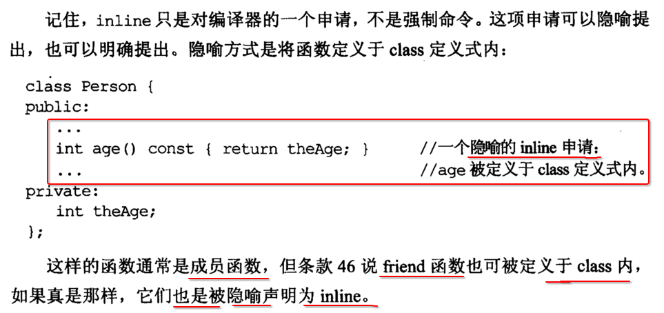

### 2. inline template

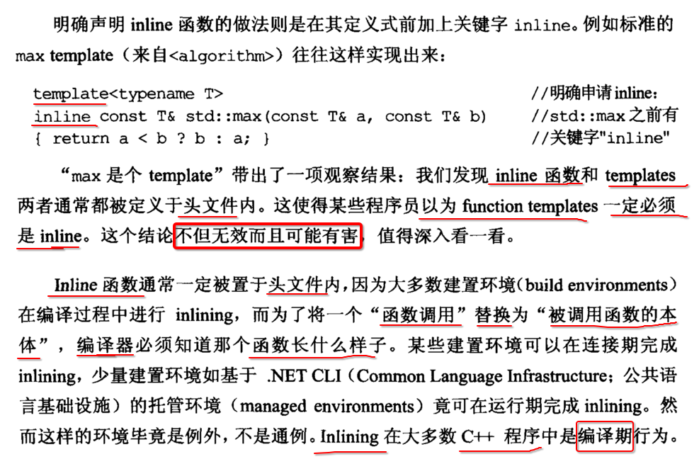

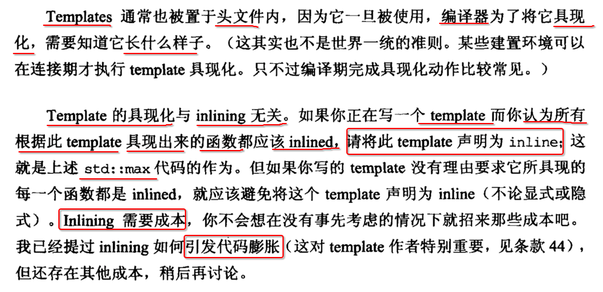

### 3. 函数指针 指向一个 inline 函数时

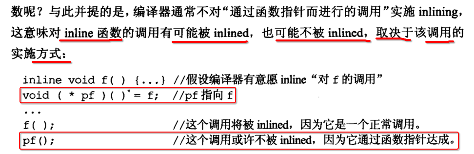

### 4. inline 方法（函数）修改时，任何依赖的 xx.o 都必须【重新编译】

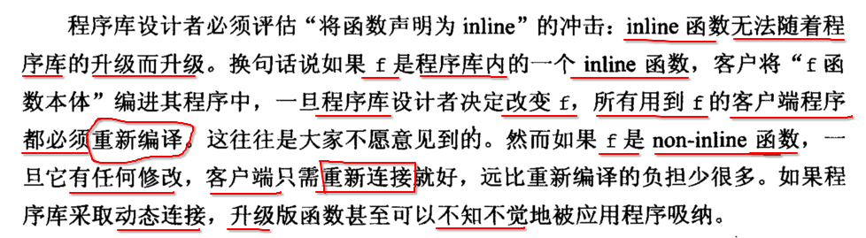

- 假设 **main.o** 依赖一个 **inline 方法（函数）**
- 而当这个 inline 方法（函数）**被修改** 时
- 必须 **重新编译 main.c** , 重新生成 **main.o**


## 14. 降低文件之间的【编译依赖】

### 1. 依赖具体文件，形成【连串编译】

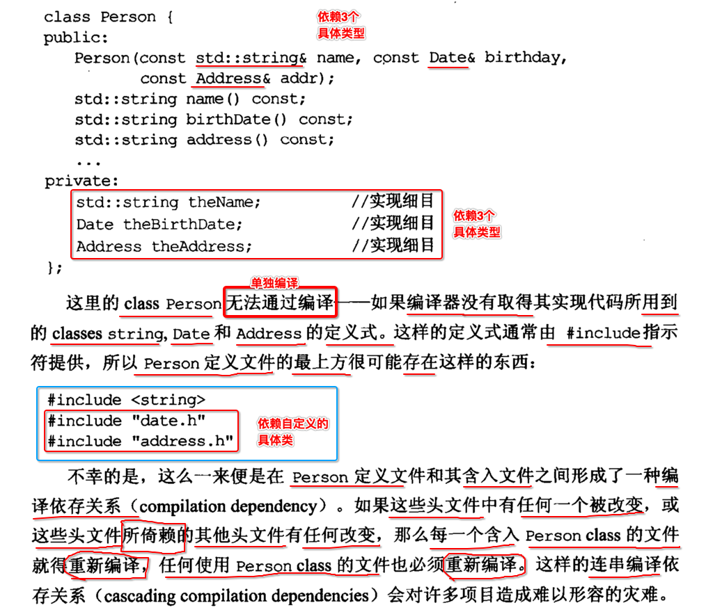

任何形式的改动，都会造成一系列文件 **重新编译** :

- 1、person.h 文件中 **包含** 进来的 **date.h、address.h** 修改
- 2、**date.h、address.h** 内部自己依赖的 **其他的 xx.h**
- 3、使用 **person.h** 其他的文件

### 2. 降低 编译依赖

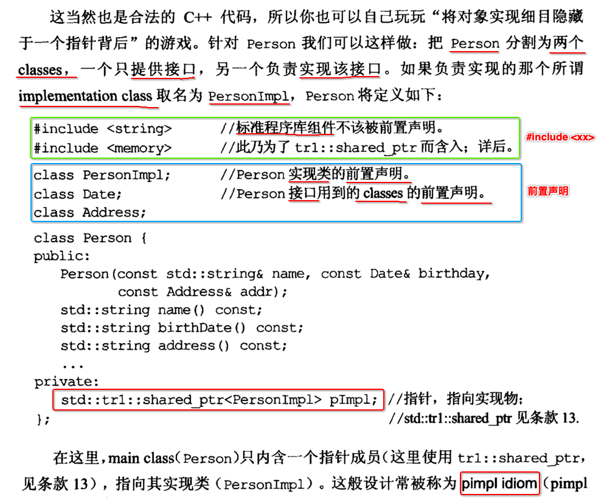

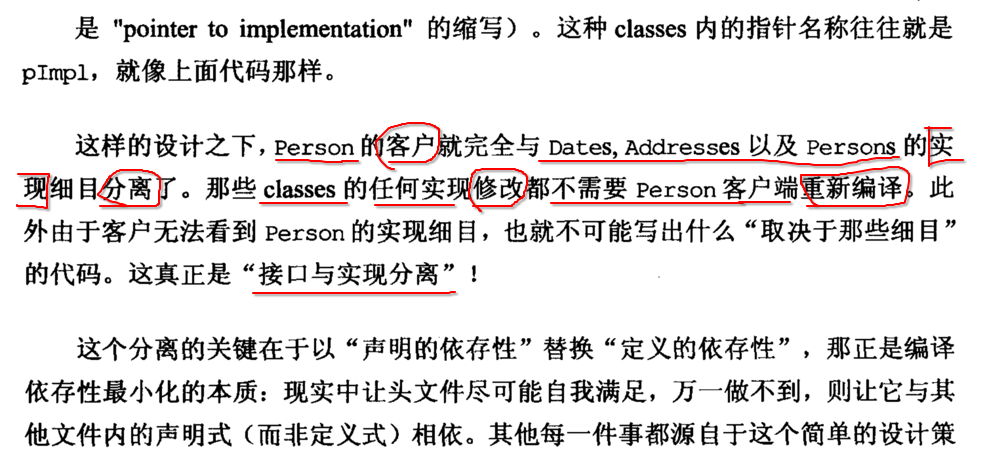

----

对于一个 xx.h 标准写法原则:

- 1) 对于 **c++ 标准库** 直接使用  `#include <c++ 标准库>` ，因为 **c++ 标准库** 不太可能成员 编译瓶颈
- 2) 对于 **用户自定义的具体类** 使用`class 类名` 只是 **向前声明** ，告诉编译器有这么个东西，但不需要编译去关心

这样的优点是，当依赖的 **Date.h、Address.h** 这些 **具体类的 xx.h** 被修改时，不会造成 **当前类.cpp** 重新编译生成新的 **目标文件**。

### 3. c++ 抽象接口写法

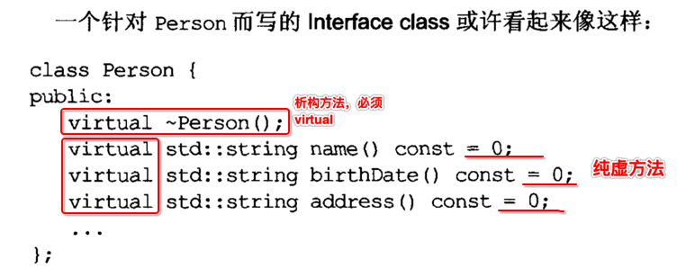

### 4. 工厂方法 create() 声明

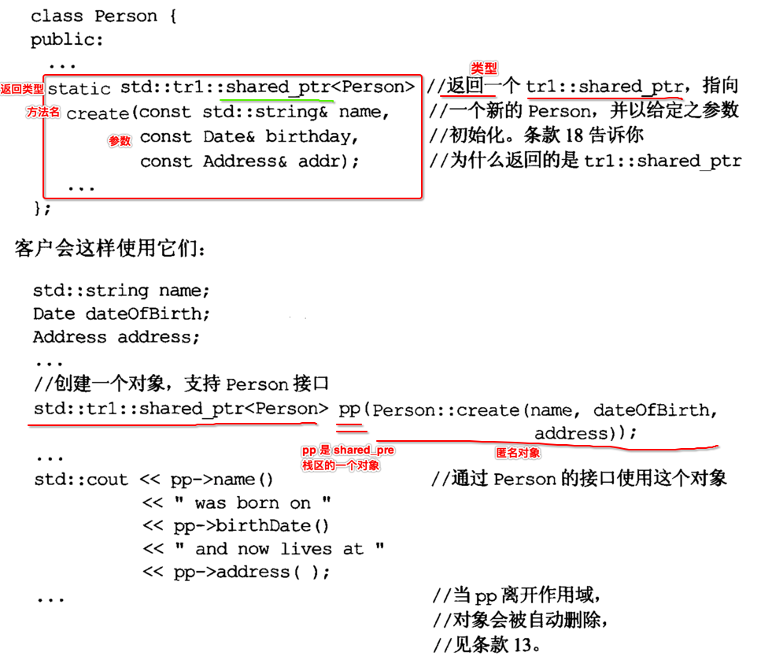

### 5. 接口实现类

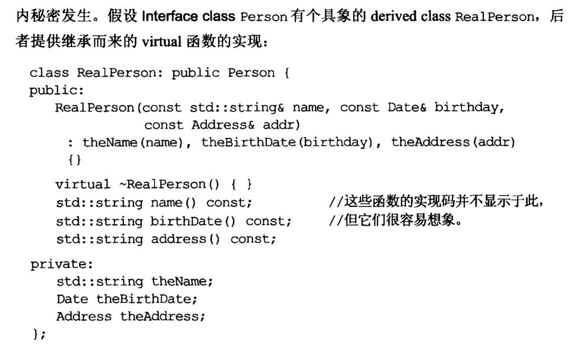

### 6. 工厂方法 create() 实现

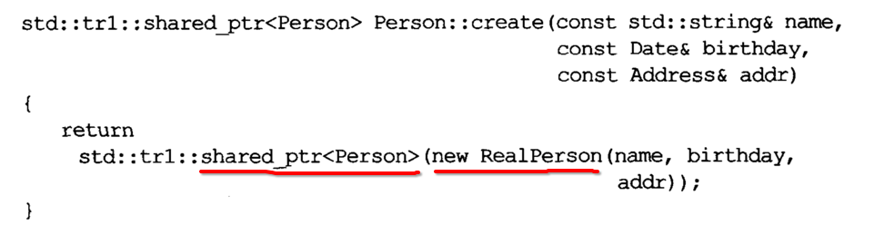


## 15. is-a 关系，使用【public 继承】

### 1. 不太好的 public 继承

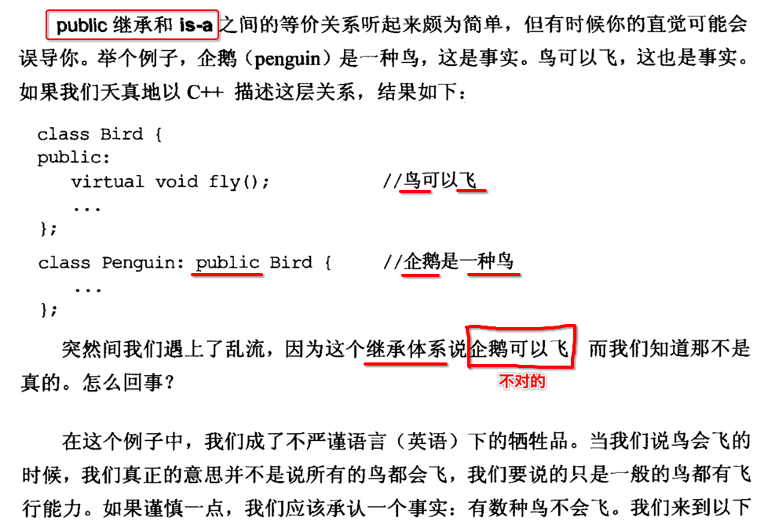

### 2. 改进后的 继承体系

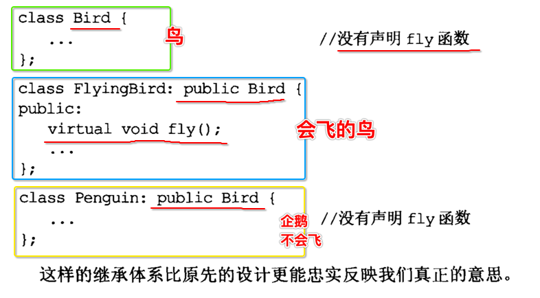

### 3. 结论

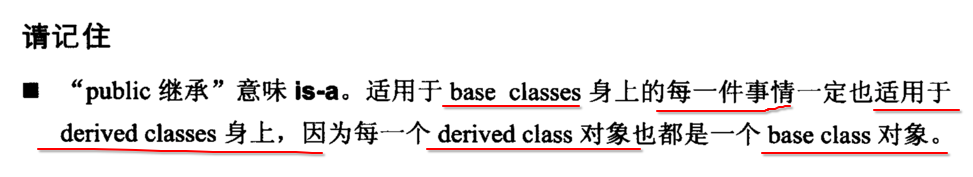


## 16. 不要【覆盖】继承过来的 non-virtual 成员方法

### 1. 默认子类会 覆盖 父类 同名符号

```c++
#include <iostream>
using namespace std;

class Father
{
public:
  Father() {}
  void run(){cout << "Father run" << endl;}
};

class Son : public Father
{
public:
  Son(){}

  // 子类默认是【覆盖】父类的同名方法实现，而并没有多态的效果
  void run(){cout << "Son run" << endl;} 
};

int main()
{    
  Father* p = dynamic_cast<Father*>(new Son);//父类类型指针，接收子类对象
  p->run();
  delete p;
}
```

```
->  make
g++ main.cpp
->  ./a.out
Father run
->
```

### 2. 显示调用父类成员方法

```c
子类对象.父类::func();
```

```c++
#include <iostream>
using namespace std;

class Father
{
public:
  Father() {}
  void run(){
    cout << "Father::run()" << endl;
  }
};

class Son : public Father
{
public:
  Son() {}
  void run(){
    Father::run();//1. 手动调用父类的同名方法
    cout << "Son::run()" << endl;//2. 再执行子类自己的覆盖逻辑
  }
};

int main(int argc, const char * argv[])
{    
  {
    Son s;
    s.run();
    cout << "---------------------" << endl;
    s.Father::run();
  }
}
```

```
->  make lan=c++
g++ main.cpp
./a.out
Father::run()
Son::run()
---------------------
Father::run()
->
```


## 17. 不要【覆盖】继承过来的 non-virtual 成员方法的【缺省参数值】

### 1. 父类 virtual 方法带有【缺省参数值】

```c++
class Shape
{
public:
  enum ShapeColor {Red, Green, Blue};

  virtual drawColor(ShapeColor color = Red) const;
};
```

### 2. 错误: 子类 override virtual 方法时【改变】【缺省参数值】

```c++
class Rectangle : public Shape
{
public:
  // 将方法的【缺省参数值】修改为【Blue】
  virtual drawColor(ShapeColor color = Blue) const;
};
```


## 18. 不想 继承 base class 某一个方法

```c++
#include <iostream>
#include <string>

class Father
{
public:
  virtual void run() = 0;
  virtual void sleep() = 0;
};

class Son : public Father
{
public:
  /**
   * 不想 继承 base class run()
   */
  void run() {
    Father::run(); // 调用父类的【纯虚方法】，因为【没有实现】，所以会【编译报错】
  }

  void sleep() {
    std::cout << "Son sleep" << std::endl;
  }
};

int main(int argc, char const *argv[])
{
  Son s; // 这里就会【编译】报错
}
```

```c++
 ~/Desktop/main  g++ main.cpp
Undefined symbols for architecture x86_64:
  "Father::run()", referenced from:
      Son::run() in main-fb919f.o
ld: symbol(s) not found for architecture x86_64
clang: error: linker command failed with exit code 1 (use -v to see invocation)
```

只要 **引用** Son 这个类，就会 **编译** 报错。


## 19. C++ 中的【接口】

```c++
class People
{
public:
  // 1、【析构】多态方法
  virtual ~People() = 0;

  // 2、【功能】多态方法
  virtual void run() = 0;
  virtual void sleep() = 0;
};

// 3、【纯虚析构】方法，必须在【类外】实现
People::~People(){}
```


## 20.【接口 继承】与【实现 继承】

### 1. 非虚函数 (non-virtual)

- 继承【接口】、继承【实现】 
- 强制提供给【派生类】的方法实现
- 子类如果出现【同名】方法，则会被【覆盖】，所以【不允许】出现
- 即 必须使用 **父类** 的方法实现

```c++
class People
{
public:
  void run(){}
};
```

### 2. 虚函数

- 继承【接口】、继承【实现】 
- **派生类** 可以 **覆写(override)** 做自己的定制实现
- **派生类** 也可以使用 **默认** 方法实现

```c++
class People
{
public:
  virtual void run(){}
};
```

### 3. 纯虚函数

- 只继承【接口】
- 派生类 **必须实现** 纯虚函数，否则 **不能实例化**

```c++
class People
{
public:
  virtual void run() = 0;
};
```

### 4. 总结

```c++
class Shape
{
public:
  // 1、纯虚函数 => 只继承到【接口】
  virtual void draw() = 0;

  // 2、虚函数 => 继承到【接口】与【默认】【实现】
  virtual void error(const std::string& err) {
    std::cout << msg << std::endl;
  }

  // 3、非虚函数 => 继承到【接口】与【强制】【实现】
  int objectID() const {
    return 1;
  };
};
```


## 21. 多重继承 -- 菱形继承

### 1. 造成【二义性】错误代码

```c++
#include <iostream>
#include <string>
using namespace std;

class Human
{
public:
  int a;// 4字节

  void run()
  {
    cout << "Human" << endl;
  }
};

class Woman : public Human
{
public:
  int b; // 4字节

  void run1()
  {
    cout << "Woman" << endl;
  }
};

class Man : public Human
{
public:
  int c; // 4字节

  void run2()
  {
    cout << "Man" << endl;
  }
};

class RenYao : public Woman, public Man
{
public:
  int d; // 4字节
  RenYao(int _d)
  {
    d = _d;
  }
};

int main()
{
  RenYao ry(1);
  ry.run(); // 编译器不知道从【Women 类】还是从【Man 类】中查找 run()
}
```

编译阶段报错

```
 ~/Desktop/main  g++ -c main.cpp
main.cpp:51:6: error: non-static member 'run' found in multiple base-class subobjects of type 'Human':
    class RenYao -> class Woman -> class Human
    class RenYao -> class Man -> class Human
  ry.run(); // 编译器不知道从【Women 类】还是从【Man 类】中查找 run()
     ^
main.cpp:10:8: note: member found by ambiguous name lookup
  void run()
       ^
1 error generated.
```

### 2. 【虚继承】解决【二义性】

```c++
#include <iostream>
#include <string>
using namespace std;

class Human
{
public:
  int a;// 4字节

  void run()
  {
    cout << "Human" << endl;
  }
};

class Woman : virtual public Human
{
public:
  int b; // 4字节

  void run1()
  {
    cout << "Woman" << endl;
  }
};

class Man : virtual public Human
{
public:
  int c; // 4字节

  void run2()
  {
    cout << "Man" << endl;
  }
};

class RenYao : public Woman, public Man
{
public:
  int d; // 4字节
  RenYao(int _d)
  {
    d = _d;
  }
};

int main()
{
  RenYao ry(1);
  ry.run(); // 编译器不知道从【Women 类】还是从【Man 类】中查找 run()
}
```

```
 ~/Desktop/main  g++ -c main.cpp
 ~/Desktop/main  g++ main.o
 ~/Desktop/main  ./a.out
Human
```

### 3. 虚继承 与 虚函数

二者 **没有任何** 关系。


## 22. 虚继承 vs 继承

| 继承                 | 虚继承                        |
| -------------------- | ----------------------------- |
| class A : pubic B    | class A : **virtual** pubic B |
| B **is** A           | B **has** A                   |
| 编译期 - 代码 - 拷贝 	 | 运行时 - 对象 - 组合          |


## 23. typename 两种用途

### 1. 指定【参数】是 template 模板参数

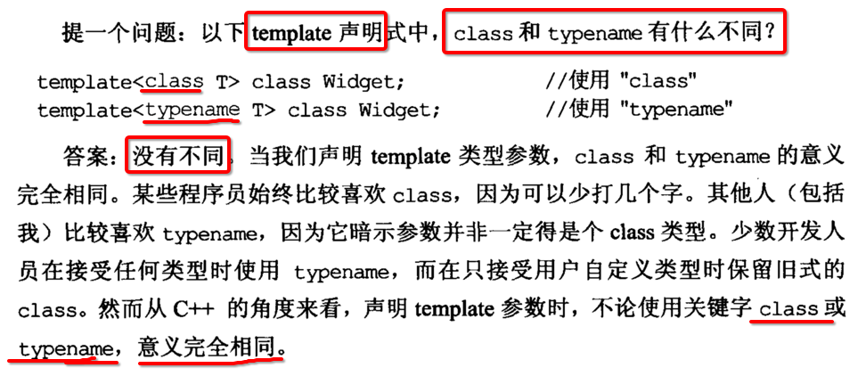

结论: 此时的 class 关键字 与 typename 关键字 完全等价。

- 1、在 **C++ 标准** 还 **没有统一** 时，很多 **旧的编译器**  都是用 **class** 关键字，来声明 **模板参数**
- 2、因为那时 C++ 并没有 **typename** 关键字
- 3、一些很早的 C++ 书籍上会告诉注意事项，如果使用 **typename** 时编译器报错的话，那么换成 **class** 即可
- 4、这里的 class 和 **定义类时** 使用的 class 完全是 **两回事**，C++ 当时就是为了 **减少关键字**，才使用了 **class**
- 5、但最终却 **不得不** 引入了 **typename**

### 2. 指定为【数据类型】时必须使用 typename

```c++
template <typename T>
void print(
  T x, 
  typename enable_if<is_integral<T>::value>::type* = 0 // 必须使用 typename 声明 enable_if<is_integral<T>::value>::type 是一个数据类型
){
  // ....
}
```


## 24. new_handler

```c++
void MyOutOfMemory()
{
  cout << "Out of memory error!" << endl;
  abort();
}

int main()
{
  set_new_handler(MyOutOfMemory);
  int *verybigmemory = new int[0x1fffffff];
  delete verybigmemory;
}
```

- 1) 在 new 之前，设置一个 **callback handler**
- 2) 当执行 delete 释放对象时，会触发调用 **callback handler**


