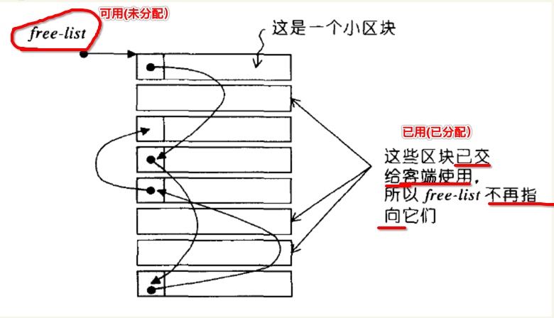

[TOC]


## 1.【标准】STL 容器

### 1. ==线性/序列== 容器

| 容器        | 容器名称      | 迭代器类型      | 适用情况                      |
| :---------- | :------------ | :-------------- | ----------------------------- |
| std::string | C++ 字符串    | 随机 ramdom     | 字符串操作                    |
| std::vector | **可变数组**  | 随机 ramdom     | 常用数组结构，适用于 **查找** |
| std::list   | 双向 **链表** | **双向** double | 任意位置 **删除、插入** 元素  |
| std::deque  | 双向 **队列** | 随机 ramdom     | **尾部** 追加，**头部** 删除  |

### 2. ==关联== 类型容器（set、map）

#### 1. 容器元素【有序】排列

- 1、**关联** 类型容器
- 2、**insert()** 默认会对 **插入的元素**  自动进行 **排序**
- 3、 **容器** 会自己 **找到合适** 的插入位置，然后进行插入

| 容器                  | 容器描述                                   | 特点                              |
| :-------------------- | :----------------------------------------- | --------------------------------- |
| `std::set<T>`         | 内部使用 **二叉树排序数** 据就结构存储元素 | **不能** 存在 **多个相同** 的元素 |
| `std::multiset<T>`    | set 增强版                                 | **可以** 存在 **多个相同** 的元素 |
| `std::map<K, V>`      | **Key:value** 键值对存储                   | **不能** 存在多个 **相同的key**   |
| `std::multimap<K, V>` | map 增强版                                 | **可以** 存在多个 **相同的key**   |

#### 2. 容器元素【无序】排列

- 1、内部的 **数据结构** 与上面的 **有序** 版本的容器一样
- 2、唯一区别是 **不会** 对 **插入的元素** 进行 **排序**

| 容器                       | 容器描述                          |
| :------------------------- | :-------------------------------- |
| `std::unordered_set<T>`         | **不排序** 版本的 set 类模板      |
| `std::unordered_multiset<T>`    | **不排序** 版本的 multiset 类模板 |
| `std::unordered_map<K, V>`      | **不排序** 版本的 map 类模板      |
| `std::unordered_multimap<K, V>` | **不排序** 版本的 multimap 类模板 |

### 3. 各种 STL 标准容器 对比

#### 1. 图示


#### 2. string、vector、deque

- 1) 都属于 **随机读写** 容器内的元素
- 2) **元素读取** 效率是 **慢** 的
- 3) 但是元素的 **插入 或 删除** 效率比较 **低** 
- 4) **vector** (单端 - 数组) 容器元素 **只能** 限制在 **末尾** 进行 **追加**
- 5) **deque** (双端 - 数组) 容器元素 可以在 **头部** 和 **尾部**  进行 **插入**

#### 3. list

- 1) 虽然是 双向链表，但是需要 **从头至尾** 一个一个比较访问
- 2) list (双向链表) 可以在 **任意位置** **插入** 或 **删除** 元素
- 3) 元素 **读取** 效率是 **最慢** 的
- 4) 适用于经常 **插入** 或 **删除** 元素

#### 4. set、multiset

- 1) 内部都使用 **二叉树** 数据结构 **存储元素**

- 2) 元素 **读取** 效率是 **最高** 的
- 3) **不允许** 外接指定元素的 **插入位置** 

#### 5. map、multimap

- 1) 内部都使用 **二叉树** 数据结构 **存储元素** (同上)
- 2) 【map】key **不允许** 存在 **相同** 的，内部按照 **二叉搜索树** 存储，元素 **读取** 速度 **最高**
- 3) 【multimap】可以 **存在多个相同 key** ，所以 **key** 需要  **单向遍历** 
- 4) 同 set、multiset 都 **不允许** 外接指定元素的 **插入位置** (同上)

### 4. ==随机迭代== 容器选择

| 需求场景                          | STL 容器 |
| --------------------------------- | -------- |
| **字符串** 存储                   | string   |
| 容器 长度 **可变**                | vector   |
| 容器 长度 **不可变**              | array    |
| 面向 **数值计算** 的数组（C++11） | valarray |
| **两端** 增加 或 删除             | deque    |
| 只存储 **0 或 1** 状态值          | bitset (非 STL） |

### 5. ==插入与删除== 容器选择

| 需求场景                               | STL 容器          |
| -------------------------------------- | ----------------- |
| 可以在【任意位置】插入 或 删除         | list (双向链表)   |
| 【头部】和【尾部】【两端】插入 或 删除 | deque (双向队列)  |
| 【只允许】【尾部】插入 或 删除         | vector (单向数组) |

### 6. 要求 ==读取== 效率

#### 1. 元素 ==value== 形式

| 需求场景        | STL 容器 |
| --------------- | -------- |
| 元素 **不重复** | set      |
| 元素 **重复**   | multiset |

#### 2. 元素 ==key : value== 形式

| 需求场景                                    | STL 容器             |
| ------------------------------------------- | -------------------- |
| Key **不重复** ，对 插入元素 自动排序       | map                  |
| Key **重复** ，对 插入元素 自动排序         | multimap             |
| Key **不重复** ，**不对** 插入元素 自动排序 | `unordered_map`      |
| Key **重复** ，**不对** 插入元素 自动排序   | `unordered_multimap` |

### 7. ==队列== 数据结构

| 容器类型                 | 容器类型       | 数据结构   |
| ------------------------ | -------------- | ---------- |
| 标准 STL 容器            | deque          | 双向 队列  |
| 标准 STL 容器 **适配器** | queue          | 单向 队列  |
| 标准 STL 容器 **适配器** | priority_queue | 优先级队列 |

### 8. 检查 容器 ==是否空==

- 1、优先使用 **empty()** ，而不要使用 **size()**
- 2、**empty()** 访问的是容器的 **实例变量** 记录的值，消耗的是 **常数级** 的时间

```c++
if (容器.empty())
  return;
```


## 2.【非标准】STL容器

### 1. ==序列== 容器

| 容器  | 容器描述               |
| :---- | :--------------------- |
| slist | **单向** 链表          |
| rope  | 加强版 **std::string** |

### 2. ==关联== 容器

#### 1. hash set

- 1、`hash_set`

- 2、`hash_multiset`

#### 2. hash map

- 1、`hash_map`
- 2、`hash_multiset`

全部都是 **hash** 类型的容器。

#### 3. 使用 `unordered_set、unordered_map` 取代

- 1、上面的这些 **hash** 类型，都已经被 **废弃**

- 2、提示替换为 **unordered_set、unordered_map**

```c++
#include <iostream>
#include <ext/hash_set>
#include <ext/hash_map>

int main()
{}
```

```
➜  main make lan=c++
g++ main.cpp
In file included from main.cpp:2:
/Applications/Xcode.app/Contents/Developer/Toolchains/XcodeDefault.xctoolchain/usr/bin/../include/c++/v1/ext/hash_set:205:5: warning:
      Use of the header <ext/hash_set> is deprecated. Migrate to <unordered_set> [-W#warnings]
#   warning Use of the header <ext/hash_set> is deprecated.  Migrate to <unordered_set>
    ^
In file included from main.cpp:3:
/Applications/Xcode.app/Contents/Developer/Toolchains/XcodeDefault.xctoolchain/usr/bin/../include/c++/v1/ext/hash_map:212:5: warning:
      Use of the header <ext/hash_map> is deprecated. Migrate to <unordered_map> [-W#warnings]
#   warning Use of the header <ext/hash_map> is deprecated.  Migrate to <unordered_set>
    ^
2 warnings generated.
./a.out
➜  main
```

提示将 hash_set、hash_map 替换为 unordered_set、unordered_set。


## 3. 不要试图在 ==STL 容器基础== 上再 ==封装通用泛化型== 容器

### 1. 在【不同类型】容器，提供【不同功能】

- **序列** 类型的容器，**vector** 提供 **push_front()**、**push_back()** 等方法
- 而 **关联** 类型的容器，提供了比如 **lower_bound()**、**upper_bound()**、**equal_range()**、**count()** 等方法
- 即 **不同类型** 容器，本身的 **成员方法** 也是不同的
- STL 提供的 **不同类型** 容器 就是用来做 **不同的事**
- 所以不要对 **不同类型** 的 **容器** 进行 **泛化** 

### 2. 即使【相同类型】容器，也存在【差异性】

- 即使相同类型的 **容器**，对于 **insert()、erase()** 等操作也会有 **区别**
- **序列**容器 与 **关联**容器 在 **insert()** 的差别：
  - 对于 **关联** 类型容器
    - 会自动对插入元素进行排序
    - 找到合适的位置进行插入
    - 不能随意的指定元素的插入位置

- **序列**容器 与 **关联**容器 在 **erase()** 方法的 **返回值** 存在差别：
  - 对于**序列** 类型容器时，返回的是 **一个新的容器**
  - 而对于 **关联** 类型容器，则 **没有返回值**

### 3. 不同类型 STL 容器【交集很小】

- 比如尝试编写同时适用于 **vector、deque、list** 这三种容器的代码
- 不能使用 **reverse()、capacity()**，因为 **deque、list** 这两种容器 **不存在** 这两个操作
- 因为存在 **list** ，所以不能使用 **operator[]** 运算符重载
- **deque** 不支持 **随机** 访问
  - 只支持 **pop_front()、pop_back()** 访问头尾元素
  - 所以 **任何的随机访问** 也不能使用
- **vector** 没有 **push_front()、pop_front()** ，所以也不能使用
- 只有 **vector** 支持把容器中的元素，传递到某个C语法的接口中

结果：最终泛化容器能提供的接口 **很少**。

### 4. 结论：不要试图编写泛化通用型的 STL 容器

...


## 4. STL 容器 默认存储元素的 ==浅拷贝==

### 1. STL 容器 默认存储【对象 -- 拷贝】

```c++
#include <iostream>
#include <cstdio>
#include <string>
#include <vector>

using namespace std;

class person
{
private:
  int pid;
  std::string name;

public:
  
  // 构造
  person(int _pid, std::string _name)
  {
    cout << "person(int _pid, char* _name): " << this << endl;
  }

  // 拷贝构造
  person(const person& other) 
  {
    cout << "person(const person& other): " << this << endl;
  }
  
  // 析构
  ~person()
  {
    cout << "~person(): " << this << endl;
  }
};

int main(int argc, char const *argv[])
{
  std::vector<person> pv;
  
  cout << "--------------------1--------------------" << endl;

  person p1(99, "xiong"); // 第一个 person 对象: 创建了一个【局部】person 对象

  cout << "--------------------2--------------------" << endl;

  pv.push_back(p1); // 第二个 person 对象: vector 最终存储的是【局部】person 对象的【拷贝】

  cout << "--------------------3--------------------" << endl;
}
```

```
 ~/Desktop/main  make lan=c++
g++ main.cpp
./a.out
--------------------1--------------------
person(int _pid, char* _name): 0x7ffedfda7ea8
--------------------2--------------------
person(const person& other): 0x7f9cf7402c80
--------------------3--------------------
~person(): 0x7ffedfda7ea8
~person(): 0x7f9cf7402c80
```

所以一共出现了 **2个**  person 对象.

### 2. 指定默认存储【对象 -- 内存地址】

```c++
#include <iostream>
#include <cstdio>
#include <string>
#include <vector>

using namespace std;

class person
{
private:
  int pid;
  std::string name;

public:
  
  // 构造
  person(int _pid, std::string _name)
  {
    cout << "person(int _pid, char* _name): " << this << endl;
  }

  // 拷贝构造
  person(const person& other) 
  {
    cout << "person(const person& other): " << this << endl;
  }
  
  // 析构
  ~person()
  {
    cout << "~person(): " << this << endl;
  }
};

int main(int argc, char const *argv[])
{
  std::vector<person*> pv; // 指定 vector[i] 类型是 `person*` 指针类型
   
  cout << "--------------------1--------------------" << endl;

  person p1(99, "xiong");

  cout << "--------------------2--------------------" << endl;

  pv.push_back(&p1); // 存储 局部对象 的【内存地址】

  cout << "--------------------3--------------------" << endl;
}
```

```
 ~/Desktop/main  make lan=c++
g++ main.cpp
./a.out
--------------------1--------------------
person(int _pid, char* _name): 0x7ffee4122ea8
--------------------2--------------------
--------------------3--------------------
~person(): 0x7ffee4122ea8
```

这次可以看到只创建 **1个** person 对象.

### 3. boost::ptr_vector 【内存地址】容器

```c++
#include <iostream>
#include <cstdio>
#include <string>
#include <boost/ptr_container/ptr_vector.hpp>

using namespace std;

class person
{
private:
  int pid;
  std::string name;

public:
  
  // 构造
  person(int _pid, std::string _name)
  {
    cout << "person(int _pid, char* _name): " << this << endl;
  }

  // 拷贝构造
  person(const person& other) 
  {
    cout << "person(const person& other): " << this << endl;
  }
  
  // 析构
  ~person()
  {
    cout << "~person(): " << this << endl;
  }
};

int main(int argc, char const *argv[])
{
  boost::ptr_vector<person> pv; // 指定 vector[i] 类型是 `person*` 指针类型
   
  cout << "--------------------1--------------------" << endl;

#if 0
  person p1(99, "xiong");

  // 会导致崩溃，因为最终 boost:ptr_vector 会对内部的内存地址执行 delete 释放操作
  // ----------------------------------------------------------------------------
  // a.out(5790,0x10d3955c0) malloc: *** error for object 0x7ffee9488fe8: pointer being freed was not allocated
  // a.out(5790,0x10d3955c0) malloc: *** set a breakpoint in malloc_error_break to debug
  // make: *** [all] Abort trap: 6
  // ----------------------------------------------------------------------------
  pv.push_back(&p1); // 存储 局部对象 的【内存地址】
#endif

  cout << "--------------------2--------------------" << endl;

  pv.push_back(new person(99, "xiong")); // 存储 局部对象 的【内存地址】

  cout << "--------------------3--------------------" << endl;
}
```

```
 ~/Desktop/main  make lan=c++ ver=c++11 boost=yes
g++ main.cpp  -std=c++11 -I/usr/xiong/include/ -L/usr/xiong/lib/ -lboost_system -lboost_program_options -lboost_signals -lboost_thread -lboost_atomic -lboost_iostreams -lboost_exception -lboost_serialization -lstdc++
./a.out
--------------------1--------------------
--------------------2--------------------
person(int _pid, char* _name): 0x7f8008402ea0
--------------------3--------------------
~person(): 0x7f8008402ea0
```

- 同样只会创建 **1个** person 对象
- 而且 **boost:ptr_vector** 容器在自己释放时，会自动对 **内部的内存地址** 执行 **delete** 释放操作


## 5. 使用 empty() 判断容器 ==是否空==

```c++
#include <iostream>
#include <cstdio>
#include <string>
#include <vector>

using namespace std;

class person
{
private:
  int pid;
  std::string name;

public:
  
  // 构造
  person(int _pid, std::string _name)
  {
    // cout << "person(int _pid, char* _name): " << this << endl;
  }

  // 拷贝构造
  person(const person& other) 
  {
    // cout << "person(const person& other): " << this << endl;
  }
  
  // 析构
  ~person()
  {
    // cout << "~person(): " << this << endl;
  }
};

int main(int argc, char const *argv[])
{
  std::vector<person> pv;
  cout << pv.empty() << endl;
  

  person p1(99, "xiong"); // 第一个 person 对象: 创建了一个【局部】person 对象
  pv.push_back(p1); // 第二个 person 对象: vector 最终存储的是【局部】person 对象的【拷贝】
  cout << pv.empty() << endl;
}
```

```
 ~/Desktop/main  make lan=c++
g++ main.cpp
./a.out
1
0
```


## 6. STL 容器 不要包含 std::auto_ptr 对象

```c++
#include <iostream>
#include <cstdio>
#include <string>
#include <memory>

using namespace std;

class person
{
private:
  int pid;
  std::string name;

public:
  
  // 构造
  person(int _pid, std::string _name)
  {
    cout << "person(int _pid, char* _name): " << this << endl;
  }

  // 拷贝构造
  person(const person& other) 
  {
    cout << "person(const person& other): " << this << endl;
  }
  
  // 析构
  ~person()
  {
    cout << "~person(): " << this << endl;
  }
};

int main(int argc, char const *argv[])
{
  // 1.
  std::auto_ptr<person> p1(new person(99, "xiong"));
  
  // 2.
  cout << "1. p1.get(): " << p1.get() << endl;

  // 3. 转移 auto_ptr 内部对 内存地址 控制权
  std::auto_ptr<person> p2 = p1;

  // 4.
  cout << "2. p1.get(): " << p1.get() << endl;
  cout << "3. p2.get(): " << p2.get() << endl;
}
```

```
 ~/Desktop/main  make lan=c++
g++ main.cpp
-----------------------------------------
./a.out
person(int _pid, char* _name): 0x7ffc07402c80
1. p1.get(): 0x7ffc07402c80
2. p1.get(): 0x0
3. p2.get(): 0x7ffc07402c80
~person(): 0x7ffc07402c80
-----------------------------------------
```

- 当执行完 `p2 = p1` 后，会 **转移** auto_ptr 内部的 内存地址 控制权
- 那么 **被拷贝** 的 **auto_ptr 对象** 内部的 内存地址 就会变为 **0x0** 清零
- 而 **STL容器** 默认对存储的元素执行 **浅拷贝**
- 所以一旦触发 **auto_ptr 对象拷贝** ，就会导致当前的 **auto_ptr 对象** 内部的 内存地址 清零为 **0x0** 


## 7. allocator

### 1. C++ 存在 两种方式 创建对象，为其分配内存

- 1) 通过 **构造函数** 构造一个类对象. (如 `Test test()` )
- 2) 通过 **new** 实例化一个类对象. (如 `Test *pTest = new Test` )

### 2. 内存的分配 ==区域==

#### 1. 静态存储区

- 1) 内存在程序 **编译期** 已经分配好 (大小确认、存储位置确认)
- 2) 这块内存在程序的整个运行空间内都存在
- 3) 主要是: 全局变量、静态变量(static 修饰的全局变量)

#### 2. 栈

- 1) 内存在程序 **运行时** 初始化 **栈** 之后，才会进行分配
- 2) **函数内** 的 **局部变量** 通过栈空间来分配存储(函数调用栈)
- 3) 当 **函数执行完毕返回** 时, 相对应的栈空间被立即回收

#### 3. 堆

- 1) 内存在程序 **运行时** 初始化 **堆** 之后，才会进行分配
- 2) 通过 **malloc** 和 **new** 创建的对象都是从堆空间分配内存
- 3) 这类空间需要 **程序员自己** 通过 **free()** 或者是 **delete** 进行释放,否则会造成内存溢出

### 3. SGI STL 将对象的 ==构造== 切分成 ==空间分配== 和 ==对象构造== 两部分


### 4. 实现细化为 4 部分

| target | 内存        | 对应实现              |
| ------ | ----------- | --------------------- |
| 内存   | 分配        | `alloc::allocate()`   |
| 内存   | 释放        | `alloc::deallocate()` |
| 对象   | 构造        | `::construct()`       |
| 对象   | 释放 (析构) | `::destroy()`         |

### 5. free_list 记录 ==空闲的内存块== 链表



### 6. 从 free_list ==取出== 内存块 (==申请== 内存)


简单角度来看，就是修改 **链表** 节点的 next 指针域.


### 7. 将 内存块 ==放回== free_list  (==释放== 内存)


## 8. STL 容器 线程安全

### 1. 对于 ==只读== 容器: 线程安全

```c++
#include <iostream>
#include <cstdio>
#include <string>
#include <vector>
#include <memory>
// #include <thread>
#include <boost/thread.hpp>
#include <unistd.h>

using namespace std;

class person
{
private:
  int pid;
  std::string name;

public:
  
  // 构造
  person(int _pid, std::string _name)
  {
    // cout << "person(int _pid, char* _name): " << this << endl;
    pid = _pid;
    name = _name;
  }

  // 拷贝构造
  person(const person& other) 
  {
    // cout << "person(const person& other): " << this << endl;
    pid = other.pid;
    name = other.name;
  }
  
  // 析构
  ~person()
  {
    // cout << "~person(): " << this << endl;
  }

  // 外部【全局函数】作为【person 类】的【友元】
  friend std::ostream& operator<<(std::ostream& os, const person* d);
};

std::ostream& operator<<(std::ostream& os, const person* p) {
  std::cout << "pid = " << p->pid << ", name = " << p->name ;
  return os;
}

void output(int i, const std::vector<person*>& v)
{
  std::cout << v[i] << std::endl;
}

int main(int argc, char const *argv[])
{
  std::vector<person*> v;
  v.push_back(new person(100, "xiong-001"));
  v.push_back(new person(100, "xiong-002"));
  v.push_back(new person(102, "xiong-003"));

  for (uint8_t i = 0; i < 3; i++)
  {
    // std::cout << v[i] << std::endl;
    boost::thread t(output, i, v);
    t.detach(); 
  }
    
  // getchar();
}
```

```
 ~/Desktop/main  make lan=c++ ver=c++11 boost=yes
g++ main.cpp  -std=c++11 -I/usr/xiong/include/ -L/usr/xiong/lib/ -lboost_system -lboost_program_options -lboost_signals -lboost_thread -lboost_atomic -lboost_iostreams -lboost_exception -lboost_serialization -lstdc++
-----------------------------------------
./a.out
pid = 100, name = xiong-001
pid = 100, name = xiong-002
pid = 102, name = xiong-003
-----------------------------------------
```

因为就只是 **读** 操作，就是一百万个线程同时 **读** ，也是不存在任何线程安全问题的。

### 2. 对于 ==读 + 写== 容器: 则必定存在线程安全问题，必须保证 ==串行== 执行

```c++
#include <iostream>
#include <cstdio>
#include <string>
#include <vector>
#include <memory>
// #include <thread>
#include <boost/thread.hpp>
#include <mutex>

using namespace std;

class person
{
// private:
public:
  int pid;
  std::string name;

public:
  
  // 构造
  person(int _pid, std::string _name)
  {
    // cout << "person(int _pid, char* _name): " << this << endl;
    pid = _pid;
    name = _name;
  }

  // 拷贝构造
  person(const person& other) 
  {
    // cout << "person(const person& other): " << this << endl;
    pid = other.pid;
    name = other.name;
  }
  
  // 析构
  ~person()
  {
    // cout << "~person(): " << this << endl;
  }

  // 外部【全局函数】作为【person 类】的【友元】
  friend std::ostream& operator<<(std::ostream& os, const person* d);
};

std::ostream& operator<<(std::ostream& os, const person* p) {
  std::cout << "pid = " << p->pid << ", name = " << p->name ;
  return os;
}

static std::mutex m;
void output(int i, const std::vector<person*>& v)
{
#if 0
  lock.lock();
  v[i]->pid = rand() % 100;
  lock.unlock();
#else
  if (m.try_lock()) {
    v[i]->pid = rand() % 100;
    m.unlock();
  }
#endif
}

int main(int argc, char const *argv[])
{
  std::vector<person*> v;
  v.push_back(new person(100, "xiong-001"));
  v.push_back(new person(100, "xiong-002"));
  v.push_back(new person(102, "xiong-003"));

  for (uint8_t i = 0; i < 3; i++)
  {
    // std::cout << v[i] << std::endl;
    boost::thread t(output, i, v);
    t.detach(); 
  }
    
  // getchar();
}
```


## 9. C++ vector 传递给 C

```c++
#include <iostream>
#include <cstdio>
#include <string>
#include <vector>
#include <memory>

using namespace std;

class person
{
// private:
public:
  int pid;
  std::string name;

public:
  
  // 构造
  person(int _pid, std::string _name)
  {
    // cout << "person(int _pid, char* _name): " << this << endl;
    pid = _pid;
    name = _name;
  }

  // 拷贝构造
  person(const person& other) 
  {
    // cout << "person(const person& other): " << this << endl;
    pid = other.pid;
    name = other.name;
  }
  
  // 析构
  ~person()
  {
    // cout << "~person(): " << this << endl;
  }
};

void func(person** ps, int size)
{
  for (int i = 0; i < size; ++i)
  {
    std::cout << "pid = " << ps[i]->pid << ", name = " << ps[i]->name << std::endl;
  }
}

int main(int argc, char const *argv[])
{
  std::vector<person*> v;
  v.push_back(new person(100, "xiong-001"));
  v.push_back(new person(100, "xiong-002"));
  v.push_back(new person(102, "xiong-003"));

  func(&v[0], v.size());
}
```

```
 ~/Desktop/main  make lan=c++ ver=c++11
g++ main.cpp  -std=c++11
-----------------------------------------
./a.out
pid = 100, name = xiong-001
pid = 100, name = xiong-002
pid = 102, name = xiong-003
-----------------------------------------
```


## 10. 不使用 `std::vector<bool>`

- `std::vector<bool>` 其内部元素实际上并 **不是 标准的 bool 值**

- 标准的 bool 值至少与 char 拥有一样的大小

- 然而 C++ 标准对于 `vector<bool>` 值有其 **特殊** 的优化，目的是为了减小空间的耗用
  - 内部只使用一个 **bit** 来存储一个元素
  - 所以通常要比一般的 bool 值 小8倍 之多

- C++ 的 **最小可寻址值** 通常以 **byte** 为单位，所以 `vector<bool>` 特殊版本的 references 和 iterators 经过了特殊的处理，并不是 bool 值的 实际地址，而是一个 **代理对象**

  ```++
  std::vector<bool> v;
  bool* p = &v.front; // 不能这么使用
  ```

- 由于 `vector<bool>` 通过 **代理对象** 进行存取访问时需要执行逐位处理，**访问速度** 通常比 **int** 之类的普通类型操作要 **慢很多**

- 如果一定要使用，则建议使用 `deque<bool>` 来取代 `vector<bool>`，功能基本相同，但 `deque<bool>` **没有对** 其进行特殊处理


## 11. `std::set<T*>` 内存地址 类型的 元素

### 1. 

```c++
#include <iostream>
#include <cstdio>
#include <string>
#include <set>

int main(int argc, char const *argv[])
{
  std::set<std::string*> v;
  v.insert(new std::string("111"));
  v.insert(new std::string("222"));
  v.insert(new std::string("333"));

  for (std::set<std::string*>::const_iterator it = v.begin(); it != v.end(); ++it)
  {
    std::cout << *it << std::endl;
  } 
}
```

```
 ~/Desktop/main  make lan=c++ ver=c++11
g++ main.cpp  -std=c++11
-----------------------------------------
./a.out
0x7fbc93402c80
0x7fbc93402cd0
0x7fbc93402d20
-----------------------------------------
```

- 打印的并不是 **字符串** , 而是 16进制 **内存地址值**
- `std::set<T*>::iterator` 迭代器 指向的数据类型为 `T**` 内存地址值

### 2. 打印 内存地址 中的 数据

```c++
#include <iostream>
#include <cstdio>
#include <string>
#include <set>
#include <algorithm>

int main(int argc, char const *argv[])
{
  std::set<std::string*> v;
  v.insert(new std::string("111"));
  v.insert(new std::string("222"));
  v.insert(new std::string("333"));

  for (std::set<std::string*>::const_iterator it = v.begin(); it != v.end(); ++it)
  {
    std::cout << *(*it) << std::endl;
  }
}
```

```
 ~/Desktop/main  make lan=c++ ver=c++11
g++ main.cpp  -std=c++11
-----------------------------------------
./a.out
111
222
333
-----------------------------------------
```

- `std::set<T*>::iterator` 迭代器 指向的数据类型为 `T**` 内存地址值
- `*it` 返回的 `T*` 
- `*(*it)` 返回的 `T` 


## 12. 禁止直接修改 set、multiset/map、multumap 中的元素的 key 值

### 1. set、multiset 内部元素都是 ==有序==

```c++
#include <iostream>
#include <cstdio>
#include <string>
#include <set>
#include <iostream>

template<typename T>
std::ostream& operator<<(std::ostream& s, const std::set<T>& v) {
  s.put('[');
  char split[3] = {'\0', ' ', '\0'};
  for (const auto& e : v) 
  {
    s << split << e;
    split[0] = ',';
  }
  return s << ']';
}

void func()
{
  std::set<int, std::less<int>> s;

  s.insert(10);
  s.insert(1);
  s.insert(5);
  s.insert(3);
  s.insert(99);

  std::cout << s << std::endl;
}

int main(int argc, char const *argv[])
{
  // 触发 10 次 set 插入元素
  for (int i = 0; i < 10; ++i)
  {
    func();
  }
}
```

```
 ~/Desktop/main  make lan=c++ ver=c++11
g++ main.cpp  -std=c++11
-----------------------------------------
./a.out
[1, 3, 5, 10, 99]
[1, 3, 5, 10, 99]
[1, 3, 5, 10, 99]
[1, 3, 5, 10, 99]
[1, 3, 5, 10, 99]
[1, 3, 5, 10, 99]
[1, 3, 5, 10, 99]
[1, 3, 5, 10, 99]
[1, 3, 5, 10, 99]
[1, 3, 5, 10, 99]
-----------------------------------------
```

- 触发 10 次 set 插入元素
- 每次插入完毕，都遍历打印 set 中的元素
- 10 次 set 内部元素 打印结果，都是 **1, 3, 5, 10, 99** 有序排列

### 2. map、multumap 内部元素的 ==key== 也是 ==有序==

...

### 3. 不能修改 set 内部元素的 key

```c++
#include <iostream>
#include <cstdio>
#include <string>
#include <set>
#include <iostream>

template<typename T>
std::ostream& operator<<(std::ostream& s, const std::set<T>& v) {
  s.put('[');
  char split[3] = {'\0', ' ', '\0'};
  for (const auto& e : v) 
  {
    s << split << e;
    split[0] = ',';
  }
  return s << ']';
}

void func()
{
  // 1. 构造 set 
  std::set<int, std::less<int>> s;
  s.insert(10);
  s.insert(1);
  s.insert(5);
  s.insert(3);
  s.insert(99);
  std::cout << s << std::endl;

  // 2. 从 set 中查询到 元素
  auto it = s.find(5);

  // 3. find(key) 
  // - 1) 返回值类型是 std::set<T>::const_iterator 【不可修改元素】类型的【迭代器】对象，而【不是】直接返回的【素值】
  // - 2) 所以【无法】也【不能】【修改】set【内部元素】
  // - 3) 修改会【编译报错】，且 set 也【没有提供】【修改元素】的成员方法
  std::cout << (*it) << '\n';

  // 4. 会编译报错
#if 0
  *it = 6;
  std::cout << (*it) << '\n';
#endif
}

int main(int argc, char const *argv[])
{
  func();
}
```

```
 ~/Desktop/main  make lan=c++ ver=c++11
g++ main.cpp  -std=c++11
-----------------------------------------
./a.out
[1, 3, 5, 10, 99]
5
-----------------------------------------
```

而如果打开 **4.** 注释的 修改 set 内部元素的代码，则会在 **g++ main.cpp** 时产生 **编译报错** :

```c++
 ~/Desktop/main  make lan=c++ ver=c++11
g++ main.cpp  -std=c++11
main.cpp:41:7: error: cannot assign to return value because function 'operator*' returns a const value
  *it = 6;
  ~~~ ^
/Applications/Xcode.app/Contents/Developer/Toolchains/XcodeDefault.xctoolchain/usr/include/c++/v1/__tree:913:31: note: function 'operator*' which
      returns const-qualified type 'std::__1::__tree_const_iterator<int, std::__1::__tree_node<int, void *> *, long>::reference' (aka 'const int &')
      declared here
    _LIBCPP_INLINE_VISIBILITY reference operator*() const
                              ^~~~~~~~~
1 error generated.
make: *** [all] Error 1
```

核心提示:

```
error: cannot assign to return value because function 'operator*' returns a const value
  *it = 6;
```

- 1) function 'operator*' returns a **const value**
- 2) 所以 `*it = 6` 会编译报错

### 4. 同样不能修改 map 内部元素的 key

```c++
#include <iostream>
#include <cstdio>
#include <string>
#include <map>

int main(int argc, char const *argv[])
{
  // 1. 构造 map
  std::map<int, std::string> map {
    {1, "name 01"},
    {2, "name 02"},
    {3, "name 03"}
  };
  map.insert(std::make_pair(4, "name 04"));

  // 2. 查找 key 对应的 pair , 返回的是 iterator 迭代器对象
  auto it = map.find(2);

  // 3. 通过 iterator 迭代器对象，读取 pair->first
  std::cout << "it->first = " << it->first << std::endl;

  // 4. 通过 iterator 迭代器对象，读取 pair->second
  std::cout << "it->second = " << it->second << std::endl;

  // 5. 修改 pair->first
#if 1
  it->first = 5; // 编译报错
#endif
}
```

```c++
 ~/Desktop/main  make lan=c++ ver=c++11
g++ main.cpp  -std=c++11
main.cpp:27:13: error: cannot assign to non-static data member 'first' with const-qualified type 'const int'
  it->first = 5;
  ~~~~~~~~~ ^
/Applications/Xcode.app/Contents/Developer/Toolchains/XcodeDefault.xctoolchain/usr/include/c++/v1/utility:320:9: note: non-static data member 'first'
      declared const here
    _T1 first;
    ~~~~^~~~~
1 error generated.
make: *** [all] Error 1
```

编译报错 核心提示:

```
error: cannot assign to non-static data member 'first' with const-qualified type 'const int'
  it->first = 5;
  ~~~~~~~~~ ^
```

pair 的 first 成员变量是 **const int** ，所以 **不允许对齐修改**。

### 5. 修改 set 中的元素


- 1) find() 找到待修改的元素的 iterator 对象
- 2) 拷贝 iterator 对象指向的 元素对象
- 3) 删除 iterator 对象指向的 元素对象
- 4) 插入 拷贝后的 元素对象

### 6. 一边【遍历】元素，一边【删除】元素

#### 1. 

```c++
#include <iostream>
#include <map>

int main() 
{
  std::map<int, std::string> c = {
    {1, "one"}, 
    {2, "two"}, 
    {3, "three"},
    {4, "four"}, 
    {5, "five"}, 
    {6, "six"}
  };

  for(auto& p : c)
    std::cout << p.second << ' ';
  std::cout << "\n";

  // erase all odd numbers from c
  for(auto it = c.begin(); it != c.end();) 
  {
    if(it->first % 2 == 1) 
    {
      /**
       *【方式1】先删除迭代器【当前位置】上的元素，再让【迭代器 ++】往下走
       */
      c.erase(it++);
    }
    else 
    {
      ++it;
    }
  }

  for(auto& p : c)
    std::cout << p.second << ' ';
  std::cout << "\n";
}
```

```
 ~/Desktop/main  make lan=c++ ver=c++11
g++ main.cpp  -std=c++11
-----------------------------------------
./a.out
one two three four five six
two four six
-----------------------------------------
```

#### 2. 

```c++
#include <iostream>
#include <map>

int main() 
{
  std::map<int, std::string> c = {
    {1, "one"}, 
    {2, "two"}, 
    {3, "three"},
    {4, "four"}, 
    {5, "five"}, 
    {6, "six"}
  };

  for(auto& p : c)
    std::cout << p.second << ' ';
  std::cout << "\n";

  // erase all odd numbers from c
  for(auto it = c.begin(); it != c.end();) 
  {
    if(it->first % 2 == 1) 
    {
      /**
       *【方式2】【保存】保存删除之后，【容器返回】的【下一个有效位置】的【迭代器】对象
       */
      it = c.erase(it);
    }
    else 
    {
      ++it;
    }
  }

  for(auto& p : c)
    std::cout << p.second << ' ';
  std::cout << "\n";
}
```

```
 ~/Desktop/main  make lan=c++ ver=c++11
g++ main.cpp  -std=c++11
-----------------------------------------
./a.out
one two three four five six
two four six
-----------------------------------------
```


## 13. iterator 转换关系


## 14. iterator 与 const_iterator 进行比较

- 比较格式: `const_iterator == iterator`
- 必须将 `const_iterator` 放在 `==` 的 **左侧**
- 因为 **const_iterator** 的 operaotr==() 是通过 **成员方法** 实现

```c++
#include <iostream>
#include <map>

int main() 
{
  // 1.
  std::map<int, std::string> m = {
    {1, "one"}, 
    {2, "two"}, 
    {3, "three"},
    {4, "four"}, 
    {5, "five"}, 
    {6, "six"}
  };

  // 2. iterator
  std::map<int, std::string>::iterator it1 = m.find(3);
  std::map<int, std::string>::iterator it2 = m.find(6);

  // 3. const_iterator
  std::map<int, std::string>::const_iterator cit = m.find(3);

  // 4. 比较 iterator 与 const_iterator
  // std::cout << (it2 == it1) << std::endl; // error
  if (cit == it1)
  {
    std::cout << "cit == it1" << "\n";
  }
  else
  {
    std::cout << "cit != it1" << "\n";
  }

  if (cit == it2)
  {
    std::cout << "cit == it2" << "\n";
  }
  else
  {
    std::cout << "cit != it2" << "\n";
  }
}
```

```
 ~/Desktop/main  make lan=c++ ver=c++11
g++ main.cpp  -std=c++11
-----------------------------------------
./a.out
cit == it1
cit != it2
-----------------------------------------
```


## 15. std::distance(it1, it2) 计算迭代器的 ==差距==

```c++
#include <iostream>
#include <map>

int main() 
{
  // 1.
  std::map<int, std::string> m = {
    {1, "one"}, 
    {2, "two"}, 
    {3, "three"},
    {4, "four"}, 
    {5, "five"}, 
    {6, "six"}
  };

  // 2. iterator
  std::map<int, std::string>::iterator it1 = m.find(3);
  std::map<int, std::string>::iterator it2 = m.find(6);

  // 3. const_iterator
  std::map<int, std::string>::const_iterator cit = m.find(5);

  // 4. 报错
  // std::cout << it2 - it1 << std::endl;

  // 5. std::distance(it1, it2) 计算【迭代器】差值
  std::cout << "std::distance(it1, it2) = " << std::distance(it1, it2) << std::endl;

  // 6. 崩溃
  // std::cout << "std::distance(it2, it1) = " << std::distance(it2, it1) << std::endl;

  // 7. 报错
  // std::cout << "std::distance(it1, cit) = " << std::distance(it1, cit) << std::endl;
}
```

```
 ~/Desktop/main  make lan=c++ ver=c++11
g++ main.cpp  -std=c++11
-----------------------------------------
./a.out
std::distance(it1, it2) = 3
-----------------------------------------
```


## 16. std::distance<std::ConstIter>(it1, it2)

```c++
#include <iostream>
#include <map>

int main() 
{
  // 1.
  std::map<int, std::string> m = {
    {1, "one"}, 
    {2, "two"}, 
    {3, "three"},
    {4, "four"}, 
    {5, "five"}, 
    {6, "six"}
  };

  // 2. iterator
  std::map<int, std::string>::iterator it = m.find(3);

  // 3. const_iterator
  std::map<int, std::string>::const_iterator cit = m.find(5);

  // 4. 统一转换为 const_iterator 计算 distance
  std::cout << "std::distance(it1, cit) = " << std::distance<std::map<int, std::string>::const_iterator>(it, cit) << std::endl;

  // 5. 崩溃
  // std::cout << "std::distance(it1, cit) = " << std::distance<std::map<int, std::string>::const_iterator>(cit, it) << std::endl;
}
```

```
 ~/Desktop/main  make lan=c++ ver=c++11
g++ main.cpp  -std=c++11
-----------------------------------------
./a.out
std::distance(it1, cit) = 2
-----------------------------------------
```


## 17. std::advance(it, N) ==移动== 迭代器

```c++
#include <iostream>
#include <map>

int main() 
{
  // 1.
  std::map<int, std::string> m = {
    {1, "one"}, 
    {2, "two"}, 
    {3, "three"},
    {4, "four"}, 
    {5, "five"}, 
    {6, "six"}
  };

  // 2. iterator
  std::map<int, std::string>::iterator it = m.find(3);
  std::cout << it->second << "\n";

  // 3.
  std::advance(it, 2);
  std::cout << it->second << "\n";  
}
```

```
 ~/Desktop/main  make lan=c++ ver=c++11
g++ main.cpp  -std=c++11
-----------------------------------------
./a.out
three
five
-----------------------------------------
```


## 18. std::remove(begin_it, end_it, 元素)

### 1. std::remove(begin_it, end_it, 值)

#### 1. std::remove(begin_it, end_it, 1)

```c++
#include <iostream>
#include <memory>
#include <vector>
#include <algorithm>

using namespace std;

template<typename T>
std::ostream& operator<<(std::ostream& s, const std::vector<T>& v) {
  s.put('[');
  char split[3] = {'\0', ' ', '\0'};
  for (const auto& e : v) 
  {
    s << split << e;
    split[0] = ',';
  }
  return s << ']';
}

int main()
{
  // 1.
  std::vector<int> c = {1,2,3,4,5,6,7,8,9,1};

  // 2.
  std::cout << c << "\n";

  // 3.
  std::cout << "size : " << c.size() << std::endl;

  // 4.
  std::remove(c.begin(), c.end(), 1);

  // 5.
  std::cout << c << "\n";

  // 6.
  std::cout << "size : " << c.size() << std::endl;
}
```

```
 ~/Desktop/main  make lan=c++ ver=c++11
g++ main.cpp  -std=c++11
-----------------------------------------
./a.out
[1, 2, 3, 4, 5, 6, 7, 8, 9, 1]
size : 10
[2, 3, 4, 5, 6, 7, 8, 9, 9, 1]
size : 10
-----------------------------------------
```

- std::remove() 移动了区间中的元素
- 其结果是 **需要被删除** 的元素被移到了 **区间的尾部** 
- 然后 std::remove() 返回一个迭代器，指向 **第一个 需要被删除** 的元素


#### 2. std::remove(begin_it, end_it, 5)

```c++
#include <iostream>
#include <memory>
#include <vector>
#include <algorithm>

using namespace std;

template<typename T>
std::ostream& operator<<(std::ostream& s, const std::vector<T>& v) {
  s.put('[');
  char split[3] = {'\0', ' ', '\0'};
  for (const auto& e : v) 
  {
    s << split << e;
    split[0] = ',';
  }
  return s << ']';
}

int main()
{
  // 1.
  std::vector<int> c = {1,2,3,4,5,6,7,8,9,1};

  // 2.
  std::cout << c << "\n";

  // 3.
  std::cout << "size : " << c.size() << std::endl;

  // 4.
  std::remove(c.begin(), c.end(), 5);

  // 5.
  std::cout << c << "\n";

  // 6.
  std::cout << "size : " << c.size() << std::endl;
}
```

```
 ~/Desktop/main  make lan=c++ ver=c++11
g++ main.cpp  -std=c++11
-----------------------------------------
./a.out
[1, 2, 3, 4, 5, 6, 7, 8, 9, 1]
size : 10
[1, 2, 3, 4, 6, 7, 8, 9, 1, 1]
size : 10
-----------------------------------------
```

#### 3. 结论

- 使用 remove 后，容器中的 **元素个数** 并 **没有减少**
- 被删除的 **元素1** 被 **移动** 到了 **容器的末尾** 
- remove 算法并不知道它操作的元素的所在容器，所以 **不可能从容器中删除元素**

### 3. std::remove(堆区内存地址)

```c++
#include <iostream>
#include <memory>
#include <vector>
#include <algorithm>

class Animal {
private:
  int age;
  std::string name;
  
public:
  // 无参 构造
  Animal(){std::cout << "Animal(): " << this << std::endl;}

  // 析构
  ~Animal(){std::cout << "~Animal(): " << this << std::endl;}
  
  // 有参 构造
  Animal(int _age, std::string _name):age(_age), name(_name) {
    std::cout << "Animal(int, std::string): " << this << std::endl;
  }
  
  // 拷贝 构造
  Animal(const Animal& other) {
    age = other.age;
    name = other.name;
    std::cout << "Animal(const Animal& other): " << this << std::endl;
  }

  // = 赋值运算
  const Animal& operator=(const Animal& other) {
    std::cout << "const Animal& operator=(const Animal& other): " << this << std::endl;
    age = other.age;
    name = other.name;
    return *this;
  }
  
  // == 运算符重载
  bool operator==(const Animal& other) {
    std::cout << "bool operator==(const Animal& other): " << this << std::endl;
    if (this != &other) return false;
    if (age != other.age) return false;
    if (name != other.name) return false;
    return false;
  }
};

int main()
{
  Animal* a1 = new Animal(100, "dog");
  Animal* a2 = new Animal(101, "monkey");
  Animal* a3 = new Animal(102, "cat");

  // 1.
  std::vector<Animal*> c = {
    a1,
    a2,
    a3
  };
  std::cout << "size : " << c.size() << std::endl;

  // 2.
  std::remove(c.begin(), c.end(), a1);
  std::cout << "size : " << c.size() << std::endl;
}
```

```
 ~/Desktop/main  make lan=c++ ver=c++11
g++ main.cpp  -std=c++11
-----------------------------------------
./a.out
Animal(int, std::string): 0x7fa540c02c90
Animal(int, std::string): 0x7fa540c02cb0
Animal(int, std::string): 0x7fa540c02cd0
size : 3
size : 3
-----------------------------------------
```

重要: 并 **没有** 看到执行 **析构方法**

### 3. 想【删除】这些元素，必须调用区间形式的 容器.erase()

```c++
#include <iostream>
#include <memory>
#include <vector>
#include <algorithm>

using namespace std;

template<typename T>
std::ostream& operator<<(std::ostream& s, const std::vector<T>& v) {
  s.put('[');
  char split[3] = {'\0', ' ', '\0'};
  for (const auto& e : v) 
  {
    s << split << e;
    split[0] = ',';
  }
  return s << ']';
}

int main()
{
  // 1.
  std::vector<int> c = {1,2,3,4,5,6,7,8,9,1};
  std::cout << c << "\n";
  std::cout << "size : " << c.size() << std::endl;

  // 2.
  c.erase(c.begin());
  std::cout << c << "\n";
  std::cout << "size : " << c.size() << std::endl;

  // 3.
  c.erase(c.begin(), c.end() - 3);
  std::cout << c << "\n";
  std::cout << "size : " << c.size() << std::endl;
}
```

```
 ~/Desktop/main  make lan=c++ ver=c++11
g++ main.cpp  -std=c++11
-----------------------------------------
./a.out
[1, 2, 3, 4, 5, 6, 7, 8, 9, 1]
size : 10
[2, 3, 4, 5, 6, 7, 8, 9, 1]
size : 9
[8, 9, 1]
size : 3
-----------------------------------------
```

### 4. 但是 list remove()、remove_if()、unique() ==成员方法== 确实会 删除元素

..

### 5. 容器.erase() 一样不会释放堆区内存

```c++
#include <iostream>
#include <memory>
#include <vector>
#include <algorithm>

class Animal {
private:
  int age;
  std::string name;
  
public:
  // 无参 构造
  Animal(){std::cout << "Animal(): " << this << std::endl;}

  // 析构
  ~Animal(){std::cout << "~Animal(): " << this << std::endl;}
  
  // 有参 构造
  Animal(int _age, std::string _name):age(_age), name(_name) {
    std::cout << "Animal(int, std::string): " << this << std::endl;
  }
  
  // 拷贝 构造
  Animal(const Animal& other) {
    age = other.age;
    name = other.name;
    std::cout << "Animal(const Animal& other): " << this << std::endl;
  }

  // = 赋值运算
  const Animal& operator=(const Animal& other) {
    std::cout << "const Animal& operator=(const Animal& other): " << this << std::endl;
    age = other.age;
    name = other.name;
    return *this;
  }
  
  // == 运算符重载
  bool operator==(const Animal& other) {
    std::cout << "bool operator==(const Animal& other): " << this << std::endl;
    if (this != &other) return false;
    if (age != other.age) return false;
    if (name != other.name) return false;
    return false;
  }
};

int main()
{
  Animal* a1 = new Animal(100, "dog");
  Animal* a2 = new Animal(101, "monkey");
  Animal* a3 = new Animal(102, "cat");

  // 1.
  std::vector<Animal*> c = {
    a1,
    a2,
    a3
  };
  std::cout << "size : " << c.size() << std::endl;

  // 2.
  c.erase(c.begin());
  std::cout << "size : " << c.size() << std::endl;
}
```

### 6. delete 容器.erase() 返回的【迭代器】指向的 元素(内存地址)

```c++
#include <iostream>
#include <memory>
#include <vector>
#include <algorithm>

class Animal {
private:
  int age;
  std::string name;
  
public:
  // 无参 构造
  Animal(){std::cout << "Animal(): " << this << std::endl;}

  // 析构
  ~Animal(){std::cout << "~Animal(): " << this << std::endl;}
  
  // 有参 构造
  Animal(int _age, std::string _name):age(_age), name(_name) {
    std::cout << "Animal(int, std::string): " << this << std::endl;
  }
  
  // 拷贝 构造
  Animal(const Animal& other) {
    age = other.age;
    name = other.name;
    std::cout << "Animal(const Animal& other): " << this << std::endl;
  }

  // = 赋值运算
  const Animal& operator=(const Animal& other) {
    std::cout << "const Animal& operator=(const Animal& other): " << this << std::endl;
    age = other.age;
    name = other.name;
    return *this;
  }
  
  // == 运算符重载
  bool operator==(const Animal& other) {
    std::cout << "bool operator==(const Animal& other): " << this << std::endl;
    if (this != &other) return false;
    if (age != other.age) return false;
    if (name != other.name) return false;
    return false;
  }
};

int main()
{
  Animal* a1 = new Animal(100, "dog");
  Animal* a2 = new Animal(101, "monkey");
  Animal* a3 = new Animal(102, "cat");

  // 1.
  std::vector<Animal*> c = {
    a1,
    a2,
    a3
  };
  std::cout << "size : " << c.size() << std::endl;

  // 2.
  auto it = c.erase(c.begin());
  std::cout << "size : " << c.size() << std::endl;

  // 3.
  delete *it;
}
```

```
 ~/Desktop/main  make lan=c++ ver=c++11
g++ main.cpp  -std=c++11
-----------------------------------------
./a.out
Animal(int, std::string): 0x7f82a7c02c90
Animal(int, std::string): 0x7f82a7c02cb0
Animal(int, std::string): 0x7f82a7c02cd0
size : 3
size : 2
~Animal(): 0x7f82a7c02cb0
-----------------------------------------
```

### 7. `容器[智能指针对象]`

```c++
#include <iostream>
#include <memory>
#include <vector>
#include <algorithm>

class Animal {
private:
  int age;
  std::string name;
  
public:
  // 无参 构造
  Animal(){std::cout << "Animal(): " << this << std::endl;}

  // 析构
  ~Animal(){std::cout << "~Animal(): " << this << std::endl;}
  
  // 有参 构造
  Animal(int _age, std::string _name):age(_age), name(_name) {
    std::cout << "Animal(int, std::string): " << this << std::endl;
  }
  
  // 拷贝 构造
  Animal(const Animal& other) {
    age = other.age;
    name = other.name;
    std::cout << "Animal(const Animal& other): " << this << std::endl;
  }

  // = 赋值运算
  const Animal& operator=(const Animal& other) {
    std::cout << "const Animal& operator=(const Animal& other): " << this << std::endl;
    age = other.age;
    name = other.name;
    return *this;
  }
  
  // == 运算符重载
  bool operator==(const Animal& other) {
    std::cout << "bool operator==(const Animal& other): " << this << std::endl;
    if (this != &other) return false;
    if (age != other.age) return false;
    if (name != other.name) return false;
    return false;
  }
};

int main()
{
  Animal* a1 = new Animal(100, "dog");
  Animal* a2 = new Animal(101, "monkey");
  Animal* a3 = new Animal(102, "cat");

  // 1.
  std::shared_ptr<Animal> ap1(a1);
  std::shared_ptr<Animal> ap2(a2);
  std::shared_ptr<Animal> ap3(a3);

  // 2. STL 容器内，智能包含 std::shared_ptr<T> 对象，
  // 因为其他类型 智能指针类模板 不支持【对象拷贝】
  std::vector<std::shared_ptr<Animal>> c = {
    ap1,
    ap2,
    ap3
  };
  std::cout << "size : " << c.size() << std::endl;

  // 3.
  auto it = c.erase(c.begin());
  std::cout << "size : " << c.size() << std::endl;
}
```

```
 ~/Desktop/main  make lan=c++ ver=c++11
g++ main.cpp  -std=c++11
-----------------------------------------
./a.out
Animal(int, std::string): 0x7fcb05402c90
Animal(int, std::string): 0x7fcb05402cb0
Animal(int, std::string): 0x7fcb05402cd0
size : 3
size : 2
~Animal(): 0x7fcb05402cd0
~Animal(): 0x7fcb05402cb0
~Animal(): 0x7fcb05402c90
-----------------------------------------
```

此时三个堆区的内存，全部都已经释放了。


## 19. std::accumulate(it1, it2, lambda) 区间执行 数值计算

```c++
#include <iostream>
#include <vector>
#include <numeric>
#include <string>
#include <functional>

int main()
{
  // 1.
  std::vector<int> v{1, 2, 3, 4, 5, 6, 7, 8, 9, 10};

  // 2.
  int sum = std::accumulate(v.begin(), v.end(), 0);

  // 2.
  int product = std::accumulate(v.begin(), v.end(), 1, std::multiplies<int>());

  // 3. lambda 给下面 4. 和 5. 使用的
  auto dash_fold = [](std::string a, int b) {
                       return std::move(a) + '-' + std::to_string(b);
                   };

  // 4.                   
  std::string s = std::accumulate(std::next(v.begin()), v.end(),
                                  std::to_string(v[0]), // start with first element
                                  dash_fold);

  // 5. Right fold using reverse iterators
  std::string rs = std::accumulate(std::next(v.rbegin()), v.rend(),
                                   std::to_string(v.back()), // start with last element
                                   dash_fold);

  // 6.
  std::cout << "sum: " << sum << '\n'
            << "product: " << product << '\n'
            << "dash-separated string: " << s << '\n'
            << "dash-separated string (right-folded): " << rs << '\n';
}
```

```
 ~/Desktop/main  make lan=c++ ver=c++11
g++ main.cpp  -std=c++11
-----------------------------------------
./a.out
sum: 55
product: 3628800
dash-separated string: 1-2-3-4-5-6-7-8-9-10
dash-separated string (right-folded): 10-9-8-7-6-5-4-3-2-1
-----------------------------------------
```


## 20. 容器的 ==成员方法== 优先于 同名的算法函数


## 21. 优先 ==函数对象== 作为 STL 算法函数的 参数

### 1. 函数对象: 重载 () 运算符

```c++
#include <iostream>
using namespace std;

class CAverage
{
public:

  /**
   * 重载 () 运算符
   */
  double operator()(int a1, int a2, int a3)
  {
    return (double)(a1 + a2 + a3) / 3;
  }
};

int main()
{
  CAverage average;  //能够求三个整数平均数的函数对象

  // 调用 double operator()(int a1, int a2, int a3) 运算符重载方法
  cout << average(3, 2, 3) << "\n"; //=> cout << average.operator(3, 2, 3);
}
```

```
 ~/Desktop/main  make lan=c++ ver=c++11
g++ main.cpp  -std=c++11
-----------------------------------------
./a.out
2.66667
-----------------------------------------
```

### 2. std::set<value, 函数对象>

```c++
#include <iostream>
#include <set>

using namespace std;

class StringSort
{
public:
  bool operator() (const string &str1, const string &str2) const
  {
    return str1 > str2;
  }
};

int main(int argc, char const *argv[])
{
  set<string, StringSort> myset;
  myset.insert("A");
  myset.insert("B");
}
```

```
 ~/Desktop/main  make lan=c++ ver=c++11
g++ main.cpp  -std=c++11
-----------------------------------------
./a.out
-----------------------------------------
```

### 3. std::find_if()

```c++
#include <iostream>
#include <vector>
#include <algorithm>

using namespace std;

class Nth
{
public:
  Nth(int n=0):m_nth(n),m_count(1){}

  bool operator() (int)
  {
    return m_count++ == m_nth;
  }
  
  int GetCount()const
  {
    return m_count;
  }
  
private:
  int m_nth;
  int m_count;
};

int main(int argc, char const *argv[])
{
  // 1.
  std::vector<int> v {1,2,3};

  // 2. 要查找的目标对象的【拷贝】
  Nth target(2);

  // 3.
  auto it = std::find_if(v.begin(), v.end(), target);
  std::cout << *it << "\n";
}
```

```
 ~/Desktop/main  make lan=c++ ver=c++11
g++ main.cpp  -std=c++11
-----------------------------------------
./a.out
2
-----------------------------------------
```

### 4. std::remove_if()

```c++
#include <iostream>
#include <vector>
#include <algorithm>

using namespace std;

class Nth
{
public:
  Nth(int n=0):m_nth(n),m_count(1){}

  bool operator() (int)
  {
    return m_count++ == m_nth;
  }
  
  int GetCount()const
  {
    return m_count;
  }
  
private:
  int m_nth;
  int m_count;
};

int main(int argc, char const *argv[])
{
  // 1.
  std::vector<int> v {1,2,3};

  // 2. 要查找的目标对象的【拷贝】
  Nth target(2);

  // 3.
  auto it = std::remove_if(v.begin(), v.end(), target);
  std::cout << *it << "\n";

  // 4.
  std::cout <<  v.size() << "\n";
}
```

```
 ~/Desktop/main  make lan=c++ ver=c++11
g++ main.cpp  -std=c++11
-----------------------------------------
./a.out
3
3
-----------------------------------------
```