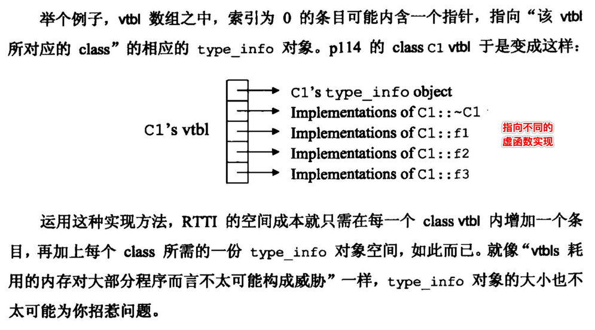
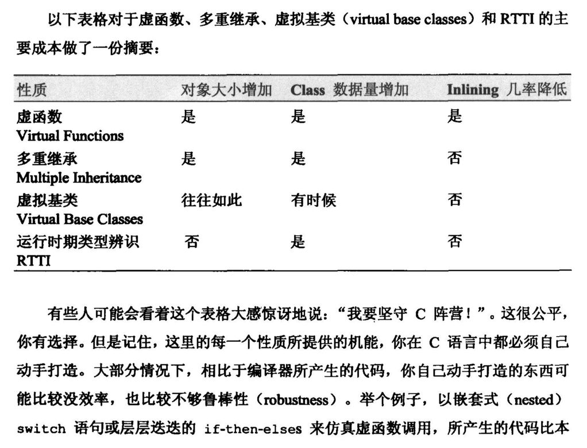

[TOC]


## 1. pointer(指针) VS references(引用)

### 1. 允许 null pointer

```c++
#include <iostream>

int main()
{
  int* ptr;
}
```

编译 ok

```
 ~/Desktop/main  g++ -c main.cpp
 ~/Desktop/main 
```

### 2. 不允许 null references

```c++
#include <iostream>

int main()
{
  int& ref;
}
```

编译报错

```c++
 ~/Desktop/main  g++ -c main.cpp
main.cpp:5:8: error: declaration of reference variable 'ref' requires an initializer
  int& ref;
       ^~~
1 error generated.
```

- 一个 **references** 必须代表一个 **变量**
- 且必须在 **定义** references 时，指定 **关联** 一个变量

- 不允许 null references 为了禁止出现 null pointer

### 3. 函数参数 pointer

```c++
#include <iostream>

void func(int* p) {
  /**
   * 需要判断传入的【指针变量】是否有指向【可用】的【内存地址】
   */
  if (!p) return;
  
  *p = 99;
}

int main()
{
  int* p = NULL;
  func(p);
}
```

### 4. 函数参数 references

```c++
#include <iostream>

void func(int& p) {
  /**
   * 完全不需要添加像 pointer 判空的逻辑
   * 直接使用 ref 变量即可
   */
  p = 99;
}

int main()
{
  int age = 98;
  std::cout << "age = " << age << std::endl;
  
  func(age);
  std::cout << "age = " << age << std::endl;
}
```

```
 ~/Desktop/main  make lan=c++
g++ main.cpp
./a.out
age = 98
age = 99
```

### 5. pointer 可以【重新】赋值

```c++
#include <iostream>

int main()
{
  int age = 98;
  int level = 99;
  
  // 第一次 赋值 pointer 变量
  int* p1 = &age;

  // 第二次 赋值 pointer 变量
  p1 = &level;
}
```

```
 ~/Desktop/main  make lan=c++
g++ main.cpp
./a.out
 ~/Desktop/main 
```

运行正常。

### 6. references【不可以】【重新】赋值

#### 1. 假象

```c++
#include <iostream>

int main()
{
  int age = 98;
  int level = 99;
  
  // 第一次 赋值 references 变量
  int& ref = age;
  std::cout << "1. ref = " << ref << std::endl;

  // 第二次 赋值 references 变量
  ref = level;
  std::cout << "2. ref = " << ref << std::endl;
}
```

```
 ~/Desktop/main  make lan=c++
g++ main.cpp
./a.out
1. ref = 98
2. ref = 99
```

- 看起来在 **第二次** 将 level 变量，赋值 references 变量后，
-  references 变量的值，变成了 第二个 level 变量的值
- 那是否是意味着 **references 变量**，也关 **联换** 成了 第二个 level 变量 ？？？

#### 2. 打印两次 references 变量的内存地址

```c++
#include <iostream>

int main()
{
  int age = 98;
  int level = 99;
  
  // 第一次 赋值 references 变量
  int& ref = age;
  std::cout << "1. ref = " << ref << " , &ref = " << &ref << std::endl;

  // 第二次 赋值 references 变量
  ref = level;
  std::cout << "2. ref = " << ref << " , &ref = " << &ref << std::endl;
}
```

```
 ~/Desktop/main  make lan=c++
g++ main.cpp
./a.out
1. ref = 98 , &ref = 0x7ffee234b11c
2. ref = 99 , &ref = 0x7ffee234b11c
```

- references 变量 **内存地址** 没有发生改变
- 也就是说或 references 变量 **并没有** 替换关联的 age 变量
- 那么对于第二次 `ref = level;` 
  - 1) 并 **不会** 让 ref 关联到 **level 变量**
  - 2) 只是将  level 变量的 **值** 赋值给 ref 关联的 **age 变量**
- 结论: 在 **定义** references 变量时，指定 **关联的变量** 之后，就 **不会再改变** 关联其他的变量

### 7. 如果在不同时间，需要指向不同的内存地址，则使用 pointer

#### 1. 错误: `std::vector<int&>`

```c++
#include <iostream>
#include <vector>

int main()
{
  std::vector<int&> v;
}
```

```c++
error: 'pointer' declared as a
      pointer to a reference of type 'int &'
    typedef _Tp*              pointer;
```

- 但是对于` vector[i]` 很可能是需要在后面某个时刻，才会对齐设置元素的
- 但是对于 **references** 必须在 定义时 就指定关联的变量

#### 2. 正确: `std::vector<int*>`

```c++
#include <iostream>
#include <vector>

int main()
{
  std::vector<int*> v;
}
```

```
 ~/Desktop/main  make lan=c++
g++ main.cpp
./a.out
```

### 8. 方法返回值 pointer vs references

#### 1. 返回 pointer

```c++
#include <iostream>
#include <string>
using namespace std;

const int SIZE = 10;

class safearay
{
private:
  int arr[SIZE];

public:
  safearay() 
  {
    register int i;

    for(i = 0; i < SIZE; i++)
    {
      arr[i] = i;
    }
  }

  // 返回的 &arr[i] 内存地址
  int* operator[](int i)
  {
    if( i > SIZE )
    {
      cout << "索引超过最大值" << endl; 
      return &arr[0]; // 返回第一个元素
    }

    return &arr[i];
  }
};


int main()
{
  safearay A;

  // 读取 arr[i]
  cout << "*A[2] 的值为 : " << *A[2] << endl;

  //-------------------------------------------
  // 修改 arr[i]
  *A[2] = 99;
  //-------------------------------------------

  // 读取 arr[i]
  cout << "*A[2] 的值为 : " << *A[2] << endl;
}
```

```
 ~/Desktop/main  make lan=c++
g++ main.cpp
./a.out
*A[2] 的值为 : 2
*A[2] 的值为 : 99
```

#### 2. 返回 references

```c++
#include <iostream>
#include <string>
using namespace std;

const int SIZE = 10;

class safearay
{
private:
  int arr[SIZE];

public:
  safearay() 
  {
    register int i;

    for(i = 0; i < SIZE; i++)
    {
      arr[i] = i;
    }
  }

  // 返回 arr[i] 引用
  int& operator[](int i)
  {
    if( i > SIZE )
    {
      cout << "索引超过最大值" << endl; 
      return arr[0]; // 返回第一个元素
    }

    return arr[i];
  }
};


int main()
{
  safearay A;

  // 读取 arr[i]
  cout << "A[2] 的值为 : " << A[2] << endl;

  //-------------------------------------------
  // 修改 arr[i]
  A[2] = 99;
  //-------------------------------------------

  // 读取 arr[i]
  cout << "A[2] 的值为 : " << A[2] << endl;
}
```

```
 ~/Desktop/main  make lan=c++
g++ main.cpp
./a.out
A[2] 的值为 : 2
A[2] 的值为 : 99
```

#### 3. 对比 `operator[](int i)` 返回值类型

```c++
// 返回的 &arr[i] 内存地址
int* operator[](int i)
{
  if( i > SIZE )
  {
    cout << "索引超过最大值" << endl; 
    return &arr[0]; // 返回第一个元素
  }

  return &arr[i];
}
```

- 读取: `*A[2]`
- 写入: `*A[2] = 99`

```c++
// 返回 arr[i] 引用
int& operator[](int i)
{
  if( i > SIZE )
  {
    cout << "索引超过最大值" << endl; 
    return arr[0]; // 返回第一个元素
  }

  return arr[i];
}
```

- 读取: `A[2]`
- 写入: `A[2] = 99`

完全去除了我们自己 **取地址** 和 **解引用(反地址)** 的操作，由 C++ 编译器替我们完成。

### 9. 小结


## 2. C++ 类型转换

### 1. `static_cast<T>(value)`

#### 1. C

```c++
int a = 10;
int b = 3;
double result = (double)a / (double)b;
```

#### 2. C++

```c++
int a = 10;
int b = 3;
double result = static_cast<double>(a) / static_cast<double>(b);
```

**static_cast** 只能对内置的 **基本数据类型** 之间的相互转换。

### 2. `const_cast<T>(value)`

#### 1. C

```c++
#include <iostream>

int main(int argc, char const *argv[])
{
  const int a = 10;
  const int * p = &a;
  *p = 20; // error
}
```

编译 报错:

```c++
 ~/Desktop/main  g++ -c main.cpp
main.cpp:7:6: error: read-only variable is not assignable
  *p = 20; // error
  ~~ ^
1 error generated.
```

#### 2. C++

```c++
#include <iostream>

int main(int argc, char const *argv[])
{
  const int a = 10;
  const int* p = &a;

  int* q = const_cast<int*>(p);
  *q = 20;
}
```

```
 ~/Desktop/main  make lan=c++
g++ main.cpp
./a.out
```

- 可以通过 `const_cast<int*>(p)` 去除 `const` 指针的修饰
- 但是使用 const_cast 通常是一种 **无奈之举**，是一种非常不好的行为

### 3. `reinterpret_cast<T>(value)`

#### 1. C

```c++
#include <stdio.h>
#include <stdlib.h>

int main(int argc, const char * argv[]) 
{
  int *a = malloc(sizeof(int));
  
  double *d = (double *)a;
}
```

#### 2. C++

```c++
#include <iostream>

int main(int argc, char const *argv[])
{
  int *a = new int;
  
  double *d = reinterpret_cast<double *>(a);
}
```

- 改变 **指针类型(步长)**

### 4. `dynamic_cast<T>(value)`

#### 1. dynamic_cast 用途

- 1、前面的三种 都是 **编译时** 完成的，**dynamic_cast** 是 **运行时** 进行类型检查

- 2、**不能** 用于 内置的 **基本数据类型** 的强制转换

- 3、dynamic_cast 转换如果成功的话返回的是指向类的 **指针** 或 **引用**，如果 **转换失败**的话则会返回**NULL**

- 4、使用 dynamic_cast 进行转换的，**父类 必须包含 虚函数**，否则 **编译失败** 

- 5、在类的转换时，在类层次间进行上行转换时，dynamic_cast 和 static_cast 的效果是一样的
- 6、但是在进行下行转换时，**dynamic_cast** 具有类型检查的功能，**比 static_cast 更安全**

#### 2. 各种情况转换

```c++
#include<iostream>
using namespace std;
 
class A
{
public:
  virtual void f()
  {
    cout << "hello1" << endl;
  }
};

class B : public A
{
public:
  void f()
  {
    cout << "hello2" << endl;
  };
};

class C
{
  void pp()
  {
    return;
  }
};

int main()
{
  A* a1 = new B; // a1 是【A类型】的【指针】指向一个【B 类型对象】
  A* a2 = new A; // a2 是【A类型】的【指针】指向一个【A 类型对象】

  /**
   * 【B 类型对象】==>【B 类对象】
   * 结果为 not null，向下转换成功
   * a1 之前指向的就是【B 类对象】所以可以转换成【B 类型的指针】
   */
  B* b = dynamic_cast<B*>(a1);
  if(b == NULL)
  {
    cout << "1. null" << endl;
  }
  else
  {
    cout << "1. not null" << endl;
  }

  /**
   * 【A 类型对象】==>【B 类对象】
   * 父类 ==> 子类
   * 结果为 null，向下转换失败
   */
  b = dynamic_cast<B*>(a2);
  if(b == NULL)
  {
    cout << "2. null" << endl;
  }
  else
  {
    cout << "2. not null" << endl;
  }

  /**
   * 【B 类型对象】==>【C 类对象】
   * 两个类没有任何的继承关系，
   * 结果为 null，向下转换失败
   */
  C* c;
  c = dynamic_cast<C*>(a1);
  if(c == NULL)
  {
    cout << "3. null" << endl;
  }
  else
  {
    cout << "3. not null" << endl;
  }

  delete(a1);
  delete(a2);
}
```

```
 ~/Desktop/main  make lan=c++
g++ main.cpp
./a.out
1. not null
2. null
3. null
```


## 3. 不能以 ==多态(polymorphically)== 处理 ==数组==

```c++
#include<iostream>
using namespace std;
 
class A
{
public:
  virtual void f()
  {
    cout << "hello1" << endl;
  }

  int a;
};

class B : public A
{
public:
  void f()
  {
    cout << "hello2" << endl;
  };

  void run() 
  {
    cout << "run" << endl;
  }

  int b;
  int c;
};

int main()
{
  // arr[i] 存放的 B* 内存地址
  // 那么最终 delete arr[i] 就按照 sizeof(B) 长度进行 释放内存块
  B** arr = new B*[3];

#if 1
  arr[0] = dynamic_cast<B*>(new A); // error
#else
  arr[0] = new B; // ok
#endif

  B *b1 = new B;
  b1->b = 99;
  b1->c = 100;
  arr[1] = b1;

  B *b2 = new B;
  b2->b = 99;
  b2->c = 100;
  arr[2] = b2;

  for (int i = 0; i < 3; ++i)
  {
    /**
     * 因为 A 和 B 两个类最终的 size 是不同的，
     * 所以如果统一按照 sizeof(B) 去寻找 f() 方法的 offset 就会出现问题
     */
    arr[i]->f();
  }
}
```

编译、链接 都没问题

```
 ~/Desktop/main  g++ -c main.cpp
 ~/Desktop/main  g++ main.o
 ~/Desktop/main 
```

运行 崩溃

```c++
 ~/Desktop/main  ./a.out
[1]    90844 segmentation fault  ./a.out
```


## 4. explicit 取消对象的【隐式转换】

```c++
#include<iostream>
using namespace std;

class Person
{  
public:  
  int _age;  
  int _size;

  // 使用关键字 explicit 声明修饰【构造方法】  
  explicit Person(int age, int size = 0)  
  {  
    // ....
  }  

  Person(const char *p)  
  {  
    // ....
  }  
};

int main(int argc, char const *argv[])
{
  Person person1(24);     // 这样是 OK 的
  Person person2 = 10;    // 这样是不行的, 因为 explicit 关键字【取消】了【隐式转换】
  Person person3;         // 这样是不行的, 因为没有【默认构造函数】
  person1 = 2;            // 这样也是不行的, 因为 explicit 关键字【取消】了【隐式转换】
  person2 = 3;            // 这样也是不行的, 因为 explicit 关键字【取消】了【隐式转换】
  person3 = person1;      // 这样也是不行的, 因为 explicit 关键字【取消】了【隐式转换】, 除非类实现操作符"="的重载
}
```


## 5. 区别【前置 ++】与【后置 ++】

```c++
#include<iostream>
using namespace std;

class Age
{
public:

  Age(int _i) {
    i = _i;
  }

  // 前置 ++ 运算 , 返回【this 对象】【引用】
  Age& operator++()
  {
    ++i;
    return *this;
  }

  // 后置 ++ 运算 , 返回【this 对象】【拷贝】
  Age operator++(int)
  {
    Age tmp = *this;
    ++(*this);
    return tmp;
  }

  int i;
};

int main(int argc, char const *argv[])
{
  Age a(99);
  std::cout << "1. a.i = " << a.i << std::endl;
  std::cout << "2. ++a.i = " << ++a.i << std::endl;
  std::cout << "3. a.i = " << a.i << std::endl;
  std::cout << "4. a++.i = " << a++.i << std::endl;
  std::cout << "5. a.i = " << a.i << std::endl;
}
```

```
 ~/Desktop/main  make lan=c++
g++ main.cpp
./a.out
1. a.i = 99
2. ++a.i = 100
3. a.i = 100
4. a++.i = 100
5. a.i = 101
```

- 1) `++a` 返回的是 `*this` **引用**
- 2) `a++` 返回的是 `*this` **拷贝**


## 6. 不要重载的 运算符

- 1) `&&`
- 2) `||`
- 3) `,`


## 7. 不同形式的 new 和 delete

### 1. new T 与 delete T

```c++
#include<iostream>
using namespace std;

int main(int argc, char const *argv[])
{
  int* age = new int;
  *age = 99;
  delete age;
}
```

### 2. new `T[n]` 与 `delete[]` T

```c++
#include<iostream>
using namespace std;

int main(int argc, char const *argv[])
{
  int* arr = new int[3];
  
  arr[0] = 1;
  arr[1] = 2;
  arr[2] = 3;

  delete[] arr;
}

```

### 3. new T(var1, var2) 与 delete T

```c++
#include<iostream>
#include<string>
using namespace std;

class Person
{
public:
  Person(int _age, std::string _name) {
    age = _age;
    _name = name;
  }

private:
  int age;
  std::string name;
};

int main(int argc, char const *argv[])
{
  Person* p = new Person(99, "xiong");
  delete p;
}
```

### 4. new `T*[n]` 与 `delete[]` T

```c++
#include<iostream>
#include<string>
using namespace std;

class Person
{
public:
  Person(int _age, std::string _name) {
    age = _age;
    _name = name;
  }

  ~Person() {
    std::cout << this << std::endl;
  }

private:
  int age;
  std::string name;
};

int main(int argc, char const *argv[])
{
  // 1. 相当于 Person* arr[3] ，但实际是一个【指针变量】
  Person** ptr = new Person*[3];
  
  // 2. arr[i] = new Person(age, name)
  ptr[0] = new Person(99, "xiong01");
  ptr[1] = new Person(100, "xiong02");
  ptr[2] = new Person(101, "xiong03");
  
  // 3. delete arr[i]
  for (int i = 0; i < 3; ++i)
  {
    delete ptr[i];
  }

  // 4. delete arr
  delete[] ptr;
}
```

```
 ~/Desktop/main  make lan=c++
g++ main.cpp
./a.out
0x7fb775c02ca0
0x7fb775c02cc0
0x7fb775c02ce0
```

连续释放 **3个** 对象。


## 8. exceptions

### 1. 被抛出的对象总是一个【副本】

```c++
#include<iostream>
#include<string>
#include<cstdio>
#include <exception>

using namespace std;

struct MyException : public exception
{
  const char * what () const throw ()
  {
    return "C++ Exception";
  }
};

void func1() {
  // 局部对象
  MyException exception;

  // cout << "func1(): " << &exception << endl;
  printf("func1(): %p\n", &exception);

  // 抛出的对象是一个副本
	// 当前作用域的 exception 在离开本函数时已经被销毁
  throw exception;
}

void func2() {
  // 虽然是 static 静态变量
  static MyException exception;
  
  // cout << "func2(): " << &exception << endl;
  printf("func2(): %p\n", &exception);

  // 尽管本函数内的 exception 不会被销毁，但是抛出的 exception 依然是一个副本
  throw exception;
}

int main(int argc, char const *argv[])
{
  try {
    func1(); 
  } catch(MyException& e) {
    // cout << "catch: " << &e << endl;
    printf("catch1: %p\n", &e);
  } catch(std::exception& e)
  {
    //其他的错误
  }

  cout << "---------------------------" << endl;

  try {
    func2(); 
  } catch(MyException& e) {
    // cout << "catch: " << &e << endl;
    printf("catch2: %p\n", &e);
  } catch(std::exception& e)
  {
    //其他的错误
  }
}
```

```
 ~/Desktop/main  make lan=c++
g++ main.cpp
./a.out
func1(): 0x7ffee63cf0b8
catch1: 0x7f8e91402d00
---------------------------
func2(): 0x109832180
catch2: 0x7f8e91402d00
```

两次 catch 块捕获的 exception 对象的 **内存地址** 都是 **不同** 的。

### 2. catch 效率

#### 1. catch(T t)

- 抛出的 **异常对象**，会被 **复制两次**
- 第一次 是在 **throw** 时
- 第二次 是在 **catch** 时

#### 2. catch(T& t)

- 只会在 第一次 是在 **throw** 时 **复制一次**

#### 3. catch(const T& t)

- 只会在 第一次 是在 **throw** 时 **复制一次**
- 并且 **不允许修改** 异常对象

### 3. catch(`T*` t)

#### 1. throw new T

```c++
#include<iostream>
#include<string>
#include<cstdio>
#include <exception>

using namespace std;

struct MyException : public exception
{
  const char * what () const throw ()
  {
    return "C++ Exception";
  }
};

void func() {
  throw new MyException;
}

int main(int argc, char const *argv[])
{
  try {
    func(); 
  } catch(MyException* e) {
    std::cout << e->what() << std::endl;
  } catch(std::exception& e)
  {
    //其他的错误
  }
}
```

```
 ~/Desktop/main  make lan=c++
g++ main.cpp
./a.out
C++ Exception
```

```
 ~/Desktop/main  make lan=c++
g++ main.cpp
./a.out
C++ Exception
```

ok

#### 2. throw `&局部对象`

```c++
#include<iostream>
#include<string>
#include<cstdio>
#include <exception>

using namespace std;

struct MyException : public exception
{
  const char * what () const throw ()
  {
    return "C++ Exception";
  }
};

void func() {
  // 局部的内存
  MyException exception;

  // 抛出【局部内存】的【内存地址】
  // 实际上只是复制【局部对象】所在的【内存地址值】
  // 而不是复制【局部对象】
  throw &exception;
}

int main(int argc, char const *argv[])
{
  try {
    func(); 
  } catch(MyException* e) {
    std::cout << e->what() << std::endl;
  } catch(std::exception& e)
  {
    //其他的错误
  }
}
```

```
 ~/Desktop/main  make lan=c++
g++ main.cpp
./a.out
make: *** [all] Segmentation fault: 11
```

- **崩溃**
- 因为抛出了一个指向 **局部内存** 的内存地址
- 而局部内存出了方法作用域时，就会被 **回收**

### 4. catch `void*` 优先级【最高】

```c++
#include<iostream>
#include<string>
#include<cstdio>
#include <exception>

using namespace std;

class BaseClass {
};

class DerivedClass : public BaseClass {
};

void func1() {
  static DerivedClass derived;
  throw &derived;
}

void func2() {
  throw new BaseClass;
}

void func3() {
  throw new DerivedClass;
}

int main(int argc, char const *argv[])
{
  try {
    func1();
  } catch (void* e) { // 优先捕获，因此void*是所有类型的基类指针
    std::cout << "catch: void*" << std::endl;
  } catch (BaseClass* e) {
    std::cout << "catch: BaseClass*" << std::endl;
  } catch (DerivedClass* e) {
    std::cout << "catch: DerivedClass*" << std::endl;
  }

  try {
    func2();
  } catch (void* e) { // 优先捕获，因此void*是所有类型的基类指针
    std::cout << "catch: void*" << std::endl;
  } catch (BaseClass* e) {
    std::cout << "catch: BaseClass*" << std::endl;
  } catch (DerivedClass* e) {
    std::cout << "catch: DerivedClass*" << std::endl;
  }

  try {
    func3();
  } catch (void* e) { // 优先捕获，因此void*是所有类型的基类指针
    std::cout << "catch: void*" << std::endl;
  } catch (BaseClass* e) {
    std::cout << "catch: BaseClass*" << std::endl;
  } catch (DerivedClass* e) {
    std::cout << "catch: DerivedClass*" << std::endl;
  }
}
```

```
catch: void*
catch: void*
catch: void*
```

最终都是以 `void*` 形式的异常进行捕捉。

### 5. catch `base*` > catch `DerivedClass*`

```c++
#include<iostream>
#include<string>
#include<cstdio>
#include <exception>

using namespace std;

class BaseClass {
};

class DerivedClass : public BaseClass {
};

void func1() {
  static DerivedClass derived;
  throw &derived;
}

void func2() {
  throw new BaseClass;
}

void func3() {
  throw new DerivedClass;
}

int main(int argc, char const *argv[])
{
  try {
    func1();
  // } catch (void* e) { // 优先捕获，因此void*是所有类型的基类指针
  //   std::cout << "catch: void*" << std::endl;
  } catch (BaseClass* e) {
    std::cout << "catch: BaseClass*" << std::endl;
  } catch (DerivedClass* e) {
    std::cout << "catch: DerivedClass*" << std::endl;
  }

  try {
    func2();
  // } catch (void* e) { // 优先捕获，因此void*是所有类型的基类指针
  //   std::cout << "catch: void*" << std::endl;
  } catch (BaseClass* e) {
    std::cout << "catch: BaseClass*" << std::endl;
  } catch (DerivedClass* e) {
    std::cout << "catch: DerivedClass*" << std::endl;
  }

  try {
    func3();
  // } catch (void* e) { // 优先捕获，因此void*是所有类型的基类指针
  //   std::cout << "catch: void*" << std::endl;
  } catch (BaseClass* e) {
    std::cout << "catch: BaseClass*" << std::endl;
  } catch (DerivedClass* e) {
    std::cout << "catch: DerivedClass*" << std::endl;
  }
}
```

```
catch: BaseClass*
catch: BaseClass*
catch: BaseClass*
```

### 6. catch `T*` 与 catch `T&`

```c++
#include<iostream>
#include<string>
#include<cstdio>
#include <exception>

using namespace std;

class BaseClass {
};

class DerivedClass : public BaseClass {
};

void func1() {
  static DerivedClass derived;
  throw &derived;  // throw T*
}

void func2() {
  DerivedClass exception;
  throw exception; // throw T&
}

int main(int argc, char const *argv[])
{
  try {
    func1();
  } catch (DerivedClass* e) {
    std::cout << "catch: DerivedClass*" << std::endl;
  } catch (DerivedClass& e) {
    std::cout << "catch: DerivedClass&" << std::endl;
  }

  try {
    func2();
  } catch (DerivedClass* e) {
    std::cout << "catch: DerivedClass*" << std::endl;
  } catch (DerivedClass& e) {
    std::cout << "catch: DerivedClass&" << std::endl;
  }
}
```

```
catch: DerivedClass*
catch: DerivedClass&
```

### 7. 指定 方法或函数 可抛出的异常列表

#### 1. void fun()

可以抛出 **任何类型** 的异常

#### 2. void fun() throw(except1,except2,except3)

- 后面 **括号里面** 是一个 **异常参数表**
- 表示该方法 fun() **只能抛出这3种** 求中的一种异常

#### 3. void fun() throw()

- 参数表为空
- 表示该方法 **不能抛出** 异常


## 9. 虚函数表(vtbl) -- 实现对象的多态




## 10. 虚函数、多重继承、虚继承、RTTI 使用成本对比




看起来 **RTTI**  并不会降低程序的性能。